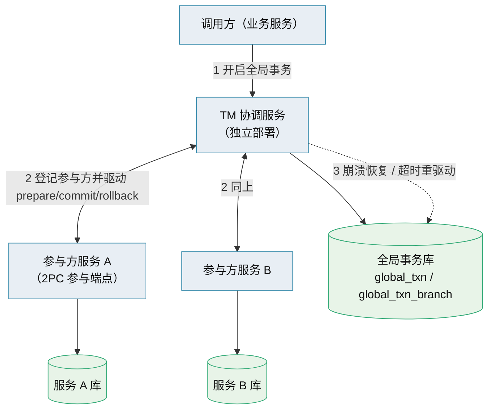

# 跨服务 TM 方案（技术储备）

> 自研跨服务事务管理器：形态 · 协调算法 · 全局事务账本 · 服务侧参与协议 · 崩溃恢复 · 插件化替换

[文档首页](../../../文档首页.md) › [知识档案](../技术栈知识档案总览.md) › [分布式事务总览](01_分布式事务_总览.md) › 跨服务 TM 方案

---

> **定位**：本目录为知识档案（辅助参考）。本篇给出**跨独立服务强一致**（外部 TM + 各服务 XA）的**可行落地方案**，作为**技术储备**——BMS 默认不启用，仅在「客户对中间态零容忍、且无法把数据收敛到单库」时，经插件化替换引入。基础原理与三库实测见《[02 两阶段提交与 XA](02_分布式事务_两阶段提交与XA.md)》。

## 1. 为什么需要 TM 

跨独立服务时，各服务各有自己的库与进程，没有一个「共同数据库」可用；2PC 的 prepare / commit 必须由一个**独立于各服务的总协调人**驱动。这就是**事务管理器（TM）**。Python 生态**没有成熟的框架无关 TM**，故本方案为**自研**。

## 2. 总体形态 

- **TM 协调服务**：独立部署的地基服务（复用平台服务骨架：服务目录 / 契约 / 服务身份 / 可观测 / 配置）。
- **参与方服务**：经**公开契约**暴露 2PC 参与端点（begin / prepare / commit / rollback），内部经**同步引擎 + XA**（达梦走 `dmxa`）承载分支。
- **TM 专属全局事务库**：TM 自己的库，持久化全局事务与分支状态（崩溃恢复基础），与服务库解耦。

## 3. 协调算法（2PC） 

### 3.1 提交路径 

1. 调用方发起全局事务：TM 分配 `global_txn_id`，落账本（状态 `ACTIVE`）。
2. TM 依次（或并行）向各参与方发 `begin(xid)`，参与方 `XA_START` 开分支；调用方在各参与者上执行实际业务变更。
3. 调用方声明准备提交：TM 进入**准备阶段**，向各参与方发 `prepare(xid)`。
4. 各参与方 `XA_END` → `XA_PREPARE`，成功回「可提交」，落本分支账。
5. **全票可提交**：TM 落账本状态 `COMMITTING`（**提交决定点**，此后续行，不再回滚），向各参与方发 `commit(xid)`。
6. 各参与方 `XA_COMMIT`；TM 收齐后账本置 `COMMITTED`，清理历史。

### 3.2 回滚路径 

- **任一步失败**（含准备阶段某参与方否决）：TM 置 `ROLLING_BACK`，向所有已开分支发 `rollback(xid)`，各参与方 `XA_ROLLBACK`；账本置 `ROLLED_BACK`。
- **超时**：准备阶段某参与方在超时内未回，按失败处理（回滚）；**提交决定点之后**不超时回滚（决定已定，靠恢复重驱动）。

### 3.3 幂等与重试 

- 每条消息带 `global_txn_id` + `branch_id`；参与端点**幂等**（按分支状态机判定：已 prepare 再 prepare 返回原结果，已 commit 再 commit 直接成功）。
- TM 对未确认的驱动消息**重试**（退避），直到确认或人工介入。

## 4. 全局事务账本 

TM 专属库的核心表（概念结构；实际字段级结构在引入该能力时按《数据库设计》建表文件，此处只表语义）：

| 表 | 语义 | 关键字段（概念） |
| --- | --- | --- |
| `global_txn` | 全局事务主记录 | `global_txn_id`、状态机（`ACTIVE` / `PREPARING` / `COMMITTING` / `COMMITTED` / `ROLLING_BACK` / `ROLLED_BACK` / `HEURISTIC_*`）、发起方、创建 / 更新时刻、超时 |
| `global_txn_branch` | 各参与方分支 | `global_txn_id`、`branch_id`、`service`、`xid`、分支状态（`ACTIVE` / `PREPARED` / `COMMITTED` / `ROLLED_BACK`）、重试次数、最后错误 |
| `global_txn_recovery` | 恢复 / 对账记录 | 悬挂分支发现时刻、处置动作、处置人 / 脚本、结论 |

- **提交决定点**（账本置 `COMMITTING` 的那一刻）是**唯一权威**：恢复时据此决定重发 commit 还是 rollback。
- 账本与业务库**物理分离**，避免「账本与分支同库」导致的恢复歧义。

## 5. 服务侧参与协议 

各参与方服务新增**公开契约端点**（示意，最终以引入时的 OpenAPI 契约为准）：

| 方法 | 路径（示意） | 语义 |
| --- | --- | --- |
| `POST` | `/api/v1/txn/branches` | `begin`：登记分支，`XA_START(xid)` |
| `POST` | `/api/v1/txn/branches/{xid}/prepare` | `prepare`：`XA_END` → `XA_PREPARE` |
| `POST` | `/api/v1/txn/branches/{xid}/commit` | `commit`：`XA_COMMIT` |
| `POST` | `/api/v1/txn/branches/{xid}/rollback` | `rollback`：`XA_ROLLBACK` |
| `GET` | `/api/v1/txn/branches/{xid}` | 查分支状态（恢复 / 对账用） |

- **业务变更怎么进分支**：参与方在分支内执行本地变更——一次 2PC 分支内的多次写共用一个 `xid`（同一 `XA_START … XA_END` 区间），保持该参与方内部的原子。
- **引擎要求**：分支经**同步引擎**（异步 API 不暴露两阶段）；达梦走 `dmxa`。**实例侧部署条件见部署说明**（[达梦 DM8](../../开发服务器/linux/达梦DM8部署使用说明.md#xa) / [PostgreSQL](../../开发服务器/linux/PostgreSQL部署使用说明.md#twophase)）。
- **兼容底线**：参与端点只暴露「分支驱动」，不暴露业务语义；业务变更仍走各自公开业务接口（在分支生命周期内完成）。

## 6. 崩溃恢复与悬挂对账 

| 故障 | TM 行为 |
| --- | --- |
| TM 崩溃于 `COMMITTING` 之前 | 账本无提交决定 → 恢复时**回滚**所有分支（若分支已 prepare，发 rollback；若 TM 未发出 prepare，通知参与方丢弃） |
| TM 崩溃于 `COMMITTING` 之后 | 账本有提交决定 → 恢复时**重发 commit** 给未确认分支 |
| 参与方崩溃 | TM 重试驱动；参与方重启后 `XA_RECOVER` 恢复本库悬挂分支，配合 TM 归位 |
| 悬挂分支（长期无主） | TM 定期扫描分支状态，结合参与方 `XA_RECOVER` 对账；无法自动判定的进人工处置队列（落 `global_txn_recovery`） |
| 启发式完成（参与方单方面提交 / 回滚） | 记 `HEURISTIC_*` 状态，人工 / 对账冲正，**不静默** |

> **不变量**：提交决定点后，所有分支最终必须 **commit**；决定点前，所有分支最终必须 **rollback**。恢复器的一切动作都为收敛到该不变量。

## 7. 插件化替换口径 

强一致方案以**能力基类 + 插件注册表 + 配置选择 + 提供者**落地，与平台既有插件化策略一致（《[插件化架构 · 总览](../插件化架构/01_插件化架构_总览.md)》）：

| 层 | 内容 |
| --- | --- |
| 能力基类（端口） | 如 `BaseTransactionManager`：`begin` / `prepare` / `commit` / `rollback` / `status`，与具体 2PC / TM 实现解耦 |
| 提供者 | 默认 `null`（单库本地事务，即现状）；`xa` / `distributed`（自研 TM）按需启用 |
| 配置选择 | `[transaction_manager].provider`——**改配置即可切**，业务调用面不变 |
| 服务侧参与 | 由「2PC 参与」能力基类承载，默认缺省不挂；启用时才暴露参与端点 |
| 适用时机 | 客户强一致要求 + 数据无法收敛单库 + 中间态零容忍——三条同时成立才启用 |

- **默认关闭**：不启用时不引入任何 TM 运行时 / 参与端点 / 全局事务库，零额外运维面。
- **迁移成本**：启用时需补「TM 协调服务 + 全局事务库 + 各服务参与端点 + 崩溃恢复器」，属**专项工程**，须先出详细设计。

## 8. 代价与不推荐情形 

| 代价 | 说明 |
| --- | --- |
| 阻塞与可用性 | prepare→commit 期间持锁握连接；任一参与方慢 / 挂即全局阻塞，违反服务自治 |
| 运维与排障 | TM + 全局事务库 + 恢复器 + 悬挂对账，是常驻基础设施与长期维护面 |
| 复杂度 | 崩溃恢复、幂等驱动、启发式完成处置，均为高风险正确性工程 |
| 团队负载 | 单人 / 小团队维护成本高 |

> **不推荐**：能收敛到单库的场景（优先单库本地事务）；能容忍短暂中间态的场景（优先 Outbox + 屏障）；跨 ≥4~5 步的长流程（优先编排式 Saga，如 Temporal）。**TM 只在「无法收敛 + 零中间态容忍」时才是正解。**

## 9. 参考资源 

| 资源 | 说明 |
| --- | --- |
| 《[02 两阶段提交与 XA](02_分布式事务_两阶段提交与XA.md)》 | 协议原理与三库实测（本篇基础） |
| 《[微服务 · 12 选型对比（BMS）](../微服务/12_微服务_选型对比.md)》§6 | 分布式一致性候选对比（含 2PC / XA / Temporal） |
| 《[插件化架构 · 03 端口适配器](../插件化架构/03_插件化架构_端口适配器.md)》《[09 自建注册表](../插件化架构/09_插件化架构_自建注册表.md)》 | 可替换落地的机制 |
| 周志明《凤凰架构》「全局事务」；X/Open XA Specification | 协议参考 |

---

> 依《[文档生成规范](../../../规范/文档生成规范.md)》编写
