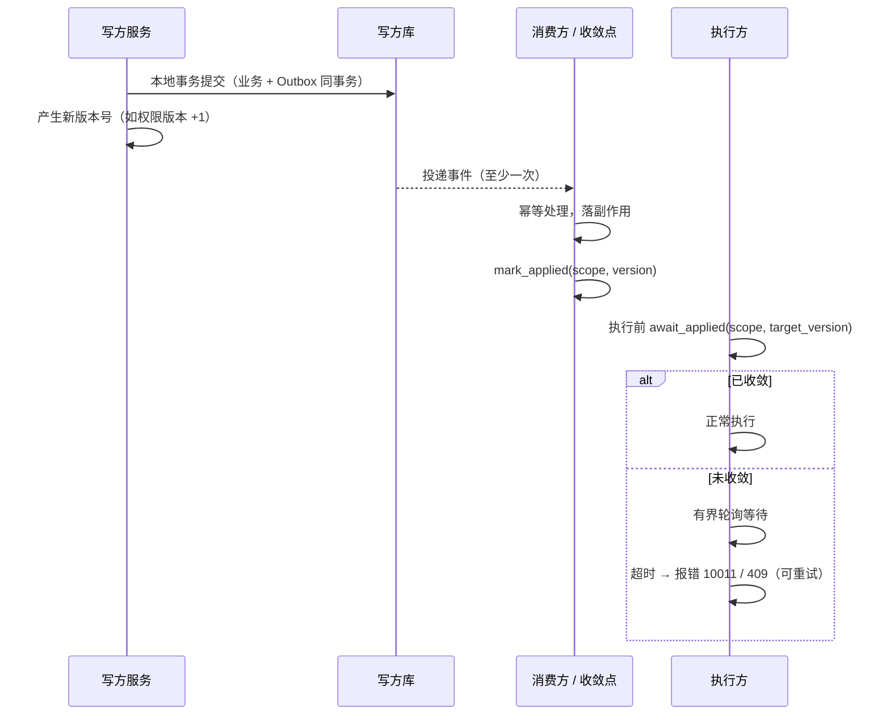

# 一致性屏障

> 平台采用方案：单库本地事务 + 最终一致 + 写后读校验 / 有界等待 / 超时报错

[文档首页](../../../文档首页.md) › [知识档案](../技术栈知识档案总览.md) › [分布式事务总览](01_分布式事务_总览.md) › 一致性屏障

---

> **定位**：本目录为知识档案（辅助参考）。本篇是**平台实际采用**的跨服务一致性方案说明；强制口径与契约细节以《[后端开发规范](../../../规范/后端开发规范.md)》平台《架构设计 · 服务间通信与分布式一致性》及任务详细设计为准。

## 1. 它解决什么 

「本地事务 + Outbox + 幂等」保证**最终会一致**，但有个缺口：**变更刚提交、下游还没收敛时，若立刻执行依赖新状态的功能，会用到旧值 / 半套状态。**

一致性屏障补的就是这一步：**执行前先确认「我要的状态已经生效」，没生效就等一会儿；等不到就报错**——而不是静默用旧值放行。

- 它给的是「**写入 + 执行前确认已生效**」，保证**走屏障校验的路**看不到半成品；
- 它**不是**跨库 ACID 原子：绕过屏障直读他库仍可能看到中间态——这点靠**数据所有权纪律**（禁止跨服务直读他库）封堵。

## 2. 机制 

- **版本**由**写方**产生、由**收敛点**在副作用落库后推进（单调不回退）；**执行方**在执行前 `await_applied` 校验。
- **scope** 是收敛域键（如 `perm` 表权限、`org` 表组织），与租户拼成存储键。
- 屏障是**增强**、非默认拦业务：缺省实现为 no-op，按需在关键路径启用。

## 3. 契约语义 

| 入口 | 语义 |
| --- | --- |
| `await_applied(scope, target_version, tenant?, timeout_ms?, poll_ms?)` | 阻塞至「已应用版本 ≥ 目标版本」；超时抛 `ConsistencyBarrierTimeout`（`10011` / 409） |
| `applied_version(scope, tenant?)` | 读取当前已应用版本（无记录返回 0） |
| `mark_applied(scope, version, tenant?)` | 推进已应用版本（单调不回退） |

- **超时 / 轮询**缺省取配置分区（缺省 3000 ms / 100 ms）。
- 契约以**能力基类**承载，提供者默认为 `null`（即返回），可切 `redis`（真实实现）。

## 4. 失败分支 

| 场景 | 处置 |
| --- | --- |
| 未收敛超时 | 抛 `10011` / 409（可重试），**不静默放行旧值** |
| 版本乱序到达 | `mark_applied` 只前推，不影响判定 |
| 目标版本已达成 | 立即返回，零等待 |
| 存储（Redis）不可用 | 记 warning，`await_applied` **放行**（degrade-open）、`mark_applied` 忽略——**屏障自身不做单点** |

> **放行口径**：屏障是增强手段；真正要求强一致的核心链路，应在业务侧同时保留版本校验兜底（如权限读取时校验版本）。

## 5. 与权限版本失效的关系 

平台权限引擎已有一套**版本失效**机制（平台《架构设计 · 权限计算引擎》§3）：角色 / 授权 / 角色分配变更 → 权限版本 +1（Redis 计数器）→ 缓存键带版本、读取校验版本。

一致性屏障是这套机制的**自然延伸**：

- **变更前**：`sys_user_role`、权限项等收敛权限服务**单库**，保存是一个**本地事务**（原子，见 §6）。
- **变更时**：版本 +1、失效缓存。
- **变更后 / 执行前**：屏障等待「权限 / 组织收敛点已应用到目标版本」，未到则有界等待、超时报错。

mdm 侧岗位 / 部门分配变更经事件通知触发版本 +1（组件设计已定：mdm 插件独立即时提交），屏障即在此跨服务链路上保证「执行前已收敛」。

## 6. 为什么先「收敛单库」而不是 2PC 

要求「要么全成功要么全失败」的那部分（角色 + 用户分配 + 权限项），**收敛到权限服务一个库**后用本地事务即可原子——**根本不需要分布式事务**。跨服务部分（mdm 岗位 / 部门分配）本就已拆开、走事件最终一致 + 屏障。

顺序是关键：**能用本地事务就用本地事务；不能时才考虑最终一致 + 屏障；最后才考虑 2PC / TM**（见 [05 选型对比](05_分布式事务_选型对比（BMS）.md)）。

## 7. 配置与运维 

- 配置分区（概念）：`provider`（空 = null）、`default_timeout_ms`、`default_poll_ms`；连接复用 `[redis].url`。
- 运维关注：屏障**等待占比 / 超时率**——持续超时说明下游收敛慢，应按《[微服务 · 05](../微服务/05_微服务_通信与分布式一致性.md)》观测 Outbox 积压、消费延迟、死信。

## 8. 参考资源 

| 资源 | 说明 |
| --- | --- |
| 《[微服务 · 05 通信与分布式一致性](../微服务/05_微服务_通信与分布式一致性.md)》 | Outbox / 幂等 / 最终一致原理 |
| 平台《架构设计 · 服务间通信与分布式一致性》 | 平台口径（Outbox / Saga / 强一致场景） |
| 平台《架构设计 · 权限计算引擎》§3 | 权限版本失效机制 |
| 《[后端基类清单](../../../后端基类清单.md)》core 横切基座 | 屏障能力域落点 |

---

> 依《[文档生成规范](../../../规范/文档生成规范.md)》编写
