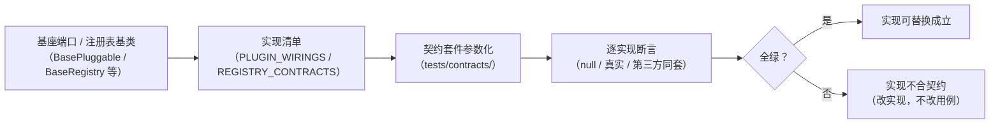

# 后端契约技术介绍

> 契约是什么 · 三层载体（结构 / 行为 / 接口）· 契约测试套件怎么跑 · 变更与版本

[文档首页](../../../文档首页.md) › [知识档案](../技术栈知识档案总览.md) › [后端开发](../技术栈知识档案总览.md#backend) › 后端契约技术介绍

---

## 1. 技术概述 <a id="overview"></a>

**契约（Contract）**是基座对「实现必须遵守什么」的**可执行承诺**：规定「必须提供哪些方法 / 参数 / 返回 / 异常 / 副作用约束 / 生命周期」，并把承诺写成**与具体实现无关的用例**——任何实现（真实实现、`NullXxx` 占位、第三方插件）跑同一套断言，**换实现不改用例、新实现接入自动受检**。

在本项目中，后端契约不是一份单独文档，而是分散在**三个载体的机器可执行资产**里（本节为总入口）：

| 层 | 载体 | 位置 | 回答的问题 |
| --- | --- | --- | --- |
| **结构契约** | 静态护栏（AST 扫描） | `backend/tests/core/test_base_inheritance.py`、`scripts/tools/base-check/check-backend-base.py` | 「类挂到基座体系了吗 / 清单与代码一致吗」 |
| **行为契约** | 契约测试套件 | `backend/tests/contracts/`（插件契约 / 域注册契约） | 「实现符合接口承诺吗（含 Null 占位语义）」 |
| **接口与数据契约** | 类型与响应模型 | `ApiResponse` / 分页 / `BaseSchema` / 事件 `EventEnvelope` / 错误码段位 | 「前后端之间、模块之间传什么、怎么传」 |

> 口径来源：《[后端开发规范](../../../规范/后端开发规范.md)》§3（后端基座体系，强制）与平台《架构设计 · 后端基础类体系》「强制用法（细则）」节、《[后端基类清单](../../../后端基类清单.md)》。契约是否达标属《[后端审计规范](../../../规范/后端审计规范.md)》B1 / B4 审计维度。

## 2. 结构契约（静态护栏） <a id="structural"></a>

结构契约用 **AST 静态扫描**执行（不连数据库、不起服务），新增违规即在 CI 失败：

| 护栏 | 位置 | 规则 | 例外 |
| --- | --- | --- | --- |
| 继承护栏 | `backend/tests/core/test_base_inheritance.py` | `app/` 下所有自定义类必须继承项目基座；**仅继承 `object`** 或**仅继承内建异常**（`Exception` / `RuntimeError` / `ValueError`…）即失败；异常类须继承 `BizError` 与段位基 | L0 根系 `BaseObject` 自身（无父类） |
| 清单对账 | `scripts/tools/base-check/check-backend-base.py`（CI `base-integrity`） | ① 《后端基类清单》§10 继承链 ↔ 代码 `class A(B)` 相邻关系（当前 **216 条**）；② 直接继承 `BaseObject` 的基座类必须登记清单（当前 **67 个**）；③ 错误码段位（平台码 5 位 / 万位 1~9）；④ alembic 迁移链完整性 | `_` 前缀私有类（非公共基座 API） |

对账脚本内置 `--self-test`（fixture 拦截验证：清单登记未存在的类 → 拦、错误码越段 → 拦、一致 → 放行），随 CI 与脚本成对执行（《[后端审计规范](../../../规范/后端审计规范.md)》§8 要求「护栏须可验证拦截」）。

## 3. 行为契约（契约测试套件） <a id="behavioral"></a>

`backend/tests/contracts/` 用 **pytest 参数化**把「家族统一承诺」跑遍**所有实现**——这是契约测试与单元测试的本质区别：单元测试测「某个实现的具体逻辑」，契约测试测「**所有实现共同承诺**」。

### 3.1 插件契约（`test_plugin_contracts.py`，Kiwi 567）

对象：**插件注册表快照**（`support.py` 的 `build_snapshot()` 从应用装配 `PLUGIN_WIRINGS` 构建）——覆盖 40 个能力域的 base / null 实现（`masking` / `tracing` / `cache` / `health` / `oauth` / `storage` / `llm` / `search` / `notify` / `ws` / `outbound` / `workflow` / `idp` / `session` / `query` / `transfer` / `archive` / `fieldtype` / `i18n` / `dashboard` 等）。

| 用例 | 契约承诺 |
| --- | --- |
| `test_snapshot_integrity` | 快照枚举完整：每个装配端口都有可解析实现（漏登记即失败） |
| `test_duplicate_name_rejected` | 同 `(plugin_key, plugin_name)` 注册拒重（抛 `PluginError`） |
| `test_resolve_semantics` | 按键解析语义（命中 / 未命中 / 缺省回退） |
| `test_class_impl_contract` | 逐实现（参数化）：声明 `key` / `describe` 元信息；`contract_version` 与端口声明一致 |
| `test_factory_entries_read_only` | 工厂条目只读（防运行期改写装配） |

### 3.2 域注册契约（`test_domain_registry_contracts.py`）

对象：`REGISTRY_CONTRACTS` 声明的四家域注册表变体——`fieldtype`（`NullFieldTypeRegistry`）/ `query`（`NullQueryProviderRegistry`）/ `dashboard`（`NullDashboardCardRegistry`）/ `health`（`HealthCheckRegistry`）。

| 用例组 | 契约承诺 |
| --- | --- |
| `test_null_registry_variants_empty` | `Null` 变体空清单（占位语义：不发请求、不写缓存、无副作用） |
| `test_uniqueness_registries_reject_duplicates` | 注册表唯一性拒重（按域参数化） |
| `test_null_registry_registers_really` | 注册即真实生效（登记 / 查找闭环） |
| `test_null_*_semantics`（字段类型 / 查询 / 卡片 / 健康检查） | 各域 `Null` 语义抽查（查询返回空结果、卡片元信息、健康检查聚合等） |
| `test_memory_*_aggregation_not_found` | 聚合注册表未命中语义（不替业务裁决兜底） |

> 契约用例标注 `pytestmark = pytest.mark.kiwi_id(567)`（插件契约）等——**先登记 Kiwi 用例后写代码**（《[测试规范](../../../规范/测试规范.md)》）。

## 4. 接口与数据契约 <a id="interface"></a>

跨模块与跨端的「传输约定」，同样是机器强制（类型检查 + 序列化测试 + 审计对账）：

| 契约 | 载体 | 关键口径 |
| --- | --- | --- |
| 统一响应 | `ApiResponse`（→ `BaseSchema`） | `{code, message, data}`；列表分页 `data` 用分页响应契约 |
| 分页 | `BasePageQuery` / `BasePageResponse[T]`、`BaseCursorQuery` / `BaseCursorResponse[T]` | 列表接口统一分页；参数口径见《[API接口规范](../../../规范/API接口规范.md)》 |
| 排序 | `BaseSortQuery`（`order_by` + `order`）+ 仓储 `sortable_fields` 白名单 | 白名单外字段忽略；禁止排序字段直接拼接用户输入 |
| 请求 / 响应模型 | `BaseSchema`（pydantic） | 统一 `to_dict` / 掩码序列化（`masked_fields` + `current_masker`） |
| 错误码 | `core/error_codes.py`（`ErrorSegment` + `ErrorCode`） | 平台段位 1xxxx ~ 9xxxx（稳定不变）；产品段 10xxxx 起（模块注册 `sys_module.errcode_segment`）；前端按 `error.{code}` 取 i18n 文案——**前后端同一套错误码契约** |
| 事件 | `EventEnvelope`（`tenant_id` / `trace_id`）+ 发布 / 消费基类 | 事件名（`topic`）点分小写、与事件表同源；真实实现随 M10 |
| 插件装配 | `PluginWiring`（`core/assembly.py`） | 能力域 ↔ 实现键绑定；`provider` 名与实现名**视为契约** |

## 5. 契约测试的工作方式 <a id="how"></a>



工作方式的四个要点：

1. **参数化跑遍所有实现**：用例按实现清单（`PLUGIN_WIRINGS` 快照 / `REGISTRY_CONTRACTS`）参数化；新增实现**自动进入**契约用例（漏登记装配则 `test_snapshot_integrity` 失败）；
2. **换实现不改用例**：契约是「实现的规格」，不是「某个实现的规格」；真实实现替换 `Null` 时用例零改动；
3. **占位语义同样受契约约束**：`Null` 变体必须满足「空清单 / 空操作 / 不副作用 / 不替业务兜底」——避免占位实现偷偷承担业务语义；
4. **契约与审计联动**：审计（B1 / B4）复跑护栏与契约套件，作为「基座合规」的硬证据；新增能力域交付时，契约用例是完成标准的一部分。

## 6. 契约的变更与版本 <a id="versioning"></a>

- **端口版本 `contract_version`**：插件端口（`PluginWiring.port`）声明契约版本，实现须与端口一致（`test_class_impl_contract` 断言）；
- **名称即契约**：`provider` 名与实现名视为对外契约，改名属破坏性变更（《[后端开发规范](../../../规范/后端开发规范.md)》§3「插件化」）；换实现只改 `config.toml` 的 `provider` + `options`；
- **破坏性变更流程**：调整既有契约（行为 / 参数 / 事件）须评估使用方、走破坏性变更流程并按适配层级标注主版本（同《[前端开发规范](../../../规范/前端开发规范.md)》组件契约口径）；
- **快照随装配更新**：新增 / 移除插件装配（`PLUGIN_WIRINGS`）后契约套件自动覆盖新集合——**实现登记与契约登记同一步**.

## 7. 自测命令与 CI <a id="commands"></a>

```bash
cd backend
uv run pytest tests/core/test_base_inheritance.py -q    # 结构契约：继承静态护栏
uv run pytest tests/contracts -q                        # 行为契约：插件 / 域注册套件
python3 ../scripts/tools/base-check/check-backend-base.py   # 清单对账 / 错误码 / 迁移链
python3 ../scripts/tools/base-check/check-backend-base.py --self-test  # 护栏拦截自检
uv run python -m ops.check_modules                      # 模块注册清单
uv run python -m ops.check_plugins                      # 插件装配
```

| CI 位置 | 内容 |
| --- | --- |
| `backend-test` 阶段（`pytest`） | `tests/core/` 静态护栏 + `tests/contracts/` 契约套件随全量用例执行（覆盖率门禁 ≥ 70%） |
| `base-integrity` job | 清单对账脚本 + `--self-test`（触发面含 `scripts/tools/**`） |

## 8. 常见坑 <a id="pitfalls"></a>

| 坑 | 说明 / 规避 |
| --- | --- |
| 实现改了、语义偏了，但用例没测到 | 契约用例只覆盖**共同承诺**；实现特有逻辑仍需单元测试补齐——两者互补，缺契约则「换实现踩空」 |
| 新增插件实现漏登记装配 | `test_snapshot_integrity` 会失败（快照枚举完整是契约第一道） |
| 把业务语义塞进 `Null` 占位 | 契约明确占位「空清单 / 空操作 / 无副作用 / 不替业务兜底」；业务语义归真实实现与调用方 |
| 数据类（dataclass 值对象）不挂基座 | 结构契约强制：值对象也须继承 `BaseObject`（统一 `to_dict` / `to_json`），缺失即 CI 失败 |
| 迁移链出现多 head / 断链 | `check-backend-base.py` 迁移链检查（当前版本目录为空时自动跳过） |
| 前端错误码硬编码文案 | 错误码是前后端契约：前端按 `error.{code}` 映射 i18n（《[命名规范](../../../规范/命名规范.md)》） |

## 9. 项目内关联文档 <a id="related"></a>

| 文档 | 说明 |
| --- | --- |
| 《[后端开发规范](../../../规范/后端开发规范.md)》§3 | 基座体系强制口径（继承 / 能力走基座 / 插件化 / 契约测试要求） |
| 《[后端审计规范](../../../规范/后端审计规范.md)》 | B1 / B4 审计维度与护栏沉淀要求；首审计报告见平台《后端基座合规审计》（2026-09-16） |
| 《[后端基类清单](../../../后端基类清单.md)》 | 分层 / 继承链 / 代码位置（清单对账权威源） |
| 《[测试规范](../../../规范/测试规范.md)》 | 用例登记（Kiwi TCMS）、覆盖率门禁 |
| 《[API接口规范](../../../规范/API接口规范.md)》 | 接口响应 / 分页 / 错误码口径 |
| 《[接口契约设计技术介绍](../插件化架构/04_插件化架构_接口契约设计.md)》 | 端口契约的理论模型（抽象基类 / Protocol / 版本兼容） |

---

> 依《[文档生成规范](../../../规范/文档生成规范.md)》编写
