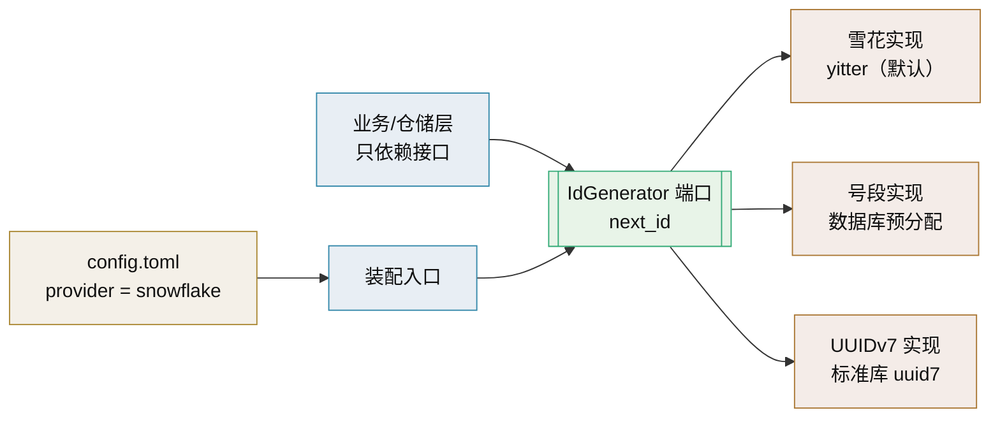

# IdGenerator 技术介绍

> 雪花算法 ID 生成 · 本项目分布式主键当前实现（可替换）

[文档首页](../../../文档首页.md) › [知识档案](../技术栈知识档案总览.md) › [后端核心](../技术栈知识档案总览.md#backend) › IdGenerator 技术介绍　|　[← 返回总览](../技术栈知识档案总览.md)

---

## 1. 技术概述 <a id="overview"></a>

**yitter/IdGenerator** 是一个多语言实现的**高性能唯一数字 ID 生成器**，
核心是对经典**雪花算法（Snowflake）**的优化变体——「雪花漂移算法」：
在保持 64 位整数、随时间单调递增的前提下，让生成的 ID 更短、瞬时并发更高，
并原生处理**时钟回拨**问题。
它不依赖 Redis、数据库等外部组件即可在单机或分布式环境生成全局唯一 ID，
在本项目中承担**所有业务表主键**的生成。

- **定位**：本项目分布式全局唯一 ID 生成（业务表主键）。
- **版本**：多语言持续迭代（Python 实现要求 Python 3.6+，本项目 3.14+）。
- **许可**：MIT，OSI 认证开源。
- **语言**：本项目用 Python 实现；同仓库另提供 C#/Java/Go/Rust/C 等。
- **可替换性**：ID 生成在本项目被视为**可替换的平台能力**（被驱动端口），本期默认 yitter 雪花，后续可换号段模式或 UUIDv7 等；接口抽象、注册与配置选择见《[插件化架构总览](../插件化架构/01_插件化架构_总览.md)》。

## 2. 核心概念与原理 <a id="principles"></a>

| 概念 | 说明 |
| --- | --- |
| 雪花算法 | 用「时间戳 + 机器号 + 序列号」拼成 64 位整数，各实例独立生成、互不冲突、无需中心协调 |
| 雪花漂移算法 | yitter 的优化：缩短 ID 长度、提升瞬时并发（宣称 0.1s 生成 50 万），并内置时钟回拨处理 |
| ID 组成 | 三段拼接：相对基准时间的时间差 + WorkerId（机器号）+ 序列号 |
| WorkerId | 区分不同机器/实例的全局唯一编号，**必须全局唯一**，是「不撞号」的关键 |
| WorkerIdBitLength | 机器号位长（默认 6，最大可 63），决定最多能区分多少实例 |
| SeqBitLength | 序列号位长（默认 6），决定每毫秒能生成多少个 ID；并发越高位长越大，ID 越长 |
| 单调递增 | ID 随时间大致递增（不保证连续），利于数据库 B+ 树索引顺序写入 |
| 时钟回拨处理 | 系统时间回拨时用预留序列号继续生成，避免重复 ID；允许回拨至预设基数内 |
| 64 位整数 | ID 为 long 整数（最多 8 字节），比 UUID（128 位）省空间、索引更快 |
| Redis 注册（可选） | k8s/容器自动扩容场景可用 Redis 自动注册 WorkerId，属可选增强，非必需依赖 |

## 3. 在本项目中的用途 <a id="usage"></a>

- 分布式全局唯一 ID 生成：**所有业务表统一用雪花 ID 作主键**，关联表用联合主键（见平台《架构设计 · 总体架构》「技术栈全景 · 后端核心」节、11.1 节「数据规范」）。
- 分布式环境下无需中心协调即可生成全局唯一 ID，契合本项目多实例无状态部署（见平台《项目规划说明》「集群设计要点」节）。
- **时钟回拨处理配置**：部署时需关注 NTP 时间同步与回拨容忍配置，避免极端情况下 ID 冲突（见平台《架构设计 · 总体架构》「技术栈全景 · 后端核心」节yitter 条目）。
- 与 UUID 相比：雪花 ID 是 64 位整数、**有序可排序**、利于数据库索引顺序写入与范围查询；UUID 无序、占 128 位，索引效率与存储都更差。
- 主键在应用侧生成后随 INSERT 写入，数据库不自增，跨 MySQL/PostgreSQL/达梦三库行为一致（见平台《项目规划说明》「数据库兼容」节）。
- 前端 JS 需注意：大整数超过 `Number.MAX_SAFE_INTEGER` 会丢精度，接口返回时按约定转字符串（见《[API 接口规范](../../../规范/API接口规范.md)》）。
- **可替换实现的用法**：业务代码只依赖统一的 ID 生成接口（如 `async def next_id() -> int`），不直接 `import` 具体算法库；换算法时改配置选实现，业务与数据模型不变（见《[插件化架构总览](../插件化架构/01_插件化架构_总览.md)》）。

## 4. 选型对比 <a id="compare"></a>

| 候选技术 | 优缺点 | 结论 |
| --- | --- | --- |
| **yitter/IdGenerator（当前默认）** | 优化雪花、ID 更短、并发高、原生时钟回拨处理、无外部依赖 | 分布式主键首选，性能与工程性兼顾 |
| 号段模式（Segment，如美团 Leaf-segment） | 数据库批量预分配号段、无时钟依赖、ID 趋势递增、性能高 | 强依赖数据库、有 ID 空洞；需严控时钟/WorkerId 时的备选 |
| UUIDv7（RFC 9562） | 128 位、时间有序、无需 WorkerId、Python 3.14 标准库原生支持 | 无需协调的现代候补；但占 16 字节、索引体积大于 64 位整数 |
| UUID（v4） | 全局唯一、无需协调，但 128 位、完全无序、索引与存储效率差 | 不满足「有序可排序、利于索引」的主键目标 |
| ULID | 26 字符、时间有序、可读性好，事实标准 | 时间有序但需字符存储/转换，主键场景不如 UUIDv7 与雪花 |
| 数据库自增（AUTO_INCREMENT） | 简单有序，但依赖单库中心、分布式/分库下会冲突 | 不适合多实例、多库的分布式主键 |
| Redis INCR | 简单连续，但强依赖 Redis、连续 ID 有业务泄露风险、成单点 | 引入外部依赖与单点，非最优 |

## 5. 可替换实现视角 <a id="replaceable"></a>

把 ID 生成当作**可替换的平台能力**看待：接口稳定、实现多样、按配置选择。这样「换算法」不影响业务代码与数据模型（数据模型前提：主键列可容纳新算法取值，见下方注意事项）。



```python
# 端口：业务只认这个接口
from abc import ABC, abstractmethod

class IdGenerator(ABC):
    @abstractmethod
    async def next_id(self) -> int: ...

# 实现：默认雪花（yitter）；另有号段、UUIDv7 等
class SnowflakeIdGenerator(IdGenerator):
    async def next_id(self) -> int:
        ...

# 装配：按配置选实现，业务代码零改动
# config.toml -> provider = "snowflake" | "segment" | "uuid7"
```

**候选算法全景**：

| 算法 | 位数/形态 | 有序性 | 时钟依赖 | 协调依赖 | 适用 |
| --- | --- | --- | --- | --- | --- |
| 雪花（yitter） | 64 位整数 | 趋势递增 | 强（有回拨处理） | WorkerId 分配 | 高并发、要 64 位紧凑主键 |
| 号段（Segment） | 64 位整数 | 趋势递增 | 无 | 数据库 | 无时钟风险、可容忍 ID 空洞 |
| UUIDv7 | 128 位 | 趋势有序 | 弱（含时间戳） | 无 | 无需协调、可接受 16 字节 |
| ULID | 128 位/26 字符 | 趋势有序 | 弱 | 无 | 需字符排序与可读性 |
| 数据库自增 | 整数 | 严格递增 | 无 | 数据库单点 | 单库、小规模后台 |

**替换步骤（阶段一）**：①确认业务只依赖 `IdGenerator` 端口；②实现新算法并注册进注册表；③改 `config.toml` 的 `provider`；④跑契约测试与主键回归；⑤重启生效。接口抽象与注册机制见《[插件化架构总览](../插件化架构/01_插件化架构_总览.md)》。

## 6. 常见问题与注意事项 <a id="pitfalls"></a>

- **WorkerId 必须全局唯一**：不同实例/服务必须分配不同 WorkerId，重复即可能撞号；一台机器部署多个服务时各服务也要用不同值。
- **时钟回拨**：务必保证 NTP 时间同步；虽算法有回拨容忍，但超出容忍基数的回拨仍会拒绝生成，需监控告警。
- **JS 精度**：64 位整数超过 JS `Number.MAX_SAFE_INTEGER`（2^53-1）会丢精度，API 返回与前端处理需统一转字符串。
- **数据库列类型**：主键列用 `BIGINT`（8 字节），不要用 `INT`，三库迁移脚本保持一致。
- **SeqBitLength 权衡**：并发需求高时增大 SeqBitLength 可提升吞吐，但 ID 会变长，需按实际 QPS 评估，不要盲目拉满。
- **无中心 ≠ 无约束**：仍需在部署编排中固化 WorkerId 分配策略（配置或注册器），避免手工配置漂移。

## 7. 学习与参考资料 <a id="learn"></a>

| 资源 | 网址 | 说明 |
| --- | --- | --- |
| yitter/IdGenerator GitHub | https://github.com/yitter/IdGenerator | 官方源码与完整算法/参数文档（README 即权威说明） |
| Python 实现与示例 | https://github.com/yitter/IdGenerator/tree/master/Python | 本项目使用的 Python 版调用示例 |
| Gitee 镜像 | https://gitee.com/yitter/idgenerator | 国内访问镜像，内容同源 |
| Twitter Snowflake 原始设计 | https://github.com/twitter-archive/snowflake | 雪花算法源头（64 位、无需协调的设计动机） |
| Snowflake ID 深入解析 | https://klab.tw/2026/06/snowflake-id-guide/ | 位结构、各家变体与选型的中文解析 |
| Python uuid 模块（3.14） | https://docs.python.org/3/library/uuid.html | 标准库新增 `uuid6()` / `uuid7()` / `uuid8()`（RFC 9562） |
| UUIDv7 / ULID / Snowflake 对比 | https://www.authgear.com/zh-hant/post/time-sortable-identifiers-uuidv7-ulid-snowflake/ | 时间可排序标识符的原理与取舍 |
| 美团 Leaf 分布式 ID | https://tech.meituan.com/2017/04/21/mt-leaf.html | 号段模式（Leaf-segment）与雪花模式详解 |

## 8. 项目内关联文档 <a id="related"></a>

| 文档 | 说明 |
| --- | --- |
| 平台《架构设计 · 总体架构》「技术栈全景 · 后端核心」节 | 后端技术栈：ID 生成（yitter/IdGenerator）条目 |
| 平台《项目规划说明》「数据规范」节 | 数据规范：业务表统一雪花 ID 主键 |
| 平台《项目规划说明》「核心数据表清单」节 | 核心数据表清单（主键约定） |
| 《[数据库开发规范](../../../规范/数据库开发规范.md)》 | 主键 BIGINT、索引与三库一致要求 |
| 《[SQLAlchemy 技术介绍](SQLAlchemy技术介绍.md)》 | ORM 主键映射（应用侧生成 ID） |
| 《[Alembic 技术介绍](Alembic技术介绍.md)》 | 迁移脚本中主键列类型（BIGINT） |
| 《[API 接口规范](../../../规范/API接口规范.md)》 | 大整数 ID 返回与 JS 精度处理约定 |
| 《[插件化架构总览](../插件化架构/01_插件化架构_总览.md)》 | ID 生成可替换的总体机制与三阶段演进 |
| 《[自建注册表技术介绍](../插件化架构/08_插件化架构_自建注册表.md)》 | 端口 + 注册表 + 工厂的落地写法 |

---

> 依《[文档生成规范](../../../规范/文档生成规范.md)》编写