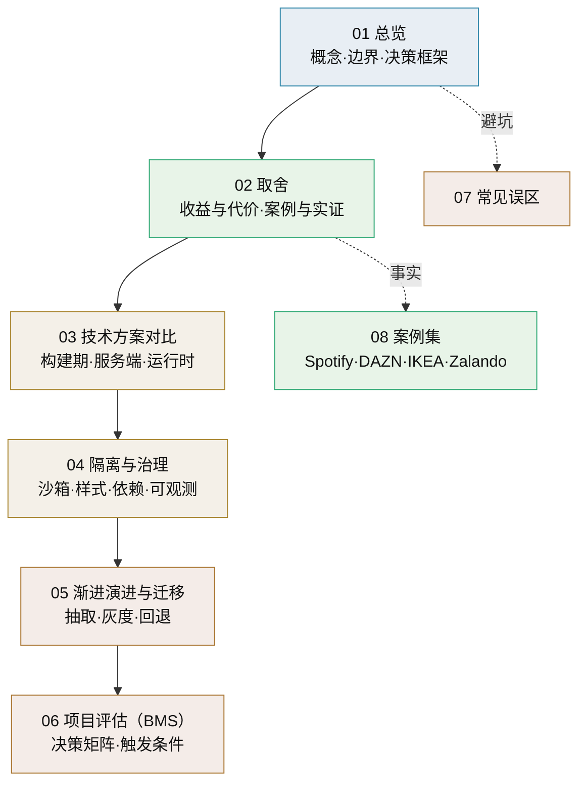

# 微前端总览

> 独立交付的前端组合成整体 · 概念、取舍与决策框架 · 子篇地图

[文档首页](../../../文档首页.md) › [知识档案](../技术栈知识档案总览.md) › 微前端总览　|　[← 返回总览](../技术栈知识档案总览.md)

---

## 1. 概述与定位 

**微前端**（Micro Frontends）是把一个前端应用拆成若干**可独立开发、测试与部署**的片段（微应用/片段），
再组合成对用户而言「一个整体产品」的架构风格。定义（Cam Jackson / Fowler 站点）：

> “An architectural style where independently deliverable frontend applications are composed into a greater whole.”

它的目标与后端微服务同源——**让多个团队独立交付**——但战场不同：浏览器只有一个运行时，
样式、路由、依赖、状态都天然共享，因此「拆开容易、隔离与治理难」。

本专题要回答的问题：

- 微前端到底解决什么问题、代价是什么、业界哪些场景真的用得上？
- 各种技术路线（构建期合并 / 服务端组合 / 运行时组合）怎么选、坑在哪？
- **BMS 当前口径「不引入运行时远程加载 / 微前端，产品前端构建期合并」是否仍然成立？**
  什么条件下需要重评？

> 本目录是**知识档案**，回答「微前端是什么、有哪些做法、取舍如何」；是否引入属平台《项目规划说明》范畴，
> 本目录只做知识铺垫与决策框架（见《[06 项目评估](06_微前端_项目评估.md)》），**不预设结论**。

## 2. 与相邻概念的关系（避免混淆） 

| 概念 | 解决的问题 | 与前端的边界 |
| --- | --- | --- |
| [后端微服务](../微服务/01_微服务_总览.md) | 后端模块独立部署与伸缩 | 微前端不是「微服务的前端镜像」：浏览器无进程隔离、共享运行时，代价结构完全不同 |
| [前端插件化](../插件化架构/14_插件化架构_前端插件化.md) | 扩展点注册与**构建期合并**（本平台现行形态） | 插件化解决「扩展内容怎么挂进来」，微前端解决「片段从哪来、怎么运行时组合」 |
| 组件库 | UI 复用与一致性 | 组件是**开发期复用**，微前端是**部署期组合**——两者正交（见《[07 常见误区](07_微前端_常见误区.md)》） |
| 单体前端 | 一个构建产物 | 微前端是「单片构建」到「多片组合」的取舍，不是必然升级 |

**一句话区分**：产品的前端页面**构建期合并**（本项目现状）＝「一个应用、多团队贡献」；
微前端＝「多个可独立部署的前端应用，运行时/服务端拼装」。前者成本低，后者换独立发版与隔离。

**与微服务的代价结构对照**（同源表见《[微服务 · 01 总览](../微服务/01_微服务_总览.md)》§7）：

| 维度 | 微服务 | 微前端 |
| --- | --- | --- |
| 拆分对象 | 业务域 + 数据所有权 | 页面 / 区域 + 构建产物 |
| 隔离底座 | 进程 / 容器（天然） | 浏览器共享运行时（人为） |
| 主要代价 | 数据切开：跨服务一致性 / 迁移 / 多租户 × 服务、分布式延迟与运维 | 共享运行时：体积与依赖重复、JS/CSS 隔离、体验漂移、版本偏斜 |
| 横切问题 | 权限 / 租户 / 审计每服务重复（且依赖全局数据） | 设计令牌一致性、登录态与租户上下文跨片段 |
| 是否切数据 | 切（库 / schema / 事务） | 不切库，但重分数据访问（片段自取数 / BFF） |
| 换来的收益 | 独立部署 / 伸缩 / 故障隔离 / 团队自治 | 独立发版 / 片段替换 / 渐进迁移 / 团队自治 |

> 一句话：**微服务是「切数据换独立」，微前端是「切页面换独立」**；横切是两者共同难题，
> 但在微服务里因数据切开被放大——这也是两者代价结构最本质的差别。

## 3. 核心概念与术语 

| 术语 | 定义 | 对应篇目 |
| --- | --- | --- |
| 微前端（Micro Frontend） | 可独立交付的前端片段，组合成更大整体 | 全篇 |
| 宿主 / 外壳（Host / Shell） | 加载、路由与组合微应用的容器（应尽量薄） | [04 隔离与治理](04_微前端_隔离与治理.md) |
| 集成方式（Integration） | 片段如何进入页面：构建期 / 服务端 / 运行时 | [03 技术方案对比](03_微前端_技术方案对比.md) |
| 隔离（Isolation） | JS 沙箱与样式/依赖互不干扰 | [04 隔离与治理](04_微前端_隔离与治理.md) |
| 共享依赖（Shared Dependency） | 多片段共用同一份运行时依赖（React/Vue 等） | [04 隔离与治理](04_微前端_隔离与治理.md) |
| 版本偏斜（Version Skew） | 宿主与远端依赖版本不一致导致的运行时异常 | [04 隔离与治理](04_微前端_隔离与治理.md) |
| BFF | 为特定前端定制的后端聚合层（Backend for Frontend） | [03 技术方案对比](03_微前端_技术方案对比.md) · [05 演进](05_微前端_渐进演进与迁移.md) |
| ESI / SSI | 服务端（Edge Side Includes / Server Side Includes）片段拼装 | [03 技术方案对比](03_微前端_技术方案对比.md) |
| Fitness Function | 用自动化检查守住架构约束（体积预算、依赖规则等） | [04 隔离与治理](04_微前端_隔离与治理.md) |
| 微前端无政府状态 | 放任各团队自由技术栈导致的体验与治理崩坏（反模式） | [07 常见误区](07_微前端_常见误区.md) |

## 4. 子篇地图 

| 篇目 | 回答的问题 |
| --- | --- |
| [01 总览](01_微前端_总览.md) | 微前端是什么、与插件化/微服务的边界、怎么读本专题 |
| [02 单体与微前端取舍](02_微前端_单体与微前端取舍.md) | 收益与代价、行业案例与实证数据 |
| [03 技术方案对比](03_微前端_技术方案对比.md) | 构建期 / 服务端 / 运行时各方案怎么做、怎么选 |
| [04 隔离与治理](04_微前端_隔离与治理.md) | JS/CSS 隔离、依赖共享与版本偏斜、路由通信、部署与可观测 |
| [05 渐进演进与迁移](05_微前端_渐进演进与迁移.md) | 真要上的话怎么起步、怎么灰度、怎么回退 |
| [06 项目评估（BMS）](06_微前端_项目评估.md) | 本项目约束代入、决策矩阵、重评触发条件 F1~F8 |
| [07 常见误区](07_微前端_常见误区.md) | 流行说法核对、与相邻概念的边界 |
| [08 案例集](08_微前端_案例集.md) | Spotify / DAZN / IKEA / Zalando 等案例的事实与教训 |

## 5. 阅读路径 

| 目的 | 建议顺序 | 预计 |
| --- | --- | --- |
| **快速参与决策** | 01 → 02 → 06 → 07 | 约 30 分钟 |
| 想系统理解 | 01 → 02 → 08 → 03 → 04 → 05 → 06 → 07 | 约 2 小时 |
| 只看技术方案 | 03 → 04 | 约 40 分钟 |
| 研究案例 | 08 → 02 §案例 | 约 30 分钟 |

## 6. 中立评估框架 

微前端的行业共识可浓缩成三句话：

1. **它解决的是「多团队同一产品的独立交付」与「渐进式技术迁移」**，不是性能或代码优雅；
2. **收益与代价同源**：拆开带来独立，也带来重复依赖、体验漂移、治理与运维复杂；
   Thoughtworks 的警示词是「**微前端无政府状态**」（micro-frontend anarchy）——只拆不治必崩；
3. **单选型产品（单团队/小团队）通常不需要它**：Cam Jackson 本人明确「一人或一个团队的公司，
   做微前端意义不大」；先把单体前端的边界与模块化做好，保留可拆分性。

| 维度 | 偏单体前端 | 偏微前端 |
| --- | --- | --- |
| 团队 | 1 个团队维护 | 多团队需独立发版、独立交付 |
| 产品形态 | 统一体验的应用 | 门户型/多域拼装、或需渐进迁移旧栈 |
| 技术栈 | 单一栈统一 | 确有异构共存/渐进替换需求 |
| 治理能力 | 无设计系统与自动化预算 | 有设计系统、Fitness Function、可观测 |
| 交付节奏 | 统一发布可接受 | 片段发版频率差异大且必须解耦 |

> 本项目取值见《[06 项目评估](06_微前端_项目评估.md)》；结论留给讨论与评审。

## 7. 学习与参考资料 

| 资源 | 网址 | 说明 |
| --- | --- | --- |
| Cam Jackson：Micro Frontends（Fowler 站） | https://martinfowler.com/articles/micro-frontends.html | 定义、收益代价与实现示例的权威起点 |
| micro-frontends.org（Michael Geers） | https://micro-frontends.org/ | 五条核心原则、Custom Elements 与 SSI/ESI 组合 |
| Thoughtworks Technology Radar | https://www.thoughtworks.com/radar/techniques/micro-frontends | 长期跟踪与技术判断 |
| 《Building Micro-Frontends》（Luca Mezzalira） | https://www.buildingmicrofrontends.com/book | 四大支柱、反模式与治理专著 |
| Module Federation 官方文档 | https://module-federation.io/ | 运行时组合与 shared 依赖配置 |
| qiankun / micro-app / wujie 文档 | https://qiankun.umijs.org/ · https://micro-zoe.github.io/micro-app/ · https://wujie-micro.github.io/doc/ | 国内主流运行时框架 |
| Sam Newman：BFF | https://samnewman.io/patterns/architectural/bff/ | 后端配套模式 |

## 8. 项目内关联文档 

| 文档 | 说明 |
| --- | --- |
| 《[技术栈知识档案总览](../技术栈知识档案总览.md)》 | 知识档案入口索引 |
| 《[插件化架构 · 14 前端插件化](../插件化架构/14_插件化架构_前端插件化.md)》 | 本平台前端扩展点与构建期合并机制 |
| 《[微服务总览](../微服务/01_微服务_总览.md)》 | 后端侧的同类取舍（边界见第 2 节） |
| 《[02 单体与微前端取舍](02_微前端_单体与微前端取舍.md)》 | 本专题证据篇 |
| 平台《项目规划说明》 | 「不引入运行时远程加载 / 微前端」现行口径（平台专属文档） |
| 平台《平台可扩展性规划》 | 产品前端模块构建期合并口径（平台专属文档） |

---

> 依《[文档生成规范](../../../规范/文档生成规范.md)》编写
