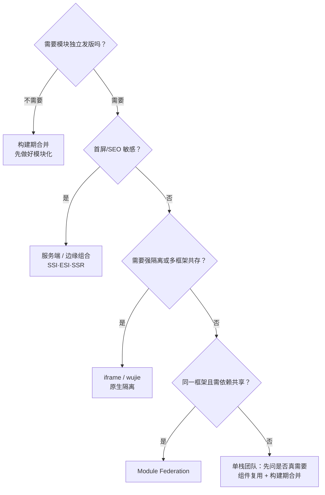

# 微前端技术方案对比技术介绍

> 构建期合并 · 服务端组合 · 运行时组合 · BFF 配套

[文档首页](../../../文档首页.md) › [知识档案](../技术栈知识档案总览.md) › [微前端](../技术栈知识档案总览.md#microfrontend) › 技术方案对比技术介绍　|　[← 返回总览](01_微前端_总览.md)

---

## 1. 技术概述 

微前端的实现差异集中在三个问题：**模块的边界是什么**（页面 / 区域 / 组件）、
**组合发生在什么时机**（构建期 / 服务端 / 运行时）、**用什么机制组合**（打包器 / 模板 / 沙箱 / 浏览器原生）。
其中**集成时机**是选型主线：

| 集成时机 | 组合发生地 | 独立发版 | 主要代价 |
| --- | --- | --- | --- |
| 构建期合并 | 打包器（CI 内） | ✗（随宿主一起发版） | 无运行时开销；边界靠代码组织与契约 |
| 服务端组合 | 服务器 / CDN 边缘 | ✓（模块可独立部署） | 需要服务端编排、响应拼装与缓存策略 |
| 运行时组合 | 浏览器 | ✓（远端独立部署） | 沙箱、共享依赖、版本偏斜与体验一致性治理 |

## 2. 方案一：构建期合并（本项目现行形态） 

产品前端模块以**包/源码**形式在平台前端工程中一起构建，产出单一 SPA 产物。

- **做法**：monorepo 或依赖包；产品页面组件在构建时并入路由与菜单注册表；类型由 OpenAPI 对齐。
- **优点**：零运行时隔离问题；共享一份依赖与设计系统，体验天然一致；构建期即可发现大部分错误；运维最简（一个产物）。
- **缺点**：产品前端不能独立发版（必须随平台构建发布）；大仓库构建时间随规模增长；跨产品复用靠构建期约定。
- **适用**：单团队/单技术栈/统一体验的产品（**本项目当前**）。

## 3. 方案二：服务端组合 

模块以 HTML/SSR 输出，在**服务端或 CDN 边缘**拼装成完整页面。

| 手段 | 说明 | 案例/备注 |
| --- | --- | --- |
| SSI（Server Side Includes） | Web 服务器模板包含（`#include`），简单稳定 | micro-frontends.org 示例工程 |
| ESI（Edge Side Includes） | CDN 边缘拼装模块，可缓存、可降级 | **IKEA**（页面 = ESI 模块，自包含模块含各自 CSS/JS）；DAZN 评述其缓存与可用性优势 |
| 服务端渲染组合（Fragments/SSR） | 应用层按模块组装响应（Node/边缘函数） | **Zalando** Interface Framework（Renderers 服务端渲染） |
| 边缘计算（Edge SSR） | 在边缘节点执行 SSR 与拼装 | IKEA 后续演进方向 |

- **优点**：首屏友好（HTML 直出）、SEO 好、模块可独立部署；缓存策略可下沉到 CDN。
- **缺点**：最慢模块决定整体响应时间；需要骨架屏/占位避免布局跳动（CLS）；开发与调试链路更长（微前端站点有多篇专述）。
- **适用**：内容型/电商型站点、首屏与 SEO 敏感场景。

## 4. 方案三：运行时组合 

### 4.1 生命周期编排：single-spa / qiankun / micro-app / wujie

| 项目 | 原理 | JS 隔离 | 样式隔离 | 特点/限制 |
| --- | --- | --- | --- | --- |
| **single-spa** | 路由分发 + 生命周期（bootstrap/mount/unmount） | 需自行实现 | 需自行实现 | 最灵活、约定最少；改造与治理成本最高 |
| **qiankun**（阿里） | 基于 single-spa，HTML Entry + 沙箱 | Proxy 沙箱（降级快照沙箱） | `strictStyleIsolation`（Shadow DOM）或 `experimentalStyleIsolation`（选择器改写） | 生态成熟；**同时仅能激活一个子应用**、Vite 需插件改造、严格样式隔离对弹窗有坑 |
| **micro-app**（京东） | WebComponent 容器 + 沙箱（类 Shadow DOM） | Proxy（1.0 起支持 iframe 沙箱） | 默认类 Shadow DOM（主应用样式仍可能穿透） | 组件式接入最简单、支持保活；需 CustomElements/Proxy 能力 |
| **wujie**（腾讯） | WebComponent 容器 + **iframe 沙箱**，DOM 代理到主文档 | iframe 原生隔离 | iframe/Shadow DOM 原生隔离 | 隔离最彻底、支持多应用同时激活与保活、原生支持 ESM/Vite；通信与调试成本相对高 |

> 国内三者的选型经验（中文社区）：**渐进迁移选 qiankun、效率优先选 micro-app、隔离优先选 wujie**；
> 但任何框架都只是「编排」，**不能替代**模块内部的模块化与契约（见《[04 隔离与治理](04_微前端_隔离与治理.md)》）。

### 4.2 运行时模块共享：Module Federation

Webpack 5 引入、现已扩展为独立规范与工具链（module-federation.io，支持 Webpack/Rspack/Vite 生态）。

- **机制**：构建产物暴露 `remoteEntry.js`；宿主在运行时加载远端模块（路由/组件）；`shared` 配置让 React/Vue 等**只加载一份**。
- **关键配置**：`singleton`（单实例，状态类库必备）、`requiredVersion`（版本范围）、`strictVersion`（不满足即抛错）、
  `eager`（打进初始包，慎用）、子路径（如 `react-dom/client`，漏配会导致第二份 React 引发 hydration 错误）。
- **优点**：运行时按需加载、依赖可共享、独立部署体验好；单框架团队最顺手。
- **风险**：**版本偏斜**（宿主与远端依赖不兼容）、共享包未声明导致重复打包（静默出问题）、
  开发态（Vite dev）与生产构建行为不一致、缓存与回滚复杂度。

### 4.3 Web Components（Custom Elements + Shadow DOM）

- **机制**：模块以自定义元素暴露（标签 + 属性 + 事件即契约），框架无关；Shadow DOM 提供样式封装。
- **优点**：浏览器原生、跨框架、长期稳定；适合**叶子组件/设计系统**级复用。
- **限制**：Shadow DOM 对弹窗/下拉挂 body 的组件不友好；SSR 支持弱（无 JS 即无 Custom Elements）；事件与属性通信偏手动。
- **定位**：micro-frontends.org 推荐它做主集成原语；Thoughtworks 观察「Web Components 在微前端领域一直难以落地」——两者并不矛盾：**做模块外壳可行，做全站路由级方案不成熟**。

### 4.4 iframe

- **机制**：每个模块独立文档上下文，浏览器级隔离（JS/样式/路由全隔离）。
- **优点**：隔离最强、改造成本最低、安全性好（适合第三方不可信内容）。
- **缺点**：通信只能 `postMessage`；路由/弹窗/全局体验受框限制；首屏与内存开销大。
- **案例**：Spotify 桌面端用 iframe + 事件总线组合。

### 4.5 import maps（原生模块加载）

- **机制**：浏览器用 import map 将裸模块名映射到 URL，模块按约定暴露 ESM 入口。
- **优点**：平台原生、无框架；**缺点**：需要强约定与治理（共享依赖、版本）与浏览器能力支持。
- **定位**：轻量组合与实验性方案；规模化生产案例少于前述方案。

## 5. 方案对比总表 

| 方案 | 隔离强度 | 首屏 | 独立发版 | 改造成本 | 典型适用 |
| --- | --- | --- | --- | --- | --- |
| 构建期合并 | 无需（同一应用） | 最优 | ✗ | 低 | 单团队、统一栈（**本项目**） |
| SSI / ESI / 边缘组合 | 中（HTML 级） | 优 | ✓ | 中高（需服务端/边缘） | 内容/电商站点，SEO 与首屏 |
| Module Federation | 中（共享运行时） | 良 | ✓ | 中 | 同一框架、多团队、需依赖共享 |
| single-spa / qiankun | 较强（沙箱） | 中 | ✓ | 中高 | 多框架迁移、管理后台 |
| micro-app / wujie | 强（沙箱/iframe） | 中 | ✓ | 中 | 强隔离、多应用并存 |
| Web Components | 样式强、JS 弱 | 中 | ✓ | 中 | 叶子组件、跨框架部件 |
| iframe | 最强 | 差 | ✓ | 低 | 第三方内容、强隔离 |
| import maps | 弱 | 良 | ✓ | 中（治理重） | 约定统一的小规模场景 |

## 6. 选型启发式 

原则：**先定边界（业务域/页面级），再定组合时机，最后才选框架**；
选「满足约束的最简边界」，把契约与治理投资放在框架选择之前（与后端的判断一致）。

## 7. BFF 配套模式 

微前端常与 **BFF（Backend for Frontend）** 一起讨论：每个前端（或每个微前端）对应一个**由该前端团队拥有**的后端聚合层。

| 维度 | 说明 |
| --- | --- |
| 目的 | 聚合下游服务、裁剪数据形态、隔离前端对后端结构的依赖 |
| 归属 | 与前端同团队、同发布节奏（不同于共享 API 网关） |
| 安全 | 不要把用户 token 直接转发给后端服务；用服务身份换取数据（见《[微服务 · 08 安全与认证](../微服务/08_微服务_安全与认证.md)》） |
| 替代 | GraphQL（Federation）可部分取代聚合；但会引入 schema 治理与过度取数风险 |
| 代价 | 多一层部署与运维；共享 BFF 会重新变成瓶颈（每前端一个，不共享） |

> **本项目现状（2026-09-25 口径更新）**：后端已微服务化（9 服务、每服务独立契约、每服务独立库），前端采用**按服务段寻址**（请求层集中维护「域 → 服务前缀」映射）而非 BFF——单一前端形态 + 统一响应下仍无强聚合诉求；
> 若未来出现「多前端形态（PC/H5/大屏）差异大」或聚合诉求放大，再按此模式评估。

## 8. 学习与参考资料 

| 资源 | 网址 | 说明 |
| --- | --- | --- |
| Cam Jackson：Micro Frontends（含各类集成方式示例） | https://martinfowler.com/articles/micro-frontends.html | 服务端/构建期/运行时全覆盖 |
| micro-frontends.org：SSI/ESI 与 Custom Elements | https://micro-frontends.org/ | 组合机制与骨架屏实践 |
| Module Federation 文档（shared 配置） | https://module-federation.io/configure/shared.html | singleton / requiredVersion / eager 语义 |
| webpack ModuleFederationPlugin | https://webpack.js.org/plugins/module-federation-plugin/ | 共享依赖与版本策略 |
| qiankun 文档 | https://qiankun.umijs.org/ | HTML Entry 与沙箱配置 |
| micro-app 文档 | https://micro-zoe.github.io/micro-app/ | 组件式接入与隔离模式 |
| wujie 文档 | https://wujie-micro.github.io/doc/ | iframe + WebComponent 方案 |
| Sam Newman：BFF | https://samnewman.io/patterns/architectural/bff/ | 模式原始定义与取舍 |
| AWS：MFE 的 BFF 指导 | https://docs.aws.amazon.com/prescriptive-guidance/latest/micro-frontends-aws/api-integration-data-fetching.html | BFF 与微前端配合 |

## 9. 项目内关联文档 

| 文档 | 说明 |
| --- | --- |
| 《[01 总览](01_微前端_总览.md)》 | 专题入口 |
| 《[02 取舍](02_微前端_单体与微前端取舍.md)》 | 是否值得拆 |
| 《[04 隔离与治理](04_微前端_隔离与治理.md)》 | 各方案的隔离与治理细节 |
| 《[06 项目评估（BMS）](06_微前端_项目评估.md)》 | 本项目选型与触发条件 |
| 《[插件化架构 · 14 前端插件化](../插件化架构/14_插件化架构_前端插件化.md)》 | 构建期合并与运行时加载的本项目对照 |

---

> 依《[文档生成规范](../../../规范/文档生成规范.md)》编写
