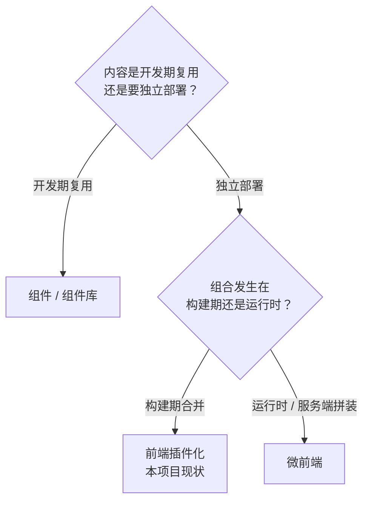

# 微前端常见误区

> 流行说法与事实核对 · 术语混淆 · 上马前自检清单

[文档首页](../../../文档首页.md) › [知识档案](../技术栈知识档案总览.md) › [微前端](../技术栈知识档案总览.md#microfrontend) › 微前端常见误区　|　[← 返回总览](01_微前端_总览.md)

---

## 1. 概述 

微前端是前端领域被讨论最多、也最容易被误用的架构之一：既有「什么都该拆」的过度热情，
也有「就是组件库 / 就是 iframe」的过度简化。本页把常见误区集中核对，供讨论中快速落地事实。

## 2. 认知误区核对 

| # | 流行说法 | 事实 | 出处/依据 |
| --- | --- | --- | --- |
| 1 | 微前端能优化性能 | 它通常**增加**体积与加载复杂度；按需加载用路由分包/懒加载即可，不必微前端 | Cam Jackson 列的代价之一即重复依赖 |
| 2 | 微前端是微服务的必要配套 | 两者动因同源（组织独立交付），技术约束完全不同；可只拆一端或不拆 | 《[01 总览](01_微前端_总览.md)》§2 |
| 3 | 组件库 / 组件拆分就是微前端 | 组件是**开发期复用**，微前端是**部署期组合**；两者正交，混同会导致「复用优先」压倒「团队自治」 | Mezzalira「Yin & Yang」反模式 |
| 4 | 上微前端就能多框架自由 | 同页多框架带来体积、调试、体验三重成本；行业建议限制在 1~2 套栈 | Mezzalira「Hydra」反模式；Thoughtworks「无政府状态」 |
| 5 | 必须选某框架（qiankun/MF/…） | 先定边界与集成时机，再选工具；框架只是编排，不解决片段内部模块化 | 《[03 技术方案对比](03_微前端_技术方案对比.md)》§6 |
| 6 | 拆得越细越好 | 运行时片段过多会成「分布式单体前端」（Mezzalira：25 个已属过量）；粒度**宁粗勿细** | Mezzalira 启发式 |
| 7 | 共享全局状态没关系 | 跨片段共享可变状态 = 团队间隐式契约，任何一方改动都要全员同步升级 | 「Relax, it's just code」反模式 |
| 8 | 依赖版本一致就不会重复打包 | 版本相同≠一份：必须**双端声明 shared**；且 `singleton` 缺失时状态型库会出现两份 | Module Federation shared 文档；双实例故障分析 |
| 9 | Shadow DOM 是万能样式隔离 | 挂到 `body` 的弹窗/下拉会丢样式、可继承属性会穿透、部分 UI 库不兼容 | qiankun `strictStyleIsolation` 限制 |
| 10 | iframe 过时、不能用 | 隔离最强、改造成本最低，Spotify 等在生产使用；关键是用对场景（强隔离/第三方） | Spotify 案例；《[03 技术方案对比](03_微前端_技术方案对比.md)》§4.4 |
| 11 | 独立部署 = 随便发版 | 需要契约兼容、版本清单/发现、灰度回滚与回归验证，否则片段独立发版会互相破坏 | 《[04 隔离与治理](04_微前端_隔离与治理.md)》§6 |
| 12 | 先拆，治理以后再补 | 治理（设计系统、体积预算、契约）是收益的前提；后补等于先制造债务 | Mezzalira：治理 for the win；Fitness Function |
| 13 | 只拆前端就能解决一切 | 后端 API 形态不支持时，前端片段仍会互相等待；必要时配 BFF（由前端团队拥有） | Sam Newman BFF；《[03 技术方案对比](03_微前端_技术方案对比.md)》§7 |
| 14 | 拆了就不是分布式单体 | 片段发布需同步协调、共享全局状态、共享库牵一发动全身——都是「分布式单体前端」症状 | 《[02 取舍](02_微前端_单体与微前端取舍.md)》§3 |

## 3. 术语混淆速查 

| 名词 | 一句话 | 与微前端的区别 |
| --- | --- | --- |
| 组件（Component） | 开发期复用单元（按钮、表格） | 不独立部署；微前端是部署期组合 |
| 单体前端（SPA 单产物） | 一次构建、一次发布 | 微前端是多次构建、独立发布的组合 |
| 插件化 / 前端插件化 | 扩展点注册 + **构建期合并**（本项目现状） | 解决「挂什么进来」；微前端解决「怎么运行时组合」 |
| 微前端无政府状态 | 各团队任意技术栈、无共享规范 | 反模式；与「微前端」不是同义词 |
| 分布式单体前端 | 多构建产物但必须同步发布、共享状态 | 微前端反模式，成本双份、收益全无 |
| BFF | 为特定前端定制的后端聚合层 | 常与微前端配套，但独立成立 |
| ESI / SSI | 服务端片段拼装 | 服务端组合路线（非运行时） |
| 浏览器沙箱 | JS/CSS 隔离机制（Proxy/iframe/Shadow DOM） | 微前端的实现细节，不是风格本身 |

## 4. 与相邻概念的三个判定问题 

| 场景 | 正确工具 |
| --- | --- |
| 多产品共用按钮/表格样式 | 组件库 + 设计令牌 |
| 产品页面随平台发布交付 | 前端插件化（构建期合并 + 注册表） |
| 产品前端独立发版、体验仍需一致 | 先评估收益与治理，再考虑 Module Federation / 微前端 |
| 嵌入第三方不可信页面 | iframe（安全隔离），不是微前端框架 |
| 页面内某个区域独立迭代 | 路由级分包 + 动态 import（单体前端内的技术手段） |

## 5. 上马前自检清单（问这 10 个问题） 

1. 是否为**多团队**需要独立交付（而非性能/代码优雅）？
2. 片段边界是否按业务域划分、粒度宁粗勿细（运行时片段是否 ≤ 8 个）？
3. 是否已具备设计系统与统一令牌，保证体验一致？
4. 是否已有体积预算、依赖白名单与契约测试（Fitness Function）？
5. 是否明确路由归属与通信方式，禁止跨片段共享可变状态？
6. 依赖共享策略是否想清楚（singleton / requiredVersion / 双端 CI 验证）？
7. 宿主是否足够薄（业务知识不进宿主）？
8. 独立发版后的版本发现、灰度与回滚机制是否就位？
9. 可观测性能否按片段归因（错误/性能/体积）？
10. 若试点收益不达预期，是否有回退为统一构建的预案？

> 10 问中「否」多于 2 个：先做《[04 隔离与治理](04_微前端_隔离与治理.md)》的准备，不要先选框架。

## 6. 学习与参考资料 

| 资源 | 网址 | 说明 |
| --- | --- | --- |
| Mezzalira：反模式演讲与播客 | https://www.infoq.com/presentations/microfrontend-antipattern/ · https://www.infoq.com/podcasts/microfrontends-heuristics-patterns-antipatterns/ | 误区与治理的一手总结 |
| Cam Jackson：Micro Frontends | https://martinfowler.com/articles/micro-frontends.html | 收益/代价原始定义 |
| micro-frontends.org | https://micro-frontends.org/ | 原则与「无政府状态」警示 |
| Thoughtworks Radar | https://www.thoughtworks.com/radar/techniques/micro-frontends | 行业趋势与判断 |
| Scott Logic 反方观点 | https://blog.scottlogic.com/2021/02/17/probably-dont-need-microfrontends.html | 「你可能不需要微前端」 |
| Module Federation FAQ | https://module-federation.io/ | 共享依赖常见错误 |

## 7. 项目内关联文档 

| 文档 | 说明 |
| --- | --- |
| 《[01 总览](01_微前端_总览.md)》 | 专题入口与术语 |
| 《[02 取舍](02_微前端_单体与微前端取舍.md)》 | 误区 #1/#2/#14 的完整证据 |
| 《[04 隔离与治理](04_微前端_隔离与治理.md)》 | 误区 #8/#9/#11/#12 的正解 |
| 《[06 项目评估（BMS）](06_微前端_项目评估.md)》 | 本项目结论与触发条件 |
| 《[插件化架构 · 14 前端插件化](../插件化架构/14_插件化架构_前端插件化.md)》 | 与插件化的系统对照 |

---

> 依《[文档生成规范](../../../规范/文档生成规范.md)》编写
