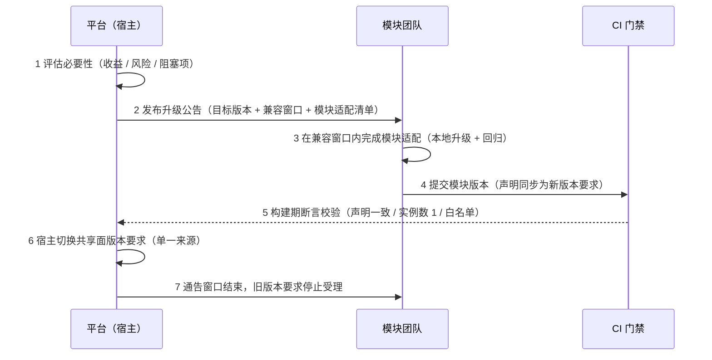

# 微前端依赖升级契约

> 框架级共享依赖的**协同升级流程、兼容窗口与通告口径**（平台与运行时模块之间的跨团队契约）

[文档首页](../../../文档首页.md) › [知识档案](../技术栈知识档案总览.md) › [微前端](../技术栈知识档案总览.md#microfrontend) › 依赖升级契约　|　[← 返回总览](01_微前端_总览.md)

## 1. 为什么需要契约 

运行时组合下，共享依赖（框架本体 / 路由 / 状态）由**宿主提供、模块消费**：宿主与模块若是各升各的，运行期就会出现版本不匹配——轻则加载被拒绝，重则出现两份实例（响应式与状态不通、组件上下文丢失，问题只在运行期以疑难杂症形式暴露）。

因此：**共享依赖的大版本升级不是任何一方的内部事务，而是平台与模块之间的契约变更**。契约目标是「升级可预期、可协同、可回退」。

> 语义要求见平台《架构设计 · 前端架构》「模块治理要求」表「依赖共享与版本偏斜」行；强制口径见《[前端开发规范](../../../规范/前端开发规范.md)》「依赖共享与版本偏斜」节。本页只写**流程与窗口**。

## 2. 变更分级 

| 级别 | 判定 | 影响 | 处置 |
| --- | --- | --- | --- |
| 补丁级 | 版本要求范围内（如 `^3.5.41` → `3.5.4x`） | 无需模块改动，共享域仍只选一份 | 平台侧自行升级；护栏与断言自动复验 |
| 次版本 | 仍满足原版本要求 | 同上，但可能带来行为微调 | 平台侧升级后跑一遍模块端到端回归 |
| **主版本（契约级）** | 超出原版本要求 | 模块侧**加载被拒**（版本不满足即拒绝） | 走第 3 节协同流程，**不得单方面升级** |

## 3. 主版本协同升级流程 

| 步 | 动作 | 责任方 | 产出 |
| --- | --- | --- | --- |
| 1 | **评估**：必要性、可替代性、受影响模块清单、回退可行性 | 平台 | 升级评估结论（含回退方案） |
| 2 | **公告**：目标版本、兼容窗口起止、模块适配清单与验证要求 | 平台 | 升级公告（含窗口） |
| 3 | **适配**：模块侧升级实装版本、跑通自身回归与端到端 | 模块 | 模块适配提交 |
| 4 | **提交**：模块声明与实装版本同步为目标版本 | 模块 | 模块发布 |
| 5 | **校验**：共享声明一致 / 实例数为 1 / 白名单 | CI | 门禁结果 |
| 6 | **切换**：单一来源的版本要求切到新版本 | 平台 | 宿主发布 |
| 7 | **收口**：窗口结束、旧要求停受理、遗留登记 | 平台 | 收口记录 |

**顺序纪律**：先模块适配、后宿主切换（宿主先切会导致未适配模块加载被拒）；**不得**通过放宽为「告警」来绕开窗口。

## 4. 兼容窗口 

| 项 | 口径 |
| --- | --- |
| 窗口起点 | 升级公告发布日 |
| 窗口长度 | 默认 **2 个发布周期**；涉及多模块联动或异构栈时按评估结论延长，并在公告中写明 |
| 窗口内 | 宿主**同时受理**旧版本要求；新发布模块按新版本要求；旧模块可继续加载但计入**遗留清单** |
| 窗口结束 | 旧版本要求停止受理；未适配模块**加载被拒**并进入错误状态（可按模块归因） |
| 例外 | 安全修复类升级可缩短窗口，但须在公告中明示并给出模块侧最小适配指引 |

## 5. 模块适配清单（模板） 

- □ 实装版本升级到目标版本，且与单一来源的版本要求一致
- □ 共享声明仍由**单一来源**生成（未手写）
- □ 消费方语义保持：不打包共享依赖的本地副本
- □ 版本不匹配场景下**拒绝加载**而非静默回退（错误可被宿主错误状态收集）
- □ 模块自身回归通过；与宿主端到端联调通过（挂载 / 卸载无残留）
- □ 模块产物体积在登记阈值内（非共享项阈值不突破）
- □ 升级后共享域内该依赖仍只有**一个**版本条目

## 6. 回退口径 

- **宿主侧回退**：把单一来源的版本要求回退到旧版本，重新发布宿主（模块侧声明保持不变即可继续加载）。
- **模块侧回退**：模块重新发布旧版本；宿主对旧版本要求在窗口内仍受理。
- **回退必须真跑一次**（与模块清单版本回退演练同口径），不得只停留在纸面。

## 7. 与后续治理的关系 

| 项 | 归口 |
| --- | --- |
| 清单唯一来源、版本发现、灰度 / 回滚（清单版本回退） | 阶段五 `03_02` 模块清单与发布治理 |
| 版本不匹配的按模块归因与错误上报字段 | 阶段五 `03_03` 可观测与失败兜底 |
| 依赖版本协商（运行期自动协商策略）、多版本共存 | 演进路线（当前口径为**单例 + 拒绝**，不做协商） |
| 基座包发布版本化 / 共享域化（共享前提） | 基座包发布治理 |

> 依《[文档生成规范](../../../规范/文档生成规范.md)》编写 · 强制口径见《[前端开发规范](../../../规范/前端开发规范.md)》「依赖共享与版本偏斜」节
