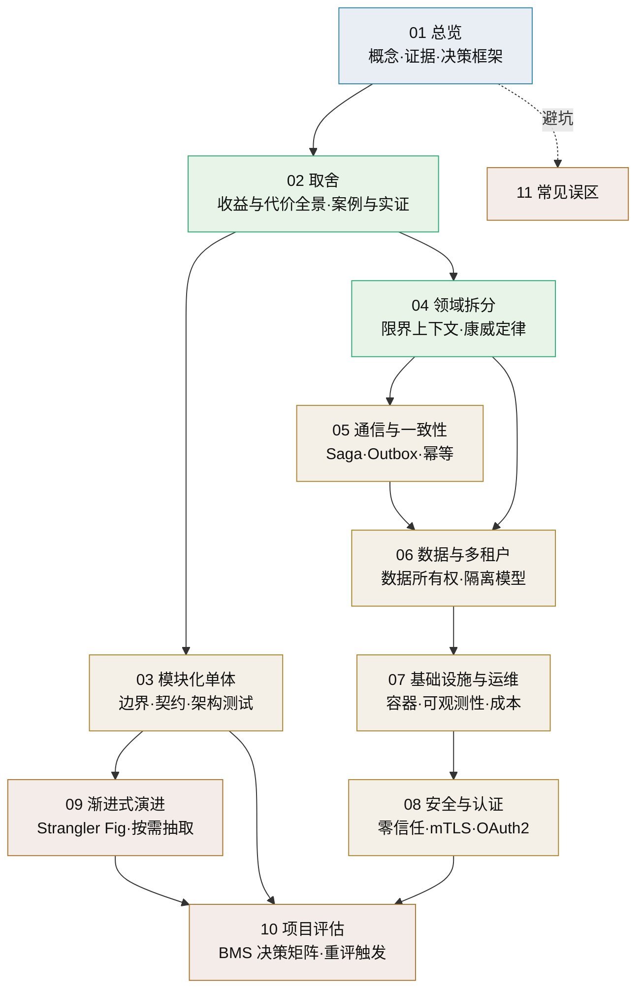

# 微服务总览

> 单体与微服务的取舍 · 概念、证据与决策框架 · 子篇地图

[文档首页](../../../文档首页.md) › [知识档案](../技术栈知识档案总览.md) › 微服务总览　|　[← 返回总览](../技术栈知识档案总览.md)

---

## 1. 概述与定位 

**微服务**（Microservices）是把一个应用拆成一组可独立部署的小服务、服务之间经网络通信（HTTP / RPC / 消息）协作的架构风格。它不是一个技术，而是一组取舍：**用分布式的复杂度，换独立部署、边界强制与组织自治**。

本专题要回答的问题很具体——**BMS 平台「不引入微服务」的结论，今天还站得住吗？**

- 项目计划里写了「不引入微服务」（《项目规划说明》「明确不采用」节的条目）；
- 但开发过程中这个问题反复被提起（独立伸缩、故障隔离、模块边界、未来团队扩张）；
- 平台已经做了**插件化**（进程内能力可替换）与**模块注册**（表前缀 / 错误码段 / 事件域唯一），
  这些机制与微服务解决的问题**部分重叠**，需要说清边界。

> 本目录是**知识档案**，回答「微服务是什么、代价与收益各是什么、业界证据怎么说、什么条件下才值得拆」；
> 本项目的最终取舍属《项目规划说明》范畴，本目录只做知识铺垫与决策框架，**不预设结论、不替代评审**。

## 2. 为什么现在讨论 

微服务在本项目里不是新话题，但有几个现实触发点：

| 触发点 | 具体表现 | 需要回答的问题 |
| --- | --- | --- |
| 独立伸缩诉求 | 报表 / 检索 / AI / 实时推送等模块的资源画像差异大 | 不拆服务能否用独立 worker / 异步队列解决？ |
| 故障隔离诉求 | 单进程内一个模块的异常或资源耗尽可能影响全局 | 进程内隔离（熔断 / 降级 / 配额）能做到什么程度？ |
| 模块边界诉求 | 项目/产品并行开发，边界靠约定与 CI 校验 | 模块化单体能否把边界做到「可拆分」？ |
| 部署风险诉求 | 单体一次发布牵动全局 | 发布风险能否用测试 / 灰度 / 回滚机制覆盖？ |
| 团队扩张预期 | 目前单人兼职，未来可能多人/多团队 | 组织到了什么规模，拆分才划算？ |
| 平台定位 | 第三方受控来源插件、异构独立服务已有规划 | 与「独立服务集成」形态的边界在哪？ |

对照「不引入微服务」的现行口径，本专题把每个触发点转成**可验证的条件**（见《[10 项目评估](10_微服务_项目评估.md)》），而不是靠立场争论。

## 3. 核心概念与术语 

| 术语 | 定义 | 本目录对应篇目 |
| --- | --- | --- |
| 单体（Monolith） | 一个部署单元承载全部功能；内部可有模块，但共享进程与（通常）共享库 | [02 取舍](02_微服务_单体与微服务取舍.md) |
| 模块化单体（Modular Monolith） | 单部署单元 + 强制边界（模块契约、数据所有权、架构测试） | [03 模块化单体](03_微服务_模块化单体.md) |
| 限界上下文（Bounded Context） | 领域模型的适用边界，微服务划分的**语义依据** | [04 领域拆分](04_微服务_领域拆分与限界上下文.md) |
| 独立部署（Independent Deployability） | 服务可单独构建、测试、发布与回滚 | [02 取舍](02_微服务_单体与微服务取舍.md) |
| 分布式单体（Distributed Monolith） | 形式上是服务、行为上仍需协调发布的**反模式** | [11 常见误区](11_微服务_常见误区.md) |
| Saga | 跨服务业务事务 = 一串本地事务 + 补偿动作 | [05 通信与一致性](05_微服务_通信与分布式一致性.md) |
| Outbox（事务性发件箱） | 业务写入与事件发布同库同事务，避免双写不一致 | [05 通信与一致性](05_微服务_通信与分布式一致性.md) |
| 数据所有权（Data Ownership） | 每份数据只有一个权威服务；他人经 API / 事件访问 | [06 数据与多租户](06_微服务_数据架构与多租户.md) |
| 服务网格（Service Mesh） | 把 mTLS、流量治理、遥测下沉到 sidecar / 节点的基础设施层 | [07 基础设施](07_微服务_基础设施与运维.md) · [08 安全](08_微服务_安全与认证.md) |
| 零信任（Zero Trust） | 不因「在内网」而信任；每次请求都要认证与授权 | [08 安全](08_微服务_安全与认证.md) |
| 绞杀者（Strangler Fig） | 渐进式替换旧系统的迁移模式：外立面路由 + 逐块搬迁 | [09 渐进式演进](09_微服务_渐进式演进.md) |
| 康威定律（Conway's Law） | 系统架构会「长成」组织的沟通结构；可用逆康威机动反推组织 | [04 领域拆分](04_微服务_领域拆分与限界上下文.md) |
| 微服务溢价（Microservice Premium） | 微服务给项目带来的额外成本与风险；只有复杂系统能摊平 | [02 取舍](02_微服务_单体与微服务取舍.md) |

## 4. 子篇地图 

| 篇目 | 回答的问题 |
| --- | --- |
| [01 总览](01_微服务_总览.md) | 微服务是什么、为什么现在讨论、怎么用本专题 |
| [02 单体与微服务取舍](02_微服务_单体与微服务取舍.md) | 收益与代价各有哪些、业界案例与实证数据怎么说 |
| [03 模块化单体](03_微服务_模块化单体.md) | 不拆服务，怎么把边界做到「随时可拆」 |
| [04 领域拆分与限界上下文](04_微服务_领域拆分与限界上下文.md) | 按什么拆、拆多细、组织与架构怎么互相塑造 |
| [05 通信与分布式一致性](05_微服务_通信与分布式一致性.md) | 拆了之后跨服务事务怎么办、事件怎么可靠投递 |
| [06 数据架构与多租户](06_微服务_数据架构与多租户.md) | 每个服务一份数据意味着什么、SaaS 多租户怎么落 |
| [07 基础设施与运维](07_微服务_基础设施与运维.md) | 容器编排、服务发现、可观测性、CI/CD 与真实成本 |
| [08 安全与认证](08_微服务_安全与认证.md) | 网关鉴权、服务间身份、零信任与多租户上下文 |
| [09 渐进式演进](09_微服务_渐进式演进.md) | 真要拆时怎么拆：Strangler Fig 与按需抽取 |
| [10 项目评估（BMS）](10_微服务_项目评估.md) | 把 BMS 的约束代入，决策矩阵与重评触发条件 |
| [11 常见误区](11_微服务_常见误区.md) | 哪些流行说法是错的、与插件化的边界在哪 |

## 5. 阅读路径 

| 目的 | 建议顺序 | 预计 |
| --- | --- | --- |
| **快速参与决策** | 01 → 02 → 10 → 11 | 约 40 分钟 |
| 想系统理解 | 01 → 02 → 03 → 04 → 05 → 06 → 07 → 08 → 09 → 10 → 11 | 半天 |
| 只关心「拆了之后怎么写」 | 04 → 05 → 06 → 09 | 约 60 分钟 |
| 只关心「运维与安全成本」 | 07 → 08 → 02 §代价 | 约 30 分钟 |
| 排查既有系统的病 | 11 → 09 → 06 §共享数据库反模式 | 约 30 分钟 |

## 6. 中立评估框架（本专题怎么下结论） 

行业共识可以浓缩成三句话：

1. **微服务是复杂度工具**：它处理「系统已经复杂到单体管不动」的问题，同时引入自己的复杂度（分布式、最终一致、运维）——Fowler 称之为**微服务溢价**；
2. **收益成立有前提**：持续交付能力、可观测性、自动化部署、团队规模与自治意愿、领域边界已稳定（Fowler 的「Microservice Prerequisites」）；
3. **演进优于设计**：业界多数成功案例是「从单体里长出来的」，几乎多数「一开始就微服务」的项目遇到麻烦（Fowler「MonolithFirst」；《[凤凰架构](https://icyfenix.cn/)》「向微服务迈进」同调）。

因此本专题的评估口径是**逐条验证前提与收益**，而不是比较「先进/落后」：

| 维度 | 单体更优的情形 | 微服务更优的情形 |
| --- | --- | --- |
| 团队 | 1~5 人、单一团队 | 多团队需要独立交付与自治 |
| 系统规模 | 模块数有限、认知可覆盖 | 领域大到单体修改/部署成瓶颈 |
| 一致性 | 审计链等强一致场景多 | 可按业务接受最终一致 |
| 运维能力 | 无专职运维 / 平台 | 有平台团队与成熟 CD |
| 性能目标 | 低延迟跨模块调用多（如 P99 ≤ 1s） | 模块间调用少、可异步化 |
| 技术异构 | 单一技术栈够用 | 确有异构/独立伸缩需求 |

> 每项在本项目的取值见《[10 项目评估](10_微服务_项目评估.md)》；**结论留给讨论与评审**。

## 7. 与插件化架构的关系（避免概念混淆） 

平台已有《[插件化架构](../插件化架构/01_插件化架构_总览.md)》专题，两者解决的**不是同一个问题**：

| 维度 | 插件化架构 | 微服务 |
| --- | --- | --- |
| 解决的问题 | 「同一个能力的实现可替换」 | 「系统的模块可独立部署与伸缩」 |
| 边界对象 | 端口 / 适配器（能力实现） | 服务 / 限界上下文（业务域） |
| 部署形态 | **进程内**（配置切换、安装期发现） | **多进程/多容器**（网络通信） |
| 一致性 | 本地事务，无分布式一致性问题 | 需要 Saga / Outbox / 最终一致 |
| 替换成本 | 换一个适配器实现 | 迁移数据、改调用方、运维对象翻倍 |

**两句话记住区别**：

- 插件化回答「**这个能力用什么实现**」（MinIO 还是 S3），运行在**同一个进程**里；
- 微服务回答「**这块业务要不要单独成为一个系统**」（订单与库存要不要分开部署），跨**网络**协作。

平台当前形态是「**单体 + 插件化 + 独立 worker**」：能力可替换（插件化已就位），
计算可横向扩展（无状态 + worker），业务模块按边界与契约组织（模块注册 + CI 唯一性校验）。
这条路线**已经覆盖了微服务收益中的大部分**，剩余部分（独立部署、故障隔离、独立伸缩）
是否需要，正是本专题与《[10 项目评估](10_微服务_项目评估.md)》要回答的核心问题。

## 8. 学习与参考资料 

| 资源 | 网址 | 说明 |
| --- | --- | --- |
| Martin Fowler：Microservices Guide | https://martinfowler.com/microservices/ | 微服务定义的原始权威入口 |
| Martin Fowler：Microservice Trade-Offs | https://martinfowler.com/articles/microservice-trade-offs.html | 收益与代价的经典清单 |
| Martin Fowler：Microservice Premium | https://martinfowler.com/bliki/MicroservicePremium.html | 为什么小系统不该上微服务 |
| Martin Fowler：Monolith First | https://martinfowler.com/bliki/MonolithFirst.html | 「先单体、后拆分」的经验总结 |
| Martin Fowler：Microservice Prerequisites | https://martinfowler.com/bliki/MicroservicePrerequisites.html | 快速供给 / 基础监控 / 快速部署三项前提 |
| Martin Fowler：Strangler Fig | https://martinfowler.com/bliki/StranglerFigApplication.html | 渐进式现代化模式 |
| Sam Newman：Monolith to Microservices | https://samnewman.io/books/monolith-to-microservices/ | 迁移模式与取舍专著 |
| 周志明《凤凰架构》 | https://icyfenix.cn/ | 中文最佳系统性读本：服务架构演进史与「向微服务迈进」 |
| microservices.io（Chris Richardson） | https://microservices.io/ | 模式目录：Saga、Outbox、数据库每服务等 |
| DORA 研究 | https://dora.dev/ | 架构松耦合与交付绩效的长期实证 |

## 9. 项目内关联文档 

| 文档 | 说明 |
| --- | --- |
| 《[技术栈知识档案总览](../技术栈知识档案总览.md)》 | 知识档案入口索引 |
| 《[插件化架构总览](../插件化架构/01_插件化架构_总览.md)》 | 进程内能力可替换机制（与微服务的边界见第 7 节） |
| 平台《平台可扩展性规划》 | 三层模型、扩展点、独立服务形态（平台专属文档） |
| 平台《项目规划说明》 | 「明确不采用」与「平台能力插件化」节（平台专属文档） |
| 《[02 单体与微服务取舍](02_微服务_单体与微服务取舍.md)》 | 本专题证据篇：案例与实证数据 |

---

> 依《[文档生成规范](../../../规范/文档生成规范.md)》编写
