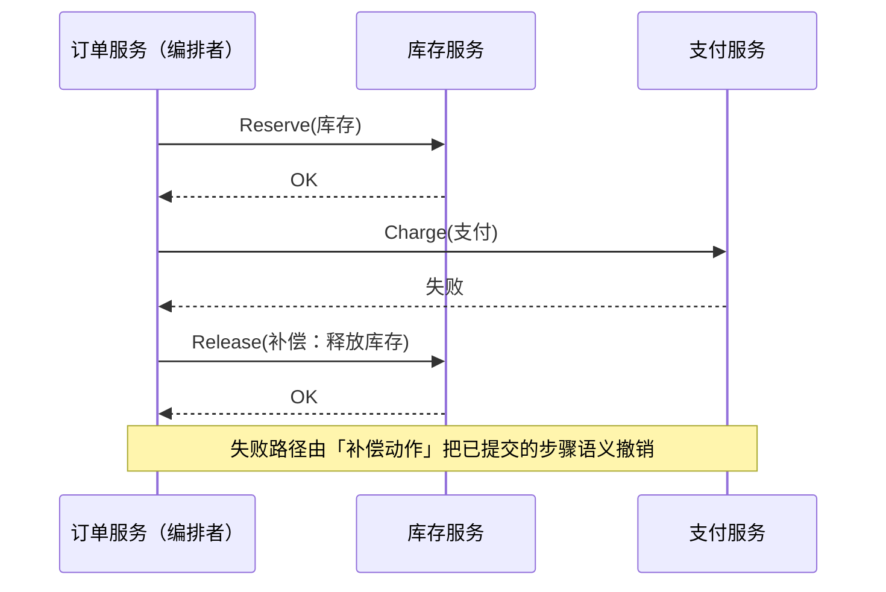
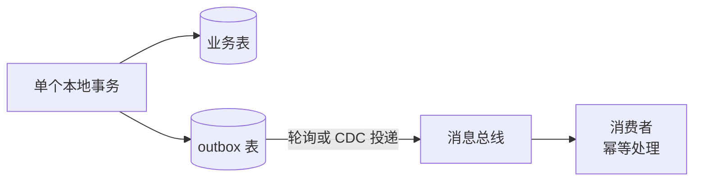

# 通信与分布式一致性技术介绍

> 跨服务调用 · Saga 与补偿 · Outbox 与幂等 · 最终一致

[文档首页](../../../文档首页.md) › [知识档案](../技术栈知识档案总览.md) › [微服务](../技术栈知识档案总览.md#microservice) › 通信与分布式一致性技术介绍　|　[← 返回总览](01_微服务_总览.md)

---

## 1. 技术概述 

一旦跨进程，**本地方法调用**就变成四类新问题：

| 问题 | 单体里 | 拆了之后 |
| --- | --- | --- |
| 调用语义 | 同步、必达、几乎不失败 | 超时、重试、失败、重复 |
| 事务边界 | 一个数据库事务全包 | 每个服务各自事务，无法原子 |
| 消息可靠性 | 不存在（无消息） | 「写库 + 发消息」双写不一致风险 |
| 幂等 | 很少需要 | 至少一次投递 ⇒ 消费者**必须**幂等 |

本页给出业界处理这四类问题的标准模式，以及本项目现状的对照。

## 2. 同步通信：REST / gRPC 与韧性模式 

| 维度 | REST / JSON | gRPC / Protobuf |
| --- | --- | --- |
| 契约 | OpenAPI（可自动生成客户端） | `.proto` + 代码生成（强类型） |
| 性能 | 一般（文本） | 高（二进制 + HTTP/2 多路复用） |
| 适用 | 外部接口、管理端、跨语言门槛低 | 内部高频调用、强类型 |
| 本项目现状 | FastAPI 全量 OpenAPI + 契约快照入 CI | 未引入（无跨进程内部调用） |

**同步调用的韧性四件套**（无论 REST/gRPC 都要有）：

- **超时**：每个下游调用设置显式超时，避免线程/连接被拖死；
- **重试**：仅对幂等操作重试、指数退避 + 抖动、限制次数；
- **熔断与降级**：失败率超阈值直接快速失败，走兜底（缓存/默认值/降级页）——本项目已有 `BaseCircuitBreaker` / `BaseFallbackPolicy` 基座；
- **背压与限流**：调用方与被调方都要限流，防止雪崩——本项目已有 `BaseRateLimiter` 基座。

> **调用链陷阱**：A → B → C → D 的同步链，延迟是各段之和、可用性是各段之积；
> 一条 4 跳链每跳 99.9% 可用，整体掉到 ~99.6%。这就是「微服务威胁 P99 ≤ 1s」的技术根源。

## 3. 异步通信与事件 

原则：**能异步就异步**——把「必须马上知道结果」的调用改为「发事件、本地状态机等结果」。

| 概念 | 说明 |
| --- | --- |
| 命令（Command） | 点对点，要求对方做一件事（可拒绝）；适合编排 Saga |
| 事件（Event） | 广播「已经发生的事实」，发布者不关心谁消费；消费者可多个、可重放 |
| 投递语义 | 至少一次（at-least-once）是工程默认；**恰好一次是营销词**，靠幂等达到「效果等价一次」 |
| 事件契约 | 事件是长期契约：字段只增不删、新增可选、破坏性变更升版本，与消费者兼容过渡（本项目事件命名 `{域}.{对象}.{动作}` 已在规约中） |
| 顺序与分区 | 同一业务实体的有序性靠分区键（如实体 ID）保证；跨实体不承诺全局有序 |

## 4. 分布式事务：Saga、Outbox 与幂等 

### 4.1 为什么不用两阶段提交（2PC）

2PC 需要跨服务锁与协调者，阻塞长、可用性差，与自动扩缩容/异步化直接冲突——业界共识是
**微服务不用 2PC**，而是用「本地事务 + 补偿 + 最终一致」。

### 4.2 Saga：用一串本地事务替代一个分布式事务

| 形态 | 说明 | 取舍 |
| --- | --- | --- |
| 编排式（Orchestration） | 中心协调器按状态机驱动各步骤与补偿 | 流程集中、可观测、易调试；协调器是额外组件。**超过 3~5 步推荐编排式** |
| 协同式（Choreography） | 各服务监听事件自发下一步 | 无中心、耦合低；超过 5 个服务易变「事件面条」 |

**Saga 的代价必须承认**：没有隔离性（并发 Saga 可能互相看到中间态）、补偿不是回滚（业务上要能「撤销」或「冲正」）、需要幂等与重试、需要监控运行中的 Saga（超时/挂起告警）。

### 4.3 Outbox：解决「写库成功、发消息失败」的双写问题

- 业务写入与事件写入**同一个本地事务**，要么都成功要么都失败；
- 独立投递器（轮询或 CDC）把 outbox 记录发给消息总线，至少一次；
- 消费者用**幂等表**（事件 ID 唯一约束）去重，实现「效果恰好一次」；
- 保留已发布记录一段时间，支持重放与取证。

### 4.4 一致性的选择清单

| 场景 | 建议 |
| --- | --- |
| 同一服务内多表 | 本地事务（首选，别拆） |
| 跨服务、可补偿 | Saga（编排式） |
| 只需最终一致的通知/统计 | 事件 + 幂等消费 |
| 需要读模型加速 | CQRS / 投影（读写分离的延伸） |
| 「读己之写」体验 | 命令响应回带版本号 + 读侧短等待，或前端乐观更新 |

## 5. 可观测与 SLO 

事件驱动把「立即失败」变成「静默延迟」，必须显式监控三件事：

- **消费者延迟**（consumer lag）：消息积压量 / 时长；
- **端到端新鲜度**：事件产生到读模型可见的时间差（如「99% 事件在 800ms 内生效」）；
- **Outbox 积压**：未投递记录数——积压即发布链路故障。

> 本项目已有 `trace_id` 入站生成 / 透传与日志关联（阶段一交付），这是未来跨进程追踪的基础。

## 6. 在本项目中的用途 

| 机制 | 本项目现状 | 与微服务模式的关系 |
| --- | --- | --- |
| 本地事务 | 模块内操作默认本地事务（`DbUnitOfWork` 随阶段二落库） | 单体优势：强一致场景零成本 |
| 事件总线 | RocketMQ 事件契约（命名 / 事件域登记）已定；发布消费契约骨架已交付 | 换成跨进程只需换传输实现，事件模型不变 |
| 幂等 / 防重放 | `IdempotencyStore` / `BaseReplayGuard` / 签名原语 `SignatureCodec` 基座已交付 | 幂等键 + 唯一约束是分布式标准做法 |
| 降级熔断限流 | `BaseCircuitBreaker` / `BaseFallbackPolicy` / `BaseRateLimiter` 基座已交付 | 同步调用韧性四件套的组件级对应 |
| 审计哈希链 | SHA256 链 + 分区有序消费，要求写入顺序与强一致 | **正是评估里「分布式事务代价」所指的强一致场景** |
| Outbox 思想 | 未引入（单体不需要）；未来事件可靠性可借用本地事件表模式 | 拆分时的必补项 |

**结论**：当前不拆服务时，一致性成本几乎为零（本地事务）；这些基座的价值是**为将来保留了标准接口**——
真到拆分时，需要新增的是 Outbox 投递器、幂等消费表与 Saga 协调（或对流程做拆解规避）。

## 7. 学习与参考资料 

| 资源 | 网址 | 说明 |
| --- | --- | --- |
| microservices.io：Saga | https://microservices.io/patterns/data/saga.html | 两种 Saga 形态与失败处理 |
| microservices.io：Transactional Outbox | https://microservices.io/patterns/data/transactional-outbox.html | Outbox 模式定义 |
| InfoQ：Saga Orchestration + Outbox | https://www.infoq.com/articles/saga-orchestration-outbox/ | Debezium CDC 实现的长文 |
| Martin Fowler：Eventual Consistency | https://martinfowler.com/articles/patterns-of-distributed-systems/ | 分布式数据一致性模式集 |
| 周志明《凤凰架构》「事务处理」 | https://icyfenix.cn/ | 本地/全局/共享/分布式事务的中文梳理 |
| OWASP / NIST 微服务相关（安全侧） | https://cheatsheetseries.owasp.org/cheatsheets/Microservices_Security_Cheat_Sheet.html | 与《[08 安全](08_微服务_安全与认证.md)》配合 |

## 8. 项目内关联文档 

| 文档 | 说明 |
| --- | --- |
| 《[03 模块化单体](03_微服务_模块化单体.md)》 | 进程内事件与契约先行的做法 |
| 《[06 数据与多租户](06_微服务_数据架构与多租户.md)》 | 数据所有权与拆库代价 |
| 《[09 渐进式演进](09_微服务_渐进式演进.md)》 | 迁移期的双跑与数据同步 |
| 《[10 项目评估（BMS）](10_微服务_项目评估.md)》 | 强一致场景在评估中的权重 |
| 平台《项目规划说明》「性能与高并发设计」节 | 本项目性能与一致性现状（平台专属文档） |

---

> 依《[文档生成规范](../../../规范/文档生成规范.md)》编写
