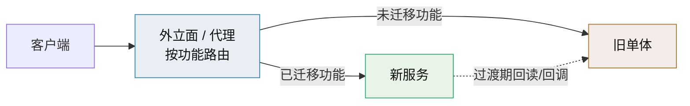

# 渐进式演进（单体到微服务）技术介绍

> Strangler Fig · 增量迁移模式 · 回退与治理

[文档首页](../../../文档首页.md) › [知识档案](../技术栈知识档案总览.md) › [微服务](../技术栈知识档案总览.md#microservice) › 渐进式演进技术介绍　|　[← 返回总览](01_微服务_总览.md)

---

## 1. 技术概述 

从单体到微服务，业界共识是**渐进演进，不要重写**：

> **绞杀者模式（Strangler Fig）**：新系统像藤蔓一样包住旧系统，外立面（代理）按功能逐块把流量从旧系统切到新系统，
> 旧系统逐渐「被绞杀」直至退役。—— Fowler 命名的现代化模式。

「一次性重写」的失败率极高：业务不能停机、需求还在变化、旧系统的隐性规则在重写时全部爆雷。
渐进式的核心价值是**风险与收益都分摊到小步**，每步都可回退、可验证、可暂停。

## 2. 迁移模式清单 

| 模式 | 做法 | 适用 |
| --- | --- | --- |
| Strangler Fig | 加外立面，按功能逐步切流 | 通用主模式 |
| UI 组合 | 新旧页面并存，导航层聚合 | 前端/页面级迁移 |
| Branch by Abstraction | 在代码内建抽象层，两个实现并存，逐步切换 | 模块级迁移（即使不拆服务也有用） |
| Parallel Run | 新旧逻辑双跑，比对结果后再切 | 高风险核心逻辑 |
| Decorating Collaborator | 新服务旁路增强旧系统的行为（如对旧系统事件做新处理） | 旧系统改动受限 |
| Change Data Capture（CDC） | 从旧库日志捕获变更，同步到新库 | 数据拆分与过渡同步 |

**数据拆库的行业标准三步**（Azure 架构中心，与《[06 数据与多租户](06_微服务_数据架构与多租户.md)》§2 修复路径一致）：

1. 新服务先包住旧表访问（新代码不再直连旧 schema）；
2. 建独立库 + ETL 初始导入 + CDC 增量同步，双写/双读校验一致性；
3. 校验通过后切权威库（system of record），旧表标记退役——保留回退窗口直到确认稳定。

> 过渡期架构（外立面、同步器、对账任务）是必要的成本，不是浪费；它买来的是可回退与可暂停。

## 3. 何时开始拆、先拆什么 

**开始的前提**（缺一不可）：领域边界已稳定且被时间验证、有 CD 与可观测性、有明确的**收益目标**（组织/性能/隔离）。
更多条件见《[02 取舍](02_微服务_单体与微服务取舍.md)》§6 与《[10 项目评估](10_微服务_项目评估.md)》。

**抽取优先级**（从易到难）：

| 优先级 | 模块特征 | 原因 |
| --- | --- | --- |
| 1 | 边缘、独立、调用少（通知、文件处理、检索） | 耦合低、失败可降级、收益可见 |
| 2 | 资源画像独特（报表、批处理、AI 推理） | 独立伸缩收益大，不影响核心链路 |
| 3 | 有独立团队 / 发布节奏诉求 | 组织收益（康威） |
| 4 | 核心业务链路（下单、审批、权限） | 最后拆：强一致与横切最多，牵动面最大 |

**反例**：先拆核心链路、先拆共享库、按技术层拆——见《[04 领域拆分](04_微服务_领域拆分与限界上下文.md)》§4。

## 4. 回退：拆错了怎么办 

拆过头（或边界切错）同样需要渐进纠偏，DHH 的《How to recover from microservices》给出可操作清单：

1. **先止血**：停止新增微服务，选一个服务作为「新中心」承接新功能；
2. **先合并关键依赖路径**：一次业务操作跨多服务的最痛，优先合并为一个服务；
3. **孤立性能热点最后处理**：真正靠异构/独立伸缩解决的热点保留（这是「拆对了」的部分）；
4. **砍掉最冷门的异构实现**：语言/框架/依赖轨道的数量要收敛（多数系统 ≤ 2 种后端语言）；
5. **用模块而不是网络分区**：回到单体内用模块与命名空间表达边界。

> 判断需要回退的信号：例行业务变更需要协调多个服务发布；故障恢复需要多个团队同时介入；
> 同一业务操作跨 4+ 服务；共享库改一次要全量回归——即《[11 常见误区](11_微服务_常见误区.md)》中的「分布式单体」。

## 5. 迁移期治理 

| 事项 | 做法 |
| --- | --- |
| 一致性校验 | 双跑/对账任务比对新旧数据，差异告警；关键字段设「零容忍」 |
| 进度可见 | 迁移清单 + 完成度看板（模块 × 流量 × 状态），避免「迁到一半没人知道」 |
| 回滚点 | 每步都有回退方案与窗口；切流用灰度开关 |
| 契约兼容 | 新旧并存期契约只加不删；消费者驱动契约测试 |
| 成本记录 | 过渡期架构的资源与人力单独记账，避免隐性膨胀 |

## 6. 在本项目中的用途 

本项目的「将来若要拆」已有两条既定轨道：

1. **独立服务形态**（《平台可扩展性规划》「独立服务」）：异构技术栈 / 强隔离的外部系统，经 OIDC 认证、`/api/open` 开放接口与 Webhook 事件集成，
   数据独立存储——这条轨道**现在就可用**，不需要动平台本体；
2. **平台扩展形态**：产品（biz / cw）以扩展包并入平台进程，是当前主推形态；
   若未来某个模块需要独立伸缩/独立发布，可在模块化单体（见《[03 模块化单体](03_微服务_模块化单体.md)》）基础上按本页模式抽取。

**当前建议**：把精力放在「保留拆分选项」的建设上（模块边界、数据所有权、事件契约、可观测性），
而不是预先支付分布式的成本——这与《[10 项目评估](10_微服务_项目评估.md)》的结论一致。

## 7. 学习与参考资料 

| 资源 | 网址 | 说明 |
| --- | --- | --- |
| Sam Newman：Strangler Fig Pattern | https://samnewman.io/patterns/refactoring/strangler-fig-application/ | 模式定义 |
| Sam Newman《Monolith to Microservices》 | https://samnewman.io/books/monolith-to-microservices/ | 迁移模式全集与取舍 |
| Martin Fowler：Strangler Fig | https://martinfowler.com/bliki/StranglerFigApplication.html | 模式来源与增量现代化四活动 |
| Microsoft Azure：Strangler Fig（含数据拆库三步） | https://learn.microsoft.com/en-us/azure/architecture/patterns/strangler-fig | 数据库渐进拆分图示 |
| DHH：How to recover from microservices | https://world.hey.com/dhh/how-to-recover-from-microservices-ce3803cc | 回退清单 |
| Segment：Goodbye Microservices | https://www.twilio.com/en-us/blog/developers/best-practices/goodbye-microservices | 回退实战复盘 |
| Taibi 等：迁移流程框架 | https://doi.org/10.1109/mcc.2017.4250931 | 三种迁移流程与常见问题 |

## 8. 项目内关联文档 

| 文档 | 说明 |
| --- | --- |
| 《[02 单体与微服务取舍](02_微服务_单体与微服务取舍.md)》 | 是否值得拆的前提与证据 |
| 《[03 模块化单体](03_微服务_模块化单体.md)》 | 「可拆分性」的工程准备 |
| 《[06 数据架构与多租户](06_微服务_数据架构与多租户.md)》 | 数据拆分的代价与路径 |
| 《[10 项目评估（BMS）](10_微服务_项目评估.md)》 | 本项目的重评触发条件 |
| 平台《平台可扩展性规划》 | 独立服务形态（平台专属文档） |

---

> 依《[文档生成规范](../../../规范/文档生成规范.md)》编写
