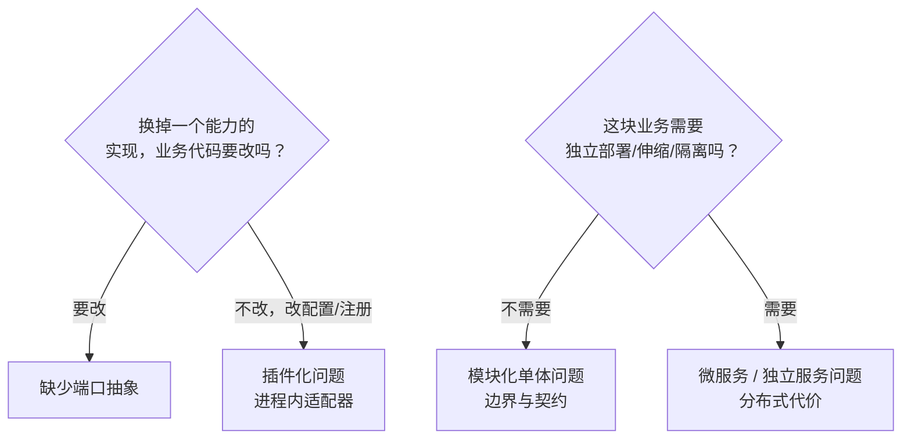

# 微服务常见误区

> 流行说法与事实核对 · 术语混淆 · 拆分前自检清单

[文档首页](../../../文档首页.md) › [知识档案](../技术栈知识档案总览.md) › [微服务](../技术栈知识档案总览.md#microservice) › 微服务常见误区　|　[← 返回总览](01_微服务_总览.md)

---

## 1. 概述 

微服务是过去十年被讨论最多、也最容易被误用的架构风格之一。本页把常见误区集中核对——
它的用途是**在讨论中被反驳时能落到事实**，以及避免把「插件化 / 模块化 / 微服务 / SOA / Serverless」混为一谈。

## 2. 认知误区核对 

| # | 流行说法 | 事实 | 后果 / 出处 |
| --- | --- | --- | --- |
| 1 | 微服务性能更好 | 远程调用通常**增加**延迟与失败面；性能来自缓存、异步、索引与水平扩展 | 多跳同步链会直接威胁延迟目标（Fowler《Trade-Offs》§性能） |
| 2 | 微服务天然更解耦 | 解耦来自**边界设计**；边界切错时，分布式只会把耦合变成网络耦合 | 分布式单体（本页 §3） |
| 3 | 单体是落后的技术债 | Facebook / Etsy / Stack Overflow / Shopify / GitHub 以单体支撑超大业务；架构没有先进落后，只有匹配与否 | 《[02 取舍](02_微服务_单体与微服务取舍.md)》§5 |
| 4 | 一开始就按微服务建，免得日后拆 | 「几乎所有成功案例都是从单体长出来的；一开始就微服务的项目大多遇到大麻烦」 | Fowler《MonolithFirst》；Shopify 明确否决微服务作为目标架构 |
| 5 | 服务越细越好 | 过细 ⇒ 一次业务操作跨 4~6 个服务，延迟与故障级联；**边界正确**比数量重要 | 行业经验：2~5 人维护一个服务为健康区间 |
| 6 | 微服务就是 DDD | DDD 是**建模方法**（限界上下文），可以也只应该在单体里用；微服务只是它的一种部署映射 | 《[04 领域拆分](04_微服务_领域拆分与限界上下文.md)》 |
| 7 | 共享数据库没关系，先跑起来再说 | 共享库让独立部署成为空话、schema 变更跨团队协调、数据损坏无法追责 | 《[06 数据与多租户](06_微服务_数据架构与多租户.md)》§2 |
| 8 | 微服务能解决团队协作问题 | 若组织没有边界纪律与自治能力，拆服务只是把协调会议搬进运行时；微服务是**组织解耦工具**，但前提是组织已就绪 | 康威定律；Fowler《Team Topologies》 |
| 9 | 上了 K8s / 服务网格才算微服务 | 编排与网格是**运维工具**，与架构风格无关；小规模服务用 Compose/托管容器更划算 | 《[07 基础设施与运维](07_微服务_基础设施与运维.md)》§2 |
| 10 | 分布式事务用 2PC 或「最终一致就行了」 | 2PC 在服务化场景不可用；最终一致需要 Saga/Outbox/幂等/补偿/对账的完整工程 | 《[05 通信与分布式一致性](05_微服务_通信与分布式一致性.md)》 |
| 11 | 从微服务回退单体是失败 | Prime Video / Segment 的回退是**按成本与数据做的工程决策**；架构应随认知演进 | 《[02 取舍](02_微服务_单体与微服务取舍.md)》§5 |
| 12 | 拆完再调边界也不迟 | 跨服务重构（数据、事务、契约）比进程内重构难一个量级；边界应在单体中先验证 | Fowler《MonolithFirst》脚注；Taibi 实证「解耦与迁移」是最大问题 |
| 13 | 技术异构越多越自由 | 语言/框架/依赖轨道膨胀会摧毁可认知性（「没人懂全系统」）；多数系统 ≤ 2 种后端语言 | DHH《How to recover》第 4 条 |
| 14 | Serverless = 微服务的自然终点 | Serverless 与微服务是两套取舍（冷启动、按次计费、调试面）；Prime Video 案例部分根因正是 Serverless 计费/编排模式 | The New Stack 对 Prime Video 的澄清 |

## 3. 术语混淆速查 

| 名词 | 一句话 | 与微服务的区别 |
| --- | --- | --- |
| SOA | 面向服务的架构（早期，常配 ESB） | 更粗粒度、常集中治理；微服务强调去中心与独立部署 |
| 模块化单体 | 单部署单元 + 强制模块边界 | 不分进程；微服务的「收益」它拿一大半，「代价」它几乎不付 |
| **分布式单体** | 形式是服务，实际必须协调发布、共享数据库/库、同步调用链 | 微服务**反模式**；成本双份、收益全无 |
| 插件化（本项目） | 能力实现可替换，**进程内** | 解决「换实现」；微服务解决「拆系统」 |
| 微前端 | 前端按业务拆分、独立构建/加载 | 前端侧的对称思路；本项目**不引入**（构建期合并） |
| FaaS / Serverless | 按函数计费托管的运行时 | 部署与计费模型；与微服务正交（可组合，也可单独用） |

## 4. 与插件化架构的边界（本项目语境） 

这是本项目讨论中最容易混淆的一组概念，用三个问题即可区分：

| 场景 | 正确工具 |
| --- | --- |
| 对象存储从 MinIO 换成 S3 | 插件化（换适配器） |
| 通知渠道加短信/企微 | 插件化（端口 + 新实现） |
| 报表模块拖慢主进程 | 先模块化（隔离资源）→ 仍不足再考虑独立进程/服务 |
| 第三方要用异构栈接入 | 独立服务形态（OIDC + 开放接口 + 事件），不是把平台拆成微服务 |
| 多团队需要独立发布业务模块 | 模块化 + 契约先行；达到触发条件再评估微服务 |

## 5. 拆分前自检清单（问这 10 个问题） 

1. 系统是否**已经**复杂到单体管不动（而不是「以后可能」）？
2. 团队是否多到需要独立交付节奏？边界是否稳定到可以冻结？
3. 是否具备快速供给、基础监控、快速部署三项前提（Fowler Prerequisites）？
4. 是否有可观测性与分布式追踪来支撑跨服务排障？
5. 跨服务一致性方案（Saga/Outbox/幂等/对账）是否想清楚并有人力维护？
6. 数据如何拆：所有权、迁移、双跑校验、回退窗口？
7. 权限 / 租户 / 审计等横切能力如何在每个服务落地而不重复出错？
8. 首批抽取的是边缘/热点模块，还是核心链路（后者应最后）？
9. 运维与安全新增面（网关/网格/mTLS/证书/编排）由谁负责？
10. 收益能否量化（发布频率、故障恢复时长、资源成本），并且大于分布式成本？

> 10 个问题里若「否」多于 2 个，先做《[03 模块化单体](03_微服务_模块化单体.md)》与《[07 基础设施与运维](07_微服务_基础设施与运维.md)》的准备。

## 6. 学习与参考资料 

| 资源 | 网址 | 说明 |
| --- | --- | --- |
| Martin Fowler：Microservice Trade-Offs | https://martinfowler.com/articles/microservice-trade-offs.html | 收益/代价原始清单 |
| Martin Fowler：MonolithFirst | https://martinfowler.com/bliki/MonolithFirst.html | 反「一开始就微服务」 |
| Simon Brown 个人站点（C4 模型 / 模块化单体演讲） | https://simonbrown.je/ | 「先问架构，再问部署」 |
| MinimumCD：Distributed Monolith 反模式 | https://beyond.minimumcd.org/docs/anti-patterns/architecture/distributed-monolith/ | 分布式单体的识别与修复 |
| microservices.io：Monolithic 不是反模式 | https://microservices.io/ | 「单体是小团队小项目的正确选择」 |
| 周志明《凤凰架构》 | https://icyfenix.cn/ | 演进视角的中文系统性澄清 |

## 7. 项目内关联文档 

| 文档 | 说明 |
| --- | --- |
| 《[01 总览](01_微服务_总览.md)》 | 专题入口与术语表 |
| 《[02 单体与微服务取舍](02_微服务_单体与微服务取舍.md)》 | 误区 #1/#3/#11 的完整证据 |
| 《[03 模块化单体](03_微服务_模块化单体.md)》 | 误区 #2/#8 的正解 |
| 《[05 通信与分布式一致性](05_微服务_通信与分布式一致性.md)》 | 误区 #10 的完整模式 |
| 《[10 项目评估（BMS）](10_微服务_项目评估.md)》 | 本项目结论与触发条件 |
| 《[插件化架构总览](../插件化架构/01_插件化架构_总览.md)》 | 与插件化的系统对照 |

---

> 依《[文档生成规范](../../../规范/文档生成规范.md)》编写
