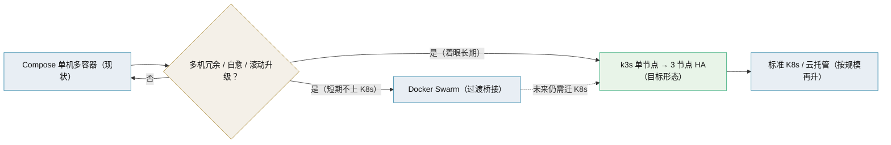

# 微服务选型对比（BMS）

> 网关 · 编排 · 发现配置 · 通信 · 一致性 · 可观测 · 身份 · CI/CD —— 候选对比与推荐

[文档首页](../../../文档首页.md) › [知识档案](../技术栈知识档案总览.md) › [微服务](../技术栈知识档案总览.md#microservice) › 微服务选型对比（BMS）　|　[← 返回总览](01_微服务_总览.md)

---

## 1. 目的与口径 

本页把微服务落地涉及的**六类技术选型**逐项做候选对比，作为规划修订（拟建平台《微服务演进规划》）与架构节点的选型输入。口径：

- 只记录「**候选 × 维度对比 + 推荐**」，**推荐一律标注「待评审确认」**，不预设结论；落实前逐项确认（口径同本专题「不预设结论」定位）。
- 对比基于 2026-09 官方文档与仓库信息，个别能力（厂商版本、达梦方言）标注「待实测」。
- 约束基线：**单人兼职 + AI 辅助、无专职运维**；Docker Compose 单机多容器起步、可按需迁多机/K8s；已有 MySQL 8 / PostgreSQL 16 / 达梦 DM8、Redis 8、RocketMQ、Celery、MinIO、Elasticsearch、自托管 GitLab CI；国内网络优先国内镜像；后端以 Python / FastAPI 为主。

## 2. API 网关 

| 维度 | Apache APISIX | Kong | Traefik | Envoy Gateway | Spring Cloud Gateway | 自研 FastAPI |
| --- | --- | --- | --- | --- | --- | --- |
| 路由 / 灰度 | 极强（Nginx 变量、金丝雀） | 强 | 强（标签自动发现） | 强（Gateway API 标准） | 强（编程式） | 需自建 |
| OIDC / JWT | OSS 内建（OIDC + JWT） | OIDC 属**企业版** | OIDC/JWT 属 **Hub 商业** | 内建（K8s 资源） | 需自写 Spring Security | 需自建 |
| 分布式限流 | Redis / Cluster / Sentinel | 部分高级在企业版 | 分布式限流属 Hub | 内建（Redis） | Redis | 需自建 |
| 可观测出口 | Prometheus/OTel + **RocketMQ / ES 日志插件** | Prometheus/OTel | Prometheus/OTel | Prometheus/OTel | Micrometer | 需自建 |
| 单机 Compose | 2~3 容器（standalone 可 1 容器） | 1~2 容器 | **1 容器** | 不可（需 K8s） | 1 容器（JVM 重） | 0 额外 |
| 声明式 / GitOps | `apisix.yaml` 或 `adc sync`；K8s 同模型 | DB-less `yml`（decK 受限） | 文件 / KV / 标签 | K8s 清单 | 配置即代码 | 无标准 |
| 许可证 | **Apache-2.0** | 核心 Apache-2.0，OIDC 企业版 | MIT 核心 + Hub 商业 | Apache-2.0 | Apache-2.0 | 自有 |
| 长期风险 | 低 | License 悬崖 | License 悬崖 | 进 K8s 前不可生产 | 引入 JVM 异构 | 重造全部网关能力 |

**推荐（待评审确认）**：**Apache APISIX** 为首选，Envoy Gateway 为「确定尽早进 K8s」时的备选；不建议 Kong（OIDC 企业版）、Spring Cloud Gateway（JVM 异构）、纯自研（长期需重造路由/限流/OIDC/观测并成为全局单点）。理由：APISIX 在 Apache-2.0 下把 OIDC/JWT、Redis 分布式限流、RocketMQ/ES 日志出口、Python 插件一次给全，且 **standalone 文件模式 → K8s Ingress/Gateway API 是同一套配置模型**，从单机到集群不换选型；代价是学习其 Route/Upstream/Plugin 模型（传统模式多一个 etcd 容器）。

**集成要点与风险**：认证由网关 `openid-connect` 对接统一 IdP，`X-Userinfo` 透传给 FastAPI，后端只做授权；限流用 `policy: redis` 复用现有 Redis 8；访问日志走 `rocketmq-logger` / `elasticsearch-logger` 复用现有组件；单机阶段用 standalone + `apisix.yaml` 入 Git，进 K8s 后切 Ingress Controller CRD。风险：standalone 模式下 Admin API / Dashboard 能力受限；升级存在破坏性变更（如 OIDC `ssl_verify` 默认值调整），须锁定版本 + 声明式配置；Python 插件 Runner 为独立进程，不宜承载核心网关逻辑。

## 3. 容器编排演进路线 

| 维度 | Docker Compose | Docker Swarm | k3s | 标准 K8s | Nomad |
| --- | --- | --- | --- | --- | --- |
| 多机调度 / 自愈 | 无 | 有（基础） | 有（完整） | 有 | 有 |
| 单机即全功能 | 是 | 是 | 是 | 否（偏开发） | 是 |
| 学习曲线（单人） | 极低 | 低 | 中 | 高 | 中 |
| 常驻资源 | 0 | 0（内建） | 低~中（约 2 核 2G） | 高 | 低 |
| 生态对齐（网关/Helm/CI） | 低 | 低 | 高 | 最高 | 中 |
| 许可证 | Apache-2.0 | Apache-2.0 | Apache-2.0 | Apache-2.0 | **BUSL-1.1（非 OSI）** |
| 长期风险 | 能力天花板低 | 功能冻结 / 边缘化 | 低 | 运维过重 | 路线不确定 |

**推荐（待评审确认）**：**Compose 单机保持 → 触发条件满足时直接上 k3s（跳过 Swarm）**；备选 Docker Swarm（仅作「短期只需 2~3 台同构机」的过渡）。理由：Swarm 功能冻结，Compose→Swarm→K8s 要付两次迁移成本；k3s 单节点即完整集群、单二进制，且 APISIX / Envoy / Kong 均有 K8s 一等集成，**一次迁移即锁定长期平台形态**。不推荐 Nomad（BUSL-1.1 非 OSI 开源，信创不友好）与标准 K8s（单人无专职运维时过重）。

**判据与要点**：升级判据是「冗余、自愈、运维效率、发布策略」而非吞吐（Compose 单机足以扛 500 并发）；状态服务（库/中间件）先留宿主机或独立节点，k3s 只编排无状态服务与网关；达梦 DM8 无官方 K8s Operator，建议继续以独立容器运行；迁移用 `kompose` 起步、Helm 分包。风险：k3s 升级、证书轮换、StorageClass、备份需额外学习；建议先单节点跑通再扩 3 节点。

## 4. 服务发现与配置中心 

| 维度 | Compose 内置 DNS | Consul | Nacos | etcd | K8s 原生 Service |
| --- | --- | --- | --- | --- | --- |
| 额外常驻组件 | 无 | 有（Raft 集群） | 有（JVM） | 有（Raft） | 无（集群自带） |
| 健康感知发现 | 无 | 有 | 有 | 弱 | 有（就绪探针） |
| 单人维护成本 | 极低 | 高 | 中高 | 高 | 集群上线后低 |
| 与 Compose 起步契合 | 最好 | 中 | 中 | 低 | 不适用 |

| 维度 | 环境变量 / `config.toml` | Consul KV | Nacos | Apollo | etcd |
| --- | --- | --- | --- | --- | --- |
| 动态刷新 | 无（需重启） | 有 | 有 | 有（≈1s） | 有 |
| 版本 / 灰度 | 无（靠 git） | 无 | 有 | 有 | 无 |
| Python 生态 | 原生（pydantic-settings） | HTTP 自建 | 官方 SDK | 社区 / HTTP | 社区客户端 |
| 运维成本 | **零** | 中 | 中高 | 高（强依赖 MySQL） | 高 |

**推荐（待评审确认）**：**服务发现走 DNS 方案**——Compose 内置 DNS 起步、迁 K8s 后由原生 Service + CoreDNS 接管（同一套「按名寻址」心智，零额外组件）；**配置中心暂不引入**，维持 `config.toml` + `BMS_` 环境变量分层（现有多环境 + 密钥只走环境变量已够）。仅当出现「跨机器但不迁 K8s + 需健康感知」（选 Consul）或「团队偏 Java 生态 + 注册配置一体化」（选 Nacos）时再引入。理由：发现的收益只在实例动态时兑现，配置中心只在「不重启改配置 + 集中治理」成刚需时划算，提前引入即常驻负债。

**集成要点与风险**：现状 `deploy/compose/base.yml` 已用服务名互访，属天然 DNS；须禁止业务代码硬编码容器 IP，地址一律收敛进配置层。Compose DNS 不摘除不健康实例，滚动重启期间靠客户端重试与 `/readyz` 就绪门控补偿。

## 5. 服务间通信与后端语言策略 

| 维度 | REST / JSON | gRPC / Protobuf | GraphQL |
| --- | --- | --- | --- |
| 契约 | OpenAPI（FastAPI 自动生成） | `.proto` + 代码生成 | SDL Schema |
| Python / FastAPI 成熟度 | 一等 | 官方 `grpcio`（`grpc.aio`），与 ASGI 非一等集成 | 第三方（Strawberry/Ariadne） |
| 性能 / 流式 | 一般 / 弱 | 高 / 强 | 同 REST / 需另配 |
| 调试便利 | 最好 | 较差（需 grpcurl） | 中 |
| 单人维护成本 | 低 | 中高（proto 工具链） | 中高 |

**推荐（待评审确认）**：**同步用 REST/JSON，异步用 RocketMQ 事件**；gRPC 仅在「内部高频 / 低延迟 / 双向流式 / 确定多语言」按服务引入，GraphQL 不用于服务间（若前端聚合诉求强，仅在 BFF 边界评估）。**后端语言保持单一 Python/FastAPI**，异构只允许以「独立服务」形态存在（OIDC + `/api/open` + 事件），不渗入主构建。理由：FastAPI 的 OpenAPI + Pydantic 是零额外成本的契约资产，性能目标下 CRT 主要由数据库决定；单一语言让工具链、CI、观测、契约与 AI 上下文全部收敛。

**集成要点与风险**：REST 沿用平台《架构设计 · 接口与集成》资源式命名与 OpenAPI 契约快照入 CI；同步调用补齐超时 / 重试 / 熔断降级 / 限流（复用 `BaseCircuitBreaker` / `BaseFallbackPolicy` / `BaseRateLimiter` 基座）；事件沿用 `{域}.{对象}.{动作}` 命名与「字段只增不删」纪律。风险：同步链延迟为各段之和、可用性为各段之积（4 跳 × 99.9% ≈ 99.6%），是「微服务威胁 P99」的根源；`betterproto` 已迁 `betterproto2` 且处活跃开发，不宜作唯一依赖。

## 6. 分布式一致性与 Saga 

| 候选 | 一致性保证 | Python 支持 | 运维成本 | 适用场景 |
| --- | --- | --- | --- | --- |
| 本地事务 + 发件箱（自研）+ 幂等 | 最终一致（库↔MQ 原子；至少一次 + 幂等去重） | 高（纯 SQLAlchemy） | 低（一表 + Celery beat relay） | **跨服务集成的默认方案** |
| RocketMQ 事务消息（半消息） | 最终一致（省 outbox 表） | 中（需 RocketMQ 5.x + `rocketmq-python-client`，待验证） | 低 | 库↔MQ 强绑定且不想维护 outbox |
| 事件驱动协同 Saga | 最终一致（含补偿） | 高 | 低 | 2~3 步跨服务流程 |
| Temporal（编排式） | 持久化执行 + 自动重试 + 补偿 | 高（官方 SDK） | 中（服务 + 独立库） | 长流程、多步补偿、超时、人工审批 |
| Camunda / Zeebe、Conductor | 同上 | 中 / 中高 | 高 / 中高 | BPMN 可视化 / 轻量 HTTP 编排 |
| 2PC / XA | 强一致 | **低（无 TM；dmPython 无 XA）** | 高 | **本栈不适用** |

**推荐（待评审确认）**：**本地事务 + 自研薄发件箱 + 幂等消费为地基**；需要补偿的短流程用**事件驱动协同**；编排引擎（**Temporal**）按判据再引入；**排除 2PC/XA**。理由：Python 无成熟框架无关的 outbox 库（Django 类不可用、通用库多停更），自研数百行可控且能兼容三方言与租户分库；outbox 可移植/可重放/可审计且不绑 broker 版本；Temporal 是共享基础设施、不随租户翻倍，但学习与排障成本实打实，按需再上。

**实现要点**：outbox 表含 `status / seq / retry / lease` 等字段，同聚合按 `seq` + RocketMQ 顺序消息保证因果序；relay 抢批优先 `FOR UPDATE SKIP LOCKED`（达梦是否支持**待实测**，不支持则退化「状态 + 租约」列方案，三库通用）；消费侧维护 `processed_event(consumer, event_id)` 与业务副作用同事务写入，命中唯一键即跳过；已发布记录归档后再删，`dead` 进死信看板。

**本项目强一致场景建议**：

| 场景 | 建议 |
| --- | --- |
| 审计哈希链 | 链按 `(service, tenant)` 分条，服务内本地强一致；`(tenant, seq)` 与 `(tenant, prev_hash)` 建唯一约束防分叉；业务变更 + 链追加 + outbox 同库同事务；跨服务由审计服务幂等消费汇总，只校验不重算；**绝不把一条链拆到多服务维护** |
| 财务 / 收付款（biz） | 收敛到单一账务服务（库内 ACID）；`idempotency_key` 唯一索引 + 分录唯一约束；跨服务用「预占-确认-取消」（TCC 思想）而非任意补偿；显式状态机 + 乐观锁；定时对账兜底，补偿操作本身幂等 |
| 软删除复合唯一 | 加 `active_key` 列（活跃 = 业务键，删除 = 本行主键），在 `(tenant, active_key)` 建**普通唯一约束**，规避达梦部分/函数索引语义不确定（**待实测**） |
| 审批状态机 | 单服务内显式状态 + 合法迁移 + 本地事务 + outbox；跨服务长流程（含人工审批）交 Temporal |

## 7. 可观测性栈 

| 环节 | 候选 | 推荐 |
| --- | --- | --- |
| 采集 | OpenTelemetry Collector + Python SDK（`opentelemetry-instrument` 自动埋点） | **OpenTelemetry**（协议中立，后端可换） |
| Trace 存储 | Grafana Tempo / Jaeger v2 / SkyWalking | **Tempo**（仅对象存储、无索引、成本最低）；备选 Jaeger v2（可复用现有 ES） |
| 指标 | Prometheus + Grafana / VictoriaMetrics | **Prometheus + Grafana** |
| 日志 | Loki + Alloy / 复用现有 ES | **Loki**（轻、与 trace 关联）；备选复用 ES |

**推荐（待评审确认）**：**OpenTelemetry 采集 + Tempo（Trace）+ Prometheus/Grafana（指标）+ Loki（日志）** 组成标准栈；若希望零新存储，可选 Jaeger v2 / ES 复用路线。理由：OTel 一次接入后端可换，避免锁定；Tempo 只依赖对象存储、规模成本最低，与 Grafana 统一 UI 用同一 `trace_id` 互跳；Loki 轻且与 trace 原生关联。不推荐 SkyWalking 作首选（Java 栈重、Python agent 成熟度弱）。

**集成要点与风险**：FastAPI / SQLAlchemy / Redis / Celery 用 OTel contrib 自动埋点（Celery 上下文传播需显式配置，易断链）；因 **OTel Python Logs 尚未 Stable**，日志走「stdout 结构化 JSON + 采集器抓取」更稳；Tempo / Loki 上线前必须配 TTL / 保留期，否则单机磁盘被 trace 撑爆；可观测四件套约 5 个容器，单机内存预算建议 ≥ 8 GB。

## 8. 服务身份与认证 

| 维度 | JWT（OAuth2 / OIDC） | 手工 mTLS | SPIFFE / SPIRE | 服务网格 mTLS（Linkerd / Istio） |
| --- | --- | --- | --- | --- |
| 层级 | 应用层 | 传输层 | 工作负载身份 | 传输层（自动注入） |
| 单人维护成本 | 低 | 高（证书全手工） | 高 | Linkerd 低 / Istio 高 |
| Compose 阶段可用 | 可用 | 可用但痛苦 | 可跑但复杂 | **Linkerd 基本不行**（面向 K8s） |
| K8s 阶段 | 可用 | 需自动化 | 最契合 | Linkerd 零配置自动 mTLS |
| 与 OIDC IdP 集成 | 天然 | 无 | 有联邦能力 | 无（传输层） |

**推荐（待评审确认）**：**分层推进**——当下 Compose 阶段用**网关 OIDC + 双类 JWT**（用户 JWT 与服务间内部 JWT，短时 + `aud`/`scope` + 服务标识），IdP 推荐自托管 **Keycloak**；**不引入服务网格**；迁 K8s 后再引入 **Linkerd 自动 mTLS** 与（必要时）SPIFFE/SPIRE 补传输层。若「信创 / 等保」现在即要求国密 SM2/SM3/SM4 与强制双向证书，则跳过纯 JWT 方案、评估「国密网关 + 国密 CA + mTLS」（**合规红线以测评意见为准，待确认**）。

**集成要点与风险**：网关做 token 校验（JWKS），下游只做 scope 鉴权，避免每服务各自对接 IdP；JWT 用 RS256/ES256、必须校验 `exp`/`iss`/**`aud`**，**内部 JWT 与用户 JWT 必须区分 `aud`**（防用户 token 直调内部服务）；不要把外部 access token 透传给内部服务；内部 JWT 的密钥 / JWKS 轮换要整体设计，否则全平台一起失效。

## 9. 多服务 CI/CD 与契约测试 

| 维度 | 单 job 全量 | `rules:changes` 按路径 | 父-子流水线（monorepo） | 每服务独立仓库 |
| --- | --- | --- | --- | --- |
| 单人可维护 | 简单但慢 | 简单够用 | 结构清晰 | 仓库爆炸 |
| 与平台 monorepo 匹配 | 差 | 好 | **最佳** | 不匹配 |

| 维度 | Pact（消费者驱动） | Schemathesis（OpenAPI 属性测试） | OpenAPI 契约快照（+ oasdiff） |
| --- | --- | --- | --- |
| 单人可维护 | 低（需自托管 Broker） | 高 | 高 |
| FastAPI 契合 | 中 | 高 | 高 |
| 能发现 | 跨团队契约不一致 | 边界值 / 500 / schema 违反 | 破坏性 API 变更 |

**推荐（待评审确认）**：**父流水线 + `rules:changes` + `trigger` 子流水线**（父管调度、子管具体服务）；契约测试用 **Schemathesis 冒烟 + OpenAPI 契约快照（oasdiff 门禁）**，Pact 待消费方/团队增多再引入；发布用「**不可变镜像 + 一键回滚上一版本 + 健康检查门禁**」，灰度作为网关级可选项，不一步到位做完整蓝绿。

**集成要点与风险**：镜像标签用 `$CI_COMMIT_SHORT_SHA`（不可变）+ 各服务独立语义化版本；公共构建模板用 CI Components / `include`（跨项目 include 固定到完整 SHA）；`rules:changes` 在**新分支无 diff 基准时会判定为全量**，须用合并请求流水线 + `compare_to` 兜底；契约基线必须走评审合入，否则门禁形同虚设；用 `resource_group` 防同服务并发发布打架。

## 10. API 版本与契约兼容 

| 维度 | oasdiff | openapi-diff（OpenAPITools） |
| --- | --- | --- |
| 活跃度 | 高 | 较低（更新慢） |
| 破坏性变更检测 | 强（`breaking` 子命令、规则可自定义） | 有 |
| 集成 | CLI / Docker / pre-commit / git revision / Action | CLI / Java |
| 生命周期支持 | API 稳定性分级、deprecation | 一般 |

**推荐（待评审确认）**：**oasdiff** 作为 CI 契约门禁（`oasdiff breaking <基线> <当前>` 失败即阻断），并把 API 稳定性等级与 deprecation 用于「即将废弃」缓冲。理由：活跃、规则细、单个二进制 / 镜像即可、可本地离线对比；与 FastAPI 导出的 OpenAPI 开箱即用。要点：每服务维护**独立基线**（避免相互污染），主版本用 URL 路径区分；oasdiff 无中文输出，CI 报错可包一层中文提示。

## 11. 汇总推荐（均待评审确认） 

| 子项 | 首选 | 备选 | 备注 |
| --- | --- | --- | --- |
| API 网关 | Apache APISIX | Envoy Gateway | 进 K8s 后最标准 |
| 容器编排 | Compose → k3s（跳过 Swarm） | Docker Swarm（短期桥接） | 状态服务暂留宿主机 |
| 服务发现 | DNS（Compose DNS → K8s Service） | Consul | 零额外组件 |
| 配置中心 | `config.toml` + 环境变量（暂不引入） | Nacos / Consul KV | 按需再引 |
| 服务间通信 | REST + RocketMQ 事件 | gRPC（按场景） | 单一 Python |
| 一致性 | 本地事务 + 自研 Outbox + 幂等 | RocketMQ 事务消息；Temporal（长流程） | 排除 2PC/XA |
| 可观测 | OTel + Tempo + Prometheus/Grafana + Loki | Jaeger v2 / ES 复用 | 单机 ≥ 8GB |
| 身份认证 | 网关 OIDC + 双类 JWT（Keycloak） | Linkerd mTLS（K8s 阶段） | 国密按合规 |
| CI/CD | 父-子流水线 + 不可变镜像回滚 | — | monorepo 多服务 |
| 契约测试 | Schemathesis + oasdiff | Pact | 零 Broker |
| API 兼容 | oasdiff breaking 门禁 | openapi-diff | 每服务独立基线 |

## 12. 待实测 / 待确认清单 

| # | 事项 | 影响 |
| --- | --- | --- |
| 1 | RocketMQ 版本（4.x / 5.x）与 `rocketmq-python-client` 事务消息稳定性 | 决定是否可用事务消息、还是纯 outbox |
| 2 | dmSQLAlchemy 对 SQLAlchemy 2.0 **async** 的支持 | 决定达梦服务是否退同步 engine |
| 3 | 达梦是否支持 `FOR UPDATE SKIP LOCKED` | 决定 relay 抢批方案 |
| 4 | 达梦唯一索引多 NULL 语义 / 部分索引支持 | 决定软删除唯一方案 |
| 5 | 达梦无 Debezium connector | outbox 只用轮询 relay，不用 CDC |
| 6 | 租户独立库 × 服务数的**库爆炸**与 Alembic 多库迁移编排 | 可能需调整分库策略 |
| 7 | SkyWalking Python agent 覆盖度（若走国产化路线） | 备选方案可行性 |
| 8 | 信创 / 等保是否要求国密算法 | 认证选型红线 |
| 9 | 各推荐的 PoC（页面/仓库所载版本以实测为准） | 逐项确认依据 |

## 13. 参考链接 

| 子项 | 资源 |
| --- | --- |
| APISIX | https://apisix.apache.org/docs/apisix/deployment-modes/ ；https://apisix.apache.org/docs/apisix/plugins/openid-connect/ ；https://apisix.apache.org/docs/apisix/plugins/limit-count/ |
| Envoy Gateway | https://gateway.envoyproxy.io/docs/tasks/security/jwt-authentication/ |
| Kong / Traefik | https://docs.konghq.com/hub/kong-inc/openid-connect/ ；https://doc.traefik.io/traefik/ |
| Compose / k3s / Swarm | https://docs.docker.com/compose/ ；https://docs.k3s.io/quick-start ；https://docs.docker.com/engine/swarm/ |
| Kubernetes | https://kubernetes.io/docs/concepts/services-networking/service/ ；https://kubernetes.io/docs/tasks/configure-pod-container/translate-compose-kubernetes/ |
| Consul / Nacos / etcd / Apollo | https://developer.hashicorp.com/consul/docs/intro ；https://nacos.io/docs/latest/what-is-nacos/ ；https://etcd.io/docs/v3.5/learning/why/ ；https://github.com/apolloconfig/apollo |
| gRPC / GraphQL | https://grpc.io/docs/languages/python/basics/ ；https://strawberry.rocks/ |
| Outbox / Saga / 幂等 | https://microservices.io/patterns/data/transactional-outbox.html ；https://microservices.io/patterns/data/saga.html ；https://microservices.io/patterns/communication-style/idempotent-consumer.html |
| RocketMQ | https://rocketmq.apache.org/docs/featureBehavior/04transactionmessage/ ；https://github.com/apache/rocketmq-clients |
| Temporal | https://docs.temporal.io/develop/python ；https://docs.temporal.io/design-patterns/saga-pattern |
| OpenTelemetry | https://opentelemetry.io/docs/languages/python/ ；https://opentelemetry.io/docs/collector/ |
| Tempo / Loki / Prometheus | https://grafana.com/docs/tempo/latest/ ；https://grafana.com/docs/loki/latest/get-started/overview/ ；https://prometheus.io/docs/introduction/overview/ |
| Jaeger / SkyWalking | https://www.jaegertracing.io/docs/2.11/getting-started/ ；https://skywalking.apache.org/docs/main/latest/readme/ |
| 身份 / 网格 | https://www.keycloak.org/ ；https://linkerd.io/2.15/features/automatic-mtls/ ；https://spiffe.io/docs/latest/spiffe-about/overview/ |
| GitLab CI / 契约 | https://docs.gitlab.com/ee/ci/pipelines/downstream_pipelines.html ；https://schemathesis.readthedocs.io/en/stable/ ；https://github.com/oasdiff/oasdiff |
| 达梦 DM8 | https://eco.dameng.com/document/dm/zh-cn/pm/dmsqlalchemy-dialect-package.html |

## 14. 项目内关联文档 

| 文档 | 说明 |
| --- | --- |
| 《[01 总览](01_微服务_总览.md)》 | 专题入口、子篇地图与阅读路径 |
| 《[05 通信与分布式一致性](05_微服务_通信与分布式一致性.md)》 | 本页 §6 的模式原理 |
| 《[07 基础设施与运维](07_微服务_基础设施与运维.md)》 | 本页 §2~§4、§7、§9 的原理 |
| 《[08 安全与认证](08_微服务_安全与认证.md)》 | 本页 §8 的原理 |
| 《[10 项目评估（BMS）](10_微服务_项目评估.md)》 | 约束代入、决策矩阵与重评触发条件 |
| 平台《平台可扩展性规划》 | 三层模型与产品接入（平台专属文档） |
| 平台《项目规划说明》 | 「明确不采用」与选型说明（平台专属文档） |

---

> 依《[文档生成规范](../../../规范/文档生成规范.md)》编写
