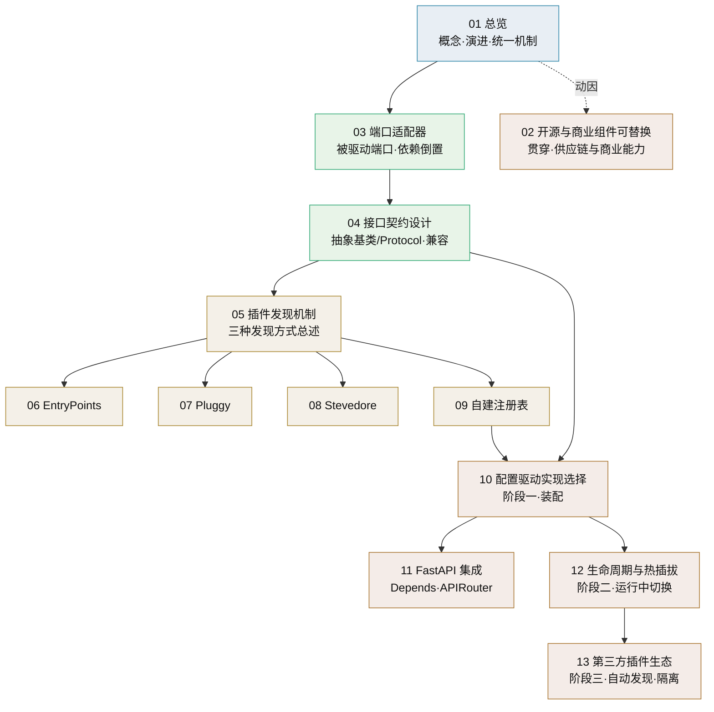
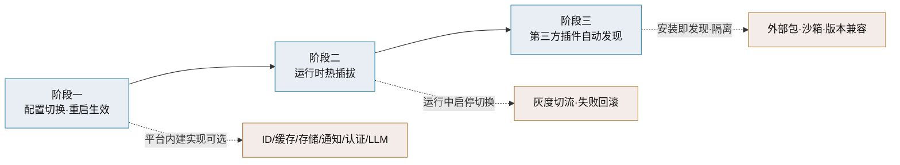
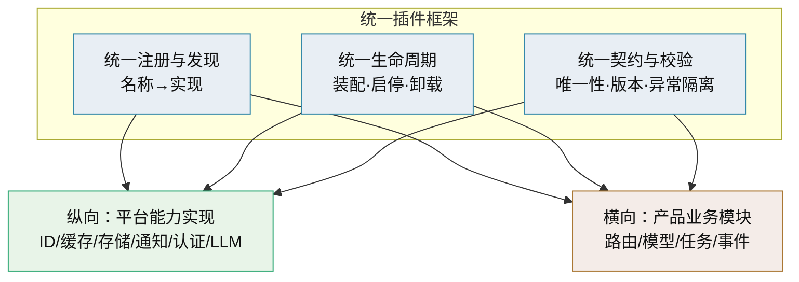

# 插件化架构总览

> 可替换实现与进程内扩展 · 概念、演进路线与子篇地图

[文档首页](../../../文档首页.md) › [知识档案](../技术栈知识档案总览.md) › 插件化架构总览　|　[← 返回总览](../技术栈知识档案总览.md)

---

## 1. 概述与定位 

**插件化架构**（Plugin Architecture）指系统把「某件事怎么做」从「谁来做」里拆出来：主程序定义稳定的**接口契约**，具体实现放在契约之外、以插件（extension / adapter / driver）形式挂进主程序，运行时按配置或发现结果选用其一。

在本项目里，它要解决的是一个很具体的痛点——**平台内部能力的实现要能换**：

- 雪花 ID 生成以后想换号段模式或 UUIDv7；
- 对象存储从 MinIO 换到别的 S3 服务；
- 通知渠道从邮件加进短信、企业微信；
- 大模型从外部 API 切到私有化端点（[LLM 适配层技术介绍](../后端核心/LLM适配层技术介绍.md) 已是这个思路的雏形）。

这些能力都有共同特征：**接口稳定、实现多样、换实现时业务代码不该跟着改**。插件化就是把这种「稳定与多变」的边界固化下来。

> 本目录是**知识档案**，回答「插件化有哪些做法、各有什么取舍」；本项目的具体机制设计（注册表字段、扩展包加载、构建合并等）属平台《架构设计》与《平台可扩展性规划》范畴，本目录只做知识铺垫，不替代设计文档。

## 2. 为什么需要插件化 

本项目技术栈以免费开源组件为主，插件化首先是**两重战略保障**：

| 战略动因 | 问题 | 可替换带来的解法 |
| --- | --- | --- |
| 供应链可持续性 | 开源组件可能停维护、换维护者、改许可、爆出无人修复的漏洞 | 上游「没人管了」时可切换到备选实现，不被锁死 |
| 商业能力补齐 | 非商业化组件功能常「差那么一点」，客户要求用商业组件 | 按客户/项目把能力切到商业实现，业务代码不动 |

> 因此**可替换是风险对冲，不是技术洁癖**：把「选型错误」与「上游变化」的代价从伤筋动骨降到换一个适配器。展开见《[02 开源与商业组件可替换](02_插件化架构_开源与商业组件可替换.md)》。

在此之下，不插件化还会表现为几种工程层面的典型症状：

| 症状 | 后果 |
| --- | --- |
| 业务代码直接 `import` 具体实现（如某 ID 库） | 换实现要全库搜索替换，牵动面不可控 |
| 实现选择散落在 if/else 与配置读取里 | 加一种实现要改多处分支，容易漏改 |
| 接口与实现放在同一模块 | 实现的可选依赖（如 Redis、ZK）被业务被迫带进来 |
| 缺少契约与兼容约定 | 换实现后行为差异无处对齐，测试难覆盖 |

插件化带来的是：

- **开放-封闭**：新增实现不动主程序（对扩展开放、对修改封闭）；
- **可测试**：契约可 mock，核心逻辑能脱离外部组件单测；
- **可配置**：同一份代码在不同环境选不同实现（开发用内存、生产用外部服务）；
- **可演进**：单体内按需替换部件，不必为了换一个算法引入微服务。

## 3. 核心概念与术语 

| 术语 | 定义 | 本目录对应篇目 |
| --- | --- | --- |
| 端口（Port） | 主程序定义的能力接口契约，表达「我需要什么」；不含技术细节 | [03 端口适配器](03_插件化架构_端口适配器.md) |
| 适配器（Adapter） | 端口的具体实现，把外部技术翻译成端口要求的形态 | [03 端口适配器](03_插件化架构_端口适配器.md) |
| 契约（Contract） | 端口的调用约定：方法、参数、返回、异常、线程/异步语义、生命周期 | [04 接口契约设计](04_插件化架构_接口契约设计.md) |
| 插件发现（Discovery） | 主程序如何得知「有哪些实现可用」 | [05 插件发现机制](05_插件化架构_插件发现机制.md) |
| 注册表（Registry） | 名称 → 实现的映射表，查找实现的依据 | [09 自建注册表](09_插件化架构_自建注册表.md) |
| 钩子（Hook） | 主程序在固定时点回调插件扩展点，允许多实现叠加 | [07 Pluggy](07_插件化架构_Pluggy.md) |
| 驱动（Driver） | 可互换的后端实现，如数据库驱动、认证后端 | [08 Stevedore](08_插件化架构_Stevedore.md) |
| 生命周期（Lifecycle） | 插件的装配、启动、停用、卸载与状态迁移 | [12 生命周期与热插拔](12_插件化架构_生命周期与热插拔.md) |
| 热插拔（Hot Swap） | 运行中启停或替换实现，不重启进程 | [12 生命周期与热插拔](12_插件化架构_生命周期与热插拔.md) |

> 端口/适配器是**理论模型**，发现机制/注册表/钩子是**工程手段**，两者是「原则」与「落地」的关系，不要混为一谈。

## 4. 子篇地图 

| 篇目 | 回答的问题 | 适用阶段 |
| --- | --- | --- |
| [01 总览](01_插件化架构_总览.md) | 插件化是什么、分几步走、和产品扩展什么关系 | 通读 |
| [02 开源与商业组件可替换](02_插件化架构_开源与商业组件可替换.md) | 上游停维护/许可变更/客户要商业组件时怎么换 | 贯穿全程 |
| [03 端口适配器](03_插件化架构_端口适配器.md) | 接口与实现怎么分离才不耦合 | 通读 |
| [04 接口契约设计](04_插件化架构_接口契约设计.md) | 契约怎么定、怎么保证换实现不破 | 设计期 |
| [05 插件发现机制](05_插件化架构_插件发现机制.md) | 主程序怎么知道有哪些实现 | 设计期 |
| [06 EntryPoints](06_插件化架构_EntryPoints.md) | 标准库发现机制怎么用 | 阶段三 |
| [07 Pluggy](07_插件化架构_Pluggy.md) | 钩子式扩展怎么用 | 按需 |
| [08 Stevedore](08_插件化架构_Stevedore.md) | 驱动式管理怎么用 | 按需 |
| [09 自建注册表](09_插件化架构_自建注册表.md) | 零依赖的显式注册怎么做 | 阶段一 |
| [10 配置驱动实现选择](10_插件化架构_配置驱动实现选择.md) | 怎么按配置选实现并装配 | 阶段一 |
| [11 FastAPI 集成](11_插件化架构_FastAPI集成.md) | 插件怎么接进 FastAPI | 阶段一 |
| [12 生命周期与热插拔](12_插件化架构_生命周期与热插拔.md) | 怎么启停、怎么运行中替换 | 阶段二 |
| [13 第三方插件生态](13_插件化架构_第三方插件生态.md) | 怎么接纳外部插件、怎么隔离 | 阶段三 |

## 5. 三阶段演进路线 

「随插随用」不是一步到位，按**能力范围从小到大、风险从低到高**分三阶段：

| 阶段 | 能力 | 前置条件 | 主要风险 | 对应篇目 |
| --- | --- | --- | --- | --- |
| 一：配置切换、重启生效 | 平台内建多实现，按 `config.toml` 选定，启动装配 | 端口契约、注册表、装配入口 | 低：变更走发布流程，可回滚 | [09](09_插件化架构_自建注册表.md) [10](10_插件化架构_配置驱动实现选择.md) [11](11_插件化架构_FastAPI集成.md) |
| 二：运行时热插拔 | 运行中启停插件、按开关切换实现、灰度与回滚 | 生命周期管理、状态迁移、并发安全 | 中：切换瞬间的在途请求与状态一致性 | [12](12_插件化架构_生命周期与热插拔.md) |
| 三：第三方插件自动发现 | 安装第三方包即被发现，多来源实现共存 | 入口点约定、沙箱/隔离、版本兼容 | 高：不可信代码执行、依赖冲突、安全边界 | [13](13_插件化架构_第三方插件生态.md) [05](05_插件化架构_插件发现机制.md) [06](06_插件化架构_EntryPoints.md) |
| 贯穿：开源 / 商业组件替换 | 上游停维护、许可变更、客户指定商业组件时切换实现 | 端口隔离、依赖清单、迁移预案 | 取决于替换对象：数据迁移与许可合规 | [02](02_插件化架构_开源与商业组件可替换.md) |

三阶段的关系是**叠加**而非替换：阶段一建立的契约与注册表是后两阶段的地基；没有契约，热插拔和第三方生态都无从谈起。项目口径上「不因扩展引入微服务」，三阶段全部是**进程内**方案（通过构建期合并或安装期发现），插件不新增独立服务进程。

## 6. 与产品扩展接入统一机制 

平台当前只有一种扩展点：**产品扩展接入**——biz、cw 等产品仓库把自己的业务模块挂进平台（横向，见平台《平台可扩展性规划》「代码复用能力边界」节）。本目录讨论的是**平台内部能力实现的可替换**（纵向）。两者最终应统一到同一套机制上：

统一后，同一套「注册 → 契约校验 → 装配 → 生命周期」机制既管平台部件的替换，也管产品模块的挂载，差异只在**注册要素**（能力名 vs 表前缀/错误码段/事件域）与**权限边界**。收益是机制只有一套、学习成本一次付出；风险是范围过大导致过度设计，因此按 5 节的三阶段逐步推进，先让纵向跑通再纳入横向。

## 7. 平台落地要点与边界 

- **先有契约，后有插件**：端口定义、契约测试、异常隔离是三阶段的共同地基，不应为了「能换」而先堆注册表。
- **按需抽象，不为抽象而抽象**：可替换的判据是「在可预见的未来是否可能被替换，或是否需要在测试中隔离」。像 ID 生成、时钟这类外部依赖，抽象价值在于确定性测试与算法切换；而内部纯函数、领域规则不需要端口。
- **契约优先于框架**：选 entry points、pluggy 还是自建注册表，是**实现手段**的选择；核心是契约稳定与唯一性校验。工具可以后换，契约返工代价大。
- **唯一性与冲突**：实现名、注册要素必须唯一，冲突在启动与 CI 阶段拒绝，不能留到运行时。
- **异常隔离与配额**：进程内插件（尤其第三方）未捕获异常不得拖垮主程序；连接、任务占用纳入平台管控。
- **凭据与安全**：插件实现可能引入外部依赖与密钥，凭据走 Secret 管理，第三方插件默认视为不可信。
- **与「不引入微服务」一致**：插件是进程内扩展包或安装期发现，不要求独立部署；确需强隔离、异构技术栈时按平台《平台可扩展性规划》「独立服务」形态另计。
- **按风险定优先级**：优先给「客户容易指定」与「上游风险高」的能力建端口，其余按需；完全不考虑替换的低风险依赖不必抽象（见 [02 开源与商业组件可替换](02_插件化架构_开源与商业组件可替换.md)）。

## 8. 常见误区与注意事项 

- **把插件化当成热插拔**：阶段一只做配置选择、重启生效，并不支持运行中替换；把两者混为一谈会低估阶段二的复杂度。
- **发现即执行**：发现阶段只应返回类或工厂，不应执行业务初始化；真正的初始化由框架在生命周期钩子里显式触发。
- **进程内无沙箱**：Python 进程内插件拿到的是完整权限，模块名/入口点必须白名单与正则校验；不可信插件要进程或容器隔离。
- **忽略异步语义**：本项目后端是 FastAPI 异步栈，插件契约若不声明同步/异步，混合调用会阻塞事件循环。
- **只测主实现**：换实现是常态，契约测试要覆盖全部注册实现，否则「配置切过去就崩」。
- **版本兼容不显式**：插件声明支持的框架版本范围，不兼容时跳过并告警，而不是运行时抛错。

## 9. 学习与参考资料 

| 资源 | 网址 | 说明 |
| --- | --- | --- |
| Python Packaging：Creating and discovering plugins | https://packaging.python.org/en/latest/guides/creating-and-discovering-plugins/ | 官方指南，三种插件发现方式 |
| Entry points 规范 | https://packaging.python.org/en/latest/specifications/entry-points/ | 入口点声明与解析的标准定义 |
| importlib.metadata 文档 | https://docs.python.org/3/library/importlib.metadata.html | 标准库发现机制 API |
| Pluggy 官方文档 | https://pluggy.readthedocs.io/ | 钩子式扩展框架（pytest 底层） |
| Stevedore 官方文档 | https://docs.openstack.org/stevedore/ | OpenStack 的插件/驱动管理器 |
| Hexagonal Architecture（Alistair Cockburn） | https://alistair.cockburn.us/hexagonal-architecture/ | 端口与适配器的原始表述 |
| FastAPI Dependencies | https://fastapi.tiangolo.com/tutorial/dependencies/ | 依赖注入与「插件」式集成 |

## 10. 项目内关联文档 

| 文档 | 说明 |
| --- | --- |
| 《[技术栈知识档案总览](../技术栈知识档案总览.md)》 | 知识档案入口索引 |
| 《[LLM 适配层技术介绍](../后端核心/LLM适配层技术介绍.md)》 | 本项目「配置驱动切换实现」的既有先例 |
| 《[IdGenerator 技术介绍](../后端核心/IdGenerator技术介绍.md)》 | 本项目当前 ID 生成实现与候选算法对比 |
| 《[02 开源与商业组件可替换](02_插件化架构_开源与商业组件可替换.md)》 | 供应链风险与商业组件替换的策略与迁移 |
| 《[FastAPI 技术介绍](../后端核心/FastAPI技术介绍.md)》 | 依赖注入体系的宿主框架 |
| 《[TOML 技术介绍](../后端核心/TOML技术介绍.md)》 | 配置格式（config.toml） |
| 平台《平台可扩展性规划》 | 平台的扩展点、契约承诺与产品接入形态（平台专属文档） |
| 平台《项目规划说明》 | 平台扩展接入流程、技术选型与阶段计划（平台专属文档） |

---

> 依《[文档生成规范](../../../规范/文档生成规范.md)》编写
