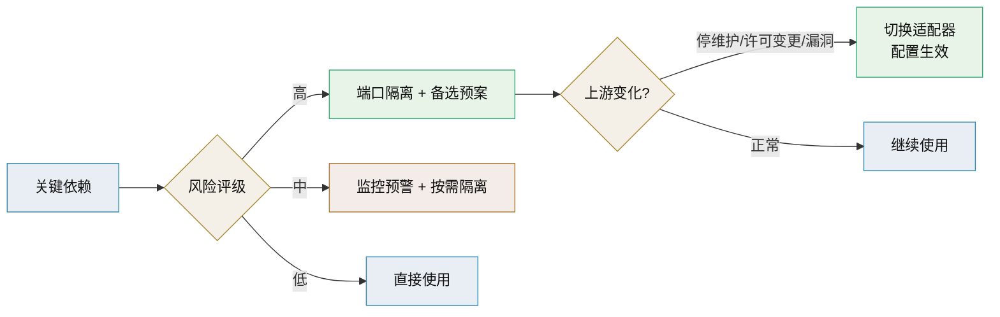
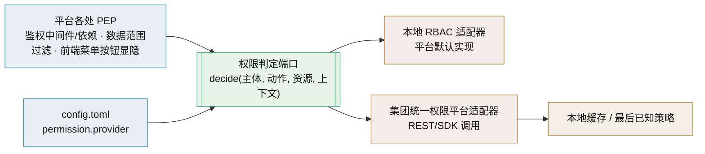

# 开源与商业组件可替换技术介绍

> 供应链可持续性与商业能力补齐 · 可替换是保障不是目的

[文档首页](../../../文档首页.md) › [知识档案](../技术栈知识档案总览.md) › [插件化架构](../技术栈知识档案总览.md#plugin) › 开源与商业组件可替换技术介绍　|　[← 返回总览](01_插件化架构_总览.md)

---

## 1. 技术概述 <a id="overview"></a>

本项目技术栈以免费开源组件为主（见平台《项目规划说明》「开源与许可协议」节）。开源带来低成本与可控性，同时引入两类**结构性风险**，这两类风险正是平台能力必须可替换的根本动因：

- **供应链可持续性无保障**：组件可能停维护、换维护者、改许可、爆出无人修复的安全漏洞或社区分裂。一旦所选实现「没人管了」，若平台与它强耦合，就会被锁死。
- **功能深度不足**：非商业化开源组件的功能常「差那么一点」——缺企业级特性、缺支持与 SLA、缺客户要求的合规能力。客户出于自身规范或安全要求指定商业组件时，平台必须能换。

**结论**：可替换能力（插件化）不是为了「技术洁癖」，而是把「选型错误」与「上游变化」的代价从「伤筋动骨」降到「换一个适配器」。它是一份**风险对冲**，不是终极目标。

> 本项目的立场：**默认用开源、保留可替换、按场景接商业**。可替换的边界与成本按本篇 5 节评估，不为不可替换的低风险依赖过度设计（对齐《[01 总览](01_插件化架构_总览.md)》「平台落地要点」的务实判据）。

## 2. 开源供应链风险与替换预案 <a id="oss-risk"></a>

| 风险 | 表现 | 预警信号 |
| --- | --- | --- |
| 停维护（Abandoned） | 长期无提交/无发版、issue 无人响应 | 最近提交 > 12 个月、发版停滞、维护者公开求接手 |
| 换维护者 / 移交 | 所有权转手、核心团队离开 | 仓库转移、维护者变更、贡献者骤减 |
| 许可变更（License Change） | 从宽松许可改为 AGPL/SSPL/商业限制 | 公告许可变更、新增商业条款、社区 fork 抗议 |
| 安全漏洞无修复 | CVE 公开但无人打补丁 | 依赖扫描持续告警、上游无回应 |
| 社区分裂（Fork） | 项目分叉，生态二选一 | 主仓库失活、活跃 fork 出现 |
| 依赖链风险 | 传递依赖停维护/被投毒 | 依赖树深层组件无维护、来源不明 |

**替换预案（供应链视角）**：

1. **识别**：维护「关键依赖清单」，标注维护活跃度、许可、替换候选与替换难度。
2. **隔离**：对高风险依赖一律先经端口/适配器隔离（见 [03 端口适配器](03_插件化架构_端口适配器.md)），业务代码不直接 `import`。
3. **预警**：订阅发版与安全公告（依赖漏洞扫描 + 人工跟踪上游发版），对预警信号设阈值告警。
4. **预案**：每个高风险依赖预先评估「备选实现」与「切换成本」，必要时提前做技术验证。
5. **切换**：通过配置切换实现（见 [10 配置驱动实现选择](10_插件化架构_配置驱动实现选择.md)），必要时双跑对比、灰度、回滚。
6. **兜底**：极端情况（上游消失且无替代）评估自行维护/接管的成本，或降级为自研最小实现。



## 3. 商业组件替换 <a id="commercial"></a>

开源「够用」与商业「好用」的差距，在客户现场会变成硬需求：客户可能已有商业组件资产、有采购与支持要求、有合规审计要求。平台需要能把这部分能力**按客户/项目切换**到商业实现。

| 差距维度 | 开源常见短板 | 商业组件优势 |
| --- | --- | --- |
| 功能深度 | 企业级特性（高级权限、审计增强、集群高可用）缺失 | 开箱即用、功能完整 |
| 支持与 SLA | 社区响应、无承诺 | 厂商支持、故障响应、责任兜底 |
| 合规与认证 | 缺等保/信创/行业认证 | 满足客户合规门槛 |
| 集成生态 | 与客户既有系统集成度低 | 厂商提供适配与迁移工具 |
| 长期演进承诺 | 路线取决于社区 | 厂商路线图与版本承诺 |

**商业组件的接入方式（按形态）**：

- **同能力换实现**：商业组件提供等价能力（如商业数据库、商业检索、商业消息中间件），经适配器替换开源实现；数据迁移与兼容见 5 节。
- **独立服务形态**：强隔离、异构技术栈、厂商独立交付的商业系统，按开放接口/OIDC 接入（对齐平台《平台可扩展性规划》「独立服务」口径）。
- **混用与共存**：部分客户用开源、部分用商业，配置层面按环境选择，代码不动。
- **采购与授权**：商业组件的许可、授权方式（订阅/永久/按量）与部署形态纳入选型评估，避免授权不清导致交付风险。

> 原则：**业务代码只依赖端口，选哪家由配置决定**；引入商业组件不得让平台核心代码出现该厂商专属类型与调用。

### 3.1 实例：权限外置到集团统一权限平台 <a id="perm-external"></a>

**场景**：客户要求把平台自身的权限功能换成集团已有的统一权限平台，纳入集团集中管理。这是「既有系统替换」的典型——不是换一个库，而是把一整块**横切能力**外置。它比换 ID 生成难得多：权限分布在鉴权中间件、菜单/按钮/字段显隐、动作级数据范围、审计与租户隔离各处。

**第一步是分清「认证」与「授权」**：认证回答「你是谁」，授权回答「你能干什么」。集团统一权限平台通常只接管授权判定，认证仍可能走 OIDC 到集团 IAM。两者边界不清，会导致改造成本失控。



**① 判定端口与 PEP/PDP 分离**：平台各处只保留**策略执行点（PEP）**——鉴权中间件/依赖、权限装饰器、数据范围过滤、前端显隐；它们统一调用**权限判定端口**。端口背后是**策略决策点（PDP）**：默认适配器是本地 RBAC 引擎，新适配器是集团权限平台客户端。端口输入为「主体（用户/角色/岗位）+ 动作（权限码/动作码）+ 资源（菜单/表单/按钮/字段/业务对象）+ 上下文（租户、数据范围、时间等）」，输出为「是否允许 + 数据范围条件」。

```python
# 权限判定端口：由平台（使用方）定义，实现可换
from abc import ABC, abstractmethod
from dataclasses import dataclass

@dataclass
class Decision:
    allowed: bool
    data_scope: dict | None = None   # 需要落到 SQL 的数据范围条件

class PermissionDecider(ABC):
    @abstractmethod
    async def decide(self, subject: dict, action: str,
                     resource: dict, context: dict) -> Decision: ...

# 装配：permission.provider = local | group_iam
```

**② 接入方式**（按实时性与依赖取舍）：

| 方式 | 机制 | 优点 | 代价 |
| --- | --- | --- | --- |
| 同步判定 | 每次鉴权调用外部 API/SDK | 实时、结果最新 | 强依赖外部可用性与性能 |
| 策略预取 | 拉取用户权限集合缓存本地、本地判定 | 性能好、外部短暂故障仍可用 | 同步延迟、失效与版本管理 |
| 令牌承载 | OIDC/OAuth2 令牌携带权限声明或 introspection | 与认证链路统一 | 令牌体积、声明容量有限 |
| 混合 | 粗粒度预取 + 敏感操作实时判定 | 平衡性能与实时 | 实现较复杂 |

**③ 可用性与降级**：判定是热路径，需本地缓存（按用户/租户/策略版本）、**最后已知策略**（stale-while-error）、超时与熔断。降级策略要有明确取舍：**写操作与敏感动作默认拒绝**（fail-closed），读场景可短暂使用缓存策略；绝不默认放行。

**④ 数据范围与业务语义对齐**：外部平台通常只懂「组织/角色/资源码」，不懂业务语义（如「本部门及其下级的数据」）。平台需把外部判定结果映射为**数据范围条件**并落到查询过滤；资源/动作码要与平台权限码体系对齐（可复用模块注册产生的权限码），且**租户隔离不能因外置而丢失**。

**⑤ 本地/外置边界划分**：外置的是「角色-权限关系与统一授权判定」；本地保留「资源/动作定义、数据范围映射与执行、审计、缓存」。避免全盘外置——业务元数据与数据过滤始终是平台职责。逐项边界：

| 权限要素 | 放外置（集团统一权限平台） | 留本地（平台） | 原因 |
| --- | --- | --- | --- |
| 主体（用户/角色/岗位） | 统一维护与同步（或从集团同步） | 本地绑定与展示 | 集团口径 vs 平台账户 |
| 角色-权限关系 | 统一授权、集中管理 | — | 外置的核心价值 |
| 授权判定（PDP） | 提供判定接口 | 判定端口 + 适配器 | 可替换点 |
| 资源/动作定义 | 登记资源码/动作码 | 菜单/表单/按钮/字段元数据 | 平台持有业务元数据 |
| 数据范围（行级） | 只给「允许/拒绝」与范围标识 | 映射为 SQL 过滤条件并执行 | 外部平台不懂业务语义 |
| 租户隔离 | 不负责（或跨租户） | **强制校验，不可丢失** | 平台多租户底线 |
| 审计 | — | 记录判定与切换操作 | 合规留痕 |

> 判据一句话：**「谁能做什么」可以外置，「哪些资源存在、数据怎么过滤、租户怎么隔离」必须留本地。**

**⑥ 迁移与双跑**：先做端口改造（业务只依赖判定端口）；新旧判定**影子并行**记录差异；按租户/角色灰度切换；保留一键回退本地引擎；观察期后再决定是否下线本地判定（或长期保留为降级实现）。迁移细节见 5 节。

> 本例印证了 2、3 节的结论：**端口由使用方定义、实现可换、按配置选择、失败可回退**——权限这种横切能力也不例外。

## 4. 许可合规与混用风险 <a id="license"></a>

开源许可不是「免费随便用」，不同许可的传染性与分发要求不同，混用需审查：

| 许可类型 | 代表 | 主要约束 | 本项目注意点 |
| --- | --- | --- | --- |
| 宽松许可 | MIT / Apache-2.0 / BSD | 保留版权与许可声明，基本无传染 | 优先选用，风险最低 |
| 弱传染 | LGPL / MPL | 修改库本体需回馈，动态链接通常可接受 | 评估链接/分发方式 |
| 强传染 | GPL / AGPL | 衍生作品/网络服务需开源 | 谨慎：AGPL 对 SaaS 交付影响大 |
| 商业许可 | 厂商 EULA / 订阅 | 按授权范围与用量使用 | 授权核对、禁止超范围部署 |
| 信创/国产 | 国产化认证组件 | 满足国产化环境要求 | 达梦 DM8 属此类场景 |

**合规要点**：

- **登记许可**：每个引入的组件登记许可类型与义务，纳入依赖清单管理（平台已在「开源与许可协议」节维护口径）。
- **隔离高风险许可**：GPL/AGPL 类组件尽量以独立服务/独立进程隔离，避免传染到平台自有代码。
- **商业授权核对**：客户指定商业组件时，先确认授权是否覆盖部署形态与规模，再落地。
- **交付材料**：随交付提供第三方组件许可清单（SBOM 思路），满足客户与审计要求。
- **替换即合规手段**：许可不满足时，切换适配器到合规实现，是合规整改的低成本路径。

## 5. 替换成本与迁移策略 <a id="migration"></a>

「能换」不等于「换得起」。切换实现前按下列维度评估成本，避免低估：

| 维度 | 关键问题 | 应对 |
| --- | --- | --- |
| 接口差异 | 目标实现语义是否与端口一致（一致性、事务、异步） | 契约测试覆盖差异点；适配器做语义转换 |
| 数据格式 | 存储格式、编码、精度是否兼容 | 数据迁移脚本、双写校验、回滚方案 |
| 能力缺口 | 目标实现缺少现有依赖的某项能力 | 降级方案、能力替代、功能裁剪评估 |
| 性能特征 | 吞吐/延迟/资源占用差异 | 压测对比，按容量规划评估 |
| 运维方式 | 部署、备份、监控、故障处理不同 | 更新部署与运维手册 |
| 许可与成本 | 授权、采购、支持费用 | 选型阶段纳入 TCO 评估 |

**迁移策略（分批降险）**：

1. **契约先行**：确保业务只依赖端口；补契约测试，锁定行为基线。
2. **双跑对比**：新旧实现并行运行（影子流量/抽样对比），验证一致性。
3. **灰度切换**：按租户/流量比例逐步切换，观察指标。
4. **快速回滚**：保留旧实现与配置，异常时一键切回。
5. **数据迁移**：可双写过渡；不可逆数据先备份、演练迁移与回滚。
6. **观察期**：切换后设观察窗口，确认稳定再下线旧实现。
7. **文档同步**：更新设计与部署文档，登记能力 provider 变更。

> 阶段一（配置切换、重启生效）即可完成大部分替换；需要不停机切换与灰度时，进入阶段二（见 [12 生命周期与热插拔](12_插件化架构_生命周期与热插拔.md)）。

## 6. 在本项目中的用途 <a id="usage"></a>

平台技术栈中，**越是重、越是与业务耦合、越是客户会指定**的能力，越需要可替换性：

| 平台能力 | 开源现状 | 可替换场景 |
| --- | --- | --- |
| ID 生成 | yitter 雪花 | 算法更换（号段 / UUIDv7），或客户指定发号服务（见《[IdGenerator 技术介绍](../后端核心/IdGenerator技术介绍.md)》） |
| 数据库 | MySQL / PostgreSQL / 达梦 DM8 | 三库并行即多实现；信创场景切达梦 |
| 对象存储 | MinIO（S3 兼容） | 客户既有 S3/商业对象存储 |
| 全文检索 / 向量 | ElasticSearch / Milvus | 商业检索/向量服务 |
| 消息与任务 | RocketMQ / Celery | 客户指定消息中间件 |
| 工作流 | SpiffWorkflow | 商业 BPM/流程平台 |
| 认证 | authlib（OIDC/CAS） | 客户既有 IdP / 商业 IAM |
| 权限（授权） | 本地 RBAC 引擎 | 集团统一权限平台 / 外部 PDP（见 3.1 节实例） |
| AI 能力 | LLM 适配层 | 外部 API / 私有化 / 商业大模型（已有先例） |
| 报表 | ECharts | 商业 BI 组件 |

- **优先隔离清单**：对「客户容易指定」与「上游风险高」的能力优先建立端口，其余按需。
- **已有先例**：LLM 适配层已实现「外部 API / 私有化端点可配置切换」，是本策略的最佳样板（见《[LLM 适配层技术介绍](../后端核心/LLM适配层技术介绍.md)》）。
- **与产品交付**：产品（biz、cw）交付时，客户环境差异由平台配置层吸收，产品业务代码不变。

## 7. 常见问题与注意事项 <a id="pitfalls"></a>

- **把可替换当成目标**：可替换是风险对冲；为所有依赖都加端口会拖垮成本，按 6 节优先级来。
- **只换实现不换数据**：接口切换了但数据格式不兼容，导致迁移失败；替换必须含数据方案。
- **低估许可风险**：引入 AGPL 组件到平台自有代码链路，SaaS 交付时触发开源义务。
- **商业组件深度绑定**：业务代码直接调用厂商 SDK/类型，换回开源时无法解耦，违背可替换初衷。
- **无预警机制**：依赖停维护了却无人知晓；需依赖升级与漏洞扫描常驻。
- **应急预案缺失**：真出事时才评估备选，时间与风险都不可控；高风险依赖应预研备选。
- **授权核对后置**：客户现场才发现授权不覆盖部署规模，影响交付。
- **一次性大切换**：无灰度、无回滚、无双跑，切换即事故；务必分批降险。
- **认证与授权混为一谈**：外置权限时未分清「你是谁」与「你能干什么」，把认证也一并改动，扩大故障面。
- **降级默认放行**：外部权限平台不可用时默认放行，等于安全形同虚设；敏感动作必须 fail-closed。
- **数据范围语义丢失**：外部平台只给「允许/拒绝」，平台未映射为数据范围条件，导致越权看到跨部门数据。
- **判定热路径反复外呼**：每个请求多次调用外部权限接口，外部抖动即拖垮全站；需缓存与批量判定。
- **租户边界被外置冲掉**：集团平台跨租户统一管理时，平台侧未校验租户隔离，产生跨租户越权。

## 8. 学习与参考资料 <a id="learn"></a>

| 资源 | 网址 | 说明 |
| --- | --- | --- |
| 开源许可指南（OSI） | https://opensource.org/licenses | 各许可条款与义务 |
| SPDX 许可清单 | https://spdx.org/licenses/ | 标准化许可标识 |
| Choose a License | https://choosealicense.com/ | 许可对比与选择 |
| Casbin | https://casbin.org/ | 通用授权库（本地 RBAC/ABAC 引擎候选） |
| OpenFGA | https://openfga.dev/ | Zanzibar 风格细粒度授权（外部 PDP 形态参考） |
| OpenID Connect | https://openid.net/developers/how-connect-works/ | 认证与令牌（权限外置的认证链路） |
| 12-factor：Dependencies | https://12factor.net/dependencies | 显式声明与管理依赖 |
| Renovate 文档 | https://docs.renovatebot.com/ | 依赖升级工具（本项目 2026-09 已停用自动升级，保留备查） |
| SemVer 语义化版本 | https://semver.org/lang/zh-CN/ | 版本兼容与升级策略 |

## 9. 项目内关联文档 <a id="related"></a>

| 文档 | 说明 |
| --- | --- |
| 《[01 插件化架构总览](01_插件化架构_总览.md)》 | 本目录总览与三阶段演进 |
| 《[03 端口适配器](03_插件化架构_端口适配器.md)》 | 隔离高风险依赖的理论与做法 |
| 《[10 配置驱动实现选择](10_插件化架构_配置驱动实现选择.md)》 | 按配置切换开源/商业实现 |
| 《[12 生命周期与热插拔](12_插件化架构_生命周期与热插拔.md)》 | 灰度切换与回滚 |
| 《[13 第三方插件生态](13_插件化架构_第三方插件生态.md)》 | 商业组件以独立服务形态接入 |
| 《[LLM 适配层技术介绍](../后端核心/LLM适配层技术介绍.md)》 | 可替换实现的既有样板 |
| 《[IdGenerator 技术介绍](../后端核心/IdGenerator技术介绍.md)》 | ID 生成算法替换实例 |
| 《[Renovate 技术介绍](../部署与运维/Renovate技术介绍.md)》 | 依赖升级工具（2026-09 已停用，供应链预警改由扫描承担） |
| 平台《项目规划说明》 | 开源与许可协议、外部依赖与降级口径（平台专属文档） |
| 平台《平台可扩展性规划》 | 独立服务形态与产品接入边界（平台专属文档） |

---

> 依《[文档生成规范](../../../规范/文档生成规范.md)》编写
