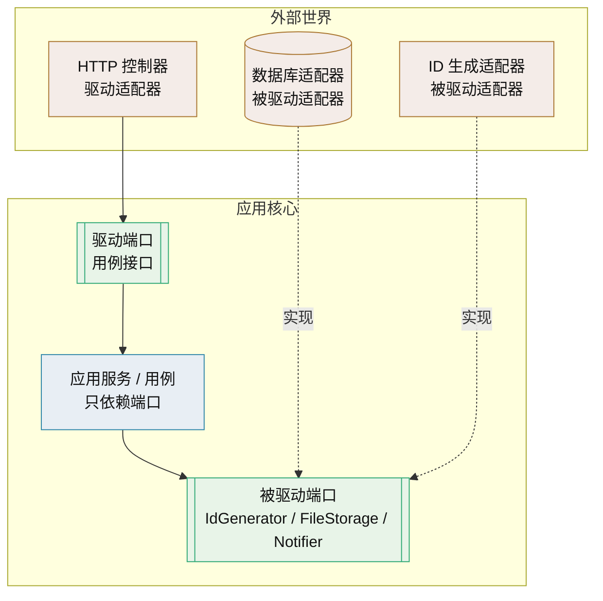
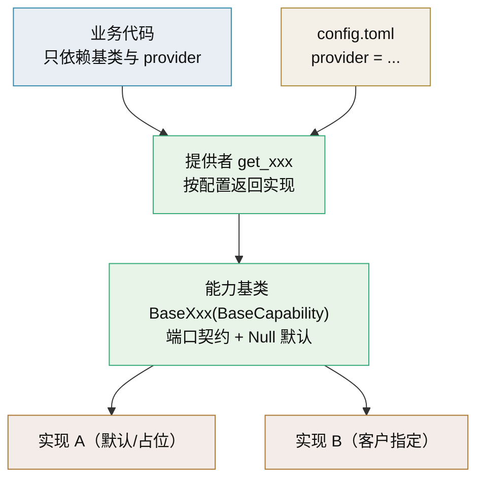
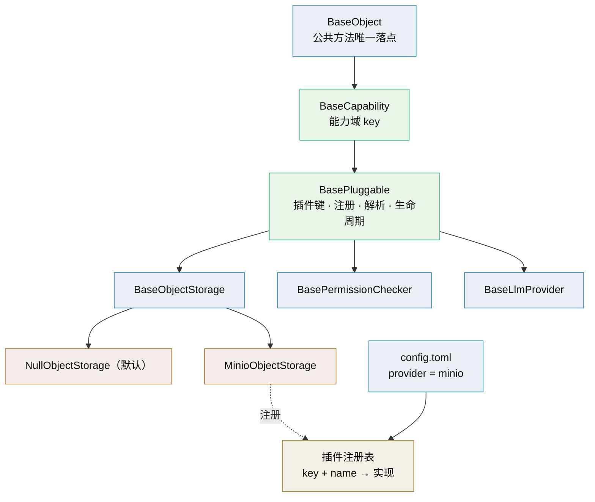

# 端口适配器技术介绍

> 六边形架构 · 依赖倒置 · 可替换实现的理论依据

[文档首页](../../../文档首页.md) › [知识档案](../技术栈知识档案总览.md) › [插件化架构](../技术栈知识档案总览.md#plugin) › 端口适配器技术介绍　|　[← 返回总览](01_插件化架构_总览.md)

---

## 1. 技术概述 <a id="overview"></a>

**端口与适配器（Ports and Adapters）**，又叫**六边形架构**（Hexagonal Architecture），由 Alistair Cockburn 在 2005 年提出。它把应用分成「内」与「外」两层：内部是业务核心，外部是数据库、消息队列、HTTP 框架、第三方 SDK 等技术细节；两者只通过**端口**（接口契约）与**适配器**（实现）交互，依赖方向永远从外指向内。

- **定位**：可替换实现（插件化）的**理论模型**——解释了「为什么接口要由使用方定义、实现要在外面」，是插件化架构的原则层。
- **别名**：六边形架构、洋葱架构（Onion）、整洁架构（Clean Architecture）共享同一核心规则，只是画法不同。
- **核心规则**：依赖倒置——高层模块不依赖低层模块，两者都依赖抽象；抽象不依赖细节，细节依赖抽象。
- **适用**：业务逻辑复杂、外部集成多、需要独立测试与实现替换的系统；简单 CRUD 用传统分层即可。

## 2. 核心概念与原理 <a id="principles"></a>

| 概念 | 说明 |
| --- | --- |
| 端口（Port） | 应用与外界交互的**接口契约**，是一组操作的声明，不含技术细节。分驱动端口与被驱动端口 |
| 驱动端口（Driving / Primary） | 外部调用应用的入口，表达「我能做什么」，典型如应用服务接口、用例接口 |
| 被驱动端口（Driven / Secondary） | 应用调用外部的能力，表达「我需要什么」，典型如 `IdGenerator`、`FileStorage`、`Notifier` |
| 适配器（Adapter） | 端口的实现，把外部技术翻译成端口要求的形态；分驱动适配器与被驱动适配器 |
| 驱动适配器 | HTTP Controller、CLI、消息消费者——把外部请求转成对驱动端口的调用 |
| 被驱动适配器 | 数据库实现、第三方 API 客户端、内存实现（测试用）——实现被驱动端口 |
| 依赖倒置原则（DIP） | 高层不依赖低层、两者依赖抽象；SOLID 第五条，是端口的理论来源 |
| 依赖注入（DI） | 对象不自己创建依赖，由外部（容器/装配入口）注入；是实现 DIP 的手段，不等于 DIP |

**关键区分**：DI 是「怎么把实现塞进来」的机制，DIP 是「依赖应该指向抽象」的原则。用了 `@inject` 或 `Depends` 不代表解耦——注入的如果是具体类，仍与实现耦合。



**判断一个项目是不是端口适配器**，不看目录怎么分，看依赖规则：**删掉所有适配器代码后，核心层还能不能独立编译/导入并通过单测**。能，就是；不能，只是按目录摆了个形状。

## 3. 在本项目中的用途 <a id="usage"></a>

- **解释平台能力替换的边界**：平台的认证、权限、文件、通知、任务、ID 生成、缓存、对象存储、LLM 适配层等，本质都是**被驱动端口 + 多适配器**——接口由平台定义，实现可换（MinIO / 本地文件系统 / 其他 S3；外部大模型 API / 私有化端点）。
- **ID 生成器是否值得抽象**：这是本目录的起点。按 DIP 的务实判断，ID 生成器与时钟一样，抽象价值在于两点——①**算法可能被替换**（雪花换号段或 UUIDv7）；②**测试需要确定性**（固定序列可复现）。因此给它定义端口是合理的；详见《[IdGenerator 技术介绍](../后端核心/IdGenerator技术介绍.md)》与 [09 自建注册表](09_插件化架构_自建注册表.md)。
- **与配置驱动选择配合**：端口只解决「依赖抽象」，选哪个适配器由装配入口决定；本项目用 `config.toml` + 注册表实现（见 [10 配置驱动实现选择](10_插件化架构_配置驱动实现选择.md)）。
- **与产品扩展的对应**：平台对产品暴露的能力（`/api/v1`、事件、注册要素）也是「契约」，产品扩展包是实现方；统一机制见 [01 总览](01_插件化架构_总览.md)「与产品扩展接入统一机制」节。
- **避免过度抽象**：端口不是越多越好。为读配置建 `ConfigPort`、为取时间建 `ClockPort`、为生成 UUID 建 `IDGeneratorPort`，若无替换或测试诉求，收益微乎其微。

## 4. 与相关模式辨析 <a id="compare"></a>

| 模式 | 关注点 | 与端口适配器的关系 |
| --- | --- | --- |
| 传统分层架构 | 上层调用下层，单向依赖 | 端口适配器反转了「业务→数据库」的方向，让细节实现抽象 |
| 依赖注入（DI） | 对象如何获得依赖 | 实现 DIP 的手段；注入具体类仍耦合 |
| 策略模式（Strategy） | 同一算法的多种可互换实现 | 端口适配器中的「被驱动端口 + 多适配器」在类级别即策略模式 |
| 工厂 / 注册表 | 运行时按名称获得实现 | 策略的创建与查找方式，见 [09 自建注册表](09_插件化架构_自建注册表.md) |
| 六边形 / 洋葱 / 整洁架构 | 内外分离与依赖规则 | 同一核心思想的三种表述，规则一致 |

**选择建议**：本项目的插件化机制用「端口（抽象基类/Protocol）+ 注册表（策略/工厂）+ 装配入口」即可覆盖阶段一；不必为了理论完备而引入完整六边形目录结构。

## 5. 落地载体：用基类体系承载可替换 <a id="carrier"></a>

端口/适配器在本项目不是新造概念，而是**落在已有的基类体系上**：每个能力域已经是一个抽象基类（端口）+ Null 占位实现（默认）+ 提供者 `get_xxx`（选择入口）。业务代码只依赖基类与提供者，换实现在基类层完成，业务零改动。



### 5.1 与现有基类体系的对照 <a id="carrier-map"></a>

平台《后端基类清单》已定义 L0 + `BaseCapability` + 能力域基类的分层体系，插件化概念与之逐项对应：

| 插件化概念 | 现有基类体系载体 | 示例 |
| --- | --- | --- |
| 端口 | 能力域抽象基类 `BaseXxx(BaseCapability)` | `BaseObjectStorage`、`BasePermissionChecker`、`BaseLlmProvider` |
| 适配器 | 继承 `BaseXxx` 的具体实现 | MinIO 适配器、集团权限平台客户端 |
| 默认实现 | `NullXxx` / 占位实现 | `NullObjectStorage`、`NullPermissionChecker`（恒定行为，免 `None` 判断） |
| 选择入口 | 提供者 `get_xxx` | `get_object_storage()`、`get_permission_checker()` |
| 契约数据 | 基类方法签名 + 数据契约 | `StoredObject`、`PresignedUrl`、`ChatResult` |
| 横切叠加 | 中间层基类 / 钩子 | `BaseMasker`、`AuditCapturer`（多实现链式，不是单选） |

> 所以「默认切现有架构、想切就实现」这套形状**项目已经具备**；要补的是把它们串起来的**装配选择层**（注册表 + 配置 + 启动唯一性校验），对应《[09 自建注册表](09_插件化架构_自建注册表.md)》与《[10 配置驱动实现选择](10_插件化架构_配置驱动实现选择.md)》。清单中多数能力域当前状态为「占位」，正是按此思路回补的入口。

### 5.2 Python 语言支持 <a id="carrier-python"></a>

| 诉求 | 语言手段 | 评价 |
| --- | --- | --- |
| 接口契约 | `abc.ABC` / `typing.Protocol`（PEP 544） | 推荐；`Protocol` 便于第三方实现不继承也可用 |
| 子类自动登记 | `__init_subclass__`（PEP 487） | 轻量好用，可选；实现类定义即注册 |
| 名称 → 实现 | 注册表 + 工厂（见 [09 自建注册表](09_插件化架构_自建注册表.md)） | 推荐 |
| 装配选择 | `config.toml` + 提供者 / `Depends` | 推荐 |
| 运行时切换 | 实例委托 + holder 原子替换 | 用组合，不用继承 |
| 元类 / 描述符 | `metaclass` / descriptor | 能做但重，不推荐 |

**关键认知：继承是静态的。** 运行时修改 `__bases__` 去「换基类」不可靠也不应做；「换实现」的本质是**组合 + 装配时选择（或运行时原子替换引用）**，不是改继承。基类体系提供的是**契约与默认实现**，选择发生在装配层。

### 5.3 三类诉求必须分开 <a id="carrier-three"></a>

| 诉求 | 语义 | 机制 | 例子 |
| --- | --- | --- | --- |
| 单实现替换（SPI） | 多实现中**选一个** | 能力基类 + 注册表 + 配置选一个 | ID 生成、对象存储、权限判定 |
| 横切叠加 | 多个实现**都生效** | 中间层基类 / 钩子 / 装饰器（链式） | 审计、限流、脱敏、埋点 |
| 运行时热插拔 | 运行中**启停 / 切换** | 实例级 holder 原子替换（见 [12 生命周期与热插拔](12_插件化架构_生命周期与热插拔.md)） | 灰度切流、故障降级 |

把三类混成一个「总开关」会出问题：单选需要竞争语义，横切需要链式叠加语义，二者机制不同。

### 5.4 分层边界与理由：为何不下沉到 L0 <a id="carrier-boundary"></a>

- `BaseObject` 是**所有**可继承类之根（含集合、ORM `BaseModel`、`BaseSchema`），把切换机制放上去会变**上帝基类**，把无关类一并拖入；
- 平台《后端基类清单》已立口径：「公共字段/方法只在对应层基类维护」「任一方的特有逻辑不得上提 L0」「加层优先于在既有层堆逻辑」；
- 放 `BaseCapability` / 能力基类层，**语义准确、命中面小、与现有体系一致**；出现新横切职责时按「插中间层」演进，而不是往根上堆。若把「实现可替换」本身也收敛成一层，则插在两者之间的 `BasePluggable`（见 5.6 节）——这正符合「加层优先」的原则。

### 5.5 推荐形态与示例 <a id="carrier-shape"></a>

```python
# 1) 端口：能力基类（项目已有形状，业务只认它）
from abc import abstractmethod
from app.core.capability import BaseCapability

class BaseObjectStorage(BaseCapability):
    key = "object_storage"

    @abstractmethod
    async def put(self, key: str, data: bytes, *, content_type: str) -> "StoredObject": ...

    @abstractmethod
    async def presign(self, key: str, *, method: str, expires_in: int) -> "PresignedUrl": ...
```

> 说明：平台**现状**是能力基类继承 `BaseCapability`；若采纳 5.6 的 `BasePluggable` 中间层，则改为继承 `BasePluggable`（业务方法不变，只是多一层装配语义）。本节 5.5 示例为现状形状，5.6 为推荐演进。

```python
# 2) 实现 + 注册（显式注册或 __init_subclass__ 自动登记）
_storage_providers: dict[str, type[BaseObjectStorage]] = {}

def register_storage(name: str):
    def deco(cls):
        if name in _storage_providers:
            raise RuntimeError(f"object_storage 实现重名：{name}")
        _storage_providers[name] = cls
        return cls
    return deco

@register_storage("minio")
class MinioObjectStorage(BaseObjectStorage):
    async def put(self, key, data, *, content_type): ...
    async def presign(self, key, *, method, expires_in): ...
```

```python
# 3) 提供者：按配置选实现（唯一知道具体类型的地方）
def get_object_storage() -> BaseObjectStorage:
    name = settings.storage.provider          # config.toml
    if name not in _storage_providers:
        raise RuntimeError(f"未知 storage.provider={name}，可选：{sorted(_storage_providers)}")
    return _storage_providers[name]()
```

```toml
# config.toml
[storage]
provider = "minio"    # 换成客户指定实现只改这一行，业务代码零改动
```

> 这套形态与《[09 自建注册表](09_插件化架构_自建注册表.md)》《[10 配置驱动实现选择](10_插件化架构_配置驱动实现选择.md)》完全一致；本节的增量是——**载体不是新建的框架，而是现有基类体系**。

### 5.6 插件化中间层：BasePluggable <a id="pluggable-layer"></a>

把「实现可替换」的**装配语义**收敛为一层，插在 `BaseCapability`（能力域标识）与各能力基类之间，避免每个能力各自重复实现注册/选择。这是《后端基类清单》「加层优先」原则的一次具体应用。



**该层职责**（单一职责＝实现可替换，不含业务能力、不含横切叠加）：

| 职责 | 说明 |
| --- | --- |
| 插件键与实现名 | 类属性 `plugin_key`（能力域，如 `object_storage`）与 `plugin_name`（实现名，如 `minio`；默认实现用 `null`） |
| 注册与唯一性校验 | 子类登记到插件注册表；`(plugin_key, plugin_name)` 重名在导入/启动期报错 |
| 按配置解析与选择 | `resolve_plugin(key, provider)` 按名取类并实例化；未指定则用默认实现 |
| 默认（Null）兜底 | `NullXxx` 作为默认实现，调用方无需 `None` 判断 |
| 契约版本校验 | 类属性 `contract_version`，装配时校验实现与契约版本兼容 |
| 生命周期钩子 | 可选 `async setup()` / `aclose()`，由装配入口统一调用与释放（对齐 [12 生命周期与热插拔](12_插件化架构_生命周期与热插拔.md)） |
| 元信息与可观测 | `describe()` 输出实现清单与元信息，供排障与清单同步 |
| 与 `get_xxx` 的关系 | 现有 `get_xxx` 退化为薄封装，内部走统一插件解析，调用面不变 |

```python
# 插件化中间层：只做「实现可替换」的装配语义，不放业务方法
from app.core.capability import BaseCapability

class BasePluggable(BaseCapability):
    plugin_key: str = ""          # 能力域，如 "object_storage"
    plugin_name: str = ""         # 实现名，如 "minio"；默认实现用 "null"
    contract_version: str = "1.0"

    def __init_subclass__(cls, **kwargs):
        super().__init_subclass__(**kwargs)
        register_plugin(cls)      # 子类定义即登记：幂等 + 重名报错

    @classmethod
    def describe(cls) -> dict: ...
    async def setup(self) -> None: ...
    async def aclose(self) -> None: ...
```

```python
# 能力基类改继承 BasePluggable；业务方法仍在此定义
class BaseObjectStorage(BasePluggable):
    plugin_key = "object_storage"

    @abstractmethod
    async def put(self, key: str, data: bytes, *, content_type: str) -> "StoredObject": ...

    @abstractmethod
    async def presign(self, key: str, *, method: str, expires_in: int) -> "PresignedUrl": ...
```

```python
# 现有 get_xxx 退化为薄封装，调用面不变
def get_object_storage() -> BaseObjectStorage:
    return resolve_plugin("object_storage", settings.storage.provider)
```

**设计约束**：

- **只承载「多选一」**：链式叠加（审计/限流/脱敏/埋点）仍走钩子/装饰器，**不进这层**——单选与叠加语义不同。
- **一职责一层**：配置读取在装配入口、业务方法在能力基类、公共方法在 L0，都不上提到 `BasePluggable`。
- **自动注册要可控**：`__init_subclass__` 导入即注册需幂等、顺序无关；若担心导入副作用，可改为显式注册（见 [09 自建注册表](09_插件化架构_自建注册表.md)）。
- **与现有体系兼容**：能力基类改继承 `BasePluggable`，`NullXxx` 默认实现与 `get_xxx` 调用面保持不变，改造是渐进的。
- **备选（组合式）**：不想拉长继承链时，能力基类可持有独立 `PluginRegistry` 用组合注入；取舍在「继承统一」与「组合灵活」。
- **前端对称**：前端基类体系若有同类诉求，按同一思路插层（见平台《前端基类清单》）。

#### 5.6.1 双轨：主线继承 + 项目组合 <a id="pluggable-dual"></a>

继承与组合**不互斥**：可以「**主线（平台内建实现）用继承**获得统一契约与自动登记，**项目二次开发用组合**注册接入、不回改平台基类」，两条路径**汇入同一张插件注册表**，统一跑唯一性与版本校验。Python 语法完全支持。

**① 显式注册（组合核心）**——注册表必须提供显式登记入口，不必继承也能登记：

```python
# 平台：注册表提供双入口（继承自动登记与显式登记都走这里）
def register_plugin(plugin_key: str, plugin_name: str, impl) -> None:
    ...   # 唯一性校验 + 契约版本校验

# 项目二次开发：独立实现，不继承 BasePluggable
register_plugin("object_storage", "acme", AcmeStorage)
```

**② 虚拟子类 `register()`**——不继承也能通过 `isinstance` / `issubclass` 检查：

```python
BaseObjectStorage.register(AcmeStorage)   # ABC 虚拟子类，桥接组合接入
```

> 虚拟子类**不强制实现抽象方法**：`isinstance` 通过 ≠ 行为正确，须靠契约测试兜底。

**③ `Protocol` 结构化子类型**——外部实现只要方法形状匹配即可，无需继承运行时基类，静态检查（pyright）也能过：

```python
from typing import Protocol, runtime_checkable

@runtime_checkable
class ObjectStorageContract(Protocol):
    async def put(self, key: str, data: bytes, *, content_type: str): ...
    async def presign(self, key: str, *, method: str, expires_in: int): ...
```

**双轨对照**：

| 维度 | 主线：继承统一 | 项目：组合灵活 |
| --- | --- | --- |
| 是否继承能力基类 | 是（`BaseXxx(BasePluggable)`） | 否（独立类 / 包装器） |
| 登记方式 | `__init_subclass__` 自动 | 显式 `register_plugin(...)` / `Base.register(...)` |
| 契约保障 | 抽象方法强制 | 契约测试 + 可选 `Protocol` 静态检查 |
| 适用 | 平台内建实现、稳定契约 | 客户定制、二次开发、不便改基类 |

**④ 契约测试与版本兜底**：虚拟子类与结构化实现**跳过抽象方法强制**，必须用契约测试锁行为（每个注册实现跑同一组测试），并由注册表统一校验 `contract_version` 兼容（见 [04 接口契约设计](04_插件化架构_接口契约设计.md)）。

**⑤ 二次开发示例（组合接入）**：

```python
# 项目侧：把客户权限平台翻译成能力契约（适配层见 ⑥）
from app.permission.base import BasePermissionChecker

class GroupPermissionAdapter(BasePermissionChecker):
    plugin_key = "permission_checker"
    plugin_name = "group_iam"

    def __init__(self, client): self._client = client
    async def check(self, subject, action, resource=None): ...

# 安装期登记；这里借继承最省事，组合的精髓在「注册」而非「继承」
register_plugin("permission_checker", "group_iam", GroupPermissionAdapter(build_client()))
```

> 若客户实现无法/不愿继承能力基类，用 ①②③ 任一方式登记即可——**组合不要求继承**。

**⑥ 适配层（ACL）建议**：项目侧实现建议包一层适配器，把外部系统接口翻译成能力契约，避免客户定制类型泄漏进平台核心；这正是《[02 开源与商业组件可替换](02_插件化架构_开源与商业组件可替换.md)》所说的「适配器」。

> 一句话：**主线继承管统一，项目组合管灵活，两者汇于同一注册表**；`resolve_plugin` 对两条路径一视同仁。

## 6. 落地要点 <a id="practice"></a>

- **端口由使用方定义**：谁需要能力，谁定义接口；不要由实现方定义接口再让使用方适配。
- **接口只依赖领域类型与标准库**：端口里出现 SQL、HTTP、厂商 SDK 的 DTO，说明技术细节泄漏进了核心。
- **端口粒度适中**：按「能力」聚合，一个端口 3~7 个方法为宜；太粗难 mock，太细接口爆炸。
- **一个端口多个适配器**：生产适配器、内存/假适配器（测试）、降级适配器（外部不可用时）。
- **装配是唯一知道具体类型的地方**：`main`/启动装配入口把适配器注入端口使用方，其余代码只认接口。
- **用自动化约束依赖方向**：如 CI 中禁止 `services` 层直接导入具体适配器模块，防止规则腐化。
- **异步语义写进契约**：本项目为异步栈，端口方法须显式标注 `async`，避免插件阻塞事件循环（见 [04 接口契约设计](04_插件化架构_接口契约设计.md)）。

## 7. 常见问题与注意事项 <a id="pitfalls"></a>

- **目录即架构的误解**：按 `domain/port/adapter` 分目录但核心层 `import` 了数据库驱动，不是六边形架构。
- **为每个外部调用建端口**：抽象爆炸，维护成本高于收益；只在「可能替换或需测试隔离」时建端口。
- **端口返回具体实现类型**：端口签名里出现具体类（而非抽象/领域类型），等于没抽象。
- **领域模型与 DTO 混淆**：核心层理解 HTTP 语义，最终仍被外部协议绑架。
- **贫血模型**：把业务规则全搬到应用服务、领域对象只剩 getter/setter，是端口适配器常见伴生病。
- **忽视合规与安全边界**：适配器负责协议转换，不应承担业务规则，也不应绕过平台的审计与租户隔离。

## 8. 学习与参考资料 <a id="learn"></a>

| 资源 | 网址 | 说明 |
| --- | --- | --- |
| Hexagonal Architecture（Alistair Cockburn） | https://alistair.cockburn.us/hexagonal-architecture/ | 端口与适配器的原始表述 |
| The Clean Architecture（Robert C. Martin） | https://blog.cleancoder.com/uncle-bob/2012/08/13/the-clean-architecture.html | 依赖规则与整洁架构 |
| 依赖倒置原则（SOLID） | https://en.wikipedia.org/wiki/Dependency_inversion_principle | DIP 定义与演化 |
| System Design Primer | https://github.com/donnemartin/system-design-primer | 架构模式系统梳理（含分层与解耦） |

## 9. 项目内关联文档 <a id="related"></a>

| 文档 | 说明 |
| --- | --- |
| 《[01 插件化架构总览](01_插件化架构_总览.md)》 | 本目录总览与演进路线 |
| 《[04 接口契约设计](04_插件化架构_接口契约设计.md)》 | 端口的契约如何定义 |
| 《[09 自建注册表](09_插件化架构_自建注册表.md)》 | 端口的多实现如何注册与查找 |
| 《[10 配置驱动实现选择](10_插件化架构_配置驱动实现选择.md)》 | 装配入口如何按配置选适配器 |
| 《[LLM 适配层技术介绍](../后端核心/LLM适配层技术介绍.md)》 | 平台既有的「端口 + 配置切换实现」先例 |
| 《[IdGenerator 技术介绍](../后端核心/IdGenerator技术介绍.md)》 | ID 生成端口的多算法候选 |
| 平台《后端基类清单》 | 能力基类 + Null 占位 + 提供者的权威清单（平台专属文档） |
| 《[后端开发规范](../../../规范/后端开发规范.md)》 | 后端基座体系的强制用法与扩展规则（基座规范） |

---

> 依《[文档生成规范](../../../规范/文档生成规范.md)》编写
