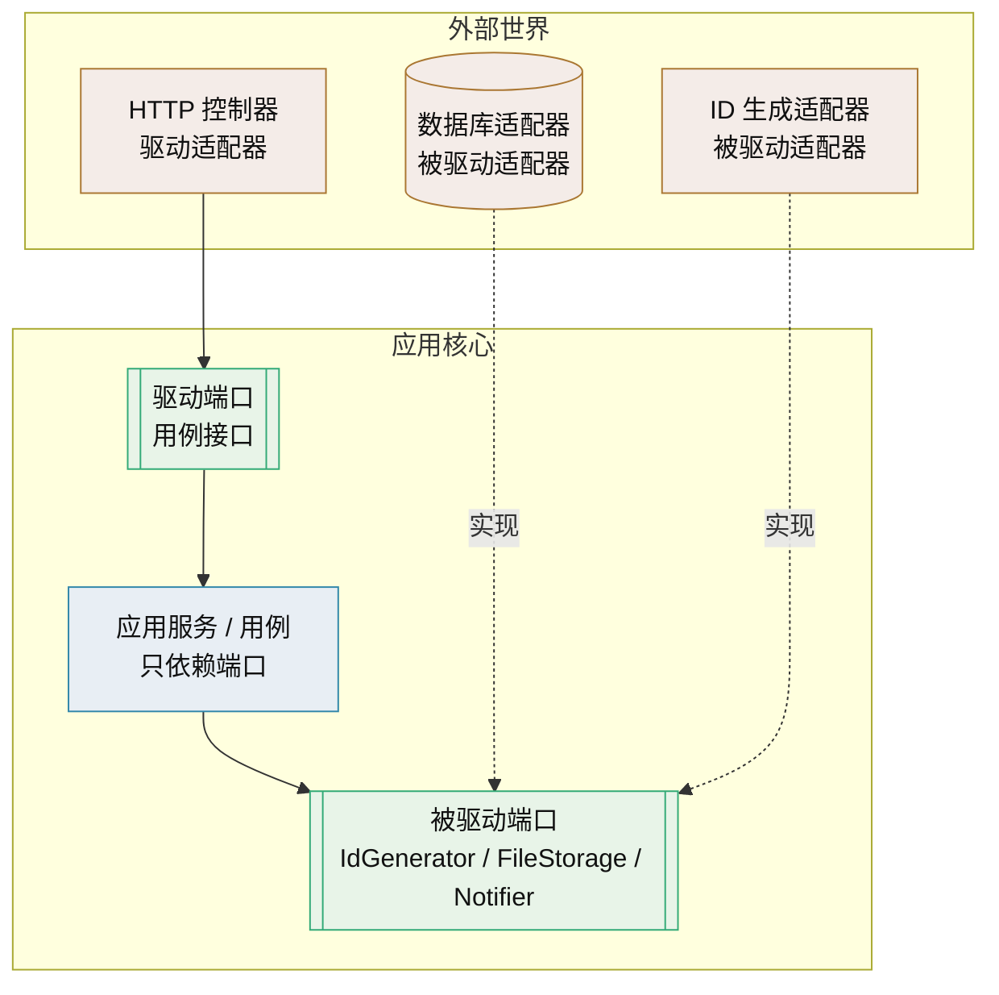

# 端口适配器技术介绍

> 六边形架构 · 依赖倒置 · 可替换实现的理论依据

[文档首页](../../../文档首页.md) › [知识档案](../技术栈知识档案总览.md) › [插件化架构](../技术栈知识档案总览.md#plugin) › 端口适配器技术介绍　|　[← 返回总览](01_插件化架构_总览.md)

---

## 1. 技术概述 

**端口与适配器（Ports and Adapters）**，又叫**六边形架构**（Hexagonal Architecture），由 Alistair Cockburn 在 2005 年提出。它把应用分成「内」与「外」两层：内部是业务核心，外部是数据库、消息队列、HTTP 框架、第三方 SDK 等技术细节；两者只通过**端口**（接口契约）与**适配器**（实现）交互，依赖方向永远从外指向内。

- **定位**：可替换实现（插件化）的**理论模型**——解释了「为什么接口要由使用方定义、实现要在外面」，是插件化架构的原则层。
- **别名**：六边形架构、洋葱架构（Onion）、整洁架构（Clean Architecture）共享同一核心规则，只是画法不同。
- **核心规则**：依赖倒置——高层模块不依赖低层模块，两者都依赖抽象；抽象不依赖细节，细节依赖抽象。
- **适用**：业务逻辑复杂、外部集成多、需要独立测试与实现替换的系统；简单 CRUD 用传统分层即可。

## 2. 核心概念与原理 

| 概念 | 说明 |
| --- | --- |
| 端口（Port） | 应用与外界交互的**接口契约**，是一组操作的声明，不含技术细节。分驱动端口与被驱动端口 |
| 驱动端口（Driving / Primary） | 外部调用应用的入口，表达「我能做什么」，典型如应用服务接口、用例接口 |
| 被驱动端口（Driven / Secondary） | 应用调用外部的能力，表达「我需要什么」，典型如 `IdGenerator`、`FileStorage`、`Notifier` |
| 适配器（Adapter） | 端口的实现，把外部技术翻译成端口要求的形态；分驱动适配器与被驱动适配器 |
| 驱动适配器 | HTTP Controller、CLI、消息消费者——把外部请求转成对驱动端口的调用 |
| 被驱动适配器 | 数据库实现、第三方 API 客户端、内存实现（测试用）——实现被驱动端口 |
| 依赖倒置原则（DIP） | 高层不依赖低层、两者依赖抽象；SOLID 第五条，是端口的理论来源 |
| 依赖注入（DI） | 对象不自己创建依赖，由外部（容器/装配入口）注入；是实现 DIP 的手段，不等于 DIP |

**关键区分**：DI 是「怎么把实现塞进来」的机制，DIP 是「依赖应该指向抽象」的原则。用了 `@inject` 或 `Depends` 不代表解耦——注入的如果是具体类，仍与实现耦合。

**判断一个项目是不是端口适配器**，不看目录怎么分，看依赖规则：**删掉所有适配器代码后，核心层还能不能独立编译/导入并通过单测**。能，就是；不能，只是按目录摆了个形状。

## 3. 在本项目中的用途 

- **解释平台能力替换的边界**：平台的认证、权限、文件、通知、任务、ID 生成、缓存、对象存储、LLM 适配层等，本质都是**被驱动端口 + 多适配器**——接口由平台定义，实现可换（MinIO / 本地文件系统 / 其他 S3；外部大模型 API / 私有化端点）。
- **ID 生成器是否值得抽象**：这是本目录的起点。按 DIP 的务实判断，ID 生成器与时钟一样，抽象价值在于两点——①**算法可能被替换**（雪花换号段或 UUIDv7）；②**测试需要确定性**（固定序列可复现）。因此给它定义端口是合理的；详见《[IdGenerator 技术介绍](../后端核心/IdGenerator技术介绍.md)》与 [09 自建注册表](09_插件化架构_自建注册表.md)。
- **与配置驱动选择配合**：端口只解决「依赖抽象」，选哪个适配器由装配入口决定；本项目用 `config.toml` + 注册表实现（见 [10 配置驱动实现选择](10_插件化架构_配置驱动实现选择.md)）。
- **与产品扩展的对应**：平台对产品暴露的能力（`/api/v1`、事件、注册要素）也是「契约」，产品扩展包是实现方；统一机制见 [01 总览](01_插件化架构_总览.md)「与产品扩展接入统一机制」节。
- **避免过度抽象**：端口不是越多越好。为读配置建 `ConfigPort`、为取时间建 `ClockPort`、为生成 UUID 建 `IDGeneratorPort`，若无替换或测试诉求，收益微乎其微。

## 4. 与相关模式辨析 

| 模式 | 关注点 | 与端口适配器的关系 |
| --- | --- | --- |
| 传统分层架构 | 上层调用下层，单向依赖 | 端口适配器反转了「业务→数据库」的方向，让细节实现抽象 |
| 依赖注入（DI） | 对象如何获得依赖 | 实现 DIP 的手段；注入具体类仍耦合 |
| 策略模式（Strategy） | 同一算法的多种可互换实现 | 端口适配器中的「被驱动端口 + 多适配器」在类级别即策略模式 |
| 工厂 / 注册表 | 运行时按名称获得实现 | 策略的创建与查找方式，见 [09 自建注册表](09_插件化架构_自建注册表.md) |
| 六边形 / 洋葱 / 整洁架构 | 内外分离与依赖规则 | 同一核心思想的三种表述，规则一致 |

**选择建议**：本项目的插件化机制用「端口（抽象基类/Protocol）+ 注册表（策略/工厂）+ 装配入口」即可覆盖阶段一；不必为了理论完备而引入完整六边形目录结构。

## 5. 落地要点 

- **端口由使用方定义**：谁需要能力，谁定义接口；不要由实现方定义接口再让使用方适配。
- **接口只依赖领域类型与标准库**：端口里出现 SQL、HTTP、厂商 SDK 的 DTO，说明技术细节泄漏进了核心。
- **端口粒度适中**：按「能力」聚合，一个端口 3~7 个方法为宜；太粗难 mock，太细接口爆炸。
- **一个端口多个适配器**：生产适配器、内存/假适配器（测试）、降级适配器（外部不可用时）。
- **装配是唯一知道具体类型的地方**：`main`/启动装配入口把适配器注入端口使用方，其余代码只认接口。
- **用自动化约束依赖方向**：如 CI 中禁止 `services` 层直接导入具体适配器模块，防止规则腐化。
- **异步语义写进契约**：本项目为异步栈，端口方法须显式标注 `async`，避免插件阻塞事件循环（见 [04 接口契约设计](04_插件化架构_接口契约设计.md)）。

## 6. 常见问题与注意事项 

- **目录即架构的误解**：按 `domain/port/adapter` 分目录但核心层 `import` 了数据库驱动，不是六边形架构。
- **为每个外部调用建端口**：抽象爆炸，维护成本高于收益；只在「可能替换或需测试隔离」时建端口。
- **端口返回具体实现类型**：端口签名里出现具体类（而非抽象/领域类型），等于没抽象。
- **领域模型与 DTO 混淆**：核心层理解 HTTP 语义，最终仍被外部协议绑架。
- **贫血模型**：把业务规则全搬到应用服务、领域对象只剩 getter/setter，是端口适配器常见伴生病。
- **忽视合规与安全边界**：适配器负责协议转换，不应承担业务规则，也不应绕过平台的审计与租户隔离。

## 7. 学习与参考资料 

| 资源 | 网址 | 说明 |
| --- | --- | --- |
| Hexagonal Architecture（Alistair Cockburn） | https://alistair.cockburn.us/hexagonal-architecture/ | 端口与适配器的原始表述 |
| The Clean Architecture（Robert C. Martin） | https://blog.cleancoder.com/uncle-bob/2012/08/13/the-clean-architecture.html | 依赖规则与整洁架构 |
| 依赖倒置原则（SOLID） | https://en.wikipedia.org/wiki/Dependency_inversion_principle | DIP 定义与演化 |
| System Design Primer | https://github.com/donnemartin/system-design-primer | 架构模式系统梳理（含分层与解耦） |

## 8. 项目内关联文档 

| 文档 | 说明 |
| --- | --- |
| 《[01 插件化架构总览](01_插件化架构_总览.md)》 | 本目录总览与演进路线 |
| 《[04 接口契约设计](04_插件化架构_接口契约设计.md)》 | 端口的契约如何定义 |
| 《[09 自建注册表](09_插件化架构_自建注册表.md)》 | 端口的多实现如何注册与查找 |
| 《[10 配置驱动实现选择](10_插件化架构_配置驱动实现选择.md)》 | 装配入口如何按配置选适配器 |
| 《[LLM 适配层技术介绍](../后端核心/LLM适配层技术介绍.md)》 | 平台既有的「端口 + 配置切换实现」先例 |
| 《[IdGenerator 技术介绍](../后端核心/IdGenerator技术介绍.md)》 | ID 生成端口的多算法候选 |

---

> 依《[文档生成规范](../../../规范/文档生成规范.md)》编写
