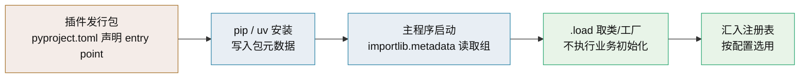

# EntryPoints 技术介绍

> importlib.metadata 入口点 · 安装即注册的标准发现机制

[文档首页](../../../文档首页.md) › [知识档案](../技术栈知识档案总览.md) › [插件化架构](../技术栈知识档案总览.md#plugin) › EntryPoints 技术介绍　|　[← 返回总览](01_插件化架构_总览.md)

---

## 1. 技术概述 <a id="overview"></a>

**Entry points（入口点）**是 Python 打包标准的组成部分：发行包在元数据里声明「我提供某个能力，实现在哪个模块的哪个对象」，主程序用标准库 `importlib.metadata` 按**入口点组（group）**读取并加载。它让插件「随包安装即被发现」，无需主程序维护插件清单。

- **定位**：Python 生态最标准的插件发现机制，被 pytest、tox、OpenStack、Sphinx 等广泛使用。
- **依赖**：仅标准库 `importlib.metadata`（Python 3.8+，3.10 起 API 更完善），无需第三方库；`importlib_metadata` 为 3.9 及以下的后向移植包。
- **核心概念**：组（group）相当于能力命名空间，条目名（name）是实现名，值（value）形如 `module:object`。

## 2. 核心概念与原理 <a id="principles"></a>

| 概念 | 说明 |
| --- | --- |
| 入口点组（group） | 能力命名空间，如 `bms.plugins.id_generator`；一个组对应一种可替换能力 |
| 入口点名（name） | 实现名，如 `snowflake`、`segment`、`uuid7`；同组内应唯一 |
| 入口点值（value） | `模块:对象` 字符串，如 `bms_plugin_snowflake:IdGenerator` |
| `EntryPoint.load()` | 解析 value 并导入对象；失败抛 `ModuleNotFoundError` / `AttributeError` |
| 发现范围 | 当前 Python 环境中所有**已安装**且声明了该组的发行包 |

**声明方式（`pyproject.toml`，现代推荐）**：

```toml
[project]
name = "bms-plugin-snowflake"
version = "1.0.0"

[project.entry-points."bms.plugins.id_generator"]
snowflake = "bms_plugin_snowflake:IdGenerator"
```

**读取与加载（主程序侧）**：

```python
import sys
from importlib.metadata import entry_points

def load_group(group: str) -> dict:
    # 跨版本兼容：3.12+ / 3.10–3.11 / <3.10
    if sys.version_info >= (3, 12):
        eps = entry_points(group=group)
    elif sys.version_info >= (3, 10):
        eps = entry_points().select(group=group)
    else:
        eps = entry_points().get(group, [])

    registry = {}
    for ep in eps:
        try:
            registry[ep.name] = ep.load()   # 仅加载类/工厂，不实例化
        except Exception as exc:
            print(f"[plugin] {ep.name} 加载失败：{exc}")
    return registry
```



## 3. 在本项目中的用途 <a id="usage"></a>

- **ID 生成实现的可插拔候选**：为 `bms.plugins.id_generator` 组注册 `snowflake` / `segment` / `uuid7` 等实现，主程序按 `config.toml` 选用（见 [09 配置驱动实现选择](09_插件化架构_配置驱动实现选择.md)）。
- **平台能力扩展**：缓存、对象存储、通知渠道、认证后端、LLM 适配层等均可用同一约定分组，形成统一的插件命名空间（`bms.plugins.*`）。
- **产品扩展包发现**：产品（biz、cw）扩展包可声明入口点，平台按受控组发现并装配路由/模型/任务/事件，与显式注册表并用。
- **与注册表的关系**：entry points 负责「发现」，注册表负责「按名查找与按配置选用」，二者分工明确（见 [08 自建注册表](08_插件化架构_自建注册表.md)）。

## 4. 与 Stevedore 的区别 <a id="compare"></a>

| 维度 | EntryPoints（标准库） | Stevedore |
| --- | --- | --- |
| 定位 | 发现机制本身 | 建立在 entry points 之上的驱动/扩展管理器 |
| 依赖 | 无（标准库） | 第三方库 |
| 缓存/懒加载 | 需自行实现 | 内置 |
| 驱动管理 | 需自行实现 | `DriverManager` 现成 |
| 适用 | 自建轻量注册表 | 多驱动、需缓存与生命周期管理 |

选择建议：阶段一/二用标准库 + 自建注册表即可；需要复杂驱动管理与启动性能优化时再评估 Stevedore（见 [07 Stevedore](07_插件化架构_Stevedore.md)）。

## 5. 常见问题与注意事项 <a id="pitfalls"></a>

- **版本 API 差异**：3.10 前 `entry_points()` 返回 dict-like，须 `.get(group)`；3.10–3.11 用 `.select(group=...)`；3.12+ 直接 `entry_points(group=...)`。不兼容处理会静默拿不到插件。
- **未安装即不可见**：entry points 来自包元数据，源码目录直接运行（未安装）时发现不到；开发期用可编辑安装（`uv pip install -e .`）。
- **发现即执行**：`ep.load()` 会导入模块，若模块顶层有副作用（连库、起线程）会在发现阶段触发；约定模块顶层只放定义。
- **异常吞掉**：逐个 `try/except` 并**留日志**，否则插件损坏后无声消失。
- **名称不唯一**：同组同名导致覆盖；装配阶段做唯一性校验。
- **安全边界**：entry points 是「安装即信任」，第三方包一旦装上即被加载；不可信插件走隔离方案。

## 6. 学习与参考资料 <a id="learn"></a>

| 资源 | 网址 | 说明 |
| --- | --- | --- |
| Entry points 规范 | https://packaging.python.org/en/latest/specifications/entry-points/ | 权威格式定义 |
| importlib.metadata 文档 | https://docs.python.org/3/library/importlib.metadata.html | `entry_points()` 与 `EntryPoint` |
| Creating and discovering plugins | https://packaging.python.org/en/latest/guides/creating-and-discovering-plugins/ | 官方发现指南 |
| setuptools 入口点指南 | https://setuptools.pypa.io/en/latest/userguide/entry_point.html | 声明与打包细节 |

## 7. 项目内关联文档 <a id="related"></a>

| 文档 | 说明 |
| --- | --- |
| 《[04 插件发现机制](04_插件化架构_插件发现机制.md)》 | 三种发现方式总述与对比 |
| 《[07 Stevedore](07_插件化架构_Stevedore.md)》 | 基于入口点的驱动管理器 |
| 《[08 自建注册表](08_插件化架构_自建注册表.md)》 | 发现结果如何注册与选用 |
| 《[12 第三方插件生态](12_插件化架构_第三方插件生态.md)》 | 自动发现后的隔离与兼容 |
| 《[uv 技术介绍](../工程化与质量/uv技术介绍.md)》 | 安装第三方插件包的包管理工具 |

---

> 依《[文档生成规范](../../../规范/文档生成规范.md)》编写
