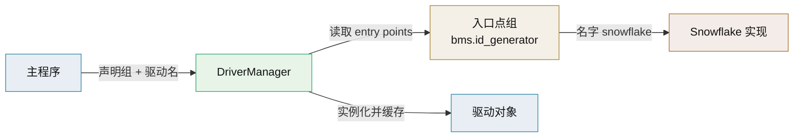

# Stevedore 技术介绍

> OpenStack 驱动/扩展管理器 · 基于入口点的加载与缓存

[文档首页](../../../文档首页.md) › [知识档案](../技术栈知识档案总览.md) › [插件化架构](../技术栈知识档案总览.md#plugin) › Stevedore 技术介绍　|　[← 返回总览](01_插件化架构_总览.md)

---

## 1. 技术概述 <a id="overview"></a>

**Stevedore** 是 OpenStack 社区维护的插件/驱动管理库，建立在 Python 入口点（entry points）之上：你只声明「用哪个入口点组」，Stevedore 负责发现、加载、缓存与按需实例化，并区分「扩展」（`ExtensionManager`）与「驱动」（`DriverManager`）两种形态。它解决的是入口点用起来「重复、易错、启动慢」的问题。

- **定位**：企业级入口点管理，适合管理多种后端驱动且对启动性能敏感的系统。
- **语言/许可**：Python；Apache-2.0。
- **关键 API**：`ExtensionManager`、`DriverManager`、`EnabledExtensionManager`、`NamedExtensionManager`。

## 2. 核心概念与原理 <a id="principles"></a>

| 概念 | 说明 |
| --- | --- |
| 扩展（Extension） | 一个入口点指向的类/工厂，抽象出统一的 `name / entry_point / plugin / obj` |
| ExtensionManager | 加载一个组内**全部**扩展，供遍历/多选 |
| DriverManager | 从组内按名字**单选**一个驱动并实例化，语义即「可替换后端」 |
| EnabledExtensionManager | 按条件过滤可用扩展（如依赖是否满足） |
| NamedExtensionManager | 只加载指定名字的扩展集合 |
| 懒加载与缓存 | 支持按需加载，避免启动时全部导入，改善冷启动 |

```python
from stevedore import driver

# 从组 "bms.id_generator" 中按名字取驱动并实例化
mgr = driver.DriverManager(
    namespace="bms.id_generator",
    name="snowflake",
    invoke_on_load=True,
    invoke_args=(),
)
generator = mgr.driver          # 已实例化的实现
```



## 3. 在本项目中的用途 <a id="usage"></a>

- **多驱动单选的现成方案**：平台若出现「同一能力多种外部后端（如多种对象存储、多种通知渠道）」且希望省去自建注册表的工作量，Stevedore 的 `DriverManager` 是直接候选。
- **启动性能优化**：平台组件多、插件多时，懒加载与缓存可减少启动时的导入开销（对比 `importlib.metadata` 每次遍历）。
- **与产品扩展接入**：产品扩展包若以「驱动」形态提供，可按名字选用；与 entry points 方案同源，迁移成本低。
- **当前取舍**：阶段一/二平台内建实现用自建注册表已足够；引入 Stevedore 属「第三方依赖换开发量」，按项目「薄封装、少依赖」取向需谨慎评估（见 [09 自建注册表](09_插件化架构_自建注册表.md)）。

## 4. 与 EntryPoints / Pluggy 对比 <a id="compare"></a>

| 维度 | Stevedore | 标准库 EntryPoints | Pluggy |
| --- | --- | --- | --- |
| 定位 | 驱动/扩展管理器 | 发现机制 | 钩子框架 |
| 单选驱动 | `DriverManager` 现成 | 自行实现 | `firstresult=True` |
| 多扩展遍历 | `ExtensionManager` | 自行遍历 | 广播钩子 |
| 懒加载/缓存 | 内置 | 自行实现 | 不涉及 |
| 依赖 | 第三方 | 无 | 无 |
| 适合 | 多驱动、启动敏感 | 轻量自建 | 多插件叠加扩展点 |

## 5. 常见问题与注意事项 <a id="pitfalls"></a>

- **仍依赖入口点**：Stevedore 不改变「需安装且声明入口点」的前提；未安装即发现不到。
- **namespace 命名**：组名要稳定且全局唯一（如 `bms.id_generator`），避免与第三方组冲突。
- **实例化时机**：`invoke_on_load` 会在管理时实例化，仍应避免在构造函数里连外部服务；初始化放生命周期钩子。
- **异常处理**：驱动加载失败需捕获并降级/告警，不能拖垮启动。
- **版本范围**：组合 `EnabledExtensionManager` 做版本/依赖过滤，防止不兼容驱动被选中。
- **依赖成本**：引入即多一个需要 Renovate 跟踪升级的依赖，评估收益后再用。

## 6. 学习与参考资料 <a id="learn"></a>

| 资源 | 网址 | 说明 |
| --- | --- | --- |
| Stevedore 官方文档 | https://docs.openstack.org/stevedore/ | 概念、API 与示例 |
| Stevedore PyPI | https://pypi.org/project/stevedore/ | 版本与依赖信息 |
| Entry points 规范 | https://packaging.python.org/en/latest/specifications/entry-points/ | 底层机制 |
| OpenStack 插件文档 | https://docs.openstack.org/ | 真实大规模使用场景 |

## 7. 项目内关联文档 <a id="related"></a>

| 文档 | 说明 |
| --- | --- |
| 《[06 EntryPoints](06_插件化架构_EntryPoints.md)》 | Stevedore 的底层发现机制 |
| 《[07 Pluggy](07_插件化架构_Pluggy.md)》 | 钩子式方案对比 |
| 《[09 自建注册表](09_插件化架构_自建注册表.md)》 | 零依赖替代方案 |
| 《[Renovate 技术介绍](../部署与运维/Renovate技术介绍.md)》 | 引入第三方依赖后的自动升级 |

---

> 依《[文档生成规范](../../../规范/文档生成规范.md)》编写
