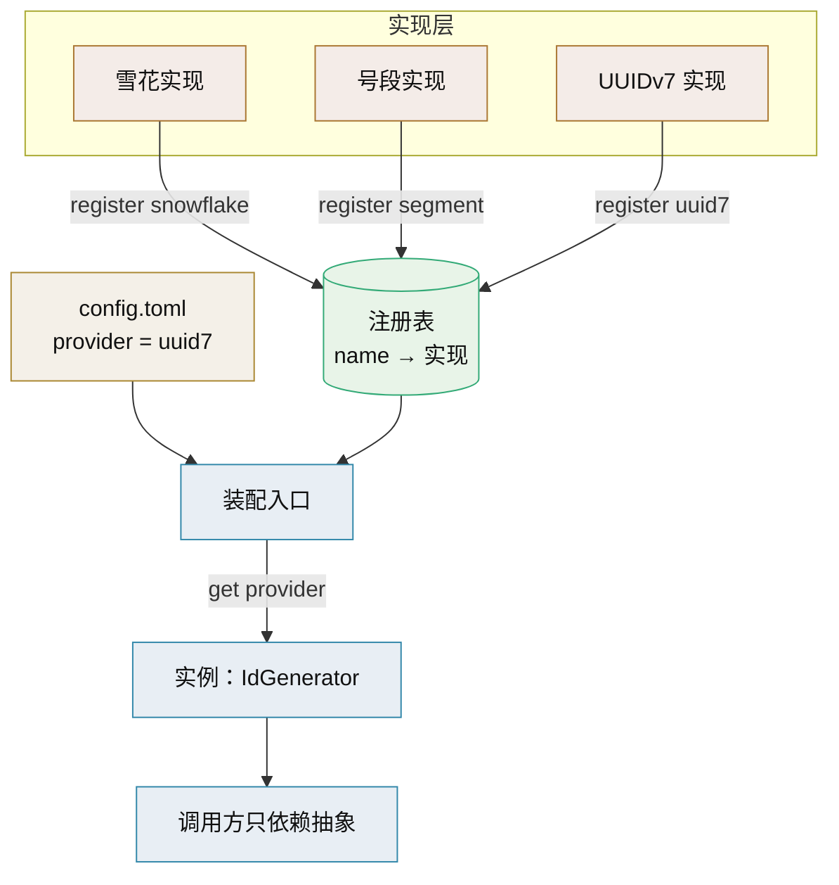

# 自建注册表技术介绍

> 显式注册表 + 策略 + 工厂 · 零依赖的实现可插拔

[文档首页](../../../文档首页.md) › [知识档案](../技术栈知识档案总览.md) › [插件化架构](../技术栈知识档案总览.md#plugin) › 自建注册表技术介绍　|　[← 返回总览](01_插件化架构_总览.md)

---

## 1. 技术概述 <a id="overview"></a>

**自建注册表**是插件化最朴素也最可控的落地方式：主程序维护一张「名称 → 实现类/工厂」的映射表，各实现在启动时**显式注册**进表，运行时按配置或参数从表中查找并实例化。它不需要任何第三方库，不依赖入口点安装，适合单体应用内「平台内建多实现、按配置切换」的场景。

- **定位**：阶段一/二的默认方案，也是理解 entry points / pluggy / stevedore 的底座。
- **组成**：策略模式（同一能力的多种实现）+ 工厂/注册表（按名创建）+ 装配入口（按配置选用）。
- **优点**：零依赖、发现范围完全可控、调试直观、启动即校验唯一性。
- **代价**：扩展新实现需改主程序注册代码（阶段三的「第三方安装即发现」需叠加入口点机制）。

## 2. 核心概念与原理 <a id="principles"></a>

| 概念 | 说明 |
| --- | --- |
| 策略（Strategy） | 定义一族可互换算法，各自封装，客户端不感知具体实现 |
| 注册表（Registry） | 名称到实现（类/工厂）的映射，是查找唯一依据 |
| 工厂（Factory） | 按名称取出实现并实例化，可带参数、缓存实例 |
| 装配入口（Composition Root） | 唯一知道全部具体类型的地方，按配置把实现注入使用方 |
| 注册时机 | 启动导入各实现模块时自注册；或由装配入口集中登记 |
| 唯一性校验 | 注册时检测重名，冲突立即失败，不静默覆盖 |
| 契约测试 | 每个注册实现都跑同一组测试，保证可替换 |



## 3. 在本项目中的用途 <a id="usage"></a>

- **ID 生成实现的替换**：以 `IdGenerator` 端口为例注册 `snowflake` / `segment` / `uuid7`，`config.toml` 选一，业务代码只调抽象（见 [09 配置驱动实现选择](09_插件化架构_配置驱动实现选择.md)）。
- **其他平台能力**：文件存储（MinIO / 本地）、通知渠道（邮件 / 短信 / 企业微信）、缓存后端、认证后端、LLM 适配层，均可套用同一模式。
- **产品扩展的登记**：产品模块的注册要素（表前缀/错误码段/事件域）沿用「注册 + 唯一性校验 + CI 拒绝冲突」的思路，与能力注册同构。
- **不引入新依赖**：契合项目「薄封装、少依赖」取向，也便于国产化/内网环境离线部署。

## 4. 最小可用实现（可直接套用） <a id="impl"></a>

```python
# app/core/registry.py —— 通用注册表（零依赖）
from typing import Callable, Generic, TypeVar

T = TypeVar("T")

class Registry(Generic[T]):
    def __init__(self, kind: str):
        self.kind = kind
        self._impls: dict[str, Callable[..., T]] = {}

    def register(self, name: str):
        def deco(cls_or_factory: Callable[..., T]) -> Callable[..., T]:
            key = name.strip().lower()
            if key in self._impls:
                raise RuntimeError(f"{self.kind} 实现重名：{key}")
            self._impls[key] = cls_or_factory
            return cls_or_factory
        return deco

    def create(self, name: str, **kwargs) -> T:
        key = name.strip().lower()
        if key not in self._impls:
            raise KeyError(f"未注册的 {self.kind} 实现：{key}（可选：{sorted(self._impls)}）")
        factory = self._impls[key]
        return factory(**kwargs)

    def names(self) -> list[str]:
        return sorted(self._impls)

# 能力注册表
id_generators: Registry[IdGenerator] = Registry("id_generator")
```

```python
# app/plugins/id_generator.py —— 端口 + 实现
from abc import ABC, abstractmethod
from app.core.registry import id_generators

class IdGenerator(ABC):
    @abstractmethod
    async def next_id(self) -> int: ...

@id_generators.register("snowflake")
class SnowflakeIdGenerator(IdGenerator):
    def __init__(self, worker_id: int):
        from yitter.idgenerator import IdGenerator as Yitter
        self._gen = Yitter(worker_id)
    async def next_id(self) -> int:
        return self._gen.get_id()

@id_generators.register("uuid7")
class Uuid7IdGenerator(IdGenerator):
    async def next_id(self) -> int:
        import uuid
        return uuid.uuid7().int
```

```python
# app/core/wiring.py —— 装配入口（唯一知道具体配置的地方）
from app.core.config import settings
from app.core.registry import id_generators

def build_id_generator() -> "IdGenerator":
    return id_generators.create(settings.id_generator.provider,
                                **settings.id_generator.options)
```

```toml
# config.toml
[id_generator]
provider = "snowflake"          # snowflake | segment | uuid7
options = { worker_id = 1 }
```

> 这样「换算法」= 改一行 `provider`；新增算法 = 加一个 `@id_generators.register(...)` 的类，调用方零改动。

## 5. 设计要点 <a id="practice"></a>

- **注册名稳定且小写**：作为外部可配置项，注册名是对外契约，改名属破坏性变更。
- **注册即校验**：重名、缺失依赖、契约不符在启动（或导入）阶段失败，别留到运行期。
- **工厂支持参数**：从 `config.toml` 读 `options` 透传给实现，参数名与默认值写进契约文档。
- **实例生命周期**：无状态实现可复用单例；有状态/需连接的实现走 [11 生命周期与热插拔](11_插件化架构_生命周期与热插拔.md) 管理。
- **延迟导入重依赖**：实现内部的第三方依赖在方法内或懒加载，避免未选用的实现也拖入依赖。
- **与入口点叠加**：阶段三可在启动时先把入口点发现的实现也注册进同一注册表，实现「内建 + 第三方」共存。
- **失败快速且可读**：未注册时报错信息带上可选列表，便于运维排障。

## 6. 常见问题与注意事项 <a id="pitfalls"></a>

- **静默覆盖**：多个模块注册同名实现，后注册者覆盖前者；必须在 `register` 里检查重名。
- **注册顺序依赖**：把「取实例」写在「注册」之前（模块导入顺序不佳）会取不到；注册集中在装配前的导入区。
- **把配置直接读进实现**：实现不应自己读全局配置，参数由装配入口传入，保证可测试。
- **注册表变全局可变状态**：测试间相互污染；测试用独立注册表或提供 reset。
- **忘记契约测试**：多实现只测常用的那个，切换时才暴露差异。
- **端口与注册表耦合**：实现模块 `import` 注册表没问题，但核心业务不应 `import` 具体实现模块。
- **过度泛型**：注册表做成「什么都能注册」的大杂烩，实际削弱了类型与边界；按能力分多个注册表。

## 7. 学习与参考资料 <a id="learn"></a>

| 资源 | 网址 | 说明 |
| --- | --- | --- |
| Python 官方指南：插件发现 | https://packaging.python.org/en/latest/guides/creating-and-discovering-plugins/ | 发现方式与注册思路 |
| abc 模块文档 | https://docs.python.org/3/library/abc.html | 端口抽象基类 |
| Registry 模式（FastAPI 策略注册示例） | https://medium.com/@snehal.shelar/build-dynamic-behavior-registry-based-strategy-for-scalable-fastapi-app-3e74c1f5952e | 注册表 + 策略的实战写法 |
| Python 设计模式参考 | https://refactoring.guru/design-patterns/strategy | 策略与工厂模式 |

## 8. 项目内关联文档 <a id="related"></a>

| 文档 | 说明 |
| --- | --- |
| 《[02 端口适配器](02_插件化架构_端口适配器.md)》 | 端口与实现分离的理论 |
| 《[03 接口契约设计](03_插件化架构_接口契约设计.md)》 | 注册对象的契约定义 |
| 《[05 EntryPoints](05_插件化架构_EntryPoints.md)》 | 阶段三叠加的自动发现 |
| 《[09 配置驱动实现选择](09_插件化架构_配置驱动实现选择.md)》 | 装配入口如何按配置选用 |
| 《[11 生命周期与热插拔](11_插件化架构_生命周期与热插拔.md)》 | 有状态实现的启停管理 |
| 《[IdGenerator 技术介绍](../后端核心/IdGenerator技术介绍.md)》 | ID 生成候选算法 |

---

> 依《[文档生成规范](../../../规范/文档生成规范.md)》编写
