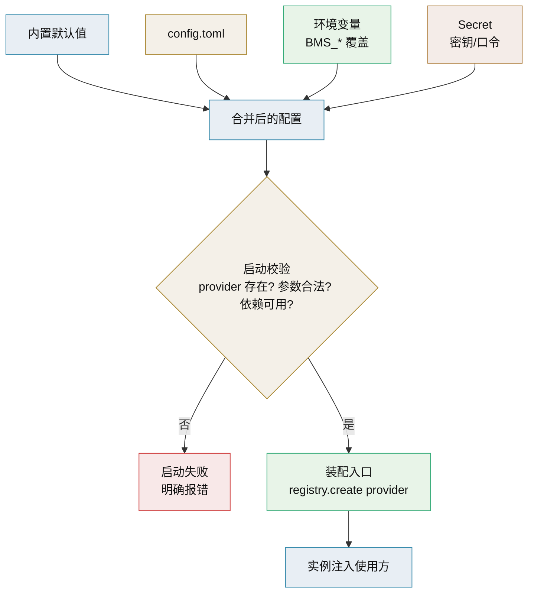

# 配置驱动实现选择技术介绍

> config.toml + 环境变量 · 按配置装配实现（阶段一）

[文档首页](../../../文档首页.md) › [知识档案](../技术栈知识档案总览.md) › [插件化架构](../技术栈知识档案总览.md#plugin) › 配置驱动实现选择技术介绍　|　[← 返回总览](01_插件化架构_总览.md)

---

## 1. 技术概述 <a id="overview"></a>

**配置驱动的实现选择**是阶段一「随插随用」的落地形态：平台内建多种实现，用配置文件选定当前使用哪一种，应用启动时按配置装配。它把「换实现」从「改代码 + 重新理解调用链」降为「改一行配置 + 重启」，是成本最低、风险最小的插件化入口。

- **定位**：插件化三阶段中的**阶段一**，适用于平台内建实现之间的切换。
- **配置载体**：本项目用 `config.toml` 分层 + 环境变量覆盖，密钥走 Secret 管理，遵循 12-factor。
- **生效时机**：启动时读取并装配，**重启生效**；运行中不切换（运行中切换属阶段二，见 [12 生命周期与热插拔](12_插件化架构_生命周期与热插拔.md)）。
- **配套**：[自建注册表](09_插件化架构_自建注册表.md) 提供实现查找，[FastAPI 集成](11_插件化架构_FastAPI集成.md) 提供装配挂载点。

## 2. 核心概念与原理 <a id="principles"></a>

| 概念 | 说明 |
| --- | --- |
| Provider（提供方） | 配置中指定的实现名，如 `provider = "snowflake"` |
| Options（参数） | 传给实现的构造参数，如 `worker_id`、`endpoint` |
| 分层配置 | 默认值（内置）← 配置文件（`config.toml`）← 环境变量（最高优先级） |
| 环境覆盖 | 部署时用环境变量覆盖敏感/差异化项，避免把值写死进镜像 |
| Secret 管理 | 密钥、口令只走 Secret（环境变量/密钥文件），不进配置文件、不进日志 |
| 装配校验 | 启动时校验 provider 存在、参数合法、依赖可用，失败即拒绝启动 |
| 配置契约 | provider 名与 options 键是配置对运维的承诺，改名/改语义属破坏性变更 |



## 3. 在本项目中的用途 <a id="usage"></a>

- **ID 生成切换**：`[id_generator] provider = "snowflake"`，需要换算法时改为 `segment` / `uuid7`，重启生效。
- **环境差异化**：开发用内存/本地实现，测试用可控实现（确定性 ID），生产用外部服务实现。
- **平台能力统一口径**：对象存储、通知渠道、认证后端、LLM 适配层都遵循「provider + options + Secret」的同一套配置约定。
- **与《[TOML 技术介绍](../后端核心/TOML技术介绍.md)》一致**：沿用现有 `config.toml` 与 `BMS_*` 环境变量覆盖机制，不新造配置体系。
- **产品扩展的启停**：产品模块的启用/停用走配置或注册表开关，与能力 provider 选择同源。

## 4. 配置结构示例 <a id="sample"></a>

```toml
# config.toml —— 能力实现选择（片段）

[id_generator]
provider = "snowflake"                 # snowflake | segment | uuid7
options = { worker_id = 1, seq_bit_length = 6 }

[storage]
provider = "minio"                       # minio | local
options = { bucket = "bms" }

[notify]
provider = "email"                       # email | sms | wecom
options = { from = "noreply@example.com" }

[ai]
provider = "openai_compatible"           # openai_compatible | ollama
options = { endpoint = "https://api.deepseek.com", model = "deepseek-chat" }

# 密钥不写此处：走环境变量 / Secret
# BMS_AI_API_KEY、BMS_STORAGE_SECRET_KEY 等
```

```python
# app/core/config.py（Pydantic Settings 风格，示意）
from pydantic import BaseModel
from pydantic_settings import BaseSettings, SettingsConfigDict

class CapabilityConfig(BaseModel):
    provider: str
    options: dict = {}

class Settings(BaseSettings):
    model_config = SettingsConfigDict(env_prefix="BMS_", env_nested_delimiter="__")
    id_generator: CapabilityConfig
    storage: CapabilityConfig
    notify: CapabilityConfig
    ai: CapabilityConfig
```

```python
# app/core/wiring.py —— 装配与校验
from app.core.config import settings
from app.core.registry import id_generators

def build_id_generator():
    name = settings.id_generator.provider
    if name not in id_generators.names():
        raise RuntimeError(f"未知的 id_generator.provider={name}，可选：{id_generators.names()}")
    return id_generators.create(name, **settings.id_generator.options)
```

## 5. 设计要点 <a id="practice"></a>

- **provider 名即契约**：作为运维可配置项，需稳定、小写、无歧义；改名要公告与迁移。
- **options 带默认值**：非必填参数给默认，降低配置负担；必填参数启动校验缺失即失败。
- **启动即校验、失败即拒启**：宁可启动失败，也不要在第一次调用时才发现 provider 配错。
- **Secret 与配置分离**：密钥只走环境变量/密钥文件；配置文件中只放非敏感项（见《[安全开发规范](../../../规范/安全开发规范.md)》）。
- **环境变量覆盖规则固定**：`BMS_` 前缀 + 嵌套分隔符，文档化，避免每处各写一套。
- **配置可观测**：启动日志打印「各能力当前 provider（不含密钥）」，便于确认装配结果。
- **不做隐式回退**：provider 缺失/非法应显式失败，而不是悄悄用默认实现，避免「以为换了其实没换」。
- **与阶段二衔接**：配置结构预留「运行时可改」的能力位，但阶段一不实现热更新，避免语义混乱。

## 6. 常见问题与注意事项 <a id="pitfalls"></a>

- **改了配置没生效**：阶段一是重启生效；误以为热更新会导致排障方向错误。
- **密钥进了配置文件**：违反 Secret 管理，泄漏风险；配置里只留占位与非敏感项。
- **provider 拼错静默使用默认**：未做校验时最危险，必须显式校验并拒绝。
- **options 类型不校验**：字符串 `"1"` 当整数用导致运行期错误；用 Pydantic 校验类型。
- **环境覆盖优先级不清**：多处定义同一项时以哪层为准要有唯一规则并文档化。
- **开发/生产配置漂移**：用同一套配置结构 + 环境覆盖，避免两套完全不同的文件。
- **版本升级后 provider 下线**：能力下线属破坏性变更，需公告、迁移与过渡期（对齐平台契约承诺口径）。

## 7. 学习与参考资料 <a id="learn"></a>

| 资源 | 网址 | 说明 |
| --- | --- | --- |
| TOML 官方规范 | https://toml.io/ | 配置文件格式 |
| 12-factor：Config | https://12factor.net/config | 配置与环境的分离原则 |
| Pydantic Settings 文档 | https://docs.pydantic.dev/latest/concepts/pydantic_settings/ | 配置模型与校验 |
| Python configparser 文档 | https://docs.python.org/3/library/configparser.html | 传统配置解析（对比 TOML） |

## 8. 项目内关联文档 <a id="related"></a>

| 文档 | 说明 |
| --- | --- |
| 《[09 自建注册表](09_插件化架构_自建注册表.md)》 | 按 provider 名查找实现 |
| 《[11 FastAPI 集成](11_插件化架构_FastAPI集成.md)》 | 装配结果如何注入 FastAPI |
| 《[12 生命周期与热插拔](12_插件化架构_生命周期与热插拔.md)》 | 阶段二的运行时切换 |
| 《[TOML 技术介绍](../后端核心/TOML技术介绍.md)》 | 本项目配置格式 |
| 平台《项目规划说明》 | 配置与密钥管理、环境与配置口径（平台专属文档） |

---

> 依《[文档生成规范](../../../规范/文档生成规范.md)》编写
