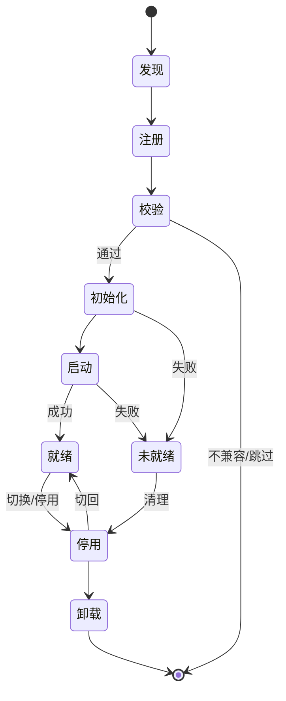
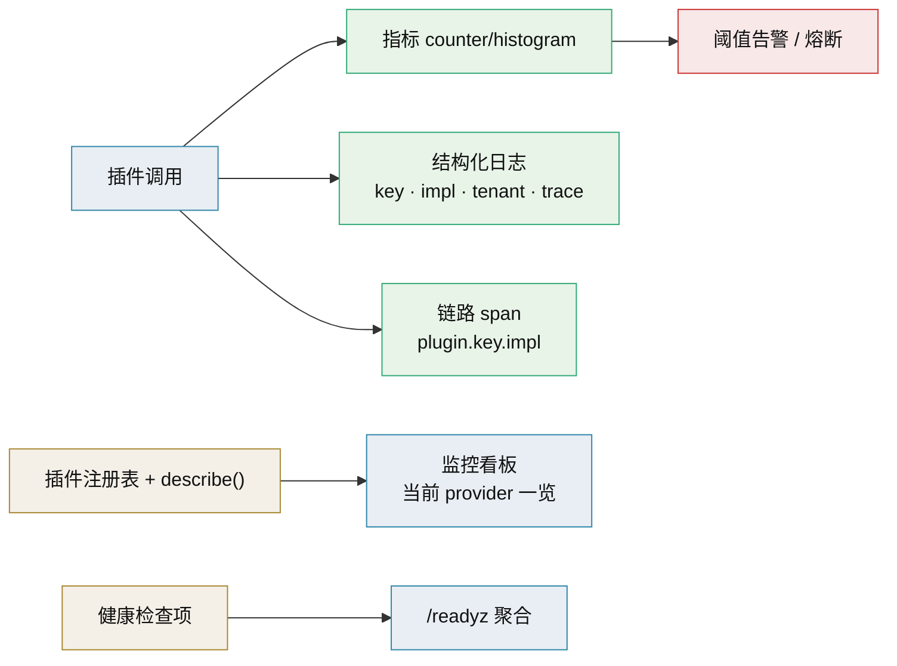

# 生命周期与热插拔技术介绍

> 插件装配 · 启停与运行中切换 · 隔离与降级（阶段二）

[文档首页](../../../文档首页.md) › [知识档案](../技术栈知识档案总览.md) › [插件化架构](../技术栈知识档案总览.md#plugin) › 生命周期与热插拔技术介绍　|　[← 返回总览](01_插件化架构_总览.md)

---

## 1. 技术概述 <a id="overview"></a>

**生命周期管理**规定插件从「被加载」到「被卸载」各阶段该做什么：发现、注册、校验、初始化、启动、就绪、停用、释放。**热插拔**是它的进阶形态：应用不重启，运行中启停插件或切换实现。阶段一只需要「启动装配」；阶段二引入运行中切换，复杂度与风险显著上升，必须配套状态迁移、并发安全与灰度回滚。

- **定位**：插件化三阶段中的**阶段二**，把「改配置重启」升级为「运行中切换」。
- **核心难点**：不是「怎么换代码」，而是「怎么保证切换瞬间在途请求、内存状态、外部连接不出错」。
- **推荐路径**：先做到「插件可启停」，再做到「同能力多实现按开关切换」，最后才做「灰度切流」。

## 2. 生命周期阶段 <a id="stages"></a>

| 阶段 | 动作 | 失败处理 |
| --- | --- | --- |
| 发现（Discover） | 读取注册表 / 入口点，得到候选实现 | 单个发现失败仅告警，不中断 |
| 注册（Register） | 写入注册表，校验唯一性 | 重名/冲突立即失败 |
| 校验（Validate） | 契约、版本范围、依赖可用性 | 不满足则跳过并告警 |
| 初始化（Init） | 构造实例、建立连接、加载资源 | 失败则标记不可用 |
| 启动（Start） | 启动后台任务、订阅、连接就绪 | 失败则回退到上一实现或降级 |
| 就绪（Ready） | 纳入可用列表，开始承接流量 | — |
| 停用（Stop） | 摘除流量、停止后台任务、关闭连接 | 超时强制释放 |
| 卸载（Unload） | 从注册表移除（必要时） | 记录残留 |



## 3. 热插拔的实现要点 <a id="hotswap"></a>

- **原子替换引用**：把「当前实现」放在一个可原子替换的引用/容器里，切换即替换引用，读取方无锁；Python 中可用 `contextvars` 或受控的字典赋值。
- **在途请求**：采用「优雅切换」——新请求走新实现，在途请求走旧实现直至结束（引用计数/宽限期），再停旧实现。
- **状态迁移**：有状态实现（连接池、内存缓冲）切换时需处理状态；无状态实现可无缝替换，优先设计成无状态。
- **回滚**：切换失败或健康检查不通过时自动切回上一实现；保留上一实现的引用与配置。
- **幂等与重试**：切换过程的操作应幂等，失败可安全重试。
- **并发安全**：切换与读取并发时，避免半初始化对象被读取；先初始化到就绪再替换引用。
- **健康检查**：切换后探测新实现（轻量探针），通过才摘除旧实现。

```python
# 切换的示意：先就绪新实现，再原子替换，最后优雅停旧实现
class ProviderHolder(Generic[T]):
    def __init__(self, current: T):
        self._current = current

    @property
    def current(self) -> T:
        return self._current

    async def swap(self, new_impl: T) -> None:
        await start(new_impl)          # 1. 新实现启动并就绪
        old = self._current
        self._current = new_impl       # 2. 原子替换引用
        await drain_and_stop(old)      # 3. 在途走完再停旧实现
```

## 4. 隔离与降级 <a id="isolation"></a>

- **异常隔离**：插件方法调用统一 `try/except`，异常按统一错误码上抛，但不得让插件异常导致主流程崩溃；对第三方插件更要强制隔离。
- **超时与熔断**：给插件调用设超时；连续失败达阈值自动熔断并降级到备用实现。
- **降级实现**：每个关键能力应有备用/兜底实现（如本地缓存、同步回退），配置里可指定 fallback provider。
- **资源配额**：插件的连接、任务、内存纳入平台管控，防止单个插件拖垮共享资源。
- **不可信插件**：进程内无沙箱，第三方插件若不可信，必须进程或容器隔离（见 [13 第三方插件生态](13_插件化架构_第三方插件生态.md)）。

## 5. 可观测与治理 <a id="observability"></a>

插件「能装」还不够，运行期要「看得见、管得住」。平台已有的可观测基类（指标 `BaseMetrics`、链路 `BaseTracer`、健康检查注册表 `BaseHealthCheckRegistry`、结构化日志，见平台《后端基类清单》）可直接复用到插件侧。

| 主题 | 做法 | 产出 |
| --- | --- | --- |
| 插件清单 | `describe()` 汇总各能力 `plugin_key` + 已注册 `plugin_name` + 当前 provider | 一张「当前装配了哪些实现」的总账 |
| 版本矩阵 | 记录「平台版本 ↔ 契约版本 ↔ 插件版本」 | 升级前复核兼容 |
| 日志 | 结构化日志带 `plugin_key` / `plugin_name` / `tenant_id` / `trace_id` | 按插件维度检索 |
| 指标 | 调用次数、失败率、耗时直方图、降级/熔断计数（counter / histogram） | 阈值告警 |
| 链路 | 插件调用纳入 trace，span 标注能力与实现名 | 定位慢在哪一段 |
| 健康检查 | 各插件实现健康的检查项，经聚合进 `/readyz` | 依赖就绪可见 |
| 审计 | 记录「谁在何时把某能力切到了哪个实现」 | 变更留痕、合规 |
| 配额 | 连接 / 任务 / 并发 / 超时纳入平台管控 | 防单插件拖垮共享资源 |

**指标与告警建议**（示例口径）：

```python
# 每次插件调用前后打点（示意）
with tracer.span(f"plugin.{key}.{impl}"):
    try:
        result = await impl.call(...)
        metrics.counter("bms_plugin_calls_total", {"plugin": key, "impl": impl_name})
    except Exception:
        metrics.counter("bms_plugin_errors_total", {"plugin": key, "impl": impl_name})
        raise
```

**治理动作**：连续失败自动熔断并告警、异常插件运行中停用（见 3 节热插拔）、灰度期间对比新旧实现指标后决定是否全量、下线前确认无调用。清单与指标应能在「平台监控看板」上一眼看到每个能力当前用的是哪个实现。



## 6. 在本项目中的用途 <a id="usage"></a>

- **能力灰度切换**：ID 生成、存储、通知等能力运行中切换实现，用于灰度验证新算法/新后端，出问题快速回滚。
- **产品模块启停**：平台超管按租户启停产品模块（菜单与接口禁用、数据保留），本质是插件生命周期管理。
- **故障降级**：外部依赖（Redis、外部 API）不可用时切换到本地/内存降级实现，保证核心可用。
- **发布解耦**：插件启停与平台发布解耦，降低「改配置要停服」的代价。

## 7. 常见问题与注意事项 <a id="pitfalls"></a>

- **切换瞬间状态丢失**：有状态实现未做迁移即替换，导致数据错乱或丢失；优先无状态设计。
- **半初始化被读取**：先替换引用后初始化，读到未就绪对象；必须「先就绪后替换」。
- **在途请求被中断**：直接停旧实现导致在途请求失败；需宽限期/优雅排空。
- **缺少回滚**：新实现有问题却无法快速切回；保留旧实现与配置直到观察期结束。
- **热插拔被当成常态**：频繁切换带来复杂性与不确定性，能重启切换就重启切换。
- **测试不足**：热插拔路径要专项测试（并发、超时、回滚、排空），非主链路测试覆盖。
- **忽略可观测**：切换事件、耗时、失败率需打点，否则线上问题无迹可循。

## 8. 学习与参考资料 <a id="learn"></a>

| 资源 | 网址 | 说明 |
| --- | --- | --- |
| FastAPI Lifespan Events | https://fastapi.tiangolo.com/advanced/events/ | 启动/关闭钩子 |
| Python contextvars 文档 | https://docs.python.org/3/library/contextvars.html | 上下文隔离与原子替换参考 |
| Release It!（稳定性模式） | https://pragprog.com/titles/mnee2/release-it-second-edition/ | 熔断、降级、隔离经典 |
| 12-factor：Disposability | https://12factor.net/disposability | 优雅启动与关闭 |

## 9. 项目内关联文档 <a id="related"></a>

| 文档 | 说明 |
| --- | --- |
| 《[10 配置驱动实现选择](10_插件化架构_配置驱动实现选择.md)》 | 阶段一的启动装配 |
| 《[11 FastAPI 集成](11_插件化架构_FastAPI集成.md)》 | lifespan 挂载与资源释放 |
| 《[13 第三方插件生态](13_插件化架构_第三方插件生态.md)》 | 隔离与安全边界 |
| 《[04 接口契约设计](04_插件化架构_接口契约设计.md)》 | 生命周期契约与契约测试 |
| 平台《平台可扩展性规划》 | 产品停用/下线与运行期边界口径（平台专属文档） |

---

> 依《[文档生成规范](../../../规范/文档生成规范.md)》编写
