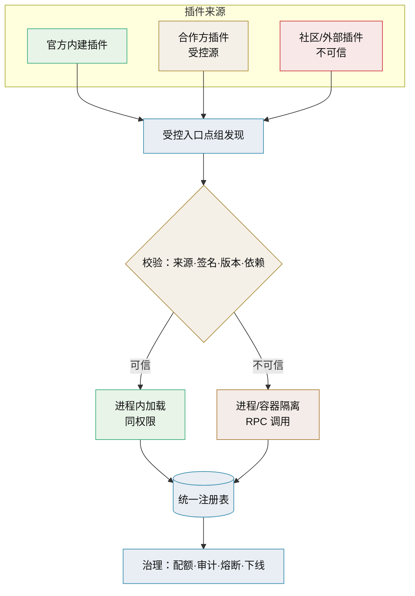

# 第三方插件生态技术介绍

> 安装即发现 · 安全隔离 · 版本兼容与生态治理（阶段三）

[文档首页](../../../文档首页.md) › [知识档案](../技术栈知识档案总览.md) › [插件化架构](../技术栈知识档案总览.md#plugin) › 第三方插件生态技术介绍　|　[← 返回总览](01_插件化架构_总览.md)

---

## 1. 技术概述 

**第三方插件生态**是插件化的最高阶段：平台之外的组织或个人可以开发插件，安装后平台自动发现并纳管。它把平台从「自己实现全部能力」变成「提供稳定的扩展契约与治理机制」。代价是引入了不可信代码、依赖冲突、版本兼容与安全边界等全新问题——**架构决策的重心从「能扩展」转向「可信地扩展」**。

- **定位**：插件化三阶段中的**阶段三**，在阶段一（契约 + 注册表）与阶段二（生命周期）之上叠加「外部来源」。
- **前提**：稳定的契约、受控的入口点组、隔离与兼容校验机制均已具备。
- **底线**：Python 进程内插件与主程序同权限，**不可信插件必须进程或容器隔离**，进程内方案只适用于可信来源。

## 2. 生态运行模型 

## 3. 安全与隔离 

| 风险 | 说明 | 对策 |
| --- | --- | --- |
| 任意代码执行 | 进程内插件拥有主程序全部权限 | 仅信任受控来源；不可信走进程/容器隔离 |
| 恶意入口点 | 非法模块路径注入 | 入口点组白名单 + 模块名正则校验 |
| 依赖投毒 | 插件引入恶意/过时依赖 | 受控索引、依赖锁定、漏洞扫描 |
| 密钥泄露 | 插件读取环境中的 Secret | 最小权限、独立凭据、隔离进程不继承全部环境 |
| 资源耗尽 | 插件占用大量 CPU/内存/连接 | 配额限制、超时、熔断 |
| 数据越界 | 插件访问其他租户/模块数据 | 强制租户隔离与权限校验，插件调用走平台接口 |

**隔离方式选择**：

- **进程内**：性能最好、实现最简单；仅限可信插件（官方/合作方受控源）。
- **独立进程 / 容器**：强隔离，插件崩溃不影响主程序；通过 RPC/HTTP 调用，代价是序列化与部署复杂度。
- **本项目的边界**：维持「单体 + 模块 + 独立 worker」，第三方插件默认不进程内直载；确需时按独立服务形态部署（对齐平台《平台可扩展性规划》「独立服务」口径）。

## 4. 版本与依赖兼容 

- **契约版本**：插件声明适配的契约/框架版本范围（如 `>=1.2,<2.0`），装配阶段校验，不匹配则拒绝并告警。
- **多版本共存**：必要时按契约大版本提供并行入口点组（`bms.plugins.v1.*` / `v2.*`），过渡期并存。
- **依赖冲突**：插件引入的平台依赖版本与平台冲突时，优先隔离（独立进程）而非强行统一；进程内方案需约束依赖范围。
- **能力下线**：平台能力下线属破坏性变更，须公告、提供替代、给过渡期，不静默移除插件依赖的接口。
- **兼容矩阵**：维护「插件版本 ↔ 平台版本 ↔ 契约版本」对照，升级前复核。

## 5. 生态治理 

- **发布与来源**：插件走受控索引/仓库发布，带签名与来源信息；平台只信任白名单来源。
- **注册与审核**：新插件按其注册要素（能力名、错误码段、事件域等）登记，冲突在 CI 拒绝。
- **可观测**：插件调用打点（耗时、失败率、资源占用），纳入平台监控与审计。
- **熔断与下线**：异常插件自动熔断并告警；支持运行中停用与安全下线（参考 [11 生命周期与热插拔](11_插件化架构_生命周期与热插拔.md)）。
- **文档与模板**：提供插件开发模板、契约说明与契约测试基类，降低接入成本、提高一致性。
- **责任边界**：明确平台与插件作者的责任划分（插件缺陷导致的问题由作者承担，平台提供隔离与契约约束）。

## 6. 在本项目中的用途 

- **产品生态**：biz、cw 等产品作为「可信插件」接入平台，共享统一注册与生命周期机制。
- **能力市场（远期）**：如存储、通知、AI 模型适配等能力可由合作方提供插件，平台按治理规则纳管。
- **第三方系统集成**：外部系统以独立服务形态（OIDC + 开放接口）接入，与本生态的隔离层同构。
- **风险控制**：默认保守——优先官方实现与受控合作方，社区插件仅在强隔离下启用。

## 7. 常见问题与注意事项 

- **「安装即信任」的错觉**：entry points 自动加载意味着装上就运行，必须用来源白名单兜底。
- **把隔离当可选项**：不可信插件放进进程是安全红线，不能靠「约定不搞破坏」。
- **契约漂移**：平台频繁破坏性变更会让生态无法生存；契约稳定性是生态的前提。
- **依赖地狱**：进程内多插件依赖冲突难解，隔离是更现实的答案。
- **治理缺位**：没有注册审核、配额与熔断，插件生态会退化为主程序稳定性的风险源。
- **过早追求生态**：阶段一/二尚未稳固就开放第三方，等于把不确定性与安全风险提前引入。

## 8. 学习与参考资料 

| 资源 | 网址 | 说明 |
| --- | --- | --- |
| Python 插件发现官方指南 | https://packaging.python.org/en/latest/guides/creating-and-discovering-plugins/ | 自动发现的机制与边界 |
| Entry points 规范 | https://packaging.python.org/en/latest/specifications/entry-points/ | 入口点声明 |
| OAuth 2.0 / OIDC | https://openid.net/developers/how-connect-works/ | 外部系统隔离接入的认证基础 |
| 容器安全（Docker） | https://docs.docker.com/engine/security/ | 隔离与最小权限 |
| SemVer 语义化版本 | https://semver.org/lang/zh-CN/ | 版本兼容约定 |

## 9. 项目内关联文档 

| 文档 | 说明 |
| --- | --- |
| 《[04 插件发现机制](04_插件化架构_插件发现机制.md)》 | 发现方式与发现边界 |
| 《[05 EntryPoints](05_插件化架构_EntryPoints.md)》 | 安装即发现的标准机制 |
| 《[11 生命周期与热插拔](11_插件化架构_生命周期与热插拔.md)》 | 隔离、熔断与停用 |
| 平台《平台可扩展性规划》 | 产品接入形态、独立服务与契约承诺（平台专属文档） |
| 《[安全开发规范](../../../规范/安全开发规范.md)》 | 安全基线（基座规范） |

---

> 依《[文档生成规范](../../../规范/文档生成规范.md)》编写
