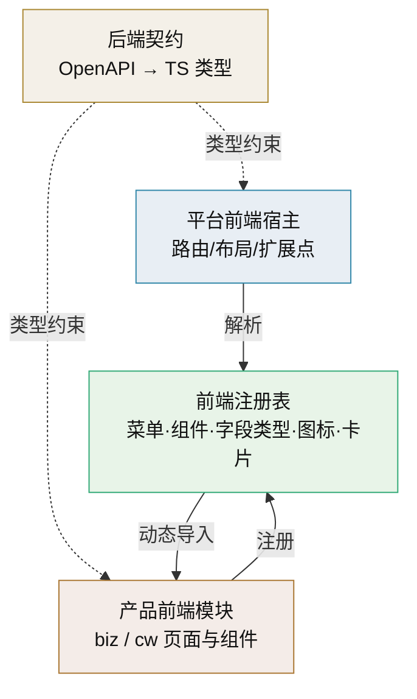

# 前端插件化技术介绍

> 前端扩展点 · 注册表与动态导入 · 构建期合并与运行时加载

[文档首页](../../../文档首页.md) › [知识档案](../技术栈知识档案总览.md) › [插件化架构](../技术栈知识档案总览.md#plugin) › 前端插件化技术介绍　|　[← 返回总览](01_插件化架构_总览.md)

---

## 1. 技术概述 

**前端插件化**把插件化思路搬到浏览器侧：宿主（平台前端应用）定义**扩展点**——路由、菜单、页面、组件、字段渲染、主题、国际化文案——产品（biz、cw）或其他来源以**注册**方式挂接自己的页面与组件，而不改动宿主源码。与后端「端口 + 适配器」同构，前端是「**扩展点 + 注册表 + 动态导入**」。

- **定位**：插件化架构的前端对称部分；承载产品前端模块挂接、字段类型渲染、工作台卡片等扩展。
- **核心差别**：后端插件在**同一 Python 进程**内；前端插件涉及**代码从哪里来**（构建期合并 / 运行时远程加载）与**样式与运行时隔离**，这是前端独有的难题。
- **与本项目的关系**：平台已规划「产品前端模块源码由产物构建期合并进 BMS 前端应用，菜单/表单/按钮/字段走平台注册，动态路由生效，前端无需随 BMS 发版」（见平台《平台可扩展性规划》「代码复用能力边界」节）。

## 2. 核心概念与原理 

| 概念 | 说明 |
| --- | --- |
| 扩展点（扩展插槽） | 宿主预留的挂接位置：路由、菜单、页面区域、字段渲染器、主题令牌等 |
| 注册表 | 名称 → 组件/处理器 的映射，如 `iconRegistry`、字段类型注册器、卡片注册器 |
| 动态导入 | `() => import('./Xxx.vue')` 懒加载，插件页面独立分包、不进首屏 |
| 动态路由 | 路由由后端菜单数据驱动，前端按注册表解析组件，菜单变化无需重发版 |
| 构建期合并 | 从产品仓库拉取前端模块产物，在平台前端构建时并入同一应用（本项目方案） |
| 运行时加载 | 运行时从远端加载组件包（Module Federation / 远程组件），可独立发版但复杂度高 |
| 隔离 | 样式作用域、全局变量污染、运行时互不干扰；强隔离用微前端/iframe |
| 前端契约 | TypeScript 接口 + Props/事件约定；请求/响应类型由 OpenAPI 生成（与后端契约同源） |

## 3. 在本项目中的用途 

- **产品前端模块挂接**：自阶段五起产品前端以**运行时片段**（Module Federation）接入平台前端应用——宿主薄壳 + 片段契约 + 片段清单，新页面按片段形态独立构建与发布；构建期合并保留为过渡 / 存量形态。菜单/表单/按钮/字段走平台注册，动态路由生效（口径见平台《项目规划说明》阶段五与平台《架构设计 · 前端架构》）。
- **字段类型渲染**：前端字段渲染器与后端字段类型注册表**同名对齐**，后端新增字段类型时前端注册对应渲染组件。
- **工作台卡片**：卡片类型（builtin / dataset）经注册表解析，产品扩展卡片即注册新 provider。
- **图标与通用组件**：`iconRegistry` 等注册表统一管理图标与通用组件（组件按域分目录，见平台《[前端开发规范](../../../规范/前端开发规范.md)》）。
- **基类体系对称**：前端有 前端基类体系与注册表约定（见平台《前端基类清单》），插件化扩展点应遵从既有基类与注册表，而不是另起一套。
- **权限显隐**：菜单/按钮显隐由权限驱动，但**前端显隐只是体验**，真正鉴权在后端（见 [02 开源与商业组件可替换](02_插件化架构_开源与商业组件可替换.md) 权限实例）。

## 4. 与后端插件化的对称 

| 插件化概念 | 后端 | 前端 |
| --- | --- | --- |
| 端口/契约 | 能力基类 `BaseXxx`（方法签名） | 扩展点接口 + Props/事件 + TS 类型 |
| 适配器/插件 | 能力基类实现 | 页面/组件/渲染器实现 |
| 注册表 | 插件注册表（key → 实现） | 前端注册表（名称 → 组件/处理器） |
| 选择入口 | `get_xxx` 提供者 | 路由/菜单解析 + 注册表查表 |
| 默认实现 | `NullXxx` / 占位 | 默认渲染组件 / 空插槽 |
| 选择依据 | `config.toml` provider | 后端下发配置 + 前端注册结果 |
| 生命周期 | `setup` / `aclose` | 组件挂载 / 卸载、路由进入 / 离开 |
| 隔离 | 进程内异常隔离 | 样式作用域、运行时隔离（强隔离走微前端） |

## 5. 实现方式对比 

| 方式 | 机制 | 优点 | 代价 | 适用 |
| --- | --- | --- | --- | --- |
| 构建期合并 | 平台页面/存量模块产物并入平台构建 | 类型/样式统一、无运行时开销、调试简单 | 需平台构建流水线支持、产物耦合 | 平台页面与存量模块（过渡形态） |
| 运行时远程组件 | Module Federation / 远程加载组件包 | 独立发版、运行时组合 | 版本/依赖/样式隔离复杂 | **本项目阶段四/五引入**（Module Federation，最小闭环） |
| 微前端（qiankun / iframe） | 子应用独立运行，宿主容器挂载 | 强隔离、技术栈自由 | 通信/样式/性能复杂、体验割裂 | 异构技术栈、强隔离 |
| Web Components | 自定义元素 + Shadow DOM | 原生隔离、框架无关 | 生态与开发体验受限 | 小组件级扩展 |

**选择建议**：本项目已定案**引入运行时组合**（Module Federation，阶段四搭骨架 / 阶段五落地，最小闭环）——新业务页面按片段形态独立构建发布；平台自身页面与存量模块仍走构建期合并（过渡形态）；`iframe` / `qiankun` 沙箱式仅在异构技术栈 / 强隔离时评估。

## 6. 常见问题与注意事项 

- **样式污染**：插件样式泄漏到宿主或其他插件；用作用域样式/命名前缀，强隔离靠 Shadow DOM 或子应用。
- **全局变量冲突**：插件改全局对象/原型，破坏宿主；约束插件只经扩展点交互。
- **首屏体积膨胀**：插件全打进主包；插件页面必须**动态导入独立分包**，不进首屏。
- **路由与菜单冲突**：多来源注册同名路由；注册时做唯一性校验，路径加前缀。
- **类型契约漂移**：前端自定义类型与后端 OpenAPI 不一致；类型由 schema 生成，接口变更走契约流程。
- **权限形同虚设**：只做前端显隐、后端不校验；前端显隐仅体验优化，鉴权必须在后端。
- **版本不匹配**：运行时加载对宿主版本有隐式依赖；运行时装插件需显式声明兼容范围。
- **把前端当后端插件的翻版**：忽略前端独有的构建、样式、运行时隔离问题，直接套用后端模型会踩坑。

## 7. 学习与参考资料 

| 资源 | 网址 | 说明 |
| --- | --- | --- |
| Vue 异步组件 | https://cn.vuejs.org/guide/components/async.html | 动态导入与懒加载分包 |
| Vite 动态导入与分包 | https://cn.vitejs.dev/guide/features.html#dynamic-import | 构建期分包的工程基础 |
| Module Federation | https://module-federation.io/ | 运行时远程组件方案 |
| qiankun 微前端 | https://qiankun.umijs.org/zh | 微前端容器方案 |
| Web Components（MDN） | https://developer.mozilla.org/zh-CN/docs/Web/Web_Components | 原生组件隔离 |

## 8. 项目内关联文档 

| 文档 | 说明 |
| --- | --- |
| 《[01 插件化架构总览](01_插件化架构_总览.md)》 | 本目录总览与三阶段演进 |
| 《[03 端口适配器](03_插件化架构_端口适配器.md)》 | 后端端口/适配器，前端扩展点与之同构 |
| 《[10 配置驱动实现选择](10_插件化架构_配置驱动实现选择.md)》 | 后端按配置选实现，前端由下发配置驱动解析 |
| 《[13 第三方插件生态](13_插件化架构_第三方插件生态.md)》 | 外部来源插件的隔离与治理 |
| 《[Vue3 技术介绍](../前端/Vue3技术介绍.md)》 | 前端框架与动态组件基础 |
| 《[Vite 技术介绍](../前端/Vite技术介绍.md)》 | 构建、分包与动态导入 |
| 《[VueRouter 技术介绍](../前端/VueRouter技术介绍.md)》 | 动态路由生成 |
| 《[前端开发规范](../../../规范/前端开发规范.md)》 | 前端基类体系与组件注册约定（基座规范） |
| 平台《前端基类清单》 | 前端基类体系（开放式）与注册表权威清单（平台专属文档） |
| 平台《平台可扩展性规划》 | 产品前端构建期合并与动态路由口径（平台专属文档） |

---

> 依《[文档生成规范](../../../规范/文档生成规范.md)》编写
