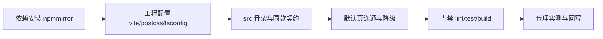

# frontend-mobile 工程初始化实施记录

> 项目骨架 · 01 工程骨架 · 子任务 05 · 实施记录 01

[文档首页](../../../../../../文档首页.md) › [05 frontend-mobile 工程初始化](../01_工程骨架_05_frontend-mobile工程初始化.md) › 01 实施记录　|　[详细设计 →](../设计/05_详细设计_01_frontend-mobile工程初始化.md)

## 1. 实施信息 

| 项 | 值 |
| --- | --- |
| 任务 | [05 frontend-mobile 工程初始化](../01_工程骨架_05_frontend-mobile工程初始化.md) |
| 对应需求 | [01-5](../../../../需求/01_需求_工程骨架.md#r01-5) |
| 详细设计 | [05_详细设计_01_frontend-mobile工程初始化](../设计/05_详细设计_01_frontend-mobile工程初始化.md) |
| 实施日期 | 2026-09-10 |
| 实施人 | minjian |
| 实施环境 | 开发机（Ubuntu）；Node 22.23.2（nvm）、npm 10.9.8；npm 源 npmmirror |
| 提交 | —（随本批提交，见仓库 git log） |
| 结论 | 占位工程升级为完整初始化（Vant + 视口适配 + 同款契约基线）；代理连通实测通过；lint/test/build 全绿 |

## 2. 实施概览 

## 3. 实施过程 

### 3.1 依赖与 npm 源

- `.npmrc` 同 04（npmmirror + legacy-peer-deps）；
- 运行依赖：vue-router 4.6、pinia 3.0、axios 1.20、vant 4.10、vue-i18n 11.4；
- 开发依赖：eslint 10 链 + prettier、vitest 5 + @vue/test-utils + jsdom + @vitest/coverage-v8、sass、unplugin-vue-components + @vant/auto-import-resolver（Vant 按需）、postcss-px-to-viewport-8-plugin、openapi-typescript 7.13、vue-eslint-parser。

### 3.2 工程配置

- `vite.config.ts`：端口 5174（strictPort）、`@` 别名、Vant 按需（unplugin + VantResolver）、代理 `/api` 与 `/healthz`、`/info` 重写至 backend `/`；
- `postcss.config.js`：px→vw（设计稿 375、`minPixelValue: 2` 保留细线）；
- `.env.development`（`VITE_API_BASE=/api`）；tsconfig `paths`（无 baseUrl）；ESLint/Prettier/Vitest 与 04 同口径；
- `index.html`：标题「BMS 基础管理系统」+ `viewport-fit=cover`。

### 3.3 src 骨架与契约

- `api/*` 与 04 同款的契约类型与 Axios 基线（统一响应解析、token 位、401 TODO、`fetchAppInfo()`）；
- `router/routes.ts`、`stores/useUserStore.ts`、`views/HomeView.vue`（连通成功/降级两态）、`i18n/*`（含 `error.{code}` 占位）、`styles/safe-area.scss`（安全区变量）、`components`/`utils` 占位；
- `main.ts` 接线 router/pinia/i18n + 安全区样式。

### 3.4 双端同款基座（后续批次）

后续两个嵌套子任务（01-4-1 / 01-4-2）按双端同款落地并复制至本工程：

- 契约与数据层：`api/types.ts`（BaseEntity/BasePageQuery）、`api/base.ts`（BaseApi）、`stores/base.ts`（createCrudStore）、`utils/serialize.ts`（stableStringify）；
- 公共基座：`utils/useRequest.ts`、`utils/useListPage.ts`、`utils/validators.ts`、`utils/useTabs.ts`、`utils/status.ts`；
- 测试：`tests/{base,utils,http}.spec.ts` + `tests/helpers/mount.ts`；双端各 18 用例、覆盖率 100%。

### 3.5 验证与提交

`npm ci` → `lint` → `test` → `build`；起 backend + dev 实测代理连通；随后形成本批提交（等用户指令）。

## 4. 问题与处置 

| # | 问题 / 现象 | 原因 | 处置 | 落点 |
| --- | --- | --- | --- | --- |
| 1 | `postcss-px-to-viewport-8-plugin` 视口换算未做像素级核对 | 无浏览器自动化（Playwright 随 05-1） | 默认页为文本结构、无固定宽元素；视口断言随 05-1 E2E 补 | 测试记录 §6 |
| 2 | 其余（openapi-typescript peer、vue-eslint-parser、TS6 baseUrl） | 同 04 | 同 04 处置 | [04 实施记录 §4](../../01_工程骨架_04_frontend工程初始化/实施/04_实施_01_frontend工程初始化.md#issues) |

## 5. 验证结果 

| 验证点（完成标准） | 方法 | 结果 |
| --- | --- | --- |
| `npm ci` 可复现 | 命令 | 通过 |
| 代理与统一响应解析 | 起 backend + `npm run dev` 后 curl | 通过（`/info` 与标题见下） |
| `npm run lint` / `test` / `build` | 命令 | 通过（2 passed，Kiwi 20） |
| 覆盖率 | `npm run test:cov` | 100%（已导入文件） |
| Node 版本 | `node -v` | v22.23.2 |

联调实测：页面标题 `BMS 基础管理系统`；`GET /info` → `{"code":0,…,"data":{"name":"BMS 基础管理系统","version":"0.1.0"}}`。

## 6. 偏差与遗留 

- 375×667 视口与安全区像素级断言随 05-1 Playwright E2E（05-1 e2e 范围已补该断言项）；当前默认页为简单结构、基线配置已就位。
- 双端同款基座（基础类/公共组合式）已随后续批次落地并保持同步（见 §3.4），无遗留。
- Vant 组件按需引入已配置；业务组件使用随阶段二/十三。
- 视口方案默认 vw；如第三方组件兼容问题可切 rem（配置层）。
- 企业微信/钉钉免登、401 刷新留阶段二（TODO 标注）。

> 本文档依《文档生成规范》编写 · 按《任务文档规范》第 5 节实施文档结构组织
