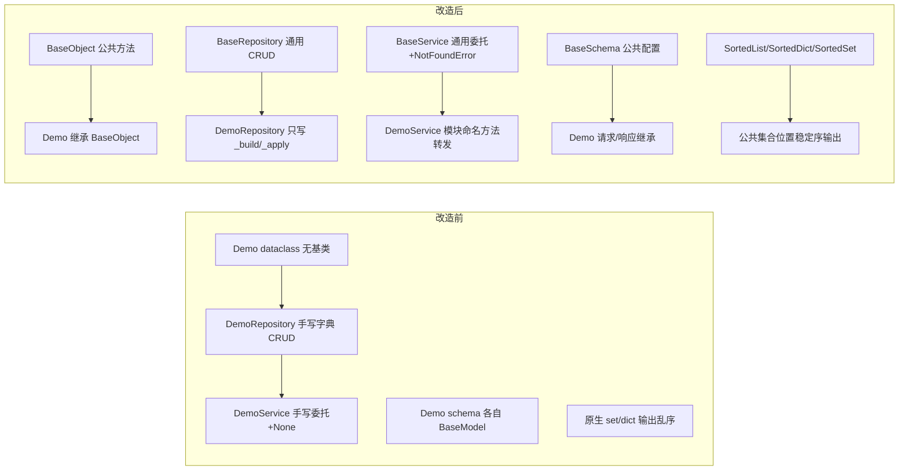

# 基础类详细设计

> 项目骨架 · 01 工程骨架 · 03 backend 分层目录与职责 · 嵌套子任务 01 · 详细设计

[文档首页](../../../../../../文档首页.md) › [03-1 基础类](../01_工程骨架_03_backend分层目录与职责_01_基础类.md) › 01 详细设计　|　[← 父任务](../../01_工程骨架_03_backend分层目录与职责.md)

## 1. 概述 <a id="overview"></a>

- **目标**：在 backend 分层骨架（任务 03）之上，建立**根基类 BaseObject**（所有可继承类的公共方法落点）、**集合基类**（有序集合体系，解决 set 无序与 dict 仅插入序的分析难题）、repositories / services / schemas 三套公共基类，把「公共方法、有序集合、统一 CRUD 契约、公共配置」收敛到基类，后续模块只写差异部分，避免「每个类都改一遍」。
- **范围**：仅后端——新增 `core/base.py` 根基类与 `core/collections.py` 集合基类；三套基类与 demo 数据模型/四件套改为继承；引入 `sortedcontainers` 依赖；《后端开发规范》继承条款。ORM `BaseModel`（雪花 ID/审计/软删除/乐观锁）仍归 03-2，本任务只落继承约定与 `models/base.py` 继承点，**不重复实现**。
- **依据**：需求 [01-3](../../../../需求/01_需求_工程骨架.md#r01-3) 第 4/5 条、《[后端开发规范](../../../../../../规范/后端开发规范.md)》第 2/4 节、《[命名规范](../../../../../../规范/命名规范.md)》第 3/6 节、2026-09-10 设计调整确认（根基类 + 集合基类）。

## 2. 现状与差距 <a id="gap"></a>

| 现状（任务 03 交付） | 差距 |
| --- | --- |
| demo 四件套各自实现 CRUD（字典存储、自增 ID、排序、不存在判断） | 每个新模块都要重复同类逻辑；口径（方法名/排序/不存在返回）易漂移 |
| schema 各自 `BaseModel` + 字段约束 | 公共配置（ORM 校验、去空白）无处统一下发，逐类补写 |
| service 直接返回 None 表示不存在，api 层逐个判断并抛 404 | 不存在语义分散在 api/service 两处，新端点重复判断 |
| 无继承约束 | 新类是否继承基类、如何覆盖全凭习惯 |
| 无根基类：字符串输出、序列化、相等/哈希等公共方法无处安放 | 每类各写一套（或缺失），后续调整要逐类改 |
| `set` 无序且字符串哈希随机化（跨进程遍历序不同）；`dict` 仅插入序 | 日志/存档/diff 不稳定，大数据量下分析查看极端困难；无从继承的有序集合体系 |

## 3. 交付物清单 <a id="tree"></a>

```text
backend/app/
├── core/base.py                           # 新增：BaseObject（根基类，ABC）
├── core/collections.py                    # 新增：BaseCollection + SortedList/SortedDict/SortedSet
├── core/exceptions.py                     # +NotFoundError（占位，02-3 接入 BizError）
├── repositories/base_repository.py        # 新增：BaseRepository[T]（继承 BaseObject）
├── services/base_service.py               # 新增：BaseService[T]（继承 BaseObject）
├── schemas/base.py                        # 新增：BaseSchema（继承 BaseModel + BaseObject）
├── models/base.py                         # 保持占位（03-2：BaseModel 约定继承 BaseObject）
├── models/demo.py                         # 改造：Demo 继承 BaseObject
├── repositories/demo_repository.py        # 改造：继承 BaseRepository[Demo]
├── services/demo_service.py               # 改造：继承 BaseService[Demo]
├── schemas/demo.py                        # 改造：继承 BaseSchema
├── api/demo.py                            # 调整：404 判断改由全局处理器
└── main.py                                # +NotFoundError → 404 临时处理器（02-3 替换）

backend/tests/
├── core/test_base_object.py               # 新增（Kiwi 14）
├── core/test_collections.py               # 新增（Kiwi 15）
├── repositories/test_base_repository.py   # 新增（Kiwi 11）
├── services/test_base_service.py          # 新增（Kiwi 12）
└── schemas/test_base_schema.py            # 新增（Kiwi 13）
```

依赖：`sortedcontainers`（MIT，纯 Python）登记 `pyproject.toml` dependencies 并锁 `uv.lock`；Python 3.14 兼容由 01-06 验证矩阵覆盖。

规范：`bms文档/规范/后端开发规范.md` §4 增补「类继承约定」。

## 4. BaseObject 根基类设计 <a id="base"></a>

`app/core/base.py`：**所有可继承类的唯一公共方法落点**（`class BaseObject(ABC)`），只放方法、不放字段（字段归模型基类 03-2）。

| 方法 | 口径 |
| --- | --- |
| `to_dict() -> dict[str, object]` | 通用反射序列化：公开字段字典（嵌套递归） |
| `to_json(sort_keys=True) -> str` | JSON 字符串：`ensure_ascii=False`、键排序兜底稳定序、不可序列化值降级 `str` |
| `__str__() / __repr__()` | 统一字符串输出：`类名(公开字段字典)`（如 `Demo(id=1, name='甲')`） |
| `__eq__(other)` | 相等判定：同类且主键（`id` 非 None）相同；无主键退化为身份比较 |
| `__hash__()` | 与 `__eq__` 一致：有主键按 `(类名, 主键)` 哈希；无主键用身份哈希 |

**`to_dict` 反射规则**：

1. 取字段：dataclass 用 `dataclasses.fields`；其他对象取 `vars(self)` 中不以 `_` 开头的公开项；
2. 值递归：`BaseObject` 子类 → 递归 `to_dict()`；`list/tuple/set` → 逐元素；`dict` → 逐值；其余原样；
3. Pydantic v2 模型字段存于 `__dict__`，同一规则直接可用，无需特殊分支。

```python
class BaseObject(ABC):
    """后端根基类：所有基类与模块类的公共方法落点。"""

    def to_dict(self) -> dict[str, object]:
        """公开字段字典（递归转换嵌套对象）。"""

    def to_json(self, sort_keys: bool = True) -> str:
        """JSON 字符串（ensure_ascii=False，键排序稳定序，不可序列化值降级 str）。"""
```

**MRO 优先规则（重要）**：子类自带实现优先——dataclass 生成的 `__eq__/__repr__`、Pydantic 的 `__eq__/__repr__` 会覆盖根基类同名方法；`to_dict/to_json` 不与 Pydantic `model_dump` 冲突，由根基类统一提供。需要统一展示语义时显式调用或调整 MRO。集合基类会覆盖 `to_dict/to_json/__str__/__repr__` 为内容式语义（见 §5）。

## 5. 集合基类设计 <a id="collections"></a>

`app/core/collections.py`：有序集合体系。基于 `sortedcontainers`（插入 O(log n)，遍历/切片天然有序），解决「set 跨进程无序、dict 仅插入序」导致的分析困难。

| 类 | 继承 | 有序口径 |
| --- | --- | --- |
| `BaseCollection[T]` | `BaseObject, ABC` | 公共方法落点（不直接实例化） |
| `SortedList[T]` | `BaseCollection` + `sortedcontainers.SortedList` | 按元素（或构造 `key=`）升序插入 |
| `SortedDict[K, V]` | `BaseCollection` + `sortedcontainers.SortedDict` | 按键升序 |
| `SortedSet[T]` | `BaseCollection` + `sortedcontainers.SortedSet` | 按元素升序去重 |

**公共方法**（`BaseCollection` 统一提供，三类继承）：

| 方法 | 口径 |
| --- | --- |
| `to_list()` | 有序内容 → 内置 `list` 副本（`SortedDict` 为 `[(key, value), ...]`） |
| `to_dict()` | 映射类（SortedDict）→ 键序 `dict`；序列类调用抛 `TypeError` 并提示改用 `to_list()` |
| `to_json(sort_keys=True)` | 稳定输出：序列 → 数组；映射 → 对象（键序稳定） |
| `__str__() / __repr__()` | 内容式展示：`SortedList([1, 2, 3])`（覆盖根基类的字段式展示） |
| `sorted_by(key, reverse=False)` | 排序视图：按自定义键返回有序 `list` 副本，不改动自身 |
| `chunk(size)` | 分批迭代（生成器，逐批 `list`），供大数据导出/日志分批 |
| `merge(*others)` | 多路归并（O(n log k)），返回同类且保持有序 |
| 集合运算 | `SortedSet` 交/并/差/对称差（运算符重载，结果仍 `SortedSet`）；`SortedDict` 按键交并 |

```python
class BaseCollection[ItemT](BaseObject, ABC):
    """有序集合基类：稳定序列化、排序视图、分批与集合运算。"""

    def to_list(self) -> list[ItemT]:
        """有序元素列表（内置 list 副本）。"""
```

- 元素要求可比较（或构造时传 `key=`）；排序键一旦选定，插入/遍历/输出全程一致。
- 大数据量取舍：插入 O(log n)、内存略高于内置集合，换取遍历/切片/序列化全程稳定序，避免反复 O(n log n) 排序。
- 现有内置集合不强制替换（渐进迁移）；公共位置新代码按 §9 约定使用。

## 6. BaseRepository 设计 <a id="repository"></a>

`app/repositories/base_repository.py`：泛型基类（`class BaseRepository[ModelT](BaseObject, ABC)`），采用**模板方法**——通用流程（ID 分配、排序、字典存取、不存在返回）在基类实现，子类只写「实体构造/更新规则」；继承 `BaseObject` 后实例可直接参与日志输出与序列化。

| 成员 | 类型 | 说明 |
| --- | --- | --- |
| `_items: dict[int, ModelT]` | 字段（内存基线） | 存储；数据库实现（02-5/03 域）覆写原子方法时不再使用；可评估改用 `SortedDict` |
| `_next_id: int` | 字段（内存基线） | 自增 ID 起点 1 |
| `_build(item_id, values) -> ModelT` | 抽象方法 | 子类实现：按字段值构造新实体 |
| `_apply(item, values) -> ModelT` | 抽象方法 | 子类实现：按字段值生成更新后实体 |
| `list() -> list[ModelT]` | 通用方法 | 按 ID 升序返回全部 |
| `get(item_id) -> ModelT \| None` | 通用方法 | 不存在返回 None（仓储层不抛业务异常） |
| `create(**values) -> ModelT` | 通用方法 | 分配自增 ID 并存储 |
| `update(item_id, **values) -> ModelT \| None` | 通用方法 | 不存在返回 None |
| `delete(item_id) -> bool` | 通用方法 | 不存在返回 False |
| `exists(item_id) -> bool` | 派生方法 | `get(...) is not None`，子类免实现 |
| `count() -> int` | 派生方法 | 记录总数，子类免实现 |

```python
class BaseRepository[ModelT](
    BaseObject,
    ABC,
):
    """仓储基类（内存基线）：通用 CRUD 流程 + 派生方法。"""
```

- 数据库接入（02-5/03 域）时：覆写 `list/get/create/update/delete` 为会话实现，`exists/count` 自动沿用；`_items/_next_id` 随内存基线弃用。
- 方法保持**同步**口径（沿用 03 现状）；数据库异步化在 02-5 基类统一切换，调用面改动集中一次。

## 7. BaseService 设计 <a id="service"></a>

`app/services/base_service.py`：泛型基类（`class BaseService[ModelT](BaseObject)`），委派仓储并统一**不存在语义**（抛 `NotFoundError`，由全局处理器转 404）。

| 成员 | 说明 |
| --- | --- |
| `_repository: BaseRepository[ModelT]` | 字段：仓储实例（构造注入） |
| `list() / count() / exists(...)` | 转发仓储（只读，不存在不抛） |
| `create(**values) -> ModelT` | 转发仓储创建 |
| `get(item_id) -> ModelT` | 不存在抛 `NotFoundError` |
| `update(item_id, **values) -> ModelT` | 不存在抛 `NotFoundError` |
| `delete(item_id) -> None` | 不存在抛 `NotFoundError` |

配套：

- `app/core/exceptions.py` 新增 `NotFoundError(Exception)` 占位；02-3 建 `BizError` 体系时替换继承（错误码统一后 handler 一并更换）。
- `app/main.py` 注册临时处理器：`NotFoundError → JSONResponse(404, {"detail": ...})`（body 结构与 FastAPI 默认 404 对齐，02-3 统一响应后调整）。
- `app/api/demo.py` 删除逐个 None 判断，404 由处理器统一产出；端点函数回归「取数 → 组装响应」。

## 8. BaseSchema 设计 <a id="schema"></a>

`app/schemas/base.py`：

```python
class BaseSchema(BaseModel, BaseObject):
    """Pydantic 模型基类：统一公共配置。"""

    model_config = ConfigDict(from_attributes=True, str_strip_whitespace=True)
```

- `from_attributes`：ORM/实体对象可直接校验（03-2 落库后响应模型使用）。
- `str_strip_whitespace`：字符串字段自动去除首尾空白。
- 继承 `BaseObject`（放 MRO 后位）：`to_dict/to_json` 可用；Pydantic 自身的 `__eq__/__repr__/model_dump` 语义优先，不受影响。
- 公共字段（id/时间戳）与统一响应 `ApiResponse` 不在此处：分别归 03-2 与 02-3，避免越界。

## 9. demo 改造设计 <a id="refactor"></a>



- `Demo(BaseObject)`：dataclass 生成的 `__eq__/__repr__` 优先，`to_dict/to_json` 从根基类继承（日志/调试可直接序列化）。
- `DemoRepository(BaseRepository[Demo])`：仅实现 `_build`（`Demo(id=item_id, name=str(values["name"]))`）与 `_apply`（按原 ID 生成新对象）。
- `DemoService(BaseService[Demo])`：保留 `list_demos / get_demo / create_demo / update_demo / delete_demo` 模块命名（api 与用例不动），内部转发基类通用方法；签名改为不存在时抛 `NotFoundError`（返回类型去 Optional）。
- `DemoCreateRequest / DemoUpdateRequest / DemoResponse` 改继承 `BaseSchema`。
- **行为不变**：成功路径响应与 404 状态码与改造前一致（回归用例 1–10 全绿）。

## 10. 继承与集合约定（规范条款） <a id="convention"></a>

《后端开发规范》§4 增补（强制）：

- **所有可继承的后端类默认继承 `BaseObject`**（三套基类、demo 数据模型、后续 03-2 `BaseModel` 与各模块类；第三方/框架受限类除外），公共方法只允许加在 `BaseObject`；
- **新增集合类型必须继承 `core/collections.py` 对应类**（`SortedList/SortedDict/SortedSet`）；
- **公共位置使用有序集合**：API 响应、日志字段、任务参数/结果、配置映射、缓存值与导出数据使用有序集合；局部临时变量不限；
- **对外输出必须稳定序**：序列化统一走 `to_json`（键排序兜底）；`set` 直接输出属违规；
- `XxxRepository` 必须继承 `BaseRepository[T]`，只写 `_build/_apply`（内存基线）或数据库实现覆写；
- `XxxService` 必须继承 `BaseService[T]`，通用 CRUD 走基类，业务规则以覆写/新增方法实现；
- 请求/响应模型必须继承 `BaseSchema`；ORM 模型基类 `BaseModel`（03-2）必须继承 `BaseObject`；
- 公共字段只允许加在 `BaseModel` 与三套基类，禁止在模块类里重复定义。

## 11. 测试设计（Kiwi 先行） <a id="tests"></a>

先登记后编码，用例含成功与失败分支：

| Kiwi | 用例 | 自动化文件 |
| --- | --- | --- |
| 14 | BaseObject 公共方法（to_dict 反射/递归、to_json、`__str__/__repr__`、主键与身份相等/哈希） | `tests/core/test_base_object.py` |
| 15 | 集合基类（插入即有序、跨实例/跨序列化稳定、排序视图、分批、集合运算保序、序列类 to_dict 报错） | `tests/core/test_collections.py` |
| 11 | BaseRepository 通用 CRUD 与派生方法（create 分配 ID、list 排序、exists/count、update/delete 缺失分支） | `tests/repositories/test_base_repository.py` |
| 12 | BaseService 不存在语义（get/update/delete 缺失抛 NotFoundError；成功路径转发） | `tests/services/test_base_service.py` |
| 13 | BaseSchema 公共配置（去空白 / from_attributes）与 demo 继承链生效 | `tests/schemas/test_base_schema.py` |
| 1–10 | 既有 API 用例回归（行为不变） | `tests/api/*` |

新增用例通过本地测试替身（`Item(BaseObject)`、`ItemRepository(BaseRepository[Item])`）验证基类通用行为，同时断言三套基类、集合基类与 demo 各类对 `BaseObject` 的继承关系。

## 12. 实施步骤 <a id="steps"></a>

1. Kiwi 登记用例 14、15 与 11–13（更新）并取 ID。
2. 新增 `core/base.py`（BaseObject）；引入 `sortedcontainers` 依赖（pyproject + uv.lock，01-06 验证）；新增 `core/collections.py`。
3. 新增 `schemas/base.py`、`repositories/base_repository.py`、`services/base_service.py`、`core/exceptions.py` 的 `NotFoundError`。
4. 改造 demo 数据模型与三件套、`api/demo.py`；`main.py` 注册 404 临时处理器。
5. 《后端开发规范》§4 增补继承与集合条款。
6. 新增五组基类用例（标注 `kiwi_id`），跑通全量测试。
7. 验证：`pytest` / `ruff` / `pyright` / 覆盖率 100% / uvicorn + curl 回归。
8. 回写：实施/测试记录、任务与计划状态、README 目录树。

## 13. 验收映射 <a id="accept-map"></a>

| 完成标准 | 验证方式 |
| --- | --- |
| 根基类就位，公共方法收敛 | `core/base.py` 核对；用例 14 通过 |
| 集合基类有序且输出稳定 | 用例 15 通过；跨进程日志/diff 抽查顺序一致 |
| 三套基类与 demo 各继承 BaseObject | 继承断言的用例通过；规范条款核对 |
| demo 三件套继承、行为不变 | 回归用例 1–10 全绿；CRUD curl 实测 |
| 无 lint/类型错误 | `uv run ruff check .`、`uv run pyright` |
| 覆盖率 100% | `uv run pytest --cov=app` |
| 规范含继承与集合条款 | 《后端开发规范》§4 核对 |
| Kiwi 用例登记并标注 | 平台登记 + 代码 `kiwi_id` |

## 14. 边界与开放项 <a id="boundary"></a>

- **不碰 ORM**：`models/base.py` 仍为占位，`BaseModel` 字段细节按 03-2（继承约定已写入本设计）；本任务仅保证 repository 泛型与其解耦。
- **不碰统一响应/异常体系**：`NotFoundError` 与 404 处理器为过渡实现，02-3 接管后替换（body 结构可能微调，测试只断言状态码）。
- **不碰 async**：数据库异步化随 02-5 在基类统一切换（本次保持同步口径与 03 现状一致）。
- **MRO 优先**：dataclass/Pydantic 生成方法覆盖 `BaseObject` 同名方法属预期，统一展示需显式调用；`to_dict` 对 datetime/Decimal 等复杂类型原样返回，`to_json` 由 `default=str` 降级。
- **无主键对象**：相等退化为身份比较（不做值比较），避免可变对象哈希陷阱。
- **集合取舍**：元素需可比较（或构造传 `key=`）；插入 O(log n)、内存略高于内置集合；`to_json(sort_keys=True)` 会覆盖插入序（需保留插入序时显式 `sort_keys=False`）；现有内置集合渐进迁移，不强制一次性替换。
- **依赖**：`sortedcontainers` 纯 Python，Python 3.14 兼容由 01-06 验证；类型存根以 typeshed 为准，不足时实现阶段补本地 `.pyi`。
- **开放项**：分页/软删除过滤等通用能力待 02-5/03-2 定稿后回填基类（只加基类，模块类不改）。
- **并发归属**：本设计的基类与有序集合为**单副本单线程语义**（`sortedcontainers` 非线程安全）；并发安全与跨副本一致由 [01-3-2「并发集合与并发安全」](../../01_工程骨架_03_backend分层目录与职责_02_并发集合与并发安全/01_工程骨架_03_backend分层目录与职责_02_并发集合与并发安全.md) 承接（进程内 `ConcurrentSorted*` + Redis 分层）。
- **同步状态**：已于 2026-09-10 同步落版（见 [实施记录 02](../实施/01_实施_02_基础类.md)、[测试记录 02](../测试/01_测试_02_基础类.md)），实现与设计一致。

## 15. 对齐记录 <a id="align"></a>

| # | 事项 | 结论 |
| --- | --- | --- |
| 1 | 挂靠位置 | 挂 01_03 任务下为嵌套子任务（目录 = 父目录名 + `_01_基础类`） |
| 2 | 编号与文档命名 | 编号 `01-3-1`；内部文档用本层级序号（`01_详细设计_01_基础类.md` 等） |
| 3 | 需求处理 | 追加进需求 01-3 条款，不新增需求编号（总需求仍 24 条） |
| 4 | 范围 | 仅后端三套基类；ORM BaseModel 仍归 03-2；前端基类仍随 01-04 |
| 5 | 工时 | 4h；01_03 重估 7h（自有 3h + 子任务 4h）；阶段总 68h→72h |
| 6 | 规范 | 同步增补《后端开发规范》继承条款；《任务文档规范》支持递归嵌套 |
| 7 | 根基类 | 新增 `core/base.py` `BaseObject`（ABC）：`__str__/__repr__`、`to_dict/to_json`、`__eq__/__hash__`；三套基类、demo 数据模型、未来 `BaseModel` 与所有可继承类均继承 |
| 8 | 序列化口径 | `to_dict` 通用反射递归；`to_json` 降级 str 且默认键排序；dataclass/Pydantic 自身同名方法优先（MRO） |
| 9 | 集合基类 | 新增 `core/collections.py`：`BaseCollection` + `SortedList/SortedDict/SortedSet`（sortedcontainers 插入即有序） |
| 10 | 集合方法 | 稳定序列化（to_list/to_dict/to_json）、排序视图 sorted_by、分批 chunk、集合运算 merge/交并差（保序） |
| 11 | 集合使用口径 | 输出稳定 + 公共位置使用有序集合；局部临时变量不限；`sortedcontainers` 依赖由 01-06 验证 |
| 12 | 本轮范围 | 仅调整本设计文档（2026-09-10 二次讨论），实现/记录随后同步 |
| 13 | 并发拆分 | 并发集合与并发安全另立嵌套子任务 01-3-2（进程内四种锁策略 + Redis 有序封装，8h），本设计只保留单副本有序集合并指向 |

> 本文档依《文档生成规范》编写 · 关键决策逐项确认
