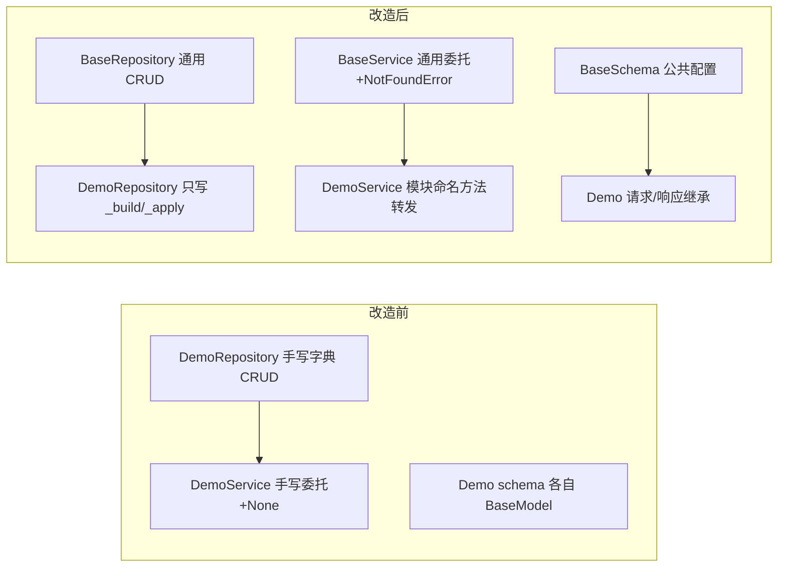

# 基础类详细设计

> 项目骨架 · 01 工程骨架 · 03 backend 分层目录与职责 · 嵌套子任务 01 · 详细设计

[文档首页](../../../../../../文档首页.md) › [03-1 基础类](../01_工程骨架_03_backend分层目录与职责_01_基础类.md) › 01 详细设计　|　[← 父任务](../../01_工程骨架_03_backend分层目录与职责.md)

## 1. 概述 <a id="overview"></a>

- **目标**：在 backend 分层骨架（任务 03）之上，为 repositories / services / schemas 三套类定型**公共基类**，把「统一 CRUD 契约、公共配置、公共字段与方法」收敛到基类，后续模块只写差异部分，避免「每个类都改一遍」。
- **范围**：仅后端三套基类 + 现有 demo 改造继承 + 《后端开发规范》继承条款；ORM `BaseModel`（雪花 ID/审计/软删除/乐观锁）仍归 03-2，本任务只在 `models/base.py` 保留继承点，**不重复实现**。
- **依据**：需求 [01-3](../../../../需求/01_需求_工程骨架.md#r01-3) 第 4/5 条、《[后端开发规范](../../../../../../规范/后端开发规范.md)》第 2/4 节、《[命名规范](../../../../../../规范/命名规范.md)》第 3/6 节。

## 2. 现状与差距 <a id="gap"></a>

| 现状（任务 03 交付） | 差距 |
| --- | --- |
| demo 四件套各自实现 CRUD（字典存储、自增 ID、排序、不存在判断） | 每个新模块都要重复同类逻辑；口径（方法名/排序/不存在返回）易漂移 |
| schema 各自 `BaseModel` + 字段约束 | 公共配置（ORM 校验、去空白）无处统一下发，逐类补写 |
| service 直接返回 None 表示不存在，api 层逐个判断并抛 404 | 不存在语义分散在 api/service 两处，新端点重复判断 |
| 无继承约束 | 新类是否继承基类、如何覆盖全凭习惯 |

## 3. 交付物清单 <a id="tree"></a>

```text
backend/app/
├── core/exceptions.py                     # +NotFoundError（占位，02-3 接入 BizError）
├── repositories/base_repository.py        # 新增：BaseRepository[T]
├── services/base_service.py               # 新增：BaseService[T]
├── schemas/base.py                        # 新增：BaseSchema
├── models/base.py                         # 保持占位（03-2：BaseModel）
├── repositories/demo_repository.py        # 改造：继承 BaseRepository[Demo]
├── services/demo_service.py               # 改造：继承 BaseService[Demo]
├── schemas/demo.py                        # 改造：继承 BaseSchema
├── api/demo.py                            # 调整：404 判断改由全局处理器
└── main.py                                # +NotFoundError → 404 临时处理器（02-3 替换）

backend/tests/
├── repositories/test_base_repository.py   # 新增（Kiwi 11）
├── services/test_base_service.py          # 新增（Kiwi 12）
└── schemas/test_base_schema.py            # 新增（Kiwi 13）
```

规范：`bms文档/规范/后端开发规范.md` §4 增补「类继承约定」。

## 4. BaseRepository 设计 <a id="repository"></a>

`app/repositories/base_repository.py`：泛型基类，采用**模板方法**——通用流程（ID 分配、排序、字典存取、不存在返回）在基类实现，子类只写「实体构造/更新规则」。

| 成员 | 类型 | 说明 |
| --- | --- | --- |
| `_items: dict[int, ModelT]` | 字段（内存基线） | 存储；数据库实现（02-5/03 域）覆写原子方法时不再使用 |
| `_next_id: int` | 字段（内存基线） | 自增 ID 起点 1 |
| `_build(item_id, values) -> ModelT` | 抽象方法 | 子类实现：按字段值构造新实体 |
| `_apply(item, values) -> ModelT` | 抽象方法 | 子类实现：按字段值生成更新后实体 |
| `list() -> list[ModelT]` | 通用方法 | 按 ID 升序返回全部 |
| `get(item_id) -> ModelT \| None` | 通用方法 | 不存在返回 None（仓储层不抛业务异常） |
| `create(**values) -> ModelT` | 通用方法 | 分配自增 ID 并存储 |
| `update(item_id, **values) -> ModelT \| None` | 通用方法 | 不存在返回 None |
| `delete(item_id) -> bool` | 通用方法 | 不存在返回 False |
| `exists(item_id) -> bool` | 派生方法 | `get(...) is not None`，子类免实现 |
| `count() -> int` | 派生方法 | 记录总数，子类免实现 |

```python
class BaseRepository[ModelT](
    ABC,
):
    """仓储基类（内存基线）：通用 CRUD 流程 + 派生方法。"""
```

- 数据库接入（02-5/03 域）时：覆写 `list/get/create/update/delete` 为会话实现，`exists/count` 自动沿用；`_items/_next_id` 随内存基线弃用。
- 方法保持**同步**口径（沿用 03 现状）；数据库异步化在 02-5 基类统一切换，调用面改动集中一次。

## 5. BaseService 设计 <a id="service"></a>

`app/services/base_service.py`：泛型基类，委派仓储并统一**不存在语义**（抛 `NotFoundError`，由全局处理器转 404）。

| 成员 | 说明 |
| --- | --- |
| `_repository: BaseRepository[ModelT]` | 字段：仓储实例（构造注入） |
| `list() / count() / exists(...)` | 转发仓储（只读，不存在不抛） |
| `create(**values) -> ModelT` | 转发仓储创建 |
| `get(item_id) -> ModelT` | 不存在抛 `NotFoundError` |
| `update(item_id, **values) -> ModelT` | 不存在抛 `NotFoundError` |
| `delete(item_id) -> None` | 不存在抛 `NotFoundError` |

配套：

- `app/core/exceptions.py` 新增 `NotFoundError(Exception)` 占位；02-3 建 `BizError` 体系时替换继承（错误码统一后 handler 一并更换）。
- `app/main.py` 注册临时处理器：`NotFoundError → JSONResponse(404, {"detail": ...})`（body 结构与 FastAPI 默认 404 对齐，02-3 统一响应后调整）。
- `app/api/demo.py` 删除逐个 None 判断，404 由处理器统一产出；端点函数回归「取数 → 组装响应」。

## 6. BaseSchema 设计 <a id="schema"></a>

`app/schemas/base.py`：

```python
class BaseSchema(BaseModel):
    """Pydantic 模型基类：统一公共配置。"""

    model_config = ConfigDict(from_attributes=True, str_strip_whitespace=True)
```

- `from_attributes`：ORM/实体对象可直接校验（03-2 落库后响应模型使用）。
- `str_strip_whitespace`：字符串字段自动去除首尾空白。
- 公共字段（id/时间戳）与统一响应 `ApiResponse` 不在此处：分别归 03-2 与 02-3，避免越界。

## 7. demo 改造设计 <a id="refactor"></a>



- `DemoRepository(BaseRepository[Demo])`：仅实现 `_build`（`Demo(id=item_id, name=str(values["name"]))`）与 `_apply`（按原 ID 生成新对象）。
- `DemoService(BaseService[Demo])`：保留 `list_demos / get_demo / create_demo / update_demo / delete_demo` 模块命名（api 与用例不动），内部转发基类通用方法；签名改为不存在时抛 `NotFoundError`（返回类型去 Optional）。
- `DemoCreateRequest / DemoUpdateRequest / DemoResponse` 改继承 `BaseSchema`。
- **行为不变**：成功路径响应与 404 状态码与改造前一致（回归用例 1–10 全绿）。

## 8. 继承约定（规范条款） <a id="convention"></a>

《后端开发规范》§4 增补（强制）：

- `XxxRepository` 必须继承 `BaseRepository[T]`，只写 `_build/_apply`（内存基线）或数据库实现覆写；
- `XxxService` 必须继承 `BaseService[T]`，通用 CRUD 走基类，业务规则以覆写/新增方法实现；
- 请求/响应模型必须继承 `BaseSchema`；ORM 模型基类 `BaseModel` 见 03-2；
- 公共字段/方法只允许加在三套基类（+ `BaseModel`），禁止在模块类里重复定义。

## 9. 测试设计（Kiwi 先行） <a id="tests"></a>

先登记后编码，用例含成功与失败分支：

| Kiwi | 用例 | 自动化文件 |
| --- | --- | --- |
| 11 | BaseRepository 通用 CRUD 与派生方法（create 分配 ID、list 排序、exists/count、update/delete 缺失分支） | `tests/repositories/test_base_repository.py` |
| 12 | BaseService 不存在语义（get/update/delete 缺失抛 NotFoundError；成功路径转发） | `tests/services/test_base_service.py` |
| 13 | BaseSchema 公共配置（去空白 / from_attributes）与 demo 继承链生效 | `tests/schemas/test_base_schema.py` |
| 1–10 | 既有 API 用例回归（行为不变） | `tests/api/*` |

新增用例通过本地测试替身（`ItemRepository(BaseRepository[Item])`）验证基类通用行为，同时断言 demo 类继承关系。

## 10. 实施步骤 <a id="steps"></a>

1. Kiwi 登记用例 11–13 并取 ID。
2. 新增 `schemas/base.py`、`repositories/base_repository.py`、`services/base_service.py`、`core/exceptions.py` 的 `NotFoundError`。
3. 改造 demo 三件套与 `api/demo.py`；`main.py` 注册 404 临时处理器。
4. 《后端开发规范》§4 增补继承条款。
5. 新增三组基类用例（标注 `kiwi_id`），跑通全量测试。
6. 验证：`pytest` / `ruff` / `pyright` / 覆盖率 100% / uvicorn + curl 回归。
7. 回写：实施/测试记录、任务与计划状态、README 目录树。

## 11. 验收映射 <a id="accept-map"></a>

| 完成标准 | 验证方式 |
| --- | --- |
| 三套基类就位且职责清晰 | 文件与 docstring 核对；基类用例通过 |
| demo 三件套继承、行为不变 | 回归用例 1–10 全绿；CRUD curl 实测 |
| 无 lint/类型错误 | `uv run ruff check .`、`uv run pyright` |
| 覆盖率 100% | `uv run pytest --cov=app` |
| 规范含继承条款 | 《后端开发规范》§4 核对 |
| Kiwi 用例登记并标注 | 平台登记 + 代码 `kiwi_id` |

## 12. 边界与开放项 <a id="boundary"></a>

- **不碰 ORM**：`models/base.py` 仍为占位，`BaseModel` 字段细节按 03-2；本任务仅保证 repository 泛型与其解耦。
- **不碰统一响应/异常体系**：`NotFoundError` 与 404 处理器为过渡实现，02-3 接管后替换（body 结构可能微调，测试只断言状态码）。
- **不碰 async**：数据库异步化随 02-5 在基类统一切换（本次保持同步口径与 03 现状一致）。
- **开放项**：分页/软删除过滤等通用能力待 02-5/03-2 定稿后回填基类（只加基类，模块类不改）。

## 13. 对齐记录 <a id="align"></a>

| # | 事项 | 结论 |
| --- | --- | --- |
| 1 | 挂靠位置 | 挂 01_03 任务下为嵌套子任务（目录 = 父目录名 + `_01_基础类`） |
| 2 | 编号与文档命名 | 编号 `01-3-1`；内部文档用本层级序号（`01_详细设计_01_基础类.md` 等） |
| 3 | 需求处理 | 追加进需求 01-3 条款，不新增需求编号（总需求仍 24 条） |
| 4 | 范围 | 仅后端三套基类；ORM BaseModel 仍归 03-2；前端基类仍随 01-04 |
| 5 | 工时 | 4h；01_03 重估 7h（自有 3h + 子任务 4h）；阶段总 68h→72h |
| 6 | 规范 | 同步增补《后端开发规范》继承条款；《任务文档规范》支持递归嵌套 |

> 本文档依《文档生成规范》编写 · 关键决策逐项确认
