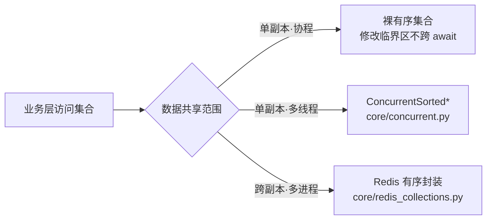

# 并发集合与并发安全详细设计

> 项目骨架 · 01 工程骨架 · 03 backend 分层目录与职责 · 嵌套子任务 02 · 详细设计

[文档首页](../../../../../../文档首页.md) › [03-2 并发集合与并发安全](../01_工程骨架_03_backend分层目录与职责_02_并发集合与并发安全.md) › 01 详细设计　|　[← 父任务](../../01_工程骨架_03_backend分层目录与职责.md)

## 1. 概述 <a id="overview"></a>

- **目标**：在 01-3-1（单副本有序集合）之上建立**并发安全集合体系**——单副本内多线程安全（进程内并发集合）、跨副本共享一致（Redis 有序封装）。这是系统正确性与性能的关键点。
- **范围**：进程内并发集合 + Redis 有序结构封装都实现；含微基准与并发正确性用例。不含业务缓存策略（02 域）与分布式事务。
- **依据**：需求 [01-3](../../../../需求/01_需求_工程骨架.md#r01-3) 第 6 条、《[后端开发规范](../../../../../../规范/后端开发规范.md)》第 8 节、《[命名规范](../../../../../../规范/命名规范.md)》Redis key 约定、《[架构设计 · 总体架构](../../../../../../设计/架构设计/03_架构设计_总体架构.md)》《[架构设计 · 多租户路由](../../../../../../设计/架构设计/08_架构设计_子系统_多租户路由.md)》《[架构设计 · 性能与安全](../../../../../../设计/架构设计/27_架构设计_性能与安全.md)》、2026-09-10 设计确认。

## 2. 并发模型与问题 <a id="model"></a>

### 2.1 三档并发

| 层级 | 共享范围 | 现状风险 | 安全手段 |
| --- | --- | --- | --- |
| 协程 | 单副本·单事件循环（async 全链路） | 修改中途 `await` 造成交错 | 临界区内不 `await` 即天然原子；无需锁 |
| 线程 | 单副本·多线程（FastAPI sync 端点线程池、多线程 worker） | `sortedcontainers` 非线程安全；复合操作与「遍历中修改」会损坏结构 | 进程内并发集合（§4） |
| 多副本 | 跨进程/跨主机（backend、worker 多副本） | 进程内存互不可见 | Redis 为事实源 + 本地快照 + 版本号（§5） |

### 2.2 为什么进程内存不能跨进程共享

- 每进程独立虚拟地址空间，Python 对象（含 `SortedDict`）对其他进程不可见；
- `multiprocessing.Manager` 走 IPC 代理（每次操作序列化，性能差，且不跨容器/主机）；`shared_memory` 仅原始字节，无对象语义、无锁、需自研序列化；
- **结论**：进程内锁只解决「单副本内线程/协程」；「多副本一致」必须 Redis/DB（本项目 Redis 已承担引擎锁、幂等、版本号一致性）。

### 2.3 Python 并发事实

- GIL 只保证单步原子（如 dict 单键读写）；复合操作与「遍历中修改」均不安全（Python 3.14《Thread Safety Guarantees》）；
- free-threading（3.14t）下锁更不可省；本设计不依赖 GIL 特性；
- `sortedcontainers` 官方定位**非线程安全**，必须外部同步（第三方库文档明示）。

## 3. 分层方案总览 <a id="layers"></a>



**选型规则**：

| 场景 | 方案 |
| --- | --- |
| 配置/注册表等「启动后基本只读」 | 快照替换（读无锁） |
| 读多写少的进程内缓存/索引 | `ConcurrentSorted*` + 读写锁 |
| 大集合高并发写（计数/排行/去重） | 分片锁；或 Redis ZSET |
| 跨副本共享/多 worker 一致 | Redis 有序封装 + 版本号 |

## 4. 进程内并发集合设计 <a id="concurrent"></a>

`app/core/concurrent.py`：包装 01-3-1 的有序集合，提供锁内操作与快照遍历。

### 4.1 类与 API

| 类 | 底层 | 有序口径 |
| --- | --- | --- |
| `ConcurrentSortedList[T]` | `SortedList` | 按元素（或 `key=`）升序 |
| `ConcurrentSortedDict[K, V]` | `SortedDict` | 按键升序 |
| `ConcurrentSortedSet[T]` | `SortedSet` | 按元素升序去重 |

公共方法 = 01-3-1 集合方法（`to_list / to_dict / to_json / sorted_by / chunk / merge` 与集合运算）+ 原子复合方法 + `snapshot()`。

**原子复合方法**（锁内完成，消除「读-改-写」竞态）：

| 方法 | 语义 |
| --- | --- |
| `put_if_absent(key, value)` | 不存在才写入；返回既有值或 None |
| `update_atomic(key, func)` | 原子更新（`func`：旧值 → 新值）；`func` 必须纯计算、禁 IO/耗时 |
| `remove_atomic(key)` | 删除并返回旧值 |
| `replace_if_equal(key, expected, new)` | CAS 语义 |
| `get_and_remove(key)` | 取走并删除 |
| `get_locked(key)` | 上下文管理器：锁内完成复杂复合逻辑 |

**遍历语义**：`iter` / `to_list` / `items` 等一律返回**快照副本**；锁外不暴露内部结构。

### 4.2 锁策略

| 策略 | 实现 | 适用 | 代价 |
| --- | --- | --- | --- |
| 读写锁（默认） | `threading.Condition` 自实现（写优先防饿死） | 读多写少 | 自实现与单测成本 |
| 单锁 | `RLock` 全包 | 通用/写多、实现最简 | 读不并行 |
| 分片锁 | key 哈希取模分 N 桶、桶内各一锁；排序遍历合并各桶 | 大 dict/set 高并发写 | 遍历需 O(n) 合并；跨桶复合操作取全局锁 |
| 快照替换 | 不可变副本 + 原子引用替换（读无锁） | 读极多写极少（配置/注册表） | 写复制 O(n)、内存峰值 |

```python
class ConcurrentSortedDict[KeyT, ValueT](
    BaseObject,
):
    """并发有序字典：锁内操作 + 快照遍历。"""

    def __init__(self, *, strategy: LockStrategy = LockStrategy.RW) -> None:
        ...
```

- 策略由调用方显式传入（默认读写锁），不做隐式自适应；分片数默认 16（可配），由微基准校准。

### 4.3 正确性要求

- **线性化**：单次公共方法调用在锁内完成，等价原子操作；
- **无丢失更新**：读-改-写一律走原子复合方法；
- **遍历一致**：快照取自同一时刻；
- **死锁规避**：锁内禁 IO 与外部回调（`update_atomic` 的 `func` 例外，文档强约束）；分片锁跨桶操作固定加锁顺序。

## 5. Redis 有序封装设计 <a id="redis"></a>

`app/core/redis_collections.py`：跨副本共享的有序结构，Redis 为唯一事实源。

### 5.1 结构映射

| 本地语义 | Redis 结构 | 说明 |
| --- | --- | --- |
| 有序字典（按键） | ZSET（score=0，member=key）+ Hash（key → value） | `ZRANGEBYLEX` 按键字典序；Lua 保证两结构一致 |
| 有序集合（按分值） | ZSET | ZADD / ZRANGE / ZRANGEBYSCORE / ZRANK |
| 有序列表（稳定序） | ZSET（score=序号或时间戳） | 也可用 List + LPUSH/RPUSH/LRANGE/LTRIM；需稳定索引与随机访问用 ZSET |
| 计数/排行 | ZSET（ZINCRBY） | 原子累加 |

### 5.2 原子与批量

- 复合操作（读-改-写）一律 **Lua**（`EVALSHA` + 脚本摘要缓存，脚本随包管理）；
- 纯批量操作用 **pipeline** 降 RTT；
- 乐观并发备选 `WATCH/MULTI`（冲突有限次重试）。

### 5.3 跨副本一致性

- Redis 为唯一事实源；本进程维护**只读快照 + 版本号**（`bms:{租户|global}:{域}:version`）惰性比对；
- 写路径：写 Redis → 版本号自增 → 本地快照失效；
- 与 `dogpile.cache` 全局版本号机制同构，避免引入第二套一致性模型。

### 5.4 Key 与容量

- 命名遵循《命名规范》`bms:{租户|global}:{域}:{业务键}`（全小写冒号分隔）；本任务集合 key 形如 `bms:global:collections:{name}`、`bms:{tenant}:collections:{name}`；
- 缓存类 key 必须 TTL；注册表类无 TTL 但提供清理接口；
- 避免大 key：单集合默认阈值 10 万元素 / 10MB，超限告警并由调用方分片。

### 5.5 连接注入

- 构造注入 `redis.asyncio.Redis`（全局客户端由 02 域配置管理提供）；本任务不在模块内自建连接、不在请求内新建连接。

## 6. 性能设计与取舍 <a id="perf"></a>

- **临界区最小化**：锁内只做内存操作，序列化/IO 尽量移出；
- **并发度**：读多写少用读写锁（读并行）；大集合写密集用分片锁；只读热点用快照（读零锁）；
- **Redis 成本**：往返为主——批量走 pipeline、复合操作走 Lua（一次往返）、合理 TTL 控制数据量；
- **验收口径**：微基准作为调参依据（分片数、读写比、锁策略），硬指标随阶段九/十 **500 并发 / P99 ≤ 1s** 压测验收；
- **内存**：快照副本、分片与列表分块有额外开销，基准报告如实记录。

## 7. 测试设计（Kiwi 先行） <a id="tests"></a>

| Kiwi | 用例 | 自动化 |
| --- | --- | --- |
| 16 | 进程内并发安全：多线程混合读写不丢不重、快照一致、复合方法原子、四种策略行为一致 | `tests/core/test_concurrent.py`（`ThreadPoolExecutor` + `Barrier`） |
| 17 | Redis 有序封装：排序语义、Lua 原子复合、版本号失效一致性 | `tests/core/test_redis_collections.py`（fakeredis 单元 + 真实 Redis integration） |
| 1–15 | 既有基类/集合/API 用例回归（不受影响） | 既有 `tests/*` |

- 微基准：`backend/benchmarks/bench_collections.py`（单/多线程吞吐、读写比 9:1 与 1:1、锁开销对比裸 `sortedcontainers`；输出表格 + JSON），**CI 不跑**，随压测/调参手动执行；
- 依赖：dev 增加 `fakeredis`（异步支持）；运行时 `redis>=5.0` 已具备。

## 8. 实施步骤 <a id="steps"></a>

1. Kiwi 登记用例 16、17 并取 ID。
2. 新增 dev 依赖 `fakeredis` 与 `backend/benchmarks/` 目录。
3. 实现 `core/concurrent.py`（策略、原子方法、快照）。
4. 实现 `core/redis_collections.py`（结构映射、Lua、版本号）。
5. 《后端开发规范》§8 增补并发集合条款（选型规则、锁内禁 IO、快照遍历）；§4 继承约定补 `ConcurrentSorted*`。
6. 新增并发用例（多线程 + fakeredis）与微基准，跑通全量测试。
7. 验证：`pytest` / `ruff` / `pyright` / 覆盖率 100% / 微基准报告；integration 用例随 05-02。
8. 回写：实施/测试记录、任务与计划状态、README。

## 9. 验收映射 <a id="accept-map"></a>

| 完成标准 | 验证方式 |
| --- | --- |
| 多线程并发无丢失/异常 | Kiwi 16 用例（线程池压测断言） |
| 遍历快照一致 | 快照一致性用例 |
| Redis 有序与原子可用 | Kiwi 17（fakeredis 全绿；真实 Redis integration 随 05-02） |
| 性能有据 | 微基准报告（锁开销、吞吐对比、分片调参） |
| 无 lint/类型错误 | `uv run ruff check .`、`uv run pyright` |
| 覆盖率 100% | `uv run pytest --cov=app` |
| 规范含并发条款 | 《后端开发规范》§8 核对 |
| Kiwi 用例登记并标注 | 平台登记 + 代码 `kiwi_id` |

## 10. 边界与开放项 <a id="boundary"></a>

- 不含分布式事务与「跨副本强一致锁语义」；分布式锁仍走 Redis SETNX（规范 §8 既有口径）。
- Redis 集群/哨兵/持久化口径随部署设计（《架构设计 · 部署与运维》）。
- free-threading（3.14t）未启用；启用后需复跑微基准复测锁开销。
- 大 key 阈值与分片数由压测校准；微基准入口固定便于复跑。
- 业务缓存策略（TTL/穿透/雪崩）归 02 域缓存任务；本任务只提供集合封装。
- 已实施（2026-09-10）：见 [实施记录 01](../实施/02_实施_01_并发集合与并发安全.md)、[测试记录 01](../测试/02_测试_01_并发集合与并发安全.md)；真实 Redis integration 随 05-02。

## 11. 对齐记录 <a id="align"></a>

| # | 事项 | 结论 |
| --- | --- | --- |
| 1 | 归属 | 01_03 下嵌套子任务 01-3-2，依赖 01-3-1 |
| 2 | 范围 | 进程内 + Redis 都实现；微基准 + 阶段压测 |
| 3 | 工时 | 8h；01_03 重估 15h；父任务 29h；阶段总 80h |
| 4 | 测试 | fakeredis 单元 + integration 标记连真实 Redis |
| 5 | 文件 | `core/concurrent.py` + `core/redis_collections.py` |
| 6 | 基线 | 需求 01-3 追加第 6 条；状态与账目按确认模式同步 |

> 本文档依《文档生成规范》编写 · 关键决策逐项确认
