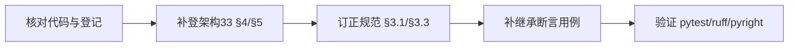

# 根基类与集合体系实施记录

> 项目骨架 · 02 后端基座 · 01 根基类与集合体系 · 实施记录

[文档首页](../../../../../../文档首页.md) › [01 根基类与集合体系](../02_后端基座_01_根基类与集合体系.md) › 01 实施　|　[← 父任务](../02_后端基座_01_根基类与集合体系.md)

## 1. 实施信息 <a id="meta"></a>

| 项 | 值 |
| --- | --- |
| 任务 | [01 根基类与集合体系](../02_后端基座_01_根基类与集合体系.md) |
| 对应需求 | [02-1](../../../../需求/02_需求_后端基座.md#r02-1)、[02-2](../../../../需求/02_需求_后端基座.md#r02-2)、[02-3](../../../../需求/02_需求_后端基座.md#r02-3)、[02-4](../../../../需求/02_需求_后端基座.md#r02-4) |
| 详细设计 | [01_详细设计_01_根基类与集合体系](../设计/01_详细设计_01_根基类与集合体系.md) |
| 实施日期 | 2026-09-13 |
| 实施人 | minjian |
| 实施环境 | 开发机（Ubuntu，Python 3.14 / uv） |
| 提交 | 设计提交 `438b56a`；实施提交待确认 |
| 结论 | 完成 |

## 2. 实施概览 <a id="overview"></a>



结果小结：四条支线（L0 根基类 / 有序集合 / 进程内并发集合 / 跨副本 Redis 封装）的类名、继承链、代码位置在《架构设计 · 后端基础类体系》与《后端开发规范》「后端基座体系（强制）」节登记齐备、与代码一致；无业务代码改动；继承断言用例补齐，`pytest` / `ruff` / `pyright` 全绿。

## 3. 实施过程 <a id="process"></a>

1. **核对代码与登记**：对照 `backend/app/core/{base,collections,concurrent,redis_collections}.py`，逐条核对架构33 §4、规范 §3 已登记项。结论：`BaseObject`、`BaseSorted → SortedList/SortedDict/SortedSet`、`BaseConcurrentSorted → ConcurrentSorted*` 三条支线登记与代码一致；识别差额——`ValueHolder`、`LockStrategy`、`RedisSortedSet` / `RedisSortedDict` / `RedisSnapshot` 未单独登记，规范 §3.1 Redis 封装父层标「—」与实际不符。
2. **补登架构33 §4/§5**：§4 基类清单增 `ValueHolder`、`LockStrategy`、`RedisSortedSet` / `RedisSortedDict` / `RedisSnapshot` 五行；§4 继承链补「跨副本封装 → `BaseObject`」；§5 跨副本共享条补三个具体类名与版本号 `{key}:version` 口径。
3. **订正规范 §3**：§3.1 分层总览表 Redis 封装父层由「—」改为 `BaseObject`；§3.3 进程内并发条补 `LockStrategy` 四策略（默认 `RW`），跨副本条补三个具体类名。
4. **补继承断言用例**：`tests/core/test_collections.py` 增 `test_inheritance_chain`（`BaseSorted → BaseObject`、`Sorted* → BaseSorted`，Kiwi 15）；`tests/core/test_redis_collections.py` 增 `test_inheritance_chain`（`RedisSortedSet` / `RedisSortedDict` / `RedisSnapshot → BaseObject`，Kiwi 17）。
5. **验证**：`uv run pytest`、`uv run ruff check .`、`uv run pyright` 全绿（详见 §5 与[测试记录](../测试/01_测试_01_根基类与集合体系.md)）。

关键命令：

```bash
uv run pytest -q
uv run pytest --cov=app -q
uv run ruff check .
uv run pyright
```

## 4. 问题与处置 <a id="issues"></a>

| 问题 / 现象 | 原因 | 处置与落点 |
| --- | --- | --- |
| 无 | — | 本任务为登记核对，代码与需求一致，未出现需修复的问题 |

## 5. 验证结果 <a id="verify"></a>

| 完成标准 | 验证方法 | 实测结果 |
| --- | --- | --- |
| 四条继承链职责 / 代码位置在架构节点与规范一致、可核对 | 架构33 §4 / 规范 §3 与代码逐项对照 | 一致（补登后齐备） |
| 「对外稳定序」「禁止进程内集合跨副本共享」约定纳入规范 | 规范 §3.3 核对 | 已纳入 |
| 继承断言用例就位 | `uv run pytest -q` | 72 passed, 2 skipped |
| 无 lint / 类型错误 | `uv run ruff check .` / `uv run pyright` | All checks passed / 0 errors |

## 6. 偏差与遗留 <a id="deviations"></a>

- **无偏差**：按详细设计执行，未改业务代码（设计允许的授权未动用）。
- 私有辅助（`ReadWriteLock` / `_LockGuard` / `_dump` / `_load` / `_score_for_key`）按设计不登记，属内部实现。
- **后续变更回写（2026-09-13）**：本次登记的 `BaseObject` 序列化口径在 02-2-3 升级为「声明字段优先」；`BaseObject` 在 02-2-4 去 `ABC`（改普通类，供 SQLAlchemy ORM 混合继承）；`ReadWriteLock` / `LockStrategy` / `LockGuard` 在 02-2-1 抽出为公共 `core/locking.py`（`LockGuard` 公开化），`LockStrategy` 登记位置随之更新为 `core/locking.py`。本次登记核对结论仍成立，细节见 [02-2-3 实施记录](../../02_后端基座_02_模块基类/02_后端基座_02_模块基类_03_请求响应基类/实施/03_实施_01_请求响应基类.md)、[02-2-4 实施记录](../../02_后端基座_02_模块基类/02_后端基座_02_模块基类_04_ORM模型基类与表规范/实施/04_实施_01_ORM模型基类与表规范.md) 与 [02-2-1 实施记录](../../02_后端基座_02_模块基类/02_后端基座_02_模块基类_01_数据访问基类/实施/01_实施_01_数据访问基类.md)。
- 真实 Redis 集成用例（`tests/integration/test_redis_collections_integration.py`）需 `BMS_TEST_REDIS_URL`，本机未配置即跳过，归 04_02（三库集成与流水线收口）重验证层执行；已在计划「后续阶段待办」表登记。

> 本文档依《文档生成规范》编写
