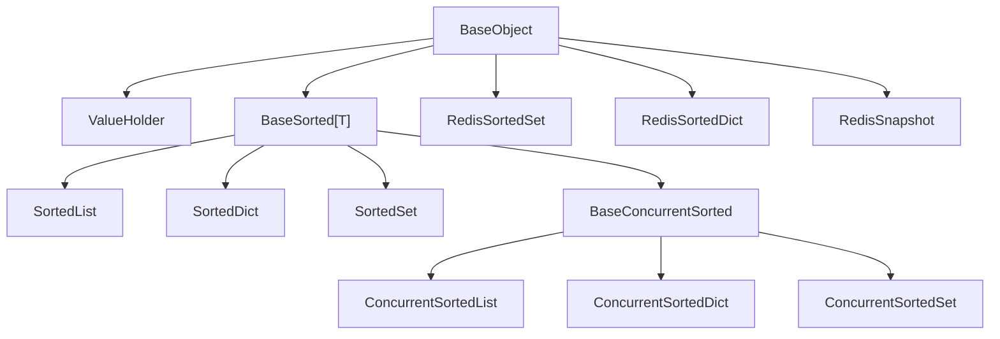

# 根基类与集合体系详细设计

> 项目骨架 · 02 后端基座 · 01 根基类与集合体系 · 详细设计

[文档首页](../../../../../../文档首页.md) › [01 根基类与集合体系](../02_后端基座_01_根基类与集合体系.md) › 01 详细设计　|　[← 父任务](../02_后端基座_01_根基类与集合体系.md)

## 1. 概述 <a id="overview"></a>

- **目标**：对阶段一已交付的 **L0 根基类**与**集合体系**（有序集合 / 进程内并发集合 / 跨副本 Redis 封装）做**职责 / 继承关系 / 代码位置**的**登记核对**——确保《[架构设计 · 后端基础类体系](../../../../../../设计/架构设计/33_架构设计_后端基础类体系.md)》「基类清单与继承链」节与《[后端开发规范](../../../../../../规范/后端开发规范.md)》第 3 节「后端基座体系」的登记与 `backend/app/core/` 代码一致、可核对；补登缺失项，补继承断言用例留证。
- **范围**：四条支线——需求 [02-1](../../../../需求/02_需求_后端基座.md#r02-1)（`BaseObject`）、[02-2](../../../../需求/02_需求_后端基座.md#r02-2)（有序集合）、[02-3](../../../../需求/02_需求_后端基座.md#r02-3)（进程内并发集合）、[02-4](../../../../需求/02_需求_后端基座.md#r02-4)（跨副本 Redis 封装）。含两处登记文档的差额补登与订正、继承断言用例补充；**不改业务代码**（除核对发现的笔误）。
- **依据**：《架构设计 · 后端基础类体系》「基类清单与继承链」节「有序与并发集合」节、《后端开发规范》第 3 节、《命名规范》「后端命名」节、01-3-1《基础类详细设计》、01-3-2《并发集合与并发安全详细设计》、2026-09-13 需求并入确认。
- **边界**：模块基类（`BaseRepository` / `BaseService` / `BaseSchema` / `BaseModel`）归 [02_02](../../02_后端基座_02_模块基类/02_后端基座_02_模块基类.md)；core 横切（异常 / 配置 / 安全 / 日志）归 [02_03](../../02_后端基座_03_core横切基座/02_后端基座_03_core横切基座.md)；机制底座归 [02_05](../../02_后端基座_05_机制底座/02_后端基座_05_机制底座.md)。本任务只登记「根基类 + 集合体系」四支线。

## 2. 现状与差距 <a id="gap"></a>

代码已于阶段一（01-3-1 / 01-3-2）交付并在架构节点、规范完成**主体登记**（2026-09-13 按继承链重写后已纳入）；本任务核对后识别以下**登记差额**：

| 项 | 代码事实 | 登记现状 | 差距 / 动作 |
| --- | --- | --- | --- |
| L0 `BaseObject` | `core/base.py`，方法 `to_dict` / `to_json` / `__str__` / `__repr__` / `__eq__` / `__hash__` | 架构33 §4、规范 §3.2 已登记 | 一致，核对 |
| L0 辅助类 `ValueHolder` | `core/base.py`，继承 `BaseObject`，供 `get_locked` 值替换 | 未登记 | **补登**架构33 §4 |
| 有序集合 | `BaseSorted` → `SortedList` / `SortedDict` / `SortedSet`（`core/collections.py`） | 架构33 §4、规范 §3.1/§3.3/§3.6 已登记 | 一致，核对 |
| 锁策略枚举 `LockStrategy` | `core/concurrent.py`：`RW` / `RLCK` / `SHARDED` / `SNAPSHOT` | 仅文字描述四种策略，类未单列 | **补登**规范 §3.3 + 架构33 §4 |
| 进程内并发集合 | `BaseConcurrentSorted` → `ConcurrentSortedList` / `ConcurrentSortedSet` / `ConcurrentSortedDict`（`core/concurrent.py`） | 架构33 §4、规范 §3.1 已登记 | 一致，核对 |
| 跨副本 Redis 封装 | `RedisSortedSet` / `RedisSortedDict` / `RedisSnapshot`（`core/redis_collections.py`），均继承 `BaseObject` | 仅泛称「Redis 有序封装」，未列具体类与继承 | **补登**具体类、职责与继承 |
| 规范 §3.1 父层口径 | Redis 封装类实际继承 `BaseObject` | 表内「跨副本有序封装」父层标「—」 | **订正**为 `BaseObject` |

> 代码侧无与需求不符项：类名、继承链、代码位置均与需求描述一致。故本次「可改代码」的授权预计不实际动用业务代码修改，仅用于必要时的笔误订正。

## 3. 交付物清单 <a id="tree"></a>

```text
bms文档/
├── 设计/架构设计/33_架构设计_后端基础类体系.md        # 修改：§4 补登 ValueHolder / LockStrategy / Redis 三类的职责·继承·位置
├── 规范/后端开发规范.md                              # 修改：§3.1 订正父层；§3.3 补锁策略枚举与 Redis 三类
└── 项目/01_项目骨架/任务/02_后端基座/
    └── 02_后端基座_01_根基类与集合体系/
        └── 设计/01_详细设计_01_根基类与集合体系.md   # 本文件

backend/tests/
├── core/test_collections.py                          # 修改：补 BaseSorted→BaseObject、Sorted*→BaseSorted 断言
└── core/test_redis_collections.py                    # 修改：补 RedisSortedSet/Dict/Snapshot→BaseObject 断言
```

代码：`backend/app/core/{base,collections,concurrent,redis_collections}.py` **保持不动**（仅核对）。

## 4. 登记矩阵 <a id="matrix"></a>

| 需求 | 类 / 封装 | 文件 | 继承关系 | 职责（登记口径） | 登记落点 |
| --- | --- | --- | --- | --- | --- |
| 02-1 | `BaseObject` | `core/base.py` | 无父类（ABC） | 公共方法唯一落点：反射序列化、稳定序 JSON、统一字符串输出、主键相等与哈希 | 架构33 §4、规范 §3.2 |
| 02-1 | `ValueHolder` | `core/base.py` | `→ BaseObject` | `get_locked` 上下文内可替换的值容器（进程内与 Redis 复用） | 架构33 §4（补登） |
| 02-2 | `BaseSorted[T]` | `core/collections.py` | `→ BaseObject` | 有序集合公共方法：`to_list` / `to_dict` / `to_json` / `sorted_by` / `chunk` / `merge` / 集合运算 | 架构33 §4、规范 §3.3 |
| 02-2 | `SortedList` / `SortedDict` / `SortedSet` | `core/collections.py` | `→ BaseSorted → BaseObject` | 插入即有序；对外稳定序；`SortedDict` 额外按键交并 | 架构33 §4、规范 §3.6 |
| 02-3 | `LockStrategy` | `core/concurrent.py` | 枚举（StrEnum） | 锁策略：`RW`（默认）/ `RLCK` / `SHARDED` / `SNAPSHOT` | 架构33 §4、规范 §3.3（补登） |
| 02-3 | `BaseConcurrentSorted` | `core/concurrent.py` | `→ BaseSorted → BaseObject` | 锁策略守卫 + SNAPSHOT 写时复制模板 | 架构33 §4、规范 §3.1 |
| 02-3 | `ConcurrentSortedList` / `ConcurrentSortedSet` / `ConcurrentSortedDict` | `core/concurrent.py` | `→ BaseConcurrentSorted → BaseSorted → BaseObject` | 多线程共享：读-改-写走原子复合方法、遍历取快照 | 架构33 §4、规范 §3.3 |
| 02-4 | `RedisSortedSet` | `core/redis_collections.py` | `→ BaseObject` | Redis ZSET 有序集合（按分值），跨副本共享 | 架构33 §4/§5、规范 §3.3（补登） |
| 02-4 | `RedisSortedDict` | `core/redis_collections.py` | `→ BaseObject` | Redis ZSET + Hash 有序字典，Lua 原子复合 + WATCH 乐观重试 | 架构33 §4/§5、规范 §3.3（补登） |
| 02-4 | `RedisSnapshot` | `core/redis_collections.py` | `→ BaseObject` | 本地只读快照，远程版本号变化（或本地失效）时重载 | 架构33 §5、规范 §3.3（补登） |

继承关系（登记用）：



## 5. 逐项登记设计 <a id="register"></a>

### 5.1 L0 根基类 <a id="reg-l0"></a>

- `BaseObject`（`core/base.py`）：架构33 §4 已列，职责与规范 §3.2 一致；核对方法清单（`to_dict` / `to_json` / `__str__` / `__repr__` / `__eq__` / `__hash__`）与代码一致即通过。
- `ValueHolder`：在架构33 §4 基类清单增行——「`ValueHolder` | `core/base.py` | `get_locked` 上下文内可替换值容器（继承 `BaseObject`）| 已交付」；规范 §3.2 不必展开（属实现辅助类，仅在架构清单登记）。

### 5.2 有序集合 <a id="reg-sorted"></a>

架构33 §4 / §5 与规范 §3.3 已登记 `BaseSorted` → `SortedList` / `SortedDict` / `SortedSet` 的继承链、稳定序强制口径与公共方法；逐条核对代码签名无误即通过，不新增条款。

### 5.3 进程内并发集合 <a id="reg-concurrent"></a>

- 架构33 §4 补登 `LockStrategy`（枚举，四策略取值与含义）；
- 规范 §3.3「进程内并发（强制）」段补一句：锁策略由 `LockStrategy` 显式传入（默认 `RW`），四策略 `RW` / `RLCK` / `SHARDED` / `SNAPSHOT`；
- `BaseConcurrentSorted` → `ConcurrentSorted*` 继承链已登记，核对一致。

### 5.4 跨副本 Redis 封装 <a id="reg-redis"></a>

- 架构33 §4 将「Redis 有序封装」一行细化为三个具体类：`RedisSortedSet`（ZSET，按分值）、`RedisSortedDict`（ZSET + Hash，Lua 原子复合 + WATCH 乐观重试）、`RedisSnapshot`（本地只读快照 + 版本号惰性重载），均标注继承 `BaseObject`、文件 `core/redis_collections.py`、状态「已交付」；
- 架构33 §5 补一句：跨副本封装以 **Redis 为唯一事实源 + `RedisSnapshot` 只读快照 + 版本号（`{key}:version`）惰性比对**，复合操作用 Lua（`replace_if_equal` / `get_and_remove`）与 WATCH + MULTI 乐观重试（`update_atomic` / `get_locked`）；
- 规范 §3.3「跨副本共享（强制）」段补登三个具体类名（现行已给机制口径，仅补类名与落点）。

### 5.5 订正项 <a id="fix"></a>

规范 §3.1 分层总览表「跨副本有序封装（Redis）」父层由「—」订正为 `BaseObject`（与代码继承一致）。

## 6. 代码修正口径 <a id="code"></a>

- 本次核对**未发现代码偏差**，业务代码不改；若补登过程中发现类名 / 继承 / 文件位置与文档笔误（非代码错误），以**代码为准**回写文档。
- 若确实发现代码与需求不符（预期不发生），按「以代码为准回写登记」处理并在本任务实施记录登记；确需改代码时另行确认，不在本设计预设范围内。

## 7. 测试设计（Kiwi 先行） <a id="tests"></a>

继承断言并入**既有用例**（不新登记 Kiwi 编号），作为登记可核对的自动化证据：

| Kiwi | 用例 | 文件 | 补充断言 |
| --- | --- | --- | --- |
| 15 | 有序集合基类 | `tests/core/test_collections.py` | `issubclass(BaseSorted, BaseObject)`；`SortedList/SortedDict/SortedSet` 均 `issubclass(…, BaseSorted)` |
| 17 | Redis 有序封装 | `tests/core/test_redis_collections.py` | `RedisSortedSet/RedisSortedDict/RedisSnapshot` 均 `issubclass(…, BaseObject)` |
| 16 | 进程内并发安全 | `tests/core/test_concurrent.py` | 已有 `ConcurrentSorted* → BaseConcurrentSorted → BaseSorted → BaseObject` 断言，**核对即可** |
| 14 | BaseObject 公共方法 | `tests/core/test_base_object.py` | 已含 `BaseRepository/BaseService/BaseSchema → BaseObject` 断言，**核对即可** |

## 8. 实施步骤 <a id="steps"></a>

1. 逐条核对代码（`base.py` / `collections.py` / `concurrent.py` / `redis_collections.py`）类名、继承、文件位置与架构33 §4、规范 §3 登记。
2. 补登架构33 §4：`ValueHolder`、`LockStrategy`、`RedisSortedSet` / `RedisSortedDict` / `RedisSnapshot`；§5 补 Redis 快照与版本号口径。
3. 订正规范 §3.1 父层；§3.3 补 `LockStrategy` 与 Redis 三类类名。
4. 补继承断言：`test_collections.py`、`test_redis_collections.py`。
5. 验证：`uv run pytest`、`uv run ruff check .`、`uv run pyright` 全绿。
6. 回写：实施记录 + 任务/需求/计划状态（登记核对完成）。

## 9. 验收映射 <a id="accept-map"></a>

| 完成标准 | 验证方式 |
| --- | --- |
| 四条继承链职责 / 代码位置在架构节点与规范一致、可核对 | 架构33 §4 / 规范 §3 与代码逐项对照；§4 登记矩阵 |
| 「对外稳定序」「禁止进程内集合跨副本共享」约定纳入规范 | 规范 §3.3 核对 |
| 继承断言用例就位 | `pytest tests/core/` 全绿 |
| 无 lint / 类型错误 | `uv run ruff check .`、`uv run pyright` |

## 10. 边界与开放项 <a id="boundary"></a>

- **不含**模块基类（02_02）、core 横切（02_03）、机制底座（02_05）的登记——各归其任务。
- **不含**并发正确性 / Redis 一致性用例本身（归 01-3-2，已有）——本任务只补继承断言。
- `RedisSnapshot` 的版本号 key 约定（`{key}:version`）与 TTL 策略随调用方；本任务只登记机制，不定调用口径。
- 私有辅助（`ReadWriteLock` / `_LockGuard` / `_dump` / `_load` / `_score_for_key`）不单独登记（内部实现，不构成对外基类契约）。

## 11. 对齐记录 <a id="align"></a>

| # | 事项 | 结论 |
| --- | --- | --- |
| 1 | 任务定位 | 登记核对 + 可改代码授权；经核对代码无偏差，实际不改业务代码 |
| 2 | 登记落点 | 沿用《架构设计 · 后端基础类体系》与《后端开发规范》§3，不另建独立登记清单 |
| 3 | 补登范围 | `ValueHolder`、`LockStrategy`、`RedisSortedSet` / `RedisSortedDict` / `RedisSnapshot`；订正规范 §3.1 父层 |
| 4 | 核对手段 | 复用现有继承断言，补 `test_collections.py` / `test_redis_collections.py` 缺失断言，并入既有 Kiwi 15/17 |
| 5 | 工时 / 窗口 | 1h；2026-10-05 |

> 本文档依《文档生成规范》编写 · 关键决策逐项确认
