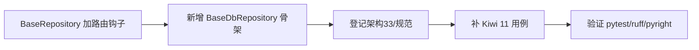

# 数据访问基类实施记录

> 项目骨架 · 02 后端基座 · 02 模块基类 · 01 数据访问基类 BaseRepository · 实施记录

[文档首页](../../../../../../../文档首页.md) › [02-2-1 数据访问基类 BaseRepository](../02_后端基座_02_模块基类_01_数据访问基类.md) › 01 实施　|　[← 父任务](../02_后端基座_02_模块基类_01_数据访问基类.md)

## 1. 实施信息 <a id="meta"></a>

| 项 | 值 |
| --- | --- |
| 任务 | [01 数据访问基类 BaseRepository](../02_后端基座_02_模块基类_01_数据访问基类.md) |
| 对应需求 | [02-5](../../../../../需求/02_需求_后端基座.md#r02-5) |
| 详细设计 | [01_详细设计_01_数据访问基类](../设计/01_详细设计_01_数据访问基类.md) |
| 实施日期 | 2026-09-13 |
| 实施人 | minjian |
| 实施环境 | 开发机（Ubuntu，Python 3.14 / uv） |
| 提交 | 设计提交 `554a8d6`；实施提交待确认 |
| 结论 | 完成 |

## 2. 实施概览 <a id="overview"></a>



结果小结：`BaseRepository[T]` 契约定型并预留 `_resolve_binding` / `_resolve_shard` 钩子；新增数据库实现骨架 `BaseDbRepository[T]`（占位、不连库）；继承约定登记入架构节点与规范；`pytest` / `ruff` / `pyright` 全绿、覆盖率 100%。

## 3. 实施过程 <a id="process"></a>

1. **基类钩子**：`app/repositories/base_repository.py` 新增 `_resolve_binding(*, read_only) -> str`（默认 `"default"`，单源同源）与 `_resolve_shard(logical_table) -> str`（默认返回逻辑表名）。
2. **DB 骨架类**：新增 `app/repositories/base_db_repository.py` 的 `BaseDbRepository[T](BaseRepository[T])`，覆写 `_build` / `_apply` / `list` / `get` / `count` / `create` / `update` / `delete` 为占位（抛 `NotImplementedError`，不连库）；`exists` 不覆写，沿用 `get(...) is not None` 派生链。
3. **登记**：《架构设计 · 后端基础类体系》§4 基类清单加 `BaseDbRepository` 行、§4 继承链补「数据库实现 → `BaseRepository`」、§7 模块约定按存储形态二选一；《后端开发规范》§3.4 补 `BaseDbRepository` 条。
4. **测试**：`tests/repositories/test_base_repository.py` 补钩子默认值断言与 DB 骨架占位断言（Kiwi 11），并以测试子类 `DbItemRepository` 暴露 `_build` / `_apply` 覆盖占位分支。
5. **验证**：`uv run pytest` / `uv run ruff check .` / `uv run pyright` 全绿，覆盖率 100%（详见[测试记录](../测试/01_测试_01_数据访问基类.md)）。

关键命令：

```bash
uv run pytest --cov=app -q
uv run ruff check .
uv run pyright
```

## 4. 问题与处置 <a id="issues"></a>

| 问题 / 现象 | 原因 | 处置与落点 |
| --- | --- | --- |
| 首轮覆盖率降至 99%（2 行未覆盖） | `BaseDbRepository._build` / `_apply` 未被用例直接触发 | 测试新增 `DbItemRepository` 子类暴露两个钩子并断言抛错，覆盖率回到 100%（见测试记录 §5） |
| 测试直接访问 `_resolve_binding` / `_resolve_shard` 触发 pyright 私有访问告警 | pyright strict `reportPrivateUsage` | 在 `ItemRepository` 内加公开包装方法 `binding` / `shard`，class 内访问私有钩子 |

## 5. 验证结果 <a id="verify"></a>

| 完成标准 | 验证方法 | 实测结果 |
| --- | --- | --- |
| `BaseRepository[T]` 可继承、`exists` / `count` 正确 | `uv run pytest` | 74 passed, 2 skipped |
| 数据库实现为占位且不连库 | 占位抛错断言 + 代码无 DB 驱动 import | 通过 |
| 继承约定纳入规范 | 《后端开发规范》§3.4、《架构设计 · 后端基础类体系》§7 核对 | 已登记 |
| 无 lint / 类型错误 | `uv run ruff check .` / `uv run pyright` | All checks passed / 0 errors |

## 6. 偏差与遗留 <a id="deviations"></a>

- **无偏差**：按详细设计执行。
- 本任务保持**同步**口径；全链路异步切换、引擎 / 会话、四库方言、读写分离真实路由归 02-5-1 数据访问底座。
- 软删除过滤 / 分页回填随 02-5-1 / 02-2-4 定稿后回填基类；分片路由真实实现（按月分表）跨阶段回补（02-13 登记）。

> 本文档依《文档生成规范》编写
