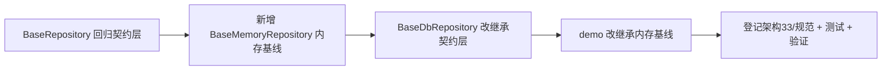

# 数据访问基类实施记录

> 项目骨架 · 02 后端基座 · 02 模块基类 · 01 数据访问基类 BaseRepository · 实施记录

[文档首页](../../../../../../../文档首页.md) › [02-2-1 数据访问基类 BaseRepository](../02_后端基座_02_模块基类_01_数据访问基类.md) › 01 实施　|　[← 父任务](../02_后端基座_02_模块基类_01_数据访问基类.md)

## 1. 实施信息 <a id="meta"></a>

| 项 | 值 |
| --- | --- |
| 任务 | [01 数据访问基类 BaseRepository](../02_后端基座_02_模块基类_01_数据访问基类.md) |
| 对应需求 | [02-5](../../../../../需求/02_需求_后端基座.md#r02-5) |
| 详细设计 | [01_详细设计_01_数据访问基类](../设计/01_详细设计_01_数据访问基类.md) |
| 实施日期 | 2026-09-13 |
| 实施人 | minjian |
| 实施环境 | 开发机（Ubuntu，Python 3.14 / uv） |
| 提交 | 待确认 |
| 结论 | 完成 |

## 2. 实施概览 <a id="overview"></a>



结果小结：仓储契约与实现分离——契约层（CRUD + 派生 + 路由钩子）、内存基线（`_build` / `_apply`）、DB 骨架（占位不连库）；`pytest` / `ruff` / `pyright` 全绿、覆盖率 100%。

## 3. 实施过程 <a id="process"></a>

1. **契约层**：`app/repositories/base_repository.py` 回归 `BaseRepository[T]`——`list/get/count/create/update/delete` 抽象 + `exists` 派生 + `_resolve_binding` / `_resolve_shard` 钩子；移除 `_items/_next_id/_build/_apply`。
2. **内存基线**：新增 `app/repositories/base_memory_repository.py` 的 `BaseMemoryRepository[T]`（字典存储 + 自增 ID + 抽象 `_build` / `_apply`）。
3. **DB 骨架**：`base_db_repository.py` 改继承契约层，覆写 CRUD 抛 `NotImplementedError`（占位、不连库）；去掉内存钩子。
4. **demo**：`demo_repository.py` 改继承 `BaseMemoryRepository`。
5. **登记**：《架构设计 · 后端基础类体系》§3 / §4 / §7、《后端开发规范》§3.1 / §3.4 / §3.6。
6. **测试**：重写 `tests/repositories/test_base_repository.py`（契约 / 内存 / DB 骨架 / 继承链）。
7. **验证**：`uv run pytest` / `uv run ruff check .` / `uv run pyright` 全绿，覆盖率 100%（详见[测试记录](../测试/01_测试_01_数据访问基类.md)）。

关键命令：

```bash
uv run pytest --cov=app -q
uv run ruff check .
uv run pyright
```

## 4. 问题与处置 <a id="issues"></a>

| 问题 / 现象 | 原因 | 处置与落点 |
| --- | --- | --- |
| 首版 `BaseRepository` 契约与内存基线合一 | `_build/_apply` 是内存专用钩子却置于契约层，DB 骨架被迫实现（抛 NotImplementedError） | 按「契约与实现分离」拆三层：`BaseRepository`（契约）/ `BaseMemoryRepository`（内存）/ `BaseDbRepository`（DB） |

## 5. 验证结果 <a id="verify"></a>

| 完成标准 | 验证方法 | 实测结果 |
| --- | --- | --- |
| 仓储契约可继承、CRUD / 派生方法正确 | `uv run pytest` | 82 passed, 2 skipped |
| 数据库实现为占位且不连库 | DB 骨架抛错断言 | 通过 |
| 继承约定纳入规范 | 《后端开发规范》§3.4、《架构设计 · 后端基础类体系》§7 | 已登记 |
| 无 lint / 类型错误 | `uv run ruff check .` / `uv run pyright` | All checks passed / 0 errors |

## 6. 偏差与遗留 <a id="deviations"></a>

- **无偏差**：按详细设计执行。
- 本任务保持**同步**口径；异步切换、引擎 / 会话、`DbUnitOfWork`、读写分离真实路由归 02-5-1。
- 分片路由真实实现跨阶段回补（02-13 登记）；软删除过滤 / 分页回填随 02-5-1 / 02-2-4。

> 本文档依《文档生成规范》编写
