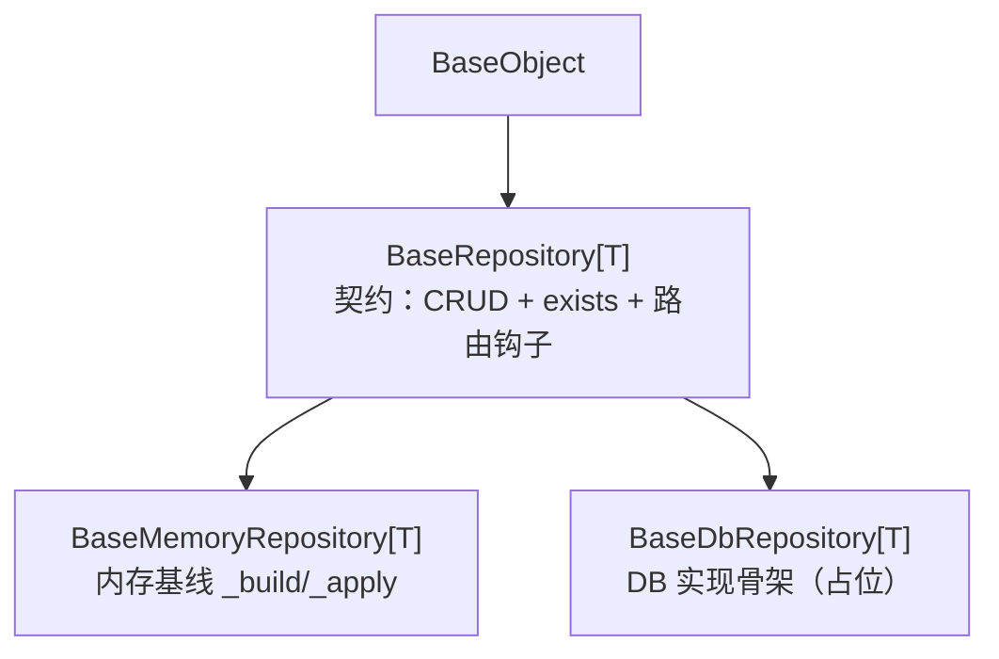

# 数据访问基类详细设计

> 项目骨架 · 02 后端基座 · 02 模块基类 · 01 数据访问基类 BaseRepository · 详细设计

[文档首页](../../../../../../../文档首页.md) › [02-2-1 数据访问基类 BaseRepository](../02_后端基座_02_模块基类_01_数据访问基类.md) › 01 详细设计　|　[← 父任务](../02_后端基座_02_模块基类_01_数据访问基类.md)

## 1. 概述 <a id="overview"></a>

- **目标**：仓储基类**分层**——`BaseRepository[T]`（**契约**：CRUD 抽象 + `exists` 派生 + 数据源 / 分片路由钩子）、`BaseMemoryRepository[T]`（**内存基线**：`_build` / `_apply` + 字典存储）、`BaseDbRepository[T]`（**数据库实现骨架**，占位不连库）；契约与实现分离，DB 侧不再背负内存钩子。
- **范围**：仓储三层基类、路由钩子、继承约定登记、单测。
- **不含**（归相邻任务）：异步切换、引擎 / 会话、四库方言、读写分离真实路由与 `DbUnitOfWork`（[02-5-1](../../../02_后端基座_05_机制底座/02_后端基座_05_机制底座_01_数据访问底座/02_后端基座_05_机制底座_01_数据访问底座.md)）；分片路由真实实现（跨阶段回补，02-13 登记）；服务基类（[02-2-2](../../02_后端基座_02_模块基类_02_服务基类/02_后端基座_02_模块基类_02_服务基类.md)）；`BaseSchema` / `BaseModel`（02-2-3 / 02-2-4）。
- **依据**：需求 [02-5](../../../../../需求/02_需求_后端基座.md#r02-5)、《[架构设计 · 后端基础类体系](../../../../../../../设计/架构设计/04_架构设计_后端基础类体系.md)》「基类清单与继承链」节「各层基类与模块约定」节、《[架构设计 · 数据访问与分片](../../../../../../../设计/架构设计/12_架构设计_子系统_数据访问与分片.md)》、《[后端开发规范](../../../../../../../规范/后端开发规范.md)》「后端基座体系（强制）」节、《[命名规范](../../../../../../../规范/命名规范.md)》「后端命名」节。

## 2. 现状与差距 <a id="gap"></a>

| 现状（首版） | 差距 |
| --- | --- |
| `BaseRepository[T]` 同时是**契约与内存基线**，`_build` / `_apply` 为抽象方法 | 契约与实现未分层；`BaseDbRepository` 被迫实现内存专用钩子（只能抛 `NotImplementedError`） |
| 数据源 / 分片路由钩子 | 已预留，保留在契约层 |
| DB 实现骨架 | 需继承契约层，只实现会话（占位），不背内存钩子 |

## 3. 交付物清单 <a id="tree"></a>

```text
backend/
├── app/repositories/
│   ├── base_repository.py          # 修改：回归契约层（CRUD 抽象 + exists 派生 + 路由钩子）
│   ├── base_memory_repository.py   # 新增：内存基线（_build/_apply + 字典存储）
│   ├── base_db_repository.py       # 修改：继承契约层，DB 占位（不再有 _build/_apply）
│   └── demo_repository.py          # 修改：继承 BaseMemoryRepository
└── tests/repositories/
    └── test_base_repository.py     # 修改：契约 / 内存 / DB 骨架与继承链断言

bms文档/
├── 设计/架构设计/04_架构设计_后端基础类体系.md   # 修改：§3/§4/§7 登记三层仓储
└── 规范/后端开发规范.md                         # 修改：§3.1/§3.4/§3.6 登记仓储分层
```

## 4. 仓储分层设计 <a id="layers"></a>

| 层 | 类 | 文件 | 职责 |
| --- | --- | --- | --- |
| 契约层 | `BaseRepository[T]` | `repositories/base_repository.py` | CRUD 抽象 + `exists` 派生 + 数据源 / 分片路由钩子 |
| 内存基线 | `BaseMemoryRepository[T]` | `repositories/base_memory_repository.py` | 字典存储 + 自增 ID；子类只实现 `_build` / `_apply` |
| DB 实现骨架 | `BaseDbRepository[T]` | `repositories/base_db_repository.py` | 占位不连库；真实实现归 02-5-1 |



## 5. 契约层设计 <a id="contract"></a>

`app/repositories/base_repository.py`：

| 成员 | 形态 | 说明 |
| --- | --- | --- |
| `list()` / `get(id)` / `count()` / `create(**values)` / `update(id, **values)` / `delete(id)` | 抽象方法 | CRUD 契约 |
| `exists(id) -> bool` | 派生方法 | `get(...) is not None`，子类免实现 |
| `_resolve_binding(*, read_only) -> str` | 钩子（默认 `"default"`） | 数据源绑定（单源同源，占位）；02-5-1 / 02-5-2 覆写 |
| `_resolve_shard(logical_table) -> str` | 钩子（默认原表名） | 分片路由（占位）；分片基座跨阶段回补（02-13） |

## 6. 内存基线设计 <a id="memory"></a>

`app/repositories/base_memory_repository.py`：`BaseMemoryRepository[T] (BaseRepository[T])`——骨架期 / 测试替身实现。

- 字段：`_items: dict[int, ModelT]`、`_next_id`。
- 抽象钩子：`_build(item_id, values)` / `_apply(item, values)`（子类实现实体构造 / 更新）。
- 实现：`list`（按 ID 升序）、`get`、`count`、`create`（自增 ID）、`update`（缺失 None）、`delete`（缺失 False）；`exists` 沿用契约派生。

## 7. 数据库实现骨架设计 <a id="db"></a>

`app/repositories/base_db_repository.py`：`BaseDbRepository[T] (BaseRepository[T])`——占位、不连库。

- 覆写 `list` / `get` / `count` / `create` / `update` / `delete`；**后续变更（02-5-1）**：CRUD 已改 `async def` 并继承 `BaseStub`，占位经 `_not_implemented(feature)` 统一抛 `NotImplementedError`（同步口径以 02-5-1 详细设计为准）。
- `exists` 不覆写，沿用 `get(...) is not None` 派生；真实实现只需提供 `get` / `count`。
- 无 `_build` / `_apply`（内存专用钩子不再污染 DB 侧）。

## 8. 继承与实现约定（登记） <a id="convention"></a>

- 模块仓储按存储形态继承：内存基线 `BaseMemoryRepository[T]`（测试替身）或数据库实现 `BaseDbRepository[T]`；只写差异（内存 `_build` / `_apply`；DB 覆写 CRUD）。
- 契约层 `BaseRepository[T]` 不含存储实现；数据源 / 分片路由由契约层钩子统一。
- 登记落点：《架构设计 · 后端基础类体系》§3 / §4 / §7；《后端开发规范》§3.1 / §3.4 / §3.6。

## 9. 测试设计（Kiwi 先行） <a id="tests"></a>

复用 `Kiwi 11`（`tests/repositories/test_base_repository.py`）：

| Kiwi | 用例 | 断言要点 |
| --- | --- | --- |
| 11 | 内存基线 CRUD | `create` 自增 ID、`list` 排序、`get` / `exists` / `count`、`update` / `delete` 缺失分支 |
| 11 | 路由钩子默认值 | `_resolve_binding(read_only=True/False) == "default"`；`_resolve_shard("sys_demo") == "sys_demo"` |
| 11 | 继承链 | `BaseMemoryRepository` / `BaseDbRepository` → `BaseRepository` → `BaseObject`；`ItemRepository` → `BaseMemoryRepository`；`DemoRepository` → `BaseMemoryRepository` |
| 11 | DB 骨架占位 | `BaseDbRepository` 的 CRUD / `exists` 均抛 `NotImplementedError`、不连库 |

## 10. 实施步骤 <a id="steps"></a>

1. `base_repository.py` 回归契约层；新增 `base_memory_repository.py`；`base_db_repository.py` 改继承契约层。
2. `demo_repository.py` 改继承 `BaseMemoryRepository`。
3. 登记《架构设计 · 后端基础类体系》§3/§4/§7 与《后端开发规范》§3.1/§3.4/§3.6。
4. 重写仓储单测（契约 / 内存 / DB 骨架）。
5. 验证：`uv run pytest`、`uv run ruff check .`、`uv run pyright` 全绿。
6. 回写：实施 / 测试记录 + 任务 / 需求 / 计划状态。

## 11. 验收映射 <a id="accept-map"></a>

| 完成标准 | 验证方式 |
| --- | --- |
| 仓储契约可继承、CRUD / 派生方法正确 | Kiwi 11 全绿 |
| 数据库实现为占位且不连库 | DB 骨架抛错断言 |
| 继承约定纳入规范 | 《后端开发规范》§3.4、《架构设计 · 后端基础类体系》§7 核对 |
| 无 lint / 类型错误 | `uv run ruff check .`、`uv run pyright` |

## 12. 边界与开放项 <a id="boundary"></a>

- **同步口径**：本任务保持同步；异步切换与 `DbUnitOfWork` 归 02-5-1。
- 数据源 / 分片路由真实实现：读写分离归 02-5-1 / 02-5-2；分片路由跨阶段回补（02-13 登记）。
- 软删除过滤 / 分页回填随 02-5-1 / 02-2-4 定稿后回填基类。
- `BaseDbRepository` 登记后，数据库模块实际接入随首个落库阶段。

## 13. 对齐记录 <a id="align"></a>

| # | 事项 | 结论 |
| --- | --- | --- |
| 1 | 契约与实现分层 | `BaseRepository`（契约）→ `BaseMemoryRepository`（内存）/ `BaseDbRepository`（DB） |
| 2 | 路由钩子 | 保留在契约层，默认占位（单源同源 / 原表名） |
| 3 | DB 骨架 | 继承契约层，CRUD 占位抛错；无 `_build` / `_apply` |
| 4 | 与 02-5-1 边界 | 异步 / 会话 / DB 真实实现归 02-5-1 |
| 5 | 测试口径 | 复用 Kiwi 11，覆盖契约 / 内存 / DB 骨架 / 继承链 |
| 6 | 工时 / 窗口 | 6h；随 02_02 模块基类窗口（2026-09-18 ~ 09-28）执行 |

> 本文档依《文档生成规范》编写 · 关键决策逐项确认
