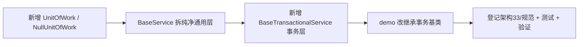

# 服务基类实施记录

> 项目骨架 · 02 后端基座 · 02 模块基类 · 02 服务基类 BaseService · 实施记录

[文档首页](../../../../../../../文档首页.md) › [02-2-2 服务基类 BaseService](../02_后端基座_02_模块基类_02_服务基类.md) › 01 实施　|　[← 父任务](../02_后端基座_02_模块基类_02_服务基类.md)

## 1. 实施信息 <a id="meta"></a>

| 项 | 值 |
| --- | --- |
| 任务 | [02 服务基类 BaseService](../02_后端基座_02_模块基类_02_服务基类.md) |
| 对应需求 | [02-6](../../../../../需求/02_需求_后端基座.md#r02-6) |
| 详细设计 | [01_详细设计_01_服务基类](../设计/01_详细设计_01_服务基类.md) |
| 实施日期 | 2026-09-13 |
| 实施人 | minjian |
| 实施环境 | 开发机（Ubuntu，Python 3.14 / uv） |
| 提交 | 待确认 |
| 结论 | 完成 |

## 2. 实施概览 <a id="overview"></a>



结果小结：事务公共方法收敛到 `UnitOfWork`（单点干涉），服务基类分两层（通用 + 事务扩展），后续横切按插层扩展；`pytest` / `ruff` / `pyright` 全绿、覆盖率 100%。

## 3. 实施过程 <a id="process"></a>

1. **工作单元**：新增 `app/db/unit_of_work.py`——`UnitOfWork`（ABC：`begin` / `commit` / `rollback` / `session`）与 `NullUnitOfWork`（占位、无副作用，`begin` → `nullcontext`）。
2. **通用层**：`app/services/base_service.py` 回归「CRUD 委派 + 不存在语义」，移除事务包裹。
3. **事务扩展层**：新增 `app/services/base_transactional_service.py` 的 `BaseTransactionalService[T](BaseService[T])`，构造注入 `UnitOfWork`（默认 `NullUnitOfWork`），覆写 `create` / `update` / `delete` 包 `with self._uow.begin():`，读操作不包。
4. **demo**：`demo_service.py` 改继承 `BaseTransactionalService`（默认空工作单元）。
5. **登记**：《架构设计 · 后端基础类体系》§3 分层表 / §4 基类清单与继承链 / §7 模块约定，《后端开发规范》§3.1 / §3.4 / §3.6 登记分层、工作单元与事务口径。
6. **测试**：新增 `tests/db/test_unit_of_work.py`、`tests/services/test_base_transactional_service.py`；`tests/services/test_base_service.py` 回退事务断言（保留 CRUD / 不存在 / 继承）。
7. **验证**：`uv run pytest` / `uv run ruff check .` / `uv run pyright` 全绿，覆盖率 100%（详见[测试记录](../测试/01_测试_01_服务基类.md)）。

关键命令：

```bash
uv run pytest --cov=app -q
uv run ruff check .
uv run pyright
```

## 4. 问题与处置 <a id="issues"></a>

| 问题 / 现象 | 原因 | 处置与落点 |
| --- | --- | --- |
| 首版单层 `BaseService` 承载事务后不利于扩展 | 事务属横切能力，单层基类堆逻辑违背「插中间层」 | 按架构33 §3.7/§3.8 拆两层：通用层 + 事务扩展层；事务公共方法抽出 `UnitOfWork` |

## 5. 验证结果 <a id="verify"></a>

| 完成标准 | 验证方法 | 实测结果 |
| --- | --- | --- |
| `BaseService[T]` 可继承、不存在语义行为正确 | `uv run pytest` | 78 passed, 2 skipped |
| 事务公共方法集中、事务扩展层就位 | 工作单元与事务包裹用例 | 通过 |
| 继承与事务约定纳入规范 | 《后端开发规范》§3.1/§3.4/§3.6、《架构设计 · 后端基础类体系》§3/§4/§7 | 已登记 |
| 无 lint / 类型错误 | `uv run ruff check .` / `uv run pyright` | All checks passed / 0 errors |

## 6. 偏差与遗留 <a id="deviations"></a>

- **无偏差**：按详细设计执行。
- 本任务保持**同步**口径；`DbUnitOfWork`（`AsyncSession` 事务）与异步切换归 02-5-1；`BizError` 体系归 02-3-1。
- 写后读主库（读写分离）由 02-5-1 实现；数据范围注入跨阶段回补（02-13 登记）。

> 本文档依《文档生成规范》编写
