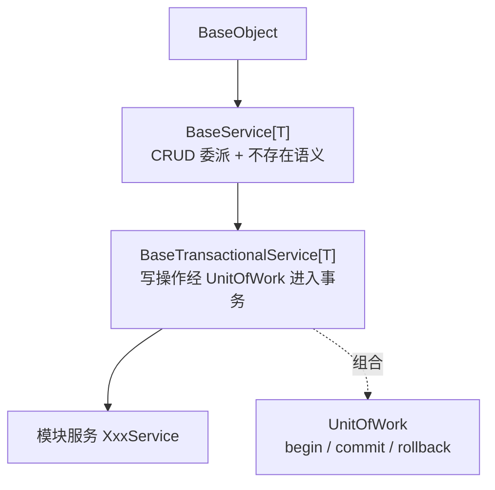

# 服务基类详细设计

> 项目骨架 · 02 后端基座 · 02 模块基类 · 02 服务基类 BaseService · 详细设计

[文档首页](../../../../../../../文档首页.md) › [02-2-2 服务基类 BaseService](../02_后端基座_02_模块基类_02_服务基类.md) › 01 详细设计　|　[← 父任务](../02_后端基座_02_模块基类_02_服务基类.md)

## 1. 概述 <a id="overview"></a>

- **目标**：服务基类**分层**——`BaseService[T]`（通用 CRUD 委派 + 不存在语义）与 `BaseTransactionalService[T]`（事务扩展层，持有工作单元 `UnitOfWork`）；**事务公共方法收敛到 `UnitOfWork`**（单点干涉），**扩展靠插层**（`BaseService` → `BaseTransactionalService` → 后续横切层）。
- **范围**：服务两层基类、工作单元占位、继承与事务约定登记、单测。
- **不含**（归相邻任务）：异步切换、`AsyncSession` 与会话注入、`DbUnitOfWork`（[02-5-1](../../../02_后端基座_05_机制底座/02_后端基座_05_机制底座_01_数据访问底座/02_后端基座_05_机制底座_01_数据访问底座.md)）；`BizError` 体系与错误码（[02-3-1](../../../02_后端基座_03_core横切基座/02_后端基座_03_core横切基座_01_异常体系与统一响应/02_后端基座_03_core横切基座_01_异常体系与统一响应.md)）；仓储基类（[02-2-1](../../02_后端基座_02_模块基类_01_数据访问基类/02_后端基座_02_模块基类_01_数据访问基类.md)）；`BaseSchema` / `BaseModel`（02-2-3 / 02-2-4）。
- **依据**：需求 [02-6](../../../../../需求/02_需求_后端基座.md#r02-6)、《[架构设计 · 后端基础类体系](../../../../../../../设计/架构设计/33_架构设计_后端基础类体系.md)》「基座分层」节「基类清单与继承链」节「各层基类与模块约定」节「扩展规则」节「分层演进示例」节、《[后端开发规范](../../../../../../../规范/后端开发规范.md)》「后端基座体系（强制）」节、《[架构设计 · 数据访问与分片](../../../../../../../设计/架构设计/09_架构设计_子系统_数据访问与分片.md)》「事务边界规则」节、01-3-1《基础类详细设计》。

## 2. 现状与差距 <a id="gap"></a>

| 现状（01-3-1 交付） | 差距 |
| --- | --- |
| `BaseService[T]`（`app/services/base_service.py`）单层同步：CRUD 委派仓储、`get`/`update`/`delete` 不存在抛 `NotFoundError` | 无事务统一落点；事务若散到各服务即「每处都改」 |
| 无事务公共方法 | 需 `UnitOfWork` 抽象（`begin` / `commit` / `rollback`），一次干涉全链生效 |
| 无扩展层 | 需按架构33 §3.7/§3.8「插中间层」：事务作为独立扩展层 `BaseTransactionalService`，后续横切再插层 |

## 3. 交付物清单 <a id="tree"></a>

```text
backend/
├── app/
│   ├── db/
│   │   └── unit_of_work.py            # 新增：UnitOfWork（ABC）+ NullUnitOfWork（占位）
│   └── services/
│       ├── base_service.py            # 修改：回归通用层（去事务）
│       ├── base_transactional_service.py  # 新增：事务扩展层（持有 UnitOfWork）
│       └── demo_service.py            # 修改：继承 BaseTransactionalService
└── tests/
    ├── db/
    │   └── test_unit_of_work.py       # 新增：工作单元占位
    └── services/
        ├── test_base_service.py       # 修改：回退事务断言（保留 CRUD / 不存在语义）
        └── test_base_transactional_service.py  # 新增：写操作事务包裹

bms文档/
├── 设计/架构设计/33_架构设计_后端基础类体系.md   # 修改：§3/§4/§7 登记 BaseTransactionalService 与 UnitOfWork
└── 规范/后端开发规范.md                         # 修改：§3.1/§3.4/§3.6 登记分层与事务口径
```

## 4. 服务基类分层设计 <a id="layers"></a>

| 层 | 类 | 文件 | 职责 |
| --- | --- | --- | --- |
| L0 服务 | `BaseService[T]` | `services/base_service.py` | 通用 CRUD 委派仓储 + 统一不存在语义（**不含事务**） |
| 事务扩展层 | `BaseTransactionalService[T]` | `services/base_transactional_service.py` | 持有 `UnitOfWork`；写操作包事务 |



**扩展规则**（架构33 §3.7/§3.8）：出现新的横切职责（限流 / 审计 / 数据范围等）时，按同一办法在合适两层之间**插入中间基类**，只解决一类横切，不动其它层；无事务需求的通用服务留在 `BaseService[T]`。

## 5. UnitOfWork 工作单元设计 <a id="uow"></a>

`app/db/unit_of_work.py`：事务公共方法的**唯一落点**。

| 成员 | 形态 | 说明 |
| --- | --- | --- |
| `begin() -> AbstractContextManager[None]` | 抽象方法 | 开启事务边界（上下文管理器） |
| `commit() -> None` / `rollback() -> None` | 抽象方法 | 提交 / 回滚 |
| `session -> object \| None` | 属性 | 请求级会话（占位 `None`；`DbUnitOfWork` 提供 `AsyncSession`） |
| `NullUnitOfWork` | 占位实现 | 无副作用：`begin` → `nullcontext`，`commit` / `rollback` 空操作 |

```python
class UnitOfWork(ABC):
    """工作单元：统一事务边界与提交 / 回滚。"""

    @abstractmethod
    def begin(self) -> AbstractContextManager[None]: ...


class NullUnitOfWork(UnitOfWork):
    """空工作单元（占位 / 内存基线）：无事务、无副作用。"""

    def begin(self) -> AbstractContextManager[None]:
        return nullcontext()
```

- 后续横切（重试、嵌套事务、审计）只改 `UnitOfWork` 实现或替换注入，服务层不动。
- 02-5-1 提供 `DbUnitOfWork`（基于 `AsyncSession`，`begin()` 切异步上下文），替换 `NullUnitOfWork` 注入。

## 6. 事务包裹设计 <a id="wrap"></a>

`BaseTransactionalService` 覆写写操作，经 `UnitOfWork` 进入事务；读操作不包：

| 方法 | 行为 |
| --- | --- |
| `create(**values)` | `with self._uow.begin(): return super().create(**values)` |
| `update(id, **values)` | `with self._uow.begin(): return super().update(...)`（缺失在事务内抛 `NotFoundError`） |
| `delete(id)` | `with self._uow.begin(): super().delete(...)`（缺失在事务内抛 `NotFoundError`） |
| `list` / `get` / `exists` / `count` | 直接继承 `BaseService`，**不包事务** |

```python
class BaseTransactionalService[ModelT] (BaseService[ModelT]):
    """事务服务基类：写操作经工作单元进入事务。"""

    def __init__(self, repository: BaseRepository[ModelT], uow: UnitOfWork | None = None) -> None:
        super().__init__(repository)
        self._uow = uow if uow is not None else NullUnitOfWork()
```

- 占位 `NullUnitOfWork` 无副作用，写/读行为与不包一致（既有回归不受影响）。
- 缺失分支在事务内抛出 → 真实事务（02-5-1）回滚；占位阶段仅抛错。

## 7. 不存在语义设计 <a id="notfound"></a>

- `get` / `update` / `delete` 缺失统一抛 `NotFoundError`；`list` / `count` / `exists` 不抛。
- `NotFoundError` **保持占位**（`app/core/exceptions.py`）；[02-3-1](../../../02_后端基座_03_core横切基座/02_后端基座_03_core横切基座_01_异常体系与统一响应/02_后端基座_03_core横切基座_01_异常体系与统一响应.md) 建立 `BizError` 体系时改为其子类并接入统一响应与错误码（基类不重复改，测试只断言异常类型）。

## 8. 继承与实现约定（登记） <a id="convention"></a>

- 模块服务 `XxxService`：需事务继承 `BaseTransactionalService[T]`，无事务需求继承 `BaseService[T]`；只写业务规则，不得拼 SQL、不得跨模块直连仓储、不得自起事务。
- 事务横切只改 `UnitOfWork`；新增横切按 4 节插层。
- 登记落点：《架构设计 · 后端基础类体系》§3 分层表 / §4 基类清单与继承链 / §7 模块约定；《后端开发规范》§3.1 / §3.4 / §3.6。

## 9. 测试设计（Kiwi 先行） <a id="tests"></a>

复用 `Kiwi 12`，不新增编号：

| Kiwi | 用例 | 文件 | 断言要点 |
| --- | --- | --- | --- |
| 12 | 工作单元占位 | `tests/db/test_unit_of_work.py` | `NullUnitOfWork` 是 `UnitOfWork`；`begin` 无副作用；`commit` / `rollback` 无操作；`session is None` |
| 12 | 事务包裹范围 | `tests/services/test_base_transactional_service.py` | 写操作进入工作单元、只读不进入、缺失在事务内抛 `NotFoundError` |
| 12 | 默认空工作单元 | 同上 | 未注入时默认 `NullUnitOfWork`，写操作正常 |
| 12 | 继承链 | 同上 | `BaseTransactionalService → BaseService → BaseObject`；`DemoService → BaseTransactionalService` |
| 12 | 通用层回归 | `tests/services/test_base_service.py` | CRUD 委派、不存在语义、`DemoService → BaseService` |

## 10. 实施步骤 <a id="steps"></a>

1. 新增 `app/db/unit_of_work.py`（`UnitOfWork` / `NullUnitOfWork`）。
2. `base_service.py` 回归通用层（移除事务）；新增 `base_transactional_service.py`；`demo_service.py` 改继承事务基类。
3. 登记《架构设计 · 后端基础类体系》§3/§4/§7 与《后端开发规范》§3.1/§3.4/§3.6。
4. 补 Kiwi 12 用例（工作单元、事务包裹、继承链）。
5. 验证：`uv run pytest`、`uv run ruff check .`、`uv run pyright` 全绿。
6. 回写：实施 / 测试记录 + 任务 / 需求 / 计划状态。

## 11. 验收映射 <a id="accept-map"></a>

| 完成标准 | 验证方式 |
| --- | --- |
| `BaseService[T]` 可继承、不存在语义行为正确 | Kiwi 12 通用层用例全绿 |
| 事务公共方法集中、事务扩展层就位 | 工作单元与事务包裹用例全绿；`UnitOfWork` 单点 |
| 继承与事务约定纳入规范 | 《后端开发规范》§3.1/§3.4/§3.6、《架构设计 · 后端基础类体系》§3/§4/§7 核对 |
| 无 lint / 类型错误 | `uv run ruff check .`、`uv run pyright` |

## 12. 边界与开放项 <a id="boundary"></a>

- **同步口径**：本任务保持同步；异步切换与会话注入由 02-5-1 的 `DbUnitOfWork` 承担。
- 事务的**真实 begin/commit/rollback**（`AsyncSession`）归 02-5-1；本任务为占位无副作用。
- `NotFoundError` 占位保持；`BizError` 体系归 02-3-1。
- 写后读主库（读写分离）由 02-5-1；数据范围注入跨阶段回补（02-13 登记）。

## 13. 对齐记录 <a id="align"></a>

| # | 事项 | 结论 |
| --- | --- | --- |
| 1 | 服务分层 | `BaseService[T]`（通用）+ `BaseTransactionalService[T]`（事务扩展层），后续横切按插层扩展 |
| 2 | 事务横切 | 收敛到 `UnitOfWork`（`begin` / `commit` / `rollback`），占位 `NullUnitOfWork`；单点干涉 |
| 3 | 异常口径 | 保持占位 `NotFoundError`，`BizError` 体系归 02-3-1 |
| 4 | 仓储形态 | DB 模块服务继承 `BaseTransactionalService`，仓储按存储形态选 `BaseRepository` / `BaseDbRepository` |
| 5 | 测试口径 | 复用 Kiwi 12；新增工作单元与事务包裹用例 |
| 6 | 工时 / 窗口 | 3h；随 02_02 模块基类窗口（2026-09-18 ~ 09-28）执行 |

> 本文档依《文档生成规范》编写 · 关键决策逐项确认
