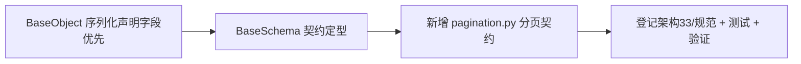

# 请求 / 响应基类实施记录

> 项目骨架 · 02 后端基座 · 02 模块基类 · 03 请求 / 响应基类 BaseSchema · 实施记录

[文档首页](../../../../../../../文档首页.md) › [02-2-3 请求 / 响应基类 BaseSchema](../02_后端基座_02_模块基类_03_请求响应基类.md) › 01 实施　|　[← 父任务](../02_后端基座_02_模块基类_03_请求响应基类.md)

## 1. 实施信息 <a id="meta"></a>

| 项 | 值 |
| --- | --- |
| 任务 | [03 请求 / 响应基类 BaseSchema](../02_后端基座_02_模块基类_03_请求响应基类.md) |
| 对应需求 | [02-7](../../../../../需求/02_需求_后端基座.md#r02-7) |
| 详细设计 | [03_详细设计_01_请求响应基类](../设计/03_详细设计_01_请求响应基类.md) |
| 实施日期 | 2026-09-13 |
| 实施人 | minjian |
| 实施环境 | 开发机（Ubuntu，Python 3.14 / uv；Pydantic 2.13.5） |
| 提交 | 待确认 |
| 结论 | 完成 |

## 2. 实施概览 <a id="overview"></a>



结果小结：序列化口径上提 `BaseObject`（声明字段优先），Pydantic 模型输出补齐计算字段；新增页码 / 游标分页契约；`pytest` / `ruff` / `pyright` 全绿、覆盖率 100%。

## 3. 实施过程 <a id="process"></a>

1. **序列化口径**：`app/core/base.py` 的 `_public_fields` 改为声明字段优先——Pydantic（有 `model_dump` 与 `model_fields`）走 `model_dump()`；dataclass 走 `dataclasses.fields`；其余 `__dict__` 兜底。`to_dict` 递归 `_convert`、`to_json` 走 `core/serialization` 稳定序不变。
2. **BaseSchema**：`app/schemas/base.py` 保持公共配置（`from_attributes` / `str_strip_whitespace`），不覆写序列化，经 `BaseObject` 获得分型序列化。
3. **分页契约**：新增 `app/schemas/pagination.py`——`BasePageQuery` / `BasePageResponse[T]`（页码）、`BaseCursorQuery` / `BaseCursorResponse[T]`（游标），均继承 `BaseSchema`。
4. **登记**：《架构设计 · 后端基础类体系》§4「BaseObject」职责与分页契约基类、§7 模块约定；《后端开发规范》§3.2 / §3.4。
5. **测试**：`tests/core/test_base_object.py` 增分型序列化（Kiwi 14）；`tests/schemas/test_base_schema.py` 增序列化与分页契约（Kiwi 13）。
6. **验证**：`uv run pytest` / `uv run ruff check .` / `uv run pyright` 全绿，覆盖率 100%（详见[测试记录](../测试/03_测试_01_请求响应基类.md)）。

关键命令：

```bash
uv run pytest --cov=app -q
uv run ruff check .
uv run pyright
```

## 4. 问题与处置 <a id="issues"></a>

| 问题 / 现象 | 原因 | 处置与落点 |
| --- | --- | --- |
| Pydantic 计算字段 / 别名字段在 `to_dict` 缺失 | 原 `_public_fields` 非 dataclass 一律取 `__dict__` | 声明字段优先：Pydantic 分支走 `model_dump()`（Pydantic 2.13.5 验证 PEP 695 泛型与计算字段可用） |

## 5. 验证结果 <a id="verify"></a>

| 完成标准 | 验证方法 | 实测结果 |
| --- | --- | --- |
| `BaseSchema` 可继承、公共配置与序列化行为正确 | `uv run pytest` | 87 passed, 2 skipped |
| 序列化声明字段优先（dataclass / Pydantic / 其他） | Kiwi 14 用例 | 通过 |
| 分页契约基类就位、字段与校验正确 | Kiwi 13 用例 | 通过 |
| 无 lint / 类型错误 | `uv run ruff check .` / `uv run pyright` | All checks passed / 0 errors |

## 6. 偏差与遗留 <a id="deviations"></a>

- **无偏差**：按详细设计执行。
- `ApiResponse` / 错误码归 02-3-1，其分页 `data` 复用本任务响应基类。
- 分页执行（limit/offset、游标查询）属 repositories / services；默认 `model_dump()` 用字段名（`by_alias=False`）。

> 本文档依《文档生成规范》编写
