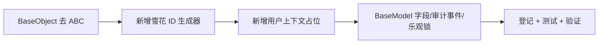

# ORM 模型基类与表规范实施记录

> 项目骨架 · 02 后端基座 · 02 模块基类 · 04 ORM 模型基类 BaseModel 与表规范 · 实施记录

[文档首页](../../../../../../../文档首页.md) › [02-2-4 ORM 模型基类与表规范](../02_后端基座_02_模块基类_04_ORM模型基类与表规范.md) › 01 实施　|　[← 父任务](../02_后端基座_02_模块基类_04_ORM模型基类与表规范.md)

## 1. 实施信息 <a id="meta"></a>

| 项 | 值 |
| --- | --- |
| 任务 | [04 ORM 模型基类与表规范](../02_后端基座_02_模块基类_04_ORM模型基类与表规范.md) |
| 对应需求 | [02-8](../../../../../需求/02_需求_后端基座.md#r02-8) |
| 详细设计 | [04_详细设计_01_ORM模型基类与表规范](../设计/04_详细设计_01_ORM模型基类与表规范.md) |
| 实施日期 | 2026-09-13 |
| 实施人 | minjian |
| 实施环境 | 开发机（Ubuntu，Python 3.14 / uv；SQLAlchemy 2.0.52） |
| 提交 | 待确认 |
| 结论 | 完成 |

## 2. 实施概览 <a id="overview"></a>



结果小结：`Base` + `BaseModel` 落地（雪花 ID / 审计 / 软删除 / 乐观锁）；审计由 ORM 事件自动填充，乐观锁用 `version_id_col`；标准雪花 41+10+12 支持分布式与高并发；`pytest` / `ruff` / `pyright` 全绿、覆盖率 100%。

## 3. 实施过程 <a id="process"></a>

1. **L0 调整**：`app/core/base.py` 的 `BaseObject` 去 `ABC`（规范 §3.2 称「普通类」），使 SQLAlchemy 声明式基类可混合继承（元类兼容）。
2. **雪花 ID**：新增 `app/core/id.py`——标准雪花 41+10+12（1024 Worker、4096 ID/ms/Worker）；`generate_id()` / `configure_id_generator(worker_id)` / `initial_worker_id()`（环境变量 `BMS_WORKER_ID`）；时钟回拨与序列用尽保护。
3. **上下文占位**：新增 `app/core/context.py`——`current_user_id`（供审计字段填充，占位默认 None）。
4. **模型基类**：新增 `app/models/base.py`——`Base(DeclarativeBase)` 与 `BaseModel(Base, BaseObject)`（`__abstract__ = True`）；字段 `id/created_at/created_by/updated_at/updated_by/deleted_at/version`；`before_insert` / `before_update` 事件填审计；`__mapper_args__ = {"version_id_col": version}`；四库类型映射与表规范写入注释。
5. **登记**：《架构设计 · 后端基础类体系》§4（`BaseModel`、`BaseObject`）/ §7；《后端开发规范》§3.4；回写 02-01 记录（BaseObject 去 ABC）。
6. **测试**：新增 `tests/models/test_base_model.py`（Kiwi 19，SQLite 临时库）。
7. **验证**：`uv run pytest` / `uv run ruff check .` / `uv run pyright` 全绿，覆盖率 100%（详见[测试记录](../测试/04_测试_01_ORM模型基类与表规范.md)）。

关键命令：

```bash
uv run pytest --cov=app -q
uv run ruff check .
uv run pyright
```

## 4. 问题与处置 <a id="issues"></a>

| 问题 / 现象 | 原因 | 处置与落点 |
| --- | --- | --- |
| SQLAlchemy 元类冲突 | `DeclarativeMeta` 与 `ABC` 元类不兼容 | `BaseObject` 去 `ABC`（规范称「普通类」），`BaseModel(Base, BaseObject)` + `__abstract__` 可行（实测） |
| pyright 报事件函数未使用 / `__mapper_args__` 覆盖 | 装饰器注册的模块级函数、SQLAlchemy 特殊属性 | 事件函数加 `reportUnusedFunction` 忽略；`__mapper_args__` 加 `# noqa: RUF012` |
| 初版雪花 6+6 位宽并发能力不足 | 需支持分布式与高并发 | 调整为**标准雪花 41+10+12**（1024 Worker、4096 ID/ms/Worker）；WorkerId 配置注入（`BMS_WORKER_ID`），Redis 自动注册后续回补 |

## 5. 验证结果 <a id="verify"></a>

| 完成标准 | 验证方法 | 实测结果 |
| --- | --- | --- |
| `BaseModel` 字段与四库类型映射落地、表规范写入注释 | 代码核对 + Kiwi 19 | 通过 |
| 审计 / 软删除 / 乐观锁行为正确 | SQLite 临时库用例 | 通过 |
| 继承约定纳入规范 | 《后端开发规范》§3.4、《架构设计 · 后端基础类体系》§4/§7 | 已登记 |
| 无 lint / 类型错误 | `uv run ruff check .` / `uv run pyright` | All checks passed / 0 errors |

## 6. 偏差与遗留 <a id="deviations"></a>

- **L0 偏差（已确认）**：`BaseObject` 去 `ABC`（原 02-01 交付为 ABC），规范 §3.2 本就称「普通类」；已回写 02-01 记录与架构33 §4。
- **雪花位宽调整（已确认）**：由设计初版示例 6+6 调整为 **41+10+12**（分布式 + 高并发）；WorkerId 配置注入，Redis 自动注册作为后续回补。
- 四库真库建表 / Alembic 迁移 / 达梦实测归后续落库阶段；本任务以 SQLite 临时库验证行为。
- 软删除查询过滤与分页回填归 02-5-1；乐观锁 `StaleDataError` 转业务错误码归 02-3-1 + 02-5-1。
- 多租户强制过滤 / 数据范围注入 / 审计捕获按插层回补（02-13 登记）。

> 本文档依《文档生成规范》编写
