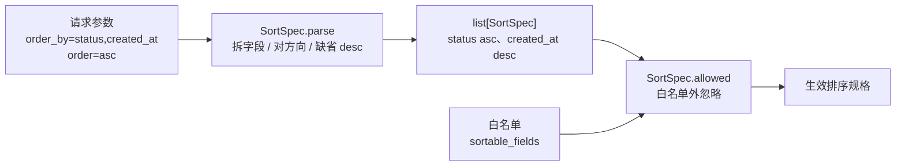
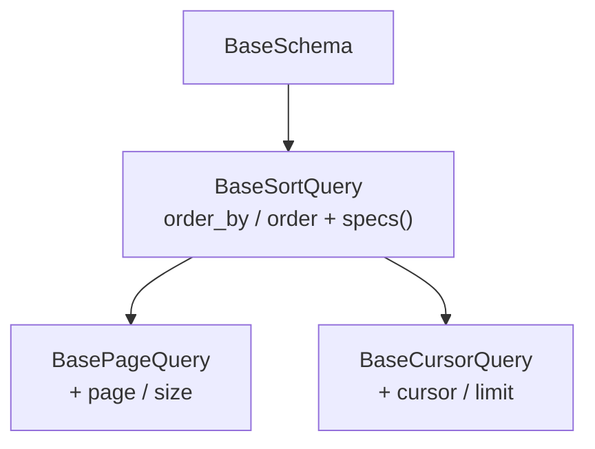

# 排序契约基座详细设计

> 项目骨架 · 02 后端基座 · 02 模块基类 · 05 排序契约基座 · 详细设计

[文档首页](../../../../../../../文档首页.md) › [02-2-5 排序契约基座](../02_后端基座_02_模块基类_05_排序契约基座.md) › 01 详细设计　|　[← 父任务](../02_后端基座_02_模块基类_05_排序契约基座.md)

## 1. 概述 <a id="overview"></a>

- **目标**：落地列表接口的统一**排序契约**——`SortSpec`（字段 + 方向，继承 `BaseSchema`）与 `BaseSortQuery`（`order_by` 逗号分隔 + `order` 方向数组），并把排序贯穿到分页契约与仓储契约：`BasePageQuery` / `BaseCursorQuery` 继承排序契约，`BaseRepository.list(*, sort=...)` 承担排序，内存基线按规格排序、数据库侧预留 `_apply_sort` 占位钩子。
- **范围**：`app/schemas/sorting.py`（新增）、`app/schemas/pagination.py`、`app/repositories/base_repository.py`、`app/repositories/base_memory_repository.py`、`app/repositories/base_db_repository.py`、`app/services/base_service.py`、`tests/schemas/test_sorting.py`（新增）与既有用例适配、架构与规范登记。
- **不含**（归相邻任务 / 后续阶段）：DB 侧真实 `ORDER BY` 拼接与白名单防注入实测（随列表接口阶段，需求 02-40 口径）；分页深限与游标键索引（《架构设计 · 数据访问与分片》「查询规范」节，随列表接口阶段）；列表筛选（筛选条件与排序正交，归各模块列表请求）；机制底座与多租户（[02-5-1](../../../02_后端基座_05_机制底座/02_后端基座_05_机制底座_01_数据访问底座/02_后端基座_05_机制底座_01_数据访问底座.md) ~ [02-5-3](../../../02_后端基座_05_机制底座/02_后端基座_05_机制底座_03_模块注册表/02_后端基座_05_机制底座_03_模块注册表.md)）。
- **依据**：需求 [02-40](../../../../../需求/02_需求_后端基座.md#r02-40)、《[架构设计 · 数据访问与分片](../../../../../../../设计/架构设计/12_架构设计_子系统_数据访问与分片.md)》「查询规范」节、《[架构设计 · 后端基础类体系](../../../../../../../设计/架构设计/04_架构设计_后端基础类体系.md)》「阶段落地（地基波 + 回补）」节、《[API接口规范](../../../../../../../规范/API接口规范.md)》「参数与分页」节、《[后端开发规范](../../../../../../../规范/后端开发规范.md)》「SQL 与数据访问规范」节、《[命名规范](../../../../../../../规范/命名规范.md)》「后端命名」节。

## 2. 现状与差距 <a id="gap"></a>

| 现状 | 差距 |
| --- | --- |
| `app/schemas/pagination.py` 有 `BasePageQuery` / `BasePageResponse` / `BaseCursorQuery` / `BaseCursorResponse`，无任何排序字段 | 列表请求无统一排序入口；排序格式与防注入口径各接口自定 |
| 全库无 `SortSpec` / `sortable_fields` / `ORDER BY` 相关实现（检索零命中） | 无排序规格值对象、无白名单校验、无可排序字段声明机制 |
| `BaseRepository.list()` 无参数；`BaseMemoryRepository.list()` 固定按 ID 升序 | 内存基线不支持按规格排序；`list_page` / `list_cursor` 只切片不排序 |
| `BaseDbRepository` 的 CRUD 占位抛 `NotImplementedError` | DB 侧无排序语句钩子，回补时需改基类结构 |
| `tests/schemas/test_base_schema.py`（Kiwi 13）断言 `BasePageQuery().model_dump() == {"page": 1, "size": 20}` | 分页请求继承排序契约后会多出 `order_by` / `order` 两键，**既有断言必须同步适配** |

## 3. 交付物清单 <a id="tree"></a>

```text
backend/
├── app/schemas/sorting.py                 # 新增：SortDirection / SortSpec / BaseSortQuery（排序契约）
├── app/schemas/pagination.py              # 修改：BasePageQuery / BaseCursorQuery 继承 BaseSortQuery
├── app/repositories/base_repository.py    # 修改：list(*, sort=...) 抽象签名 + sortable_fields + _resolve_sort + _apply_sort 钩子
├── app/repositories/base_memory_repository.py  # 修改：list 支持按 SortSpec 多键排序；分页派生带排序
├── app/repositories/base_db_repository.py # 修改：list 占位签名对齐（仍抛 NotImplementedError）
├── app/services/base_service.py           # 修改：list(*, sort=...) 透传仓储
└── tests/
    ├── schemas/test_sorting.py            # 新增：排序契约用例（Kiwi 29）
    ├── schemas/test_base_schema.py        # 修改：Kiwi 13 分页默认值断言适配新增排序键
    └── repositories/test_base_repository.py  # 修改：内存基线 / 分页排序与 DB 占位用例（Kiwi 11、29）

bms文档/
├── 设计/架构设计/04_架构设计_后端基础类体系.md   # 修改：§4 基类清单 + §8 跨阶段基座表登记
└── 规范/后端开发规范.md                          # 修改：§3.1 列表排序口径（排序走契约、白名单防注入）
```

## 4. 排序契约设计 <a id="contract"></a>

`app/schemas/sorting.py`（新增）——三条契约，均继承 `BaseSchema`（自动获得 `from_attributes` / `str_strip_whitespace` 与稳定序序列化）：

| 成员 | 形态 | 说明 |
| --- | --- | --- |
| `SortDirection` | `StrEnum`（`asc` / `desc`） | 方向枚举；成员序列化为字符串 |
| `SortSpec.field` | `str` | 排序字段名（数据库字段名口径，非别名） |
| `SortSpec.direction` | `SortDirection`，默认 `desc` | 缺省降序（与《API接口规范》一致） |
| `SortSpec.parse(order_by, order) -> list[SortSpec]` | 类方法 | 解析原始参数：逗号分隔拆字段、方向按位置对应、缺位 / 非法方向回退 `desc`；空串 / `None` 返回空列表；**同一字段重复出现保留首次**（避免重复排序列） |
| `SortSpec.allowed(specs, whitelist) -> list[SortSpec]` | 类方法 | 按白名单逐项过滤，白名单外字段忽略该项（保持原顺序） |
| `BaseSortQuery.order_by` | `str \| None`，默认 `None` | 排序字段（逗号分隔多值，如 `status,created_at`） |
| `BaseSortQuery.order` | `list[str] \| None`，默认 `None` | 方向数组，与 `order_by` 位置一一对应，缺省 `desc` |
| `BaseSortQuery.specs(whitelist=None) -> list[SortSpec]` | 方法 | `parse` + `allowed` 的组合入口；`whitelist=None` 表示**不做白名单过滤**（仅限内部可信调用，用户输入禁止走此路径）；传集合则逐项过滤 |



**入参形态（沿用《API接口规范》，不新造格式）**：

| 参数 | 取值 | 示例 |
| --- | --- | --- |
| `order_by` | 逗号分隔多值 | `order_by=status,created_at` |
| `order` | 方向数组，位置一一对应，缺省 `desc` | `order=asc`（第二条回退 `desc`） |

**解析与校验口径（本任务定稿）**：

| 情形 | 处置 |
| --- | --- |
| `order_by` 为空 / `None` / 全空白 | 无排序（返回空规格列表） |
| 方向缺位（`order` 短于字段数） | 该字段回退 `desc` |
| 方向非法（非 `asc` / `desc`，大小写不敏感） | **回退 `desc`**，不报错 |
| 方向数组长于字段数 | 多余方向忽略 |
| 字段不在白名单 | **忽略该项**，不报错（其余字段照常生效） |
| 同一字段重复出现 | 保留首次，后续忽略 |

## 5. 与分页契约的关系 <a id="pagination"></a>

`app/schemas/pagination.py`（修改）——排序契约**单向**被分页请求继承（单继承，不引入多重继承；《后端开发规范》「多重继承克制」节）：



| 变更 | 内容 |
| --- | --- |
| `BasePageQuery` | 改为 `class BasePageQuery(BaseSortQuery)`，不再直接继承 `BaseSchema`；`page` / `size` 定义与约束不变 |
| `BaseCursorQuery` | 改为 `class BaseCursorQuery(BaseSortQuery)`；`cursor` / `limit` 定义与约束不变 |
| 响应契约 | `BasePageResponse` / `BaseCursorResponse` **不动**（排序属请求侧契约） |
| 兼容性 | 既有调用 `BasePageQuery(page=1, size=20)` / `BaseCursorQuery(...)` 仍合法（新字段均有默认值 `None`） |

**必须同步的既有用例**：`tests/schemas/test_base_schema.py`（Kiwi 13）中 `test_page_query_defaults_and_bounds` 断言 `BasePageQuery().model_dump() == {"page": 1, "size": 20}`，改为含 `"order_by": None, "order": None` 的期望值；`test_pagination_inherits_base_schema` 的继承断言仍成立（不新增分支）。

## 6. 排序生效：仓储契约与内存基线 <a id="repo"></a>

### 6.1 契约层 `app/repositories/base_repository.py` <a id="repo-contract"></a>

| 成员 | 形态 | 说明 |
| --- | --- | --- |
| `sortable_fields: ClassVar[frozenset[str]]` | 类属性，默认 `frozenset()` | **默认白名单**：模块声明可排序字段；为空表示「本仓储不开放排序」（安全默认，排序请求被整体忽略） |
| `list(*, sort: Sequence[SortSpec] \| None = None)` | 抽象方法（签名变更） | 返回记录列表；传 `sort` 时按规格排序，不传由实现给默认顺序 |
| `_resolve_sort(query: BaseSortQuery \| None) -> list[SortSpec]` | 派生方法 | `query is None` → 空；否则 `query.specs(self.sortable_fields)`——**类属性为默认白名单**，调用方可用 `query.specs(whitelist=...)` 显式覆盖 |
| `list_page(query)` / `list_cursor(query)` | 派生方法（改内部） | `items = await self.list(sort=self._resolve_sort(query))` 后再切片，使排序对分页生效 |
| `_apply_sort(statement, sort) -> statement` | 钩子（默认原样返回） | DB 侧 `ORDER BY` 拼接点（占位）；与 `_resolve_shard` / `_apply_data_scope` 同风格 |
| 其余成员 | 不变 | `exists` / `get` / `count` / `create` / `update` / `delete` / `_resolve_binding` / `_guard_version` 不动 |

`_apply_sort` 采用方法级类型变量，避免绑定 SQLAlchemy 泛型签名：

```python
def _apply_sort[StatementT](self, statement: StatementT, sort: Sequence[SortSpec]) -> StatementT:
    """ORDER BY 拼接钩子（占位：原样返回；真实实现随落库阶段，字段经白名单后拼接防注入）。"""
    return statement
```

### 6.2 内存基线 `app/repositories/base_memory_repository.py` <a id="repo-memory"></a>

- `list(*, sort: Sequence[SortSpec] | None = None)`：先按现有作用域过滤 + ID 升序取数（与原行为一致），再按规格排序；`sort` 为空则返回 ID 升序结果（**既有行为不变**）。
- 排序实现为模块级纯函数，多键排序走「按规格逆序逐次稳定排序」，保证主次键语义：

| 要点 | 口径 |
| --- | --- |
| 多键 | `for spec in reversed(specs): items.sort(key=..., reverse=...)`；稳定排序保证前序键次序不被破坏 |
| 键取值 | `getattr(item, spec.field, None)`；字段缺失按 `None` 处理 |
| 空值 | 统一参与比较并置于末尾（升序）/ 首位（降序）；DB 方言 `NULLS` 口径随落库阶段对齐登记 |
| 类型不一致 | 数值型与字符串型分别比较；类型混合时按字符串化兜底比较——确定性、不抛 `TypeError` |
| 排序字段 | 已由白名单过滤（见第 6.1 节），内存侧不再做存在性校验 |

### 6.3 数据库实现 `app/repositories/base_db_repository.py` <a id="repo-db"></a>

- `list(*, sort=None)`：签名与契约对齐，实现仍为占位（`self._not_implemented("list")`），**不连库**。
- `_apply_sort` 不覆写，沿用契约层占位（原样返回语句）；真实 `ORDER BY`（白名单字段 + 方向映射，禁止拼接用户原始输入）随列表接口阶段回补。

## 7. 服务层与上层链路适配 <a id="service"></a>

| 位置 | 变更 |
| --- | --- |
| `BaseService.list(*, sort=None)` | 透传 `await self._repository.list(sort=sort)`；其余 CRUD / `page` / `cursor_page` 不变（分页排序经 `query` 已生效） |
| `BaseTransactionalService` | 不覆写 `list`，无需改动 |
| `DemoService.list_demos()` | 仍调 `await self.list()`（无排序），`DemoRepository` 不声明 `sortable_fields`，接口行为不变 |
| `api/demo.py` | 不改（不给 demo 列表加排序参数；真实列表接口的排序入参随列表接口阶段接入） |

白名单声明落点：**只在仓储类属性声明**（服务层不重复声明，避免两处漂移）；显式覆盖走 `BaseSortQuery.specs(whitelist=...)`。

## 8. 登记落点 <a id="register"></a>

| 落点 | 登记内容 |
| --- | --- |
| 《架构设计 · 后端基础类体系》「基类清单与继承链」节 | 新增 `SortSpec` / `BaseSortQuery` / `SortDirection` 行（`schemas/sorting.py`，职责与状态）+ 继承链补 `BasePageQuery` / `BaseCursorQuery` → `BaseSortQuery` → `BaseSchema` |
| 《架构设计 · 后端基础类体系》「阶段落地（地基波 + 回补）」节 | 跨阶段基座表新增「排序契约」行（代码位置、契约、回补阶段＝随列表接口） |
| 《后端开发规范》「后端基座体系」节 | 「必须继承 / 强制用法」补排序口径：列表排序一律走排序契约 + 白名单，禁止接口层自行拼 `ORDER BY` 或直接透传用户字段 |
| 需求 [02-40](../../../../../需求/02_需求_后端基座.md#r02-40) | 实施完成后回写状态 / 完成日期（本设计阶段不回写） |

## 9. 测试设计（Kiwi 先行） <a id="tests"></a>

用例**先登记 Kiwi TCMS 再编码**（《测试规范》「用例管理（Kiwi TCMS）」节）；本任务新分配 **Kiwi 29**：

| Kiwi | 用例 | 断言要点 | 自动化文件 |
| --- | --- | --- | --- |
| 29 | 排序规格解析 | `order_by="status,created_at"` + `order=["asc"]` → 两条规格（首条 `asc`、次条回退 `desc`）；空串 / `None` → 空列表；重复字段保留首次 | `tests/schemas/test_sorting.py` |
| 29 | 方向容错 | 方向非法（如 `up`）、大小写混写（`ASC`）按 `asc` / 回退 `desc` 口径判定；方向数组超长被忽略 | 同上 |
| 29 | 白名单校验 | 白名单外字段被忽略、白名单内保留；`whitelist=None` 不过滤（内部调用）；类属性默认与 `specs(whitelist=...)` 覆盖两条路径 | 同上 |
| 29 | 契约继承链 | `SortSpec` / `BaseSortQuery` / `BasePageQuery` / `BaseCursorQuery` → `BaseSchema`；`BasePageQuery` / `BaseCursorQuery` → `BaseSortQuery` | 同上 |
| 29 | 内存基线排序 | 单字段升 / 降序、多字段主次键、空值位置、类型混合不抛错；`sort` 为空时保持 ID 升序（既有行为回归） | `tests/repositories/test_base_repository.py` |
| 29 | 分页承载排序 | `list_page` / `list_cursor` 传入带排序的 `query` 返回已排序页；`BaseService.page` / `cursor_page` 同步生效 | 同上、`tests/services/test_base_service.py` |
| 29 | DB 侧占位 | `BaseDbRepository.list(sort=[...])` 抛 `NotImplementedError`（不连库）；`_apply_sort` 占位原样返回语句 | `tests/repositories/test_base_repository.py` |
| 13（适配） | 分页请求默认值 | `BasePageQuery().model_dump()` 期望值追加 `order_by=None` / `order=None` | `tests/schemas/test_base_schema.py` |

用例命名遵循《测试规范》「命名规范」节（后端测试文件 `test_模块.py`、函数 `test_行为_期望`）；测试数据自建、用例间不共享可变状态。

## 10. 实施步骤 <a id="steps"></a>

1. 新增 `app/schemas/sorting.py`（`SortDirection` / `SortSpec` / `BaseSortQuery`）。
2. `app/schemas/pagination.py`：`BasePageQuery` / `BaseCursorQuery` 改继承 `BaseSortQuery`。
3. `app/repositories/base_repository.py`：`list` 加 `sort` 关键字参数、加 `sortable_fields` 类属性与 `_resolve_sort`，`list_page` / `list_cursor` 接排序，加 `_apply_sort` 占位钩子。
4. `app/repositories/base_memory_repository.py`：`list` 支持排序（多键稳定排序 + 空值 / 类型兜底）。
5. `app/repositories/base_db_repository.py`：`list` 签名对齐（实现仍占位）。
6. `app/services/base_service.py`：`list(*, sort=None)` 透传。
7. 测试：先登记 Kiwi 29 用例，再写 `tests/schemas/test_sorting.py`、补仓库 / 服务排序用例，适配 Kiwi 13 分页默认值断言。
8. 登记：架构 §4 / §8 与《后端开发规范》§3.1（第 8 节）。
9. 验证：`uv run pytest`、`uv run ruff check .`、`uv run pyright` 全绿；应用可启动、`/docs` 可访问。
10. 回写：实施 / 测试记录 + 任务（02-2-5、02 模块基类）与需求 02-40 状态、计划表。

## 11. 验收映射 <a id="accept-map"></a>

| 完成标准（需求 02-40 / 任务 02-2-5） | 验证方式 |
| --- | --- |
| 排序契约接口 / 抽象声明就位、可被上层引用 | `SortSpec` / `BaseSortQuery` 落地 + 继承断言 + Kiwi 29 |
| 依赖注入可解析、应用可启动不报错 | 应用冒烟（`/docs`、demo 列表接口）+ 既有 api 用例 |
| 内存基线按 `SortSpec` 排序、DB 侧回补拼 `ORDER BY` | 内存排序用例 + `_apply_sort` 占位断言 |
| 白名单校验对合法 / 非法字段判定正确 | Kiwi 29 白名单用例（类属性默认 + 方法覆盖） |
| 不实现真实能力（不连库、DB 侧占位） | `BaseDbRepository.list` 抛错断言 |
| 登记齐备 | 架构 §4 / §8 与《后端开发规范》§3.1 核对 |
| 无 lint / 类型错误 | `uv run ruff check .`、`uv run pyright` |

## 12. 边界与开放项 <a id="boundary"></a>

- **排序真实落库**：DB 侧 `ORDER BY` 拼接、白名单防注入实测与索引配合（排序字段须建索引）随列表接口阶段回补（需求 02-40 口径，回补时在对应阶段计划登记窗口，同一任务文档不重复立项）。
- **空值口径**：内存侧「升序末尾 / 降序首位」为占位约定；三库 SQLite / MySQL / PostgreSQL / 达梦的 `NULLS FIRST / LAST` 差异随落库阶段对齐并登记。
- **分页深限与游标键**：列表分页限深（100 页）、游标分页排序键索引归《架构设计 · 数据访问与分片》「查询规范」节，随列表接口阶段。
- **列表筛选**：筛选条件与排序正交，不在本契约内；筛选契约随列表接口阶段另立。
- **demo 接口**：本次不给 demo 列表加排序参数，避免示例接口契约突变；真实列表接口接入时按本契约取 `BasePageQuery` 派生。
- **Kiwi 29 用例登记（实施回写）**：实施阶段曾因 Kiwi TCMS 管理员口令失效一度未能登记；经重置口令后已按第 9 节清单在平台完成登记——**平台 29 号「排序契约基座（规格解析 / 白名单 / 内存排序 / DB 占位）」**（分类「平台骨架」、P2、CONFIRMED、自动化标记），与代码 `@pytest.mark.kiwi_id(29)` 一致（详见[实施记录](../实施/05_实施_01_排序契约基座.md)与[测试记录](../测试/05_测试_01_排序契约基座.md)）。

## 13. 对齐记录 <a id="align"></a>

| # | 事项 | 结论 |
| --- | --- | --- |
| 1 | 契约代码落点 | 新建 `app/schemas/sorting.py`，与 `pagination.py` 并列（职责单一） |
| 2 | `SortSpec` 载体 | 继承 `BaseSchema` 的 Pydantic 模型（可入请求 / 响应契约，自动校验与稳定序序列化） |
| 3 | 与分页契约关系 | `BasePageQuery` / `BaseCursorQuery` **继承** `BaseSortQuery`（单继承，不引入多重继承） |
| 4 | 排序生效点 | 扩展 `list(*, sort=...)` 抽象签名：内存基线与 DB 侧统一在 `list` 排序，`list_page` / `list_cursor` 经 `_resolve_sort` 接入；连带适配 `BaseService` / demo / 既有用例 |
| 5 | 非法入参口径 | 白名单外字段忽略该项、方向非法回退 `desc`（与《API接口规范》一致，不因排序报错） |
| 6 | 白名单声明 | 仓储类属性 `sortable_fields` 为默认白名单，`specs(whitelist=...)` 可按调用覆盖；空白名单＝不开放排序（安全默认） |
| 7 | DB 侧占位 | 契约层预留 `_apply_sort` 钩子（占位原样返回语句），真实 `ORDER BY` 随落库阶段回补 |
| 8 | 登记落点 | 《架构设计 · 后端基础类体系》§4 基类清单 + §8 跨阶段基座表、《后端开发规范》§3.1 排序口径 |
| 9 | 测试 | 新分配 Kiwi 29；既有 Kiwi 13 分页默认值断言同步适配新增排序键 |
| 10 | 工时 / 窗口 | 1h；随 02_02 模块基类窗口（2026-09-14 ~ 2026-09-20） |

> 本文档依《文档生成规范》编写 · 关键决策逐项确认
