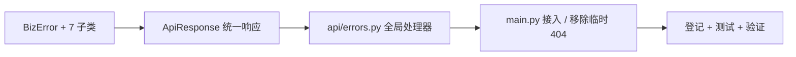

# 异常体系与统一响应实施记录

> 项目骨架 · 02 后端基座 · 03 core 横切基座 · 01 异常体系与统一响应 · 实施记录

[文档首页](../../../../../../../文档首页.md) › [02-3-1 异常体系与统一响应](../02_后端基座_03_core横切基座_01_异常体系与统一响应.md) › 01 实施　|　[← 父任务](../02_后端基座_03_core横切基座_01_异常体系与统一响应.md)

## 1. 实施信息 <a id="meta"></a>

| 项 | 值 |
| --- | --- |
| 任务 | [01 异常体系与统一响应](../02_后端基座_03_core横切基座_01_异常体系与统一响应.md) |
| 对应需求 | [02-9](../../../../../需求/02_需求_后端基座.md#r02-9) |
| 详细设计 | [01_详细设计_01_异常体系与统一响应](../设计/01_详细设计_01_异常体系与统一响应.md) |
| 实施日期 | 2026-09-13 |
| 实施人 | minjian |
| 实施环境 | 开发机（Ubuntu，Python 3.14 / uv） |
| 提交 | 待确认 |
| 结论 | 完成 |

## 2. 实施概览 <a id="overview"></a>



结果小结：`BizError` 异常体系与 `ApiResponse` 统一响应落地，全局处理器接管业务异常 / 参数校验 / 未捕获异常；临时 404 处理器移除；`pytest` / `ruff` / `pyright` 全绿、覆盖率 100%。

## 3. 实施过程 <a id="process"></a>

1. **异常体系**：`app/core/exceptions.py` 落地 `BizError`（`code` / `message` / `http_status` / `data`）+ 骨架 7 子类（10000/10001/10002/10003/10004/20001/30001）；`NotFoundError`、`ConcurrentConflictError` 由占位 `Exception` 改继承 `BizError`。
2. **统一响应**：`app/schemas/common.py` 落地 `ApiResponse(BaseSchema)` `{code, message, data}` + `ok()`。
3. **全局处理器**：新增 `app/api/errors.py` 的 `register_exception_handlers(app)`——`BizError` → 统一响应（HTTP 状态分离）；`RequestValidationError` → `ParamError`（10001）；未捕获异常 → 500 + `InternalError`（不暴露堆栈）；回写 `X-Request-Id`。
4. **接入**：`main.py` 注册处理器、移除临时 `not_found_handler`、根路由用 `ApiResponse`；`api/demo.py` 响应改用 `ApiResponse`。
5. **登记**：《架构设计 · 后端基础类体系》§6、《后端开发规范》§3.5；02-5-1 乐观锁错误码明确为 `ConcurrentConflictError`（10004）。
6. **测试**：新增 `tests/core/test_exceptions.py`、`tests/api/test_errors.py`（Kiwi 20）。
7. **验证**：`uv run pytest` / `uv run ruff check .` / `uv run pyright` 全绿，覆盖率 100%（详见[测试记录](../测试/01_测试_01_异常体系与统一响应.md)）。

关键命令：

```bash
uv run pytest --cov=app -q
uv run ruff check .
uv run pyright
```

## 4. 问题与处置 <a id="issues"></a>

| 问题 / 现象 | 原因 | 处置与落点 |
| --- | --- | --- |
| ruff `UP037`（类型注解引号） | Python 3.14 支持自引用注解 | 去掉 `"ApiResponse"` 引号 |
| pyright 报处理器函数未使用 | 嵌套函数经 `app.exception_handler` 装饰注册 | 处理器函数加 `reportUnusedFunction` 忽略 |
| pyright 报 `TestClient` 成员类型 unknown | starlette TestClient 类型信息不全 | 未捕获异常用例改用 `httpx.ASGITransport`（类型完整） |

## 5. 验证结果 <a id="verify"></a>

| 完成标准 | 验证方法 | 实测结果 |
| --- | --- | --- |
| `BizError` 及各子类可用 | Kiwi 20 用例 | 通过 |
| 业务异常经全局处理器转统一响应 | 处理器集成用例 | 通过 |
| 未捕获异常 500 且不泄露堆栈 | 未捕获用例 | 通过 |
| 错误码段位登记 | 架构「错误码」节对照 | 一致 |
| 临时处理器移除 | `main.py` 核对 | 已移除 |
| 无 lint / 类型错误 | `uv run ruff check .` / `uv run pyright` | All checks passed / 0 errors |

## 6. 偏差与遗留 <a id="deviations"></a>

- **应用基类体系（2026-09-13 调整）**：按基座口径把本任务产物挂到 L0——`BizError` 继承 `BaseObject`（获得统一序列化 / 字符串输出，覆写 `__str__` 返回消息）；错误码抽为基座 `core/error_codes.py`（`ErrorCode` / `ErrorSegment`），异常类引用之；**新增段位基类** `GeneralError`（1xxxx）/ `AuthError`（2xxxx）/ `UserOrgError`（3xxxx），子类按段位继承；`ApiResponse` 登记为响应基类（架构33 §4/§7、规范 §3.4）。
- 各业务域具体错误码（2xxxx / 3xxxx / 4xxxx…）随对应模块登记；`AuthError` / `PermissionError` 本阶段仅定义类与码位，实现随认证 / RBAC 阶段（已登记：阶段一计划「后续阶段待办」表）。
- trace_id 真实链路追踪随 02-3-4 / 03-2 日志体系（已登记：02-3-4 任务内容）；`ApiResponse` 分页 `data` 复用 02-2-3 契约。

> 本文档依《文档生成规范》编写
