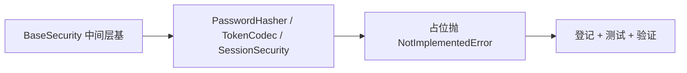

# 安全基座结构占位实施记录

> 项目骨架 · 02 后端基座 · 03 core 横切基座 · 03 安全基座结构占位 · 实施记录

[文档首页](../../../../../../../文档首页.md) › [02-3-3 安全基座结构占位](../02_后端基座_03_core横切基座_03_安全基座结构占位.md) › 01 实施　|　[← 父任务](../02_后端基座_03_core横切基座_03_安全基座结构占位.md)

## 1. 实施信息 <a id="meta"></a>

| 项 | 值 |
| --- | --- |
| 任务 | [03 安全基座结构占位](../02_后端基座_03_core横切基座_03_安全基座结构占位.md) |
| 对应需求 | [02-11](../../../../../需求/02_需求_后端基座.md#r02-11) |
| 详细设计 | [03_详细设计_01_安全基座结构占位](../设计/03_详细设计_01_安全基座结构占位.md) |
| 实施日期 | 2026-09-13 |
| 实施人 | minjian |
| 实施环境 | 开发机（Ubuntu，Python 3.14 / uv） |
| 提交 | 待确认 |
| 结论 | 完成 |

## 2. 实施概览 <a id="overview"></a>



结果小结：安全原语中间层基与三类原语签名落地（纳入 `BaseObject` 体系）；占位抛 `NotImplementedError`、类可实例化；`pytest` / `ruff` / `pyright` 全绿、覆盖率 100%。

## 3. 实施过程 <a id="process"></a>

1. **中间层基**：`app/core/security.py` 的 `BaseSecurity(BaseObject, ABC)`（统一安全约定与入口）。
2. **原语类**：`PasswordHasher`（`hash` / `verify`，bcrypt / argon2）、`TokenCodec`（`encode` / `decode`，双 token）、`SessionSecurity`（`new_session_id` / `fingerprint` / `blacklist_key`），均继承 `BaseSecurity`；方法签名齐备、占位抛 `NotImplementedError`。
3. **登记**：《架构设计 · 后端基础类体系》§4 / §6、《后端开发规范》§3.5（安全基座结构占位；真实实现随认证阶段）。
4. **测试**：新增 `tests/core/test_security.py`（Kiwi 22）。
5. **验证**：`uv run pytest` / `uv run ruff check .` / `uv run pyright` 全绿，覆盖率 100%（详见[测试记录](../测试/03_测试_01_安全基座结构占位.md)）。

关键命令：

```bash
uv run pytest --cov=app -q
uv run ruff check .
uv run pyright
```

## 4. 问题与处置 <a id="issues"></a>

| 问题 / 现象 | 原因 | 处置与落点 |
| --- | --- | --- |
| ruff `RUF100` 未使用 `noqa` | `B024` 未触发（中间层基继承 `BaseObject`，规则不适用） | 移除多余 `# noqa: B024` |

## 5. 验证结果 <a id="verify"></a>

| 完成标准 | 验证方法 | 实测结果 |
| --- | --- | --- |
| 安全基座接口声明就位、可被上层引用 | Kiwi 22 用例 + 代码核对 | 通过 |
| 依赖注入可解析、应用可启动不报错 | 构造可解析用例 | 通过 |
| 不实现安全细节 | 方法占位抛 `NotImplementedError` | 通过 |
| 无 lint / 类型错误 | `uv run ruff check .` / `uv run pyright` | All checks passed / 0 errors |

## 6. 偏差与遗留 <a id="deviations"></a>

- **无偏差**：按详细设计执行。
- 真实实现（密码哈希 bcrypt/argon2、JWT 双 token、会话黑名单）随认证阶段；依赖注入提供者随认证阶段接入。
- `AuthError` / `PermissionError` 错误码实现随认证 / RBAC 阶段（已登记计划待办）。

> 本文档依《文档生成规范》编写
