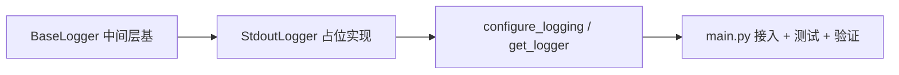

# 日志基座接入点实施记录

> 项目骨架 · 02 后端基座 · 03 core 横切基座 · 04 日志基座接入点 · 实施记录

[文档首页](../../../../../../../文档首页.md) › [02-3-4 日志基座接入点](../02_后端基座_03_core横切基座_04_日志基座接入点.md) › 01 实施　|　[← 父任务](../02_后端基座_03_core横切基座_04_日志基座接入点.md)

## 1. 实施信息 <a id="meta"></a>

| 项 | 值 |
| --- | --- |
| 任务 | [04 日志基座接入点](../02_后端基座_03_core横切基座_04_日志基座接入点.md) |
| 对应需求 | [02-12](../../../../../需求/02_需求_后端基座.md#r02-12) |
| 详细设计 | [04_详细设计_01_日志基座接入点](../设计/04_详细设计_01_日志基座接入点.md) |
| 实施日期 | 2026-09-13 |
| 实施人 | minjian |
| 实施环境 | 开发机（Ubuntu，Python 3.14 / uv） |
| 提交 | 待确认 |
| 结论 | 完成 |

## 2. 实施概览 <a id="overview"></a>



结果小结：日志门面中间层与接入点落地（标准库 stdout、不落文件）；`create_app` 接入 `configure_logging(get_settings())`；`pytest` / `ruff` / `pyright` 全绿、覆盖率 100%。

## 3. 实施过程 <a id="process"></a>

1. **中间层基**：`app/core/logging.py` 的 `BaseLogger(BaseObject, ABC)`（门面：`debug` / `info` / `warning` / `error` / `exception` + `bind`）。
2. **占位实现**：`StdoutLogger(BaseLogger)`（标准库 logging，输出 stdout、不落文件）。
3. **入口**：`configure_logging(settings)`（幂等，级别取 `settings.log.level`，stdout handler）+ `get_logger(name)`。
4. **接入**：`app/main.py` 的 `create_app()` 调用 `configure_logging(get_settings())`（移除旧 TODO）。
5. **登记**：《架构设计 · 后端基础类体系》§4 / §6、《后端开发规范》§3.5（日志基座接入点；真实 structlog 归 03-2）。
6. **测试**：新增 `tests/core/test_logging.py`（Kiwi 23）。
7. **验证**：`uv run pytest` / `uv run ruff check .` / `uv run pyright` 全绿，覆盖率 100%（详见[测试记录](../测试/04_测试_01_日志基座接入点.md)）。

关键命令：

```bash
uv run pytest --cov=app -q
uv run ruff check .
uv run pyright
```

## 4. 问题与处置 <a id="issues"></a>

| 问题 / 现象 | 原因 | 处置与落点 |
| --- | --- | --- |
| ruff `UP037`（自引用注解引号） | Python 3.14 支持自引用注解 | 去掉 `bind` 返回注解引号 |

## 5. 验证结果 <a id="verify"></a>

| 完成标准 | 验证方法 | 实测结果 |
| --- | --- | --- |
| 日志基座接入点声明就位、可被上层引用 | Kiwi 23 用例 + 代码核对 | 通过 |
| 依赖注入可解析、应用可启动不报错 | 应用启动冒烟 + 初始化用例 | 通过 |
| 不实现日志细节 | 占位为标准库最小实现；structlog 归 03-2 | 通过 |
| 无 lint / 类型错误 | `uv run ruff check .` / `uv run pyright` | All checks passed / 0 errors |

## 6. 偏差与遗留 <a id="deviations"></a>

- **无偏差**：按详细设计执行。
- **遗留归口**：
  - structlog JSON 渲染、上下文字段（`trace_id` / `tenant` / `user`）、脱敏、请求日志中间件 → 阶段一 **03_02 日志体系**（已在本阶段排期）；`configure_logging` 为其初始化入口。
  - `trace_id` 链路追踪与 OpenTelemetry 接入 → 计划「后续阶段待办」表「链路追踪与 OpenTelemetry 接入」（分布式与监控阶段）。

> 本文档依《文档生成规范》编写
