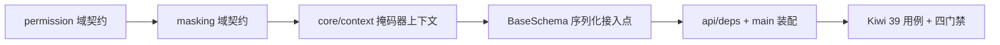

# 数据脱敏基座实施记录

> 项目骨架 · 02 后端基座 · 03 core 横切基座 · 05 数据脱敏基座 · 实施记录

[文档首页](../../../../../../../文档首页.md) › [02-3-5 数据脱敏基座](../02_后端基座_03_core横切基座_05_数据脱敏基座.md) › 01 实施　|　[← 父任务](../02_后端基座_03_core横切基座_05_数据脱敏基座.md)

## 1. 实施信息 <a id="meta"></a>

| 项 | 值 |
| --- | --- |
| 任务 | [05 数据脱敏基座](../02_后端基座_03_core横切基座_05_数据脱敏基座.md) |
| 对应需求 | [02-29](../../../../../需求/02_需求_后端基座.md#r02-29)（含提前交付的 [02-24](../../../../../需求/02_需求_后端基座.md#r02-24) 权限校验契约） |
| 详细设计 | [05_详细设计_01_数据脱敏基座](../设计/05_详细设计_01_数据脱敏基座.md) |
| 实施日期 | 2026-09-14 |
| 实施人 | minjian |
| 实施环境 | 开发机（Ubuntu，Python 3.14 / uv） |
| 提交 | 待提交 |
| 结论 | 完成 |

## 2. 实施概览 <a id="overview"></a>



结果小结：数据脱敏能力域契约与占位实现落地（`BaseMasker` / `NullMasker`），权限校验能力域契约按需求 02-24 完整提前交付（`BasePermissionChecker` / `NullPermissionChecker` + `require_permission` 依赖工厂），`BaseSchema` 序列化自动掩码接入点就位且未注入掩码器时直通；应用可启动、依赖可解析；`pytest` / `ruff` / `pyright` 全绿。

## 3. 实施过程 <a id="process"></a>

1. **权限域契约**：新增 `app/permission/`（`__init__.py` + `base.py`）——`BasePermissionChecker(BaseCapability)`（`key = "permission"`；抽象 `check(code) -> bool` + 具体 `require(code)`，失败抛 `PermissionError` 30001 / 403）、`NullPermissionChecker`（恒定允许）、提供者 `get_permission_checker(request)`、依赖工厂 `require_permission(code)`。
2. **脱敏域契约**：新增 `app/masking/`（`__init__.py` + `base.py`）——`MASK_STRATEGIES` 六项候选策略、`MaskRule`（frozen dataclass 登记项）、`BaseMasker(BaseCapability)`（`key = "masking"`；构造注入权限检查器；`register` 为基类公共实现、`mask` / `reveal` 抽象、`check_plain()` 单点判定 `data:plain`）、`NullMasker`（`mask` / `reveal` 原样返回）。
3. **上下文变量**：`app/core/context.py` 新增 `current_masker`（`ContextVar`）+ `set_current_masker` / `reset_current_masker` / `get_current_masker`；`BaseMasker` 类型经 `TYPE_CHECKING` 前向引用导入（避免 `core` ↔ `masking` 运行时循环依赖）。
4. **序列化接入**：`app/schemas/base.py` 新增类属性 `masked_fields`（默认空集）与模块级 `_apply_masking`；在既有 `@model_serializer(mode="wrap")` 包装器内、`stringify_ids` 之后追加掩码步骤（未注入掩码器 / 无声明 / 非字典 → 原样返回）。**不单独覆写 `model_dump`**：四条序列化出口（`model_dump` / `model_dump_json` / `to_dict` / `to_json`）口径一致，且不背 Pydantic 版本参数签名兼容负担。
5. **依赖注入装配**：`app/api/deps.py` 导出 `get_masker` / `get_permission_checker`；`app/main.py` 的 `create_app()` 装配 `app.state.permission_checker = NullPermissionChecker()`、`app.state.masker = NullMasker(checker=...)`；`get_masker` 为**异步**生成器依赖，请求期写入 `current_masker`、请求结束复位。
6. **测试**：新增 `tests/masking/test_masking.py`、`tests/permission/test_permission.py`（Kiwi 39，共 9 条用例）；首次运行暴露同步生成器依赖的线程池上下文问题，改为异步生成器后通过。
7. **Kiwi 登记**：在 mjbk Kiwi TCMS（分类「平台骨架」、P2、CONFIRMED、标签「自动化」）登记用例 **39「数据脱敏基座（契约 / 注册表 / 占位直通 / 权限联动 / 序列化掩码 / 依赖解析）」**，与代码 `@pytest.mark.kiwi_id(39)` 一致。
8. **登记回写**：《架构设计 · 后端基础类体系》§4 基类清单（`BaseSchema` 行补掩码接入点 + 新增脱敏 / 权限两行 + 继承链）与 §8 跨阶段基座契约表；《后端基类清单》§2 / §7 / §9 / §10；《后端开发规范》§3.1（脱敏与权限口径）；任务 / 父任务 / 需求 / 计划状态回写。

关键命令：

```bash
uv run pytest --cov=app -q
uv run ruff check .
uv run ruff format --check .
uv run pyright
```

## 4. 问题与处置 <a id="issues"></a>

| 问题 / 现象 | 原因 | 处置与落点 |
| --- | --- | --- |
| ruff `UP037`（引号注解，5 处） | Python 3.14 注解惰性求值（PEP 649），前向引用无需引号 | `ruff check app/core/context.py --fix` 去引号；`TYPE_CHECKING` 导入保留（类型检查可解析） |
| pyright `reportUnknownVariableType`（`app/schemas/base.py` 的 `return data`） | 参数 `object` 经 `isinstance(data, dict)` 收窄为 `dict[Unknown, Unknown]` | 改为 `return fields`（已 `cast` 为 `dict[str, object]`），类型完全已知 |
| pytest 失败：`ValueError: Token was created in a different Context` | `get_masker` 写成**同步**生成器依赖 → FastAPI 用 `contextmanager_in_threadpool` 在线程池执行 enter / exit，`contextvars` 的 `set` 与 `reset` 不在同一 Context，且掩码器传不到接口内 | 改为**异步**生成器依赖（`async def` + `yield`）；已在详细设计 §7 与 `get_masker` docstring 写明该约束（后续能力域提供者照此口径） |
| `BaseSchema` 掩码接入点与既有 Kiwi 13 兼容 | 既有断言覆盖 `to_dict() == model_dump()`、精确字典与嵌套 ID 字符串化 | 无掩码器时 `_apply_masking` 原样返回；Kiwi 13 断言未改动、全数通过 |

## 5. 验证结果 <a id="verify"></a>

| 完成标准 | 验证方法 | 实测结果 |
| --- | --- | --- |
| 接口 / 抽象声明就位、可被上层引用 | Kiwi 39 用例 + 代码核对 | 通过 |
| 依赖注入可解析、应用可启动不报错 | `create_app` 装配 + `get_masker` / `get_permission_checker` 依赖用例 + 应用冒烟用例 | 通过 |
| 占位实现不掩码（原样返回） | 占位直通用例（含未注册字段） | 通过 |
| 序列化接入点就位且不改既有行为 | 掩码 / 直通用例 + Kiwi 13 回归 | 通过 |
| 权限判定在基座内（调用方不传权限） | `check_plain()` 用例（允许 / 拒绝两条路径） | 通过 |
| 登记齐备 | 架构 04 §4 / §8、《后端基类清单》§2 / §7 / §9 / §10、《后端开发规范》§3.1 | 已登记 |
| 不实现真实能力 | 无真实掩码规则、无解密、无 RBAC 查询；仅接口签名与占位 | 通过 |
| 无 lint / 类型错误 | `uv run ruff check .` / `uv run ruff format --check .` / `uv run pyright` | All checks passed / 124 files already formatted / 0 errors |

## 6. 偏差与遗留 <a id="deviations"></a>

- **偏差**：无功能性偏差。两点实现口径已在详细设计中同步说明——① 序列化掩码复用既有 `model_serializer(mode="wrap")`（达成「`model_dump` 自动掩码」且四条出口一致）；② `get_masker` 为异步生成器依赖（同步依赖走线程池会破坏上下文变量）。
- **遗留归口**：
  - 真实掩码规则（手机号 / 身份证 / 邮箱 / 银行卡 / 姓名）、`reveal` 真实解密 → 性能与安全阶段（需求 02-29 口径，同一任务文档不重复立项）。
  - `data:plain` 真实权限查询与 RBAC 主体链 → 五 RBAC 阶段替换 `NullPermissionChecker`（[02-3-9 权限校验基座](../../02_后端基座_03_core横切基座_09_权限校验基座/02_后端基座_03_core横切基座_09_权限校验基座.md) 复用本任务提前交付的契约）。
  - 嵌套 `BaseSchema` 的掩码、导出侧脱敏、日志脱敏（03-2）、AI 交互落库前掩码 → 各自阶段，统一经 `BaseMasker` 接入。
  - 需求 02-24 状态未回写：契约代码由本任务提前交付，但归属 02-3-9，待其登记复用后回写。

> 本文档依《文档生成规范》编写
