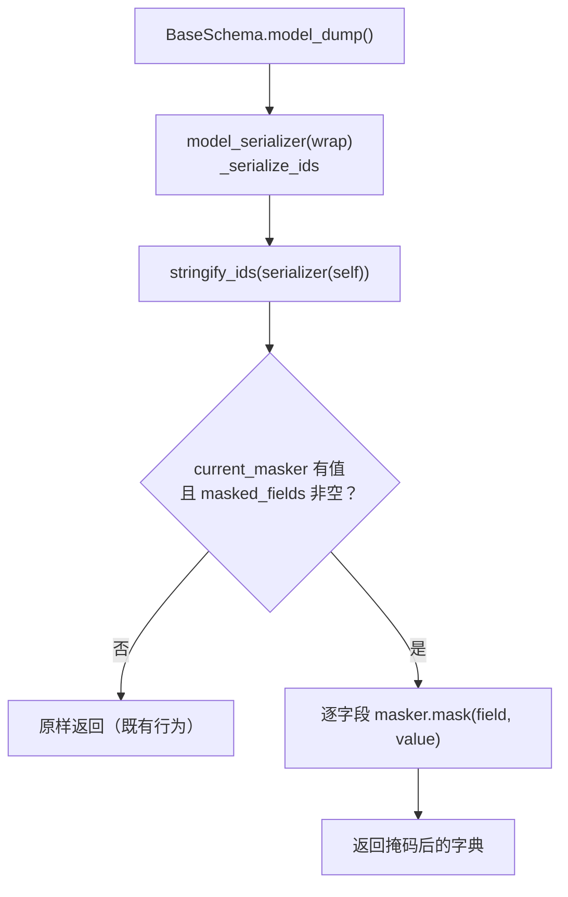

# 数据脱敏基座详细设计

> 项目骨架 · 02 后端基座 · 03 core 横切基座 · 05 数据脱敏基座 · 详细设计

[文档首页](../../../../../../../文档首页.md) › [02-3-5 数据脱敏基座](../02_后端基座_03_core横切基座_05_数据脱敏基座.md) › 01 详细设计　|　[← 父任务](../02_后端基座_03_core横切基座_05_数据脱敏基座.md)

## 1. 概述 <a id="overview"></a>

- **目标**：落地「数据脱敏基座」的契约与占位实现——`app/masking/base.py` 的**能力域中间层** `BaseMasker`（字段注册 + `mask` / `reveal`）+ 占位实现 `NullMasker`（原样返回、不掩码）；配套 `app/permission/base.py` 的 `BasePermissionChecker` + `NullPermissionChecker`（恒定允许，作为脱敏「持 `data:plain` 看明文」判定的注入依赖）；`BaseSchema` 序列化自动掩码接入点（`masked_fields` 声明 + 无 masker 直通）；依赖注入提供者与 `create_app` 装配。
- **范围**：`app/masking/`（新增）、`app/permission/`（新增）、`app/core/context.py`（掩码器上下文变量）、`app/schemas/base.py`（掩码接入点）、`app/api/deps.py`（提供者导出）、`app/main.py`（装配）、单测。
- **不含**（归相邻任务 / 后续阶段）：真实掩码规则（手机号 / 身份证 / 邮箱等正则与掩码模板，随性能与安全阶段回补）；`reveal` 的**真实解密**（密钥 / 加密字段，随性能与安全阶段）；`data:plain` 的**真实权限查询**与 RBAC 主体链（随 RBAC 阶段，对应[02-3-9 权限校验基座](../../02_后端基座_03_core横切基座_09_权限校验基座/02_后端基座_03_core横切基座_09_权限校验基座.md)）；导出侧脱敏（[《概要设计 · 导入导出》](../../../../../../../设计/概要设计/19_概要设计_导入导出.md)）；日志敏感字段脱敏（[03-2 日志体系](../../../../../需求/03_需求_后端基础能力.md#r03-2)）；字段权限 `visible` / `editable` 读时过滤（[《架构设计 · 权限计算引擎》](../../../../../../../设计/架构设计/15_架构设计_子系统_权限计算引擎.md)「字段权限」节）。
- **依据**：需求 [02-29](../../../../../需求/02_需求_后端基座.md#r02-29)、需求 [02-24](../../../../../需求/02_需求_后端基座.md#r02-24)、《[架构设计 · 性能与安全](../../../../../../../设计/架构设计/31_架构设计_性能与安全.md)》「数据安全」节、《[架构设计 · 后端基础类体系](../../../../../../../设计/架构设计/04_架构设计_后端基础类体系.md)》「阶段落地（地基波 + 回补）」节、《[后端开发规范](../../../../../../../规范/后端开发规范.md)》「后端基座体系（强制）」节、《[安全开发规范](../../../../../../../规范/安全开发规范.md)》「数据安全」节、《[命名规范](../../../../../../../规范/命名规范.md)》「后端命名」节。

## 2. 现状与差距 <a id="gap"></a>

| 现状 | 差距 |
| --- | --- |
| 全库无 `BaseMasker` / `NullMasker` / `masked_fields` 相关实现（检索零命中）；无 `app/masking/` 目录 | 无统一脱敏入口、无敏感字段登记位；各模块只能自行掩码，口径与绕过风险并存 |
| 全库无 `BasePermissionChecker` / `NullPermissionChecker`（检索零命中）；无 `app/permission/` 目录 | 脱敏所需的 `data:plain` 判定无依赖可注入；权限校验入口（需求 02-24）亦缺位 |
| `app/core/context.py` 仅有 `current_user_id` / `current_tenant` / `read_only` 三个上下文变量 | 序列化期取不到当前掩码器，无法做「自动掩码」 |
| `app/schemas/base.py` 的 `BaseSchema` 只有 `@model_serializer(mode="wrap")` 做 ID 字符串化，无掩码接入点与字段声明 | 序列化层默认掩码（架构「数据安全」节）无处落地 |
| `app/api/deps.py` 只汇总数据访问与租户依赖；`create_app` 只装配 `engine_factory` / `engine_registry` / `resources` / `module_registry` / `demo_service` | 能力域基座无提供者、无应用级单例，「依赖注入可解析」无落点 |
| 既有 `tests/schemas/test_base_schema.py`（Kiwi 13）断言 `to_dict() == model_dump()`、`BasePageQuery().model_dump()` 精确字典、`_IdSchema` 精确字典（含嵌套） | 掩码接入点必须保证**无掩码器时行为完全不变（直通）**，否则既有断言回归失败 |

## 3. 交付物清单 <a id="tree"></a>

```text
backend/
├── app/masking/__init__.py                     # 新增：能力域包（导出 BaseMasker / NullMasker / MaskRule / MASK_STRATEGIES）
├── app/masking/base.py                         # 新增：MASK_STRATEGIES / MaskRule / BaseMasker / NullMasker
├── app/permission/__init__.py                  # 新增：权限域包（导出 BasePermissionChecker / NullPermissionChecker / require_permission）
├── app/permission/base.py                      # 新增：BasePermissionChecker / NullPermissionChecker / require_permission / get_permission_checker
├── app/core/context.py                         # 修改：新增 current_masker 上下文变量（set / reset / get）
├── app/schemas/base.py                         # 修改：masked_fields 类属性 + 序列化追加掩码步骤（无掩码器直通）
├── app/api/deps.py                             # 修改：导出 get_masker / get_permission_checker
├── app/main.py                                 # 修改：装配 app.state.permission_checker / app.state.masker
└── tests/
    ├── masking/test_masking.py                 # 新增：Kiwi 39（契约 / 注册表 / 占位原样返回 / 权限联动 / 依赖解析）
    ├── permission/test_permission.py           # 新增：Kiwi 39（契约 / 恒定允许 / 依赖工厂）
    └── schemas/test_base_schema.py             # 回归：Kiwi 13（无掩码器直通，断言不变）

bms文档/
├── 设计/架构设计/04_架构设计_后端基础类体系.md   # 修改：§4 基类清单 + §8 跨阶段基座契约表登记
├── 后端基类清单.md                              # 修改：§2 分层总览 + §9 跨阶段基座 + §10 继承链与代码位置
└── 规范/后端开发规范.md                          # 修改：§3.1 强制用法 + §3.2 扩展规则（数据脱敏 / 权限校验口径）
```

## 4. 脱敏能力域设计（`app/masking/base.py`） <a id="masking"></a>

| 成员 | 形态 | 说明 |
| --- | --- | --- |
| `MASK_STRATEGIES` | `tuple[str, ...]` 常量 | 候选掩码策略：`("phone", "id_card", "email", "bank_card", "name", "custom")`；**占位期仅登记不生效**，上层可先按常量声明 |
| `MaskRule` | `@dataclass(frozen=True)`，继承 `BaseObject` | 字段 → 策略的登记项：`field: str` + `strategy: str = "custom"`（与 `ScopeCondition` / `FieldChange` 同风格） |
| `BaseMasker(BaseCapability, ABC)` | 能力域契约中间层 | `key: str = "masking"`；构造注入权限检查器；`register` 为基类公共实现，`mask` / `reveal` 为抽象方法 |
| `BaseMasker.__init__(self, *, checker: BasePermissionChecker)` | 构造 | 权限检查器**必传**（关键字），与「基座内判定」口径一致 |
| `BaseMasker.register(field, strategy="custom") -> MaskRule` | 具体方法 | 写注册表（`dict[str, MaskRule]`，同字段重复注册以最后一次为准），返回登记项 |
| `BaseMasker.masked_fields` | `property -> frozenset[str]` | 已注册字段集合（供序列化层与测试核对） |
| `BaseMasker.mask(field, value) -> object` | 抽象方法 | 按注册策略掩码；**持 `data:plain` 时返回明文**；未注册字段原样返回 |
| `BaseMasker.reveal(field, value) -> object` | 抽象方法 | 还原明文（加密字段解密）；**持 `data:plain` 放行**，否则返回掩码值 |
| `BaseMasker.check_plain() -> bool` | 具体方法（受保护语义） | 判定当前请求是否持 `data:plain`：`return self._checker.check("data:plain")`（单一事实源） |
| `NullMasker(BaseMasker, BaseNullObject)` | 占位实现 | `mask` / `reveal` **原样返回**（不掩码、不解密）；`register` 照常登记（沿用基类实现） |

```mermaid
flowchart LR
    CTX["请求上下文<br/>masked_fields 声明"] --> SER["BaseSchema 序列化<br/>wrap 包装器"]
    SER -->|"无掩码器"| PASS["直通输出<br/>（占位期默认）"]
    SER -->|"有掩码器"| MASK["masker.mask(field, value)"]
    MASK --> CHK["checker.check(\"data:plain\")"]
    CHK -->|"真（有权限）"| PLAIN["返回明文"]
    CHK -->|"假（无权限）"| HIDE["返回掩码值"]
```

**契约口径（本任务定稿）**：

| 情形 | 处置 |
| --- | --- |
| 字段未注册 | 原样返回（未注册即非敏感字段） |
| 已注册 + 无 `data:plain` | 返回掩码值（占位 `NullMasker` 无掩码 → 原样返回） |
| 已注册 + 有 `data:plain` | `mask` 返回明文；`reveal` 放行解密（占位原样返回） |
| `strategy` 取值 | 占位期不校验取值（仅登记）；真实实现期按 `MASK_STRATEGIES` 解析规则 |
| 权限参数 | **不传**（`plain` 参数已去除），统一由基座内 `check_plain()` 判定 |

## 5. 权限检查器契约设计（`app/permission/base.py`） <a id="permission"></a>

按需求 [02-24](../../../../../需求/02_需求_后端基座.md#r02-24) 的完整契约提前立域，供本任务脱敏判定复用，并由 [02-3-9 权限校验基座](../../02_后端基座_03_core横切基座_09_权限校验基座/02_后端基座_03_core横切基座_09_权限校验基座.md) 后续直接复用（不重复建设）：

| 成员 | 形态 | 说明 |
| --- | --- | --- |
| `BasePermissionChecker(BaseCapability, ABC)` | 能力域契约中间层 | `key: str = "permission"`；与数据侧 `DataScope` 分工（权限码校验 vs 数据范围过滤） |
| `BasePermissionChecker.check(code) -> bool` | 抽象方法 | 是否持该权限码（如 `data:plain`）；真实 RBAC 随 RBAC 阶段 |
| `BasePermissionChecker.require(code) -> None` | 具体方法 | 校验失败抛 `app.core.exceptions.PermissionError`（30001 / 403） |
| `require_permission(code) -> Callable[..., None]` | 模块级依赖工厂 | FastAPI 依赖签名：返回的依赖函数内取检查器并 `require(code)`；恒定放行与否取决实现 |
| `get_permission_checker(request) -> BasePermissionChecker` | 模块级提供者 | 从 `request.app.state.permission_checker` 取应用级单例（`app/api/deps.py` 再导出） |
| `NullPermissionChecker(BasePermissionChecker, BaseNullObject)` | 占位实现 | `check` **恒定返回 True**（恒定允许，不读权限数据） |

- 与既有 `NullDataScope`「恒定允许」口径一致；`PermissionError` 复用已交付的 [异常体系](../../02_后端基座_03_core横切基座_01_异常体系与统一响应/02_后端基座_03_core横切基座_01_异常体系与统一响应.md)（全局处理器转 `{code, message, data}`）。
- **依赖方向**：`app/masking/` → `app/permission/` → `app/core/`，无反向依赖；`app/permission/` 与 `app/masking/` 均不依赖 `api/` / `services/`（《后端开发规范》「依赖方向」节）。

## 6. `BaseSchema` 序列化接入点 <a id="schema"></a>

`app/schemas/base.py`（修改）：

| 变更 | 内容 |
| --- | --- |
| 新增类属性 | `masked_fields: ClassVar[frozenset[str]] = frozenset()`——声明本模型需掩码的敏感字段；默认空集 |
| 序列化追加掩码 | 在既有 `@model_serializer(mode="wrap")` 包装器内，`stringify_ids(...)` 之后追加「按 `masked_fields` + 当前掩码器掩码」步骤 |
| 掩码器来源 | `app/core/context.py` 的 `current_masker` 上下文变量（`ContextVar[BaseMasker \| None]`，默认 `None`） |
| 直通保证 | 掩码器为 `None` 或 `masked_fields` 为空 → 返回 `stringify_ids` 结果，**行为与现状完全一致** |

**实现口径（对齐记录第 4 项）**：不额外覆写 `model_dump` 签名，而是复用既有 `model_serializer(mode="wrap")` 包装器追加掩码步骤——这达成了「`model_dump` 自动掩码、调用方无感」的目标，且 `model_dump` / `model_dump_json` / `to_dict` / `to_json` 四条序列化出口口径一致（若单独覆写 `model_dump`，`model_dump_json` 会绕过掩码，形成静默不一致；覆写还需逐个对齐 Pydantic 版本的全部参数签名，易随升级漂移）。



**必须同步的既有用例（Kiwi 13，回归口径）**：`tests/schemas/test_base_schema.py` 的 `test_schema_to_dict_matches_model_dump`、`test_page_query_defaults_and_bounds`、`test_id_fields_serialized_as_string`（含嵌套）等断言**保持不变**——占位期无掩码器（`current_masker` 为 `None`），序列化必须与现状逐字节一致。

**嵌套模型口径**：Pydantic 内层模型的序列化不经过外层模型类的方法，嵌套 `BaseSchema` 的掩码不在本任务生效范围（占位期无掩码，无实际差异），列入「边界与开放项」，随真实实现阶段一并对齐。

## 7. 应用装配与依赖注入 <a id="di"></a>

| 位置 | 变更 |
| --- | --- |
| `app/api/deps.py` | 导出 `get_masker`（来自 `app/masking/base.py`）与 `get_permission_checker`（来自 `app/permission/base.py`），与既有 `get_db` / `get_uow` / `get_tenant` 并列 |
| `app/main.py` `create_app()` | 装配 `app.state.permission_checker = NullPermissionChecker()`、`app.state.masker = NullMasker(checker=app.state.permission_checker)` |
| 上下文注入 | `get_masker` 提供者在请求期把掩码器写入 `current_masker` 上下文变量（`yield` 后 `reset`，请求级隔离、可并发） |

- 构造即可解析（无外部依赖、不连库、不读权限数据），满足「依赖注入可解析、应用可启动不报错」。
- `get_masker` 必须写成**异步**生成器依赖（`async def` + `yield`）：同步生成器依赖由 FastAPI 放入线程池执行，`current_masker` 的 `set` 与 `reset` 不在同一 Context（实测抛 `Token was created in a different Context`），且上下文变量传不到接口内。
- 越权 / 权限真实实现随 RBAC 阶段替换 `NullPermissionChecker`，脱敏侧与序列化侧**零改动**（改基座实现即全链生效）。

## 8. 继承与分层 <a id="base"></a>

- `BaseMasker → BaseCapability → BaseObject`；`NullMasker → BaseMasker + BaseNullObject → BasePlaceholder → BaseObject`。
- `BasePermissionChecker → BaseCapability → BaseObject`；`NullPermissionChecker → BasePermissionChecker + BaseNullObject`。
- 与既有 `NullDataScope` / `NullShardingRouter` / `NullUnitOfWork` 同构（《后端基类清单》「中间层基类」节口径），不新增层级、不引入多重继承（仅与 `BaseNullObject` 混合，同既有做法）。

## 9. 登记落点 <a id="register"></a>

| 落点 | 登记内容 |
| --- | --- |
| 《架构设计 · 后端基础类体系》「基类清单与继承链」节 | 新增 `BaseMasker` / `NullMasker` / `MaskRule` / `BasePermissionChecker` / `NullPermissionChecker` 行（职责、代码位置、状态＝占位） |
| 《架构设计 · 后端基础类体系》「阶段落地（地基波 + 回补）」节 | 跨阶段基座契约表新增「数据脱敏」「权限校验」两行（代码位置、契约、回补阶段＝性能与安全 / RBAC） |
| 《后端基类清单》 | §2 分层总览补 `app/masking/` / `app/permission/` 能力域；§9 跨阶段基座补两行；§10 继承链与目录补两条 |
| 《后端开发规范》「后端基座体系」节 | §3.1 补口径：敏感字段掩码一律走 `BaseMasker`（禁止各模块自行掩码）、权限码校验一律走 `BasePermissionChecker`；§3.2 登记新增能力域 |
| 需求 [02-29](../../../../../需求/02_需求_后端基座.md#r02-29) / [02-24](../../../../../需求/02_需求_后端基座.md#r02-24) | 实施完成后回写状态 / 完成日期（本设计阶段不回写） |
| [02-3-9 权限校验基座](../../02_后端基座_03_core横切基座_09_权限校验基座/02_后端基座_03_core横切基座_09_权限校验基座.md) | 契约代码由本任务**提前交付**、登记归属挂 02-3-5；09 实施时标注「复用既有契约」（不改其状态与工时） |

## 10. 测试设计（Kiwi 先行） <a id="tests"></a>

用例**先登记 Kiwi TCMS 再编码**（《[测试规范](../../../../../../../规范/测试规范.md)》「用例管理（Kiwi TCMS）」节）；本任务新分配 **Kiwi 39**：

| Kiwi | 用例 | 断言要点 | 自动化文件 |
| --- | --- | --- | --- |
| 39 | 契约继承链 | `NullMasker → BaseMasker → BaseCapability → BaseObject`；`NullPermissionChecker → BasePermissionChecker → BaseCapability`；占位标记 `placeholder is True` | `tests/masking/test_masking.py`、`tests/permission/test_permission.py` |
| 39 | 能力域标识 | `BaseMasker.key == "masking"`、`BasePermissionChecker.key == "permission"` | 同上 |
| 39 | 字段注册 | `register("phone")` / `register("id_card", "id_card")` 入注册表、`masked_fields` 反映、同字段重复注册以最后一次为准 | `tests/masking/test_masking.py` |
| 39 | 占位原样返回 | `NullMasker.mask("phone", "13800001111") == "13800001111"`；`reveal` 同理；未注册字段原样返回 | 同上 |
| 39 | 权限联动 | `check_plain()` 经注入检查器判定：`NullPermissionChecker` 恒定 `True`；自定义拒绝实现下 `check_plain()` 为 `False`（**验证基座内判定、调用方不传权限**） | 同上 |
| 39 | 权限契约 | `NullPermissionChecker.check("data:plain") is True`；`require("data:plain")` 放行；自定义拒绝实现下 `require` 抛 `PermissionError`（30001 / 403） | `tests/permission/test_permission.py` |
| 39 | 依赖工厂与解析 | `require_permission("data:plain")` 返回可调用依赖；`get_masker` / `get_permission_checker` 能返回装配后的实例（应用可启动、依赖可解析） | 同上 |
| 39 | 序列化掩码接入 | 用测试用掩码器（覆写 `mask` 返回固定掩码）+ `masked_fields` 声明的测试模型：序列化结果被掩码；未声明字段不变 | `tests/masking/test_masking.py` |
| 39 | 无掩码器直通 | `current_masker` 为 `None` 时序列化与现状逐字段一致（`to_dict() == model_dump()`） | 同上 |
| 13（回归） | 既有序列化断言 | `test_base_schema.py` 全部断言**不改动**、保持通过（无掩码器直通） | `tests/schemas/test_base_schema.py` |

用例命名遵循《测试规范》「命名规范」节（后端测试文件 `test_模块.py`、函数 `test_行为_期望`）；测试数据自建、用例间不共享可变状态（上下文变量用例用 `try/finally` 复位）。

## 11. 实施步骤 <a id="steps"></a>

1. 新增 `app/permission/`（`__init__.py` + `base.py`：`BasePermissionChecker` / `NullPermissionChecker` / `require_permission` / `get_permission_checker`）。
2. 新增 `app/masking/`（`__init__.py` + `base.py`：`MASK_STRATEGIES` / `MaskRule` / `BaseMasker` / `NullMasker`）。
3. `app/core/context.py` 新增 `current_masker` 上下文变量（`set_current_masker` / `reset_current_masker` / `get_current_masker`）。
4. `app/schemas/base.py` 加 `masked_fields` 类属性与序列化掩码步骤（无掩码器直通）。
5. `app/api/deps.py` 导出两个提供者；`app/main.py` 装配 `app.state.permission_checker` / `app.state.masker`。
6. 测试：先登记 Kiwi 39 用例，再写 `tests/masking/test_masking.py`、`tests/permission/test_permission.py`，回归 `tests/schemas/test_base_schema.py`（Kiwi 13）。
7. 登记：架构 04 §4 / §8、《后端基类清单》§2 / §9 / §10、《后端开发规范》§3.1 / §3.2（第 9 节）。
8. 验证：`uv run pytest`、`uv run ruff check .`、`uv run pyright` 全绿；应用可启动、`/docs` 可访问。
9. 回写：实施 / 测试记录 + 任务（02-3-5、02_03 core 横切基座）与需求 02-29 状态、计划表。

## 12. 验收映射 <a id="accept-map"></a>

| 完成标准（需求 02-29 / 任务 02-3-5） | 验证方式 |
| --- | --- |
| 接口 / 抽象声明就位、可被上层引用 | `BaseMasker` / `BasePermissionChecker` 落地 + 继承断言 + Kiwi 39 |
| 依赖注入可解析、应用可启动不报错 | `create_app` 装配 + `get_masker` 解析用例 + 应用冒烟（`/docs`） |
| 占位实现不掩码（`NullMasker` 原样返回） | 占位原样返回用例（含未注册字段） |
| 序列化接入点就位且不改既有行为 | `masked_fields` + 掩码用例（有掩码器掩码 / 无掩码器直通）+ Kiwi 13 回归全绿 |
| 权限判定在基座内（调用方不传权限） | `check_plain()` 用例（注入检查器两条路径） |
| 登记齐备 | 架构 04 §4 / §8、《后端基类清单》§2 / §9 / §10、《后端开发规范》§3.1 / §3.2 核对 |
| 不实现真实能力 | 无真实掩码规则、无解密、无 RBAC 查询；接口签名与占位即交付边界 |
| 无 lint / 类型错误 | `uv run ruff check .`、`uv run pyright` |

## 13. 边界与开放项 <a id="boundary"></a>

- **真实掩码规则**：手机号 / 身份证 / 邮箱 / 银行卡 / 姓名等的掩码模板与正则，随性能与安全阶段回补（需求 02-29 口径，同一任务文档不重复立项）。
- **`reveal` 真实解密**：加密字段的密钥来源与解密路径随性能与安全阶段；密钥只走环境变量（不入库、不入镜像、不写日志）。
- **真实权限查询**：`data:plain` 由 RBAC 权限码集合判定，随 RBAC 阶段替换 `NullPermissionChecker`；三权分立与「安全管理员分配 `data` 权限码」口径由 [《架构设计 · 权限计算引擎》](../../../../../../../设计/架构设计/15_架构设计_子系统_权限计算引擎.md) 承接。
- **嵌套模型掩码**：Pydantic 内层序列化不经过外层模型，嵌套 `BaseSchema` 的掩码随真实实现阶段对齐（占位期无实际差异）。
- **字段权限协同**：脱敏（掩码展示）与字段权限（`visible` / `editable` 读时过滤、写时校验）互补，序列化侧「先过滤不可见字段、再掩码可见敏感字段」的顺序随字段权限阶段定稿。
- **其他消费方**：导出侧脱敏（导入导出模块）、日志脱敏（03-2 日志体系）、AI 交互落库前掩码（[《概要设计 · AI能力》](../../../../../../../设计/概要设计/34_概要设计_AI能力.md)）后续统一经 `BaseMasker` 接入，不得各自实现。
- **09 权限校验基座**：本任务提前交付 `app/permission/base.py` 契约（登记归属挂 02-3-5）；02-3-9 实施时在自身设计 / 任务文档标注「复用既有契约」，不重复建设。

## 14. 对齐记录 <a id="align"></a>

| # | 事项 | 结论 |
| --- | --- | --- |
| 1 | 契约代码落点 | 新建能力域目录 `app/masking/base.py`（与 `cache` / `scope` / `sharding` / `audit` 同构） |
| 2 | 形态 | 能力域中间层 `BaseMasker(BaseCapability, ABC)` + 占位 `NullMasker(BaseMasker, BaseNullObject)`（`mask` / `reveal` 原样返回） |
| 3 | 方法签名 | `register(field, strategy="custom")` + `mask(field, value)` + `reveal(field, value)` 三方法；`register` 为基类公共实现 |
| 4 | 序列化接入形态 | 覆写口径＝复用既有 `model_serializer(mode="wrap")` 追加掩码步骤（达成「`model_dump` 自动掩码、调用方无感」，且四条序列化出口口径一致）；`masked_fields` 类属性声明敏感字段；无掩码器直通 |
| 5 | 掩码器来源 | `app/core/context.py` 新增 `current_masker` 上下文变量，由 `get_masker` 提供者在请求期注入并复位 |
| 6 | 权限判定 | 基座**构造注入**权限检查器，由基座内 `check_plain()` 判定；调用方**不传**权限参数（`plain` 参数去除） |
| 7 | 权限契约落点 | 新建 `app/permission/base.py` 提前立域（`BasePermissionChecker` / `NullPermissionChecker` / `require_permission`） |
| 8 | 权限契约深度 | 按需求 02-24 完整契约：`check(code) -> bool` + `require(code)`（失败抛 `PermissionError` 30001）+ `require_permission(code)` FastAPI 依赖工厂 + `NullPermissionChecker` 恒定允许 |
| 9 | 登记归属 | 两域登记行归属 02-3-5 数据脱敏基座（谁交谁登记）；09 实施时改标「复用既有契约」 |
| 10 | 字段注册方式 | 基座运行时注册（`register(field, strategy)`，基座内维护注册表）；Pydantic 侧标记方式随接入阶段再定 |
| 11 | 策略常量 | 定义 `MASK_STRATEGIES = ("phone", "id_card", "email", "bank_card", "name", "custom")`；占位期仅登记不校验 |
| 12 | 依赖注入 | `app/api/deps.py` 加 `get_masker` / `get_permission_checker`；`create_app` 装配 `app.state.masker` / `app.state.permission_checker` |
| 13 | 登记落点 | 架构 04 §4 / §8、《后端基类清单》§2 / §9 / §10、《后端开发规范》§3.1 / §3.2 |
| 14 | 测试 | 新分配 Kiwi 39；既有 Kiwi 13 序列化断言不改动、回归通过 |
| 15 | 交付范围 | 本任务仅交付详细设计并挂链接到任务文档「参考文档」，任务 / 需求状态不动（实施时回写） |
| 16 | 工时 / 窗口 | 1h；02_03 core 横切基座窗口（2026-09-14 ~ 2026-09-20） |

> 本文档依《文档生成规范》编写 · 关键决策逐项确认
