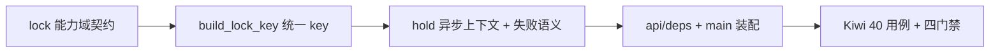

# 分布式锁基座实施记录

> 项目骨架 · 02 后端基座 · 03 core 横切基座 · 06 分布式锁基座 · 实施记录

[文档首页](../../../../../../../文档首页.md) › [02-3-6 分布式锁基座](../02_后端基座_03_core横切基座_06_分布式锁基座.md) › 01 实施　|　[← 父任务](../02_后端基座_03_core横切基座_06_分布式锁基座.md)

## 1. 实施信息 <a id="meta"></a>

| 项 | 值 |
| --- | --- |
| 任务 | [06 分布式锁基座](../02_后端基座_03_core横切基座_06_分布式锁基座.md) |
| 对应需求 | [02-30](../../../../../需求/02_需求_后端基座.md#r02-30) |
| 详细设计 | [06_详细设计_01_分布式锁基座](../设计/06_详细设计_01_分布式锁基座.md) |
| 实施日期 | 2026-09-14 |
| 实施人 | minjian |
| 实施环境 | 开发机（Ubuntu，Python 3.14 / uv） |
| 提交 | 待提交 |
| 结论 | 完成 |

## 2. 实施概览 <a id="overview"></a>



结果小结：分布式锁能力域契约与占位实现落地（`BaseDistributedLock` / `NullDistributedLock`），锁 key 统一拼接入口 `build_lock_key`、`hold` 异步上下文（未取到锁抛 `ConcurrentConflictError`）就位；应用可启动、依赖可解析；`pytest` / `ruff` / `pyright` 全绿。

## 3. 实施过程 <a id="process"></a>

1. **能力域契约**：新增 `app/lock/`（`__init__.py` + `base.py`）——常量 `LOCK_KEY_PREFIX` / `GLOBAL_LOCK_SCOPE` / `DEFAULT_LOCK_TTL=30` / `DEFAULT_WAIT=0.0`；`build_lock_key(*, tenant, resource) -> str` 统一拼 `bms:{租户|global}:lock:{资源}`。
2. **契约方法**：`BaseDistributedLock(BaseCapability, ABC)`（`key = "distributed_lock"`）——全异步 `acquire(key, *, ttl, wait) -> str | None`（成功返回锁令牌）、`release(key, token) -> bool`（按令牌释放，防误放）、`extend(key, token, *, ttl) -> bool`（续租）；`hold(key, *, ttl, wait)` 异步上下文（`@asynccontextmanager`，进入获取、退出释放，未取到抛 `ConcurrentConflictError`）。
3. **占位实现**：`NullDistributedLock(BaseDistributedLock, BaseNullObject)`——`acquire` 恒定返回 `uuid4().hex` 令牌、`release` / `extend` 恒定 `True`（不连 Redis、不写存储）。
4. **依赖注入装配**：`app/api/deps.py` 导出 `get_distributed_lock`；`app/main.py` 的 `create_app()` 装配 `app.state.distributed_lock = NullDistributedLock()`。
5. **测试**：新增 `tests/lock/test_lock.py`（Kiwi 40，6 条用例），含记录型测试锁断言 `hold` 调用序列与失败语义。
6. **Kiwi 登记**：在 mjbk Kiwi TCMS（分类「平台骨架」、P2、CONFIRMED、标签「自动化」）登记用例 **40「分布式锁基座（契约 / key 拼接 / 占位恒定成功 / hold 上下文与冲突语义 / 依赖解析）」**，与 `@pytest.mark.kiwi_id(40)` 一致。
7. **登记回写**：架构 04 §4 基类清单（新增行 + 继承链）与 §8 跨阶段基座契约表；架构 07「key 空间规划」补租户级锁形态；《后端基类清单》§2 / §9 / §10；《后端开发规范》§3.1（分布式锁口径）；计划「后续阶段待办」登记回补行；需求 02-30 补实现期要点注块；任务 / 父任务 / 需求 / 计划状态回写。

关键命令：

```bash
uv run pytest --cov=app -q
uv run ruff check .
uv run ruff format --check .
uv run pyright
```

## 4. 问题与处置 <a id="issues"></a>

| 问题 / 现象 | 原因 | 处置与落点 |
| --- | --- | --- |
| ruff `F401`（`tests/lock/test_lock.py` 未使用 `FastAPI` 导入） | 依赖解析用例直接调 `create_app()`，未显式引用 `FastAPI` | 移除该导入 |
| pyright `reportDeprecated`：`@asynccontextmanager` 标注 `-> AsyncIterator[str]` 已弃用 | Python 3.14 / typeshed 口径变更：`@asynccontextmanager` 应标注 `-> AsyncGenerator[...]` | `hold` 返回注解改为 `AsyncGenerator[str]`（导入自 `collections.abc`） |
| pyright `reportAttributeAccessIssue`：测试里访问 `BaseDistributedLock.placeholder` 未知 | `placeholder` 定义在中间层 `BasePlaceholder`，契约类未声明 | 依赖解析用例改为断言「类型名 + 与应用装配实例的同一性」，不再访问未声明属性 |
| `hold` 未取到锁的语义 | 需在「抛错」与「静默降级」之间定稿 | 按对齐记录第 6 项抛 `ConcurrentConflictError`（10004 / 409），临界区不执行（用例已断言） |

## 5. 验证结果 <a id="verify"></a>

| 完成标准 | 验证方法 | 实测结果 |
| --- | --- | --- |
| 接口 / 抽象声明就位、可被上层引用 | Kiwi 40 用例 + 代码核对 | 通过 |
| 依赖注入可解析、应用可启动不报错 | `create_app` 装配 + `get_distributed_lock` 解析用例 + 应用冒烟 | 通过 |
| 占位恒定获取成功（不连 Redis） | 占位用例（令牌 / `release` / `extend` / 未持锁 key） | 通过 |
| 锁 key 口径统一 | `build_lock_key` 用例（租户 / 全局两种形态） | 通过 |
| `hold` 未取到锁语义明确 | `ConcurrentConflictError`（10004 / 409）+ 临界区未执行断言 | 通过 |
| 登记齐备 | 架构 04 §4 / §8、架构 07 key 空间、《后端基类清单》§2 / §9 / §10、《后端开发规范》§3.1、计划「后续阶段待办」 | 已登记 |
| 不实现真实能力 | 无 Redis 依赖、无 SETNX / Lua / 续租；仅签名与占位 | 通过 |
| 无 lint / 类型错误 | `uv run ruff check .` / `uv run ruff format --check .` / `uv run pyright` | All checks passed / 127 files already formatted / 0 errors |

## 6. 偏差与遗留 <a id="deviations"></a>

- **偏差**：无偏差，按详细设计执行（`hold` 失败语义、令牌口径、key 拼接、异步签名均按对齐记录落地）。
- **遗留归口（已登记，随对应阶段销项）**：
  - 真实实现（Redis `SET NX PX`、Lua 令牌比对释放 / 续租、`wait` 轮询与订阅、看门狗续租）→ **六 通用能力**；多副本互斥实测随**十一 分布式与监控阶段**收口——已登记计划「后续阶段待办」表「分布式锁真实实现」行，实现期要点见需求 02-30 `> 注：` 块。
  - Redis 短超时（约 500ms）与故障降级策略（放行 / 拒绝）→ 已并入计划「后续阶段待办」表「分布式锁真实实现」行说明，随真实实现阶段定稿并登记。
  - 消费方接入（幂等键去重与防重放 → 02-3-10 限流幂等防重放中间层与接口阶段；beat 防重 → 通用能力 / 部署阶段；引擎创建防重 → 落库阶段；表单定制 DDL 串行 → 表单定制阶段）→ 已登记计划「后续阶段待办」表「分布式锁消费方接入」行；本阶段 02-3-10 任务文档已标注前置契约（本任务不接线）。
  - 真实 Redis 集成用例（SETNX 竞争、令牌误放防护、TTL 到期）→ 已并入计划「后续阶段待办」表「Redis 集成用例」行（出处标注 02-3-6），随六 通用能力阶段补充并纳入重验证层 Redis job（需 `BMS_TEST_REDIS_URL`）。
- **结论**：本任务无未闭环遗留（均已在计划「后续阶段待办」表登记去向）。

> 本文档依《文档生成规范》编写
