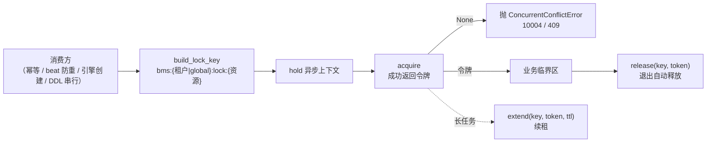

# 分布式锁基座详细设计

> 项目骨架 · 02 后端基座 · 03 core 横切基座 · 06 分布式锁基座 · 详细设计

[文档首页](../../../../../../../文档首页.md) › [02-3-6 分布式锁基座](../02_后端基座_03_core横切基座_06_分布式锁基座.md) › 01 详细设计　|　[← 父任务](../02_后端基座_03_core横切基座_06_分布式锁基座.md)

## 1. 概述 <a id="overview"></a>

- **目标**：落地「分布式锁基座」的契约与占位实现——`app/lock/base.py` 的**能力域中间层** `BaseDistributedLock`（`acquire` 带 TTL 并返回锁令牌 / `release` 按令牌释放 / `extend` 续租 + `hold` 异步上下文）+ 占位实现 `NullDistributedLock`（恒定获取成功、不连 Redis）；锁 key 统一入口 `build_lock_key`；依赖注入提供者与 `create_app` 装配。
- **范围**：`app/lock/`（新增）、`app/api/deps.py`（提供者导出）、`app/main.py`（装配）、单测。
- **不含**（归相邻任务 / 后续阶段）：真实 Redis `SETNX` + TTL 写入、Lua 比对令牌释放、续租定时器、看门狗自动续租 → **六 通用能力**（多副本互斥实测随十一 分布式与监控阶段收口，需求 02-30 口径，同一任务文档不重复立项）；具体消费方（幂等键去重与防重放见《架构设计 · 接口与集成》「幂等与防重放」节、beat 防重见《架构设计 · 部署与运维》「无状态多副本」节、引擎创建防重见《架构设计 · 子系统_多租户路由》「引擎注册表」节、表单定制 DDL 串行见《架构设计 · 子系统_表单定制》「执行策略」节）。
- **依据**：需求 [02-30](../../../../../需求/02_需求_后端基座.md#r02-30)、《[架构设计 · 性能与安全](../../../../../../../设计/架构设计/30_架构设计_性能与安全.md)》「超时与资源」节、《[架构设计 · 数据架构](../../../../../../../设计/架构设计/07_架构设计_数据架构.md)》「key 空间规划」节、《[架构设计 · 后端基础类体系](../../../../../../../设计/架构设计/04_架构设计_后端基础类体系.md)》「阶段落地（地基波 + 回补）」节、《[后端开发规范](../../../../../../../规范/后端开发规范.md)》「后端基座体系（强制）」节、《[命名规范](../../../../../../../规范/命名规范.md)》「后端命名」节。

## 2. 现状与差距 <a id="gap"></a>

| 现状 | 差距 |
| --- | --- |
| 全库无 `BaseDistributedLock` / `NullDistributedLock`（检索零命中）；无 `app/lock/` 目录 | 跨实例互斥无统一入口；各模块若自研 SETNX，过期 / 释放 / 续租口径必然发散 |
| `app/core/locking.py` 只有**进程内**锁原语（`LockStrategy` / `ReadWriteLock` / `LockGuard`） | 进程内锁只解决同实例并发，多副本互斥缺能力域契约；两类职责需边界清晰 |
| 锁 key 规范已登记（《架构设计 · 数据架构》「key 空间规划」节：`bms:global:lock:{资源}`，SETNX 带过期防死锁） | 无统一 key 拼接入口，重复自拼易出前缀 / 租户位错误 |
| `app/api/deps.py` 已汇总 `get_db` / `get_uow` / `get_tenant` / `get_masker` / `get_permission_checker`；`create_app` 已装配掩码器与权限检查器 | 锁能力域无提供者、无应用级单例，「依赖注入可解析」无落点 |

## 3. 交付物清单 <a id="tree"></a>

```text
backend/
├── app/lock/__init__.py                  # 新增：能力域包（docstring 口径，与 cache/scope/masking 一致）
├── app/lock/base.py                      # 新增：build_lock_key / BaseDistributedLock / NullDistributedLock / get_distributed_lock
├── app/api/deps.py                       # 修改：导出 get_distributed_lock
├── app/main.py                           # 修改：装配 app.state.distributed_lock
└── tests/lock/test_lock.py               # 新增：Kiwi 40（契约 / key 拼接 / 占位恒定成功 / hold 上下文与失败语义 / 依赖解析）

bms文档/
├── 设计/架构设计/04_架构设计_后端基础类体系.md   # 修改：§4 基类清单 + §8 跨阶段基座契约表登记
├── 设计/架构设计/07_架构设计_数据架构.md         # 修改：「key 空间规划」节「锁与幂等」行补租户级锁形态
├── 后端基类清单.md                                # 修改：§2 分层总览 + §9 跨阶段基座 + §10 继承链与代码位置
├── 规范/后端开发规范.md                            # 修改：§3.1 强制用法（分布式锁口径）
└── 项目/01_项目骨架/计划/01_计划_项目骨架.md      # 修改：§3.1 后续阶段待办登记回补窗口
```

## 4. 契约设计（`app/lock/base.py`） <a id="contract"></a>

| 成员 | 形态 | 说明 |
| --- | --- | --- |
| `LOCK_KEY_PREFIX` | `str` 常量 | `"bms"`（与缓存 key 同前缀） |
| `GLOBAL_LOCK_SCOPE` | `str` 常量 | `"global"`（全局锁作用域位） |
| `DEFAULT_LOCK_TTL` | `int` 常量 | 默认锁 TTL `30`（秒），防死锁 |
| `DEFAULT_WAIT` | `float` 常量 | 默认等待时长 `0.0`（秒）＝不等待、立即返回 |
| `build_lock_key(*, tenant, resource) -> str` | 模块函数 | 统一拼锁 key：`bms:{tenant\|global}:lock:{资源}`（`tenant=None` 为全局锁） |
| `BaseDistributedLock(BaseCapability, ABC)` | 能力域契约中间层 | `key: str = "distributed_lock"` |
| `acquire(key, *, ttl=DEFAULT_LOCK_TTL, wait=DEFAULT_WAIT) -> str \| None` | 抽象方法（async） | 获取锁：成功返回**锁令牌**（释放 / 续租凭据），失败返回 `None` |
| `release(key, token) -> bool` | 抽象方法（async） | 按令牌释放：持锁且令牌匹配才释放（防误放他人锁） |
| `extend(key, token, *, ttl=DEFAULT_LOCK_TTL) -> bool` | 抽象方法（async） | 续租：重置 TTL；非持有者返回 `False` |
| `hold(key, *, ttl=DEFAULT_LOCK_TTL, wait=DEFAULT_WAIT)` | 具体方法（async 上下文） | 进入获取锁、退出释放；**未取到抛 `ConcurrentConflictError`**（10004 / 409） |
| `NullDistributedLock(BaseDistributedLock, BaseNullObject)` | 占位实现 | `acquire` 恒定返回令牌、`release` / `extend` 恒定 `True`（**不连 Redis**） |
| `get_distributed_lock(request) -> BaseDistributedLock` | 模块函数（提供者） | 取应用级单例（`request.app.state.distributed_lock`） |



## 5. 占位实现与参数口径 <a id="null"></a>

| 情形 | 口径 |
| --- | --- |
| `acquire` | **恒定成功**，返回令牌 `uuid4().hex`（形状与真实实现一致，便于上层先接入）；占位不连 Redis、不写入任何存储 |
| `release(key, token)` | 恒定返回 `True`（不校验令牌） |
| `extend(key, token, *, ttl)` | 恒定返回 `True` |
| `ttl` | 秒；真实实现写入 Redis `SET ... NX PX` 的过期时间（防死锁，见《架构设计 · 性能与安全》「超时与资源」节） |
| `wait` | 秒；`0` ＝不等待立即返回 `None`；`>0` ＝最多等待该时长（真实实现轮询 / 订阅重试）；占位忽略（直接成功） |
| 令牌口径 | 由基座生成并返回，调用方**必须**原样回传给 `release` / `extend`；真实实现在 Redis 侧比对令牌，防「超时后旧持有者释放新持有者的锁」 |
| 锁内约束 | 锁内禁止长 IO 与外部回调（与 `core/locking.py` 同一纪律）；长任务需显式 `extend`，看门狗自动续租不落本阶段 |

## 6. 与进程内锁原语的边界 <a id="boundary-locking"></a>

| 维度 | `app/core/locking.py`（进程内） | `app/lock/base.py`（跨实例，本任务） |
| --- | --- | --- |
| 解决问题 | 同实例多线程并发（集合读写、连接池保护） | 多副本 / 多进程互斥（幂等去重、beat 防重、引擎创建、DDL 串行） |
| 载体 | `threading`（`ReadWriteLock` / `LockGuard`） | Redis `SETNX` + TTL（占位不连 Redis） |
| 形态 | **同步**上下文管理器 | **异步**契约（`acquire` / `release` / `extend` / `hold`） |
| 组合用法 | 多副本互斥场景可「进程内锁 + 分布式锁」叠加（引擎创建防重即此口径，见《架构设计 · 子系统_多租户路由》） | 同上 |

## 7. 应用装配与依赖注入 <a id="di"></a>

| 位置 | 变更 |
| --- | --- |
| `app/api/deps.py` | 导出 `get_distributed_lock`（来自 `app/lock/base.py`），与既有 `get_db` / `get_uow` / `get_tenant` / `get_masker` / `get_permission_checker` 并列 |
| `app/main.py` `create_app()` | 装配 `app.state.distributed_lock = NullDistributedLock()` |

- 提供者为普通函数（无上下文变量、无 IO），构造即解析，满足「依赖注入可解析、应用可启动不报错」。
- 真实实现替换 `NullDistributedLock` 为 Redis 实现（注入 `redis.asyncio` 客户端）时，调用面**零改动**（改基座实现即全链生效）。

## 8. 继承与分层 <a id="base"></a>

- `BaseDistributedLock → BaseCapability → BaseObject`；`NullDistributedLock → BaseDistributedLock + BaseNullObject → BasePlaceholder → BaseObject`。
- 与既有 `NullDataScope` / `NullShardingRouter` / `NullMasker` / `NullPermissionChecker` 同构；不新增层级、不引入多重继承之外的新形态。

## 9. 登记落点 <a id="register"></a>

| 落点 | 登记内容 |
| --- | --- |
| 《架构设计 · 后端基础类体系》「基类清单与继承链」节 | 新增 `BaseDistributedLock` / `NullDistributedLock` 行（职责、代码位置、状态＝占位）+ 继承链补一条 |
| 《架构设计 · 后端基础类体系》「阶段落地（地基波 + 回补）」节 | 跨阶段基座契约表新增「分布式锁」行（代码位置、契约、回补阶段＝六 通用能力） |
| 《架构设计 · 数据架构》「key 空间规划」节 | 「锁与幂等」行补**租户级锁形态** `bms:{tenant}:lock:{资源}`（原文只列 `bms:global:lock:{资源}`；租户级锁为消费方实际需要——引擎创建防重按租户加锁、表单定制 DDL 每租户串行） |
| 《后端基类清单》 | §2 分层总览补 `app/lock/` 能力域；§9 跨阶段基座补一行；§10 继承链与目录补一条 |
| 《后端开发规范》「后端基座体系」节 | §3.1 补口径：跨实例互斥一律走 `BaseDistributedLock`（key 经 `build_lock_key`，锁内禁长 IO），禁止模块自研 SETNX；同实例并发仍走 `core/locking.py` 原语 |
| 计划《01_计划_项目骨架》「后续阶段待办」节 | 登记「分布式锁真实实现」回补行（六 通用能力；多副本实测随十一 分布式与监控阶段） |
| 需求 [02-30](../../../../../需求/02_需求_后端基座.md#r02-30) | 在参考文档后补 `> 注：实现期要点` 块（回补对齐依据）；实施完成后回写状态 / 完成日期 |

## 10. 测试设计（Kiwi 先行） <a id="tests"></a>

用例**先登记 Kiwi TCMS 再编码**（《[测试规范](../../../../../../../规范/测试规范.md)》「用例管理（Kiwi TCMS）」节）；本任务新分配 **Kiwi 40**：

| Kiwi | 用例 | 断言要点 | 自动化文件 |
| --- | --- | --- | --- |
| 40 | 契约继承链与能力域标识 | `NullDistributedLock → BaseDistributedLock → BaseCapability → BaseObject`；`placeholder is True`；`key == "distributed_lock"` | `tests/lock/test_lock.py` |
| 40 | 锁 key 拼接 | `build_lock_key(tenant="t1", resource="engine:create") == "bms:t1:lock:engine:create"`；`tenant=None` → `bms:global:lock:…`；常量 `DEFAULT_LOCK_TTL` / `DEFAULT_WAIT` | 同上 |
| 40 | 占位恒定成功 | `acquire` 返回非空字符串令牌；`release` / `extend` 返回 `True`；未持锁 key 亦成功（占位不连 Redis） | 同上 |
| 40 | `hold` 上下文 | 进入可用令牌、退出后 `release` 被调用（用记录型测试锁断言调用序列）；`ttl` / `wait` 透传 | 同上 |
| 40 | `hold` 失败语义 | 自定义锁 `acquire` 返回 `None` 时抛 `ConcurrentConflictError`（`code == 10004`、`http_status == 409`），且**不执行**临界区 | 同上 |
| 40 | 依赖解析 | `create_app()` 装配后 `app.state.distributed_lock` 为 `NullDistributedLock`；路由 `Depends(get_distributed_lock)` 取到实例；`api.deps` 可导出该提供者 | 同上 |

用例命名遵循《测试规范》「命名规范」节；测试数据自建、用例间不共享可变状态。

## 11. 实施步骤 <a id="steps"></a>

1. 新增 `app/lock/`（`__init__.py` + `base.py`：常量 / `build_lock_key` / `BaseDistributedLock` / `NullDistributedLock` / `get_distributed_lock`）。
2. `app/api/deps.py` 导出提供者；`app/main.py` 装配 `app.state.distributed_lock`。
3. 测试：先登记 Kiwi 40 用例，再写 `tests/lock/test_lock.py`。
4. 登记：架构 04 §4 / §8、架构 07「key 空间规划」、《后端基类清单》§2 / §9 / §10、《后端开发规范》§3.1；计划「后续阶段待办」补回补行；需求 02-30 补实现期要点注块（第 9 节）。
5. 验证：`uv run pytest`、`uv run ruff check .`、`uv run ruff format --check .`、`uv run pyright` 全绿；`python3 scripts/tools/base-check/check-base.py` 五项通过；应用可启动、`/docs` 可访问。
6. 回写：实施 / 测试记录 + 任务（02-3-6、02_03 core 横切基座）与需求 02-30 状态、计划表。

## 12. 验收映射 <a id="accept-map"></a>

| 完成标准（需求 02-30 / 任务 02-3-6） | 验证方式 |
| --- | --- |
| 接口 / 抽象声明就位、可被上层引用 | `BaseDistributedLock` 落地 + 继承断言 + Kiwi 40 |
| 依赖注入可解析、应用可启动不报错 | `create_app` 装配 + `get_distributed_lock` 解析用例 + 应用冒烟 |
| 占位恒定获取成功（不连 Redis） | 占位用例（`acquire` 返回令牌 / `release` / `extend`） |
| 锁 key 口径统一 | `build_lock_key` 用例（租户 / 全局两种形态） |
| `hold` 未取到锁语义明确 | `ConcurrentConflictError`（10004 / 409）用例 + 临界区未执行断言 |
| 登记齐备 | 架构 04 §4 / §8、架构 07 key 空间、《后端基类清单》§2 / §9 / §10、《后端开发规范》§3.1、计划「后续阶段待办」核对 |
| 不实现真实能力 | 无 Redis 依赖、无 SETNX / Lua / 续租；仅签名与占位 |
| 无 lint / 类型错误 | `uv run ruff check .`、`uv run ruff format --check .`、`uv run pyright` |

## 13. 边界与开放项 <a id="boundary"></a>

- **真实实现**（Redis `SET key token NX PX ttl`、Lua 比对令牌释放、`wait` 轮询 / 订阅、看门狗自动续租）→ **六 通用能力**（Redis 客户端就位后落地），多副本互斥实测随**十一 分布式与监控阶段**收口；已登记计划「后续阶段待办」表。
- **Redis 故障降级**：短超时快速失败（《架构设计 · 性能与安全》「超时与资源」节：Redis 操作 500ms），降级策略（放行 / 拒绝）随真实实现阶段定稿。
- **与幂等 / 防重放的分工**：幂等键与 nonce 去重是「短窗去重」（`bms:{tenant}:idem:{key}` + 唯一约束兜底），分布式锁是「临界区互斥」，二者不互相替代；消费方接入随 02-3-10 限流幂等防重放中间层与接口阶段。
- **租户维度锁**：`bms:{tenant}:lock:{资源}` 由 `build_lock_key(tenant=...)` 产出；本任务同步在《架构设计 · 数据架构》「key 空间规划」节补登该形态。
- **测试**：真实 Redis 集成用例（SETNX 竞争、令牌误放防护、TTL 到期）随六 通用能力阶段补充，纳入重验证层 Redis job。

## 14. 对齐记录 <a id="align"></a>

| # | 事项 | 结论 |
| --- | --- | --- |
| 1 | 契约代码落点 | 新建能力域目录 `app/lock/base.py`（与 `cache` / `scope` / `sharding` / `masking` / `permission` 同构） |
| 2 | 形态 | 能力域中间层 `BaseDistributedLock(BaseCapability, ABC)` + 占位 `NullDistributedLock(BaseDistributedLock, BaseNullObject)` |
| 3 | 签名 | 全 **async**：`acquire(key, *, ttl, wait=0) -> str \| None`、`release(key, token) -> bool`、`extend(key, token, *, ttl) -> bool` |
| 4 | 锁令牌 | `acquire` 生成并返回令牌；`release` / `extend` 必须回传令牌（防误放）；占位令牌用 `uuid4().hex` |
| 5 | 上下文辅助 | 提供 `hold(key, *, ttl, wait=0)` 异步上下文（进入获取、退出释放） |
| 6 | `hold` 失败语义 | 未取到锁抛 `ConcurrentConflictError`（10004 / 409），临界区不执行 |
| 7 | key 拼接 | 基座提供 `build_lock_key(*, tenant, resource)` → `bms:{tenant\|global}:lock:{资源}`；同步在架构 07「key 空间规划」补租户级形态 |
| 8 | 与进程内锁边界 | 跨实例互斥走本基座；同实例并发仍走 `core/locking.py`（`LockStrategy` / `ReadWriteLock` / `LockGuard`），二者可叠加 |
| 9 | 依赖注入 | `get_distributed_lock` 提供者（`app/api/deps.py` 导出）+ `create_app` 装配 `app.state.distributed_lock` |
| 10 | 回补阶段 | 六 通用能力（多副本实测随十一 分布式与监控阶段）；计划「后续阶段待办」登记 |
| 11 | 登记落点 | 架构 04 §4 / §8、架构 07 key 空间、《后端基类清单》§2 / §9 / §10、《后端开发规范》§3.1 |
| 12 | 测试 | 新分配 Kiwi 40（平台登记 + `@pytest.mark.kiwi_id(40)`） |
| 13 | 交付范围 | 设计 + 实施 + 测试 + 登记与记录 + 提交推送（一条龙） |
| 14 | 工时 / 窗口 | 1h；02_03 core 横切基座窗口（2026-09-14 ~ 2026-09-20） |

> 本文档依《文档生成规范》编写 · 关键决策逐项确认
