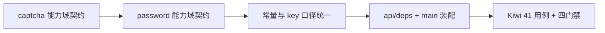

# 验证码与密码策略基座实施记录

> 项目骨架 · 02 后端基座 · 03 core 横切基座 · 07 验证码与密码策略基座 · 实施记录

[文档首页](../../../../../../../文档首页.md) › [02-3-7 验证码与密码策略基座](../02_后端基座_03_core横切基座_07_验证码与密码策略基座.md) › 01 实施　|　[← 父任务](../02_后端基座_03_core横切基座_07_验证码与密码策略基座.md)

## 1. 实施信息 <a id="meta"></a>

| 项 | 值 |
| --- | --- |
| 任务 | [07 验证码与密码策略基座](../02_后端基座_03_core横切基座_07_验证码与密码策略基座.md) |
| 对应需求 | [02-31](../../../../../需求/02_需求_后端基座.md#r02-31) |
| 详细设计 | [07_详细设计_01_验证码与密码策略基座](../设计/07_详细设计_01_验证码与密码策略基座.md) |
| 实施日期 | 2026-09-14 |
| 实施人 | minjian |
| 实施环境 | 开发机（Ubuntu，Python 3.14 / uv） |
| 提交 | 待提交 |
| 结论 | 完成 |

## 2. 实施概览 <a id="overview"></a>



结果小结：验证码与密码策略两组契约与占位实现落地（`BaseCaptcha` / `NullCaptcha`、`BasePasswordPolicy` / `NullPasswordPolicy`），验证码挑战值对象 `CaptchaChallenge` 与 key / TTL / 场景常量、密码违规原因码 `PASSWORD_VIOLATIONS` 就位；应用可启动、两个提供者可解析；`pytest` / `ruff` / `pyright` 全绿。

## 3. 实施过程 <a id="process"></a>

1. **验证码能力域**：新增 `app/captcha/`（`__init__.py` + `base.py`）——常量 `CAPTCHA_KEY_PREFIX` / `GLOBAL_CAPTCHA_SCOPE` / `CAPTCHA_TTL=300` / `CAPTCHA_SCENES`；`build_captcha_key(captcha_id)` 统一拼 `bms:global:captcha:{uuid}`；值对象 `CaptchaChallenge`（frozen dataclass 继承 `BaseObject`：`captcha_id` / `image` / `expires_in` / `scene`）；`BaseCaptcha(BaseCapability, ABC)`（`key = "captcha"`，异步 `generate(scene) -> CaptchaChallenge`、`verify(captcha_id, code) -> bool`）；`NullCaptcha`（`generate` 返回 `image=b""` 的挑战、`verify` 恒定 `True`）；提供者 `get_captcha`。
2. **密码策略能力域**：新增 `app/password/`（`__init__.py` + `base.py`）——`PASSWORD_VIOLATIONS`（7 项违规原因码）；`BasePasswordPolicy(BaseCapability, ABC)`（`key = "password_policy"`，异步 `validate(password, *, username)` 返回违规原因码元组、`expired(pwd_changed_at, *, now)`、`reused(password, *, history)`）；`NullPasswordPolicy`（恒定允许：空元组 / `False` / `False`）；提供者 `get_password_policy`。
3. **依赖注入装配**：`app/api/deps.py` 导出 `get_captcha` / `get_password_policy`；`app/main.py` 的 `create_app()` 装配 `app.state.captcha = NullCaptcha()`、`app.state.password_policy = NullPasswordPolicy()`。
4. **测试**：新增 `tests/captcha/test_captcha.py`（5 条）与 `tests/password/test_password.py`（4 条），共 9 条 Kiwi 41 用例。
5. **Kiwi 登记**：在 mjbk Kiwi TCMS（分类「平台骨架」、P2、CONFIRMED、标签「自动化」）登记用例 **41「验证码与密码策略基座（契约 / 挑战值对象 / key 与常量 / 占位恒定通过与允许 / 违规码 / 依赖解析）」**，与 `@pytest.mark.kiwi_id(41)` 一致。
6. **登记回写**：架构 04 §4 基类清单（新增两行 + 继承链）与 §8 跨阶段基座契约表；《后端基类清单》§2 / §9 / §10；《后端开发规范》§3.1（验证码与密码策略口径）；计划「后续阶段待办」登记回补行；需求 02-31 补实现期要点注块；任务 / 父任务 / 需求 / 计划状态回写。

关键命令：

```bash
uv run pytest --cov=app -q
uv run ruff check .
uv run ruff format --check .
uv run pyright
```

## 4. 问题与处置 <a id="issues"></a>

| 问题 / 现象 | 原因 | 处置与落点 |
| --- | --- | --- |
| 无 | 首轮四门禁（`pytest` / `ruff check` / `ruff format --check` / `pyright`）一次全绿 | 无需处置；此前 02-3-6 暴露的两类问题（`asynccontextmanager` 返回注解、契约类未声明属性）本次已按新口径书写，未再触发 |

## 5. 验证结果 <a id="verify"></a>

| 完成标准 | 验证方法 | 实测结果 |
| --- | --- | --- |
| 接口 / 抽象声明就位、可被上层引用 | Kiwi 41 用例 + 代码核对 | 通过 |
| 依赖注入可解析、应用可启动不报错 | `create_app` 装配 + 两提供者解析用例 + 应用冒烟 | 通过 |
| 占位恒定通过 / 恒定允许 | `NullCaptcha.verify`、`NullPasswordPolicy.validate` / `expired` / `reused` 用例 | 通过 |
| 验证码 key / TTL / 场景口径统一 | `build_captcha_key` 与常量用例 | 通过 |
| 密码违规原因码口径统一 | `PASSWORD_VIOLATIONS` 用例（7 项、无重复） | 通过 |
| 登记齐备 | 架构 04 §4 / §8、《后端基类清单》§2 / §9 / §10、《后端开发规范》§3.1、计划「后续阶段待办」 | 已登记 |
| 不实现真实能力 | 无 Pillow / 无 Redis / 不读 sys_config；`image=b""`、`validate` 恒空元组 | 通过 |
| 无 lint / 类型错误 | `uv run ruff check .` / `uv run ruff format --check .` / `uv run pyright` | All checks passed / 133 files already formatted / 0 errors |

## 6. 偏差与遗留 <a id="deviations"></a>

- **偏差**：无偏差，按详细设计执行（两组契约签名、`CaptchaChallenge` 值对象、违规原因码元组、全异步口径、常量清单均按对齐记录落地）。
- **遗留归口（已登记，随对应阶段销项）**：
  - 真实实现（Pillow 出图经线程池、Redis 读写 `bms:global:captcha:{uuid}`、`verify` 单次失效、sys_config 策略规则、`pwd_history` 比对、90 天有效期）→ **六 认证与安全**；已登记计划「后续阶段待办」表「验证码与密码策略真实实现」行，实现期要点见需求 02-31 `> 注：` 块。
  - 验证码强制策略（连续失败 3 次）与账号锁定（`sys_account_lock`、180 天未登录扫描）→ 登录侧 / 任务调度（计划「验证码与密码策略真实实现」行已注明），不在本基座。
  - 登录失败限流（slowapi Redis 后端）与验证码强制计数窗口 → **已登记**：计划「Redis 集成用例」行含验证码用例（出处 02-3-7），且 02-3-10 任务文档已标注「登录侧联动（口径）」条目（限流与计数窗口由该中间层提供，登录侧只接线）。
  - 验证码图片传输形态（base64 / 二进制流）→ 认证阶段接口层定稿；本基座只返回字节。
  - 真实 Pillow / Redis 集成用例 → **已登记**计划「Redis 集成用例」行（验证码出处 02-3-7；Pillow 出图用例归六 认证与安全阶段），随重验证层 Redis job 执行（需 `BMS_TEST_REDIS_URL`）。
- **结论**：本任务无未闭环遗留（均已在计划「后续阶段待办」表登记去向）。

> 本文档依《文档生成规范》编写
