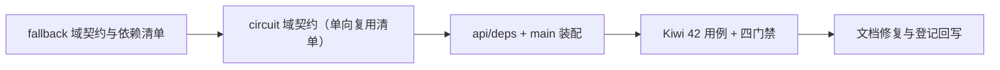

# 降级与熔断基座实施记录

> 项目骨架 · 02 后端基座 · 03 core 横切基座 · 08 降级与熔断基座 · 实施记录

[文档首页](../../../../../../../文档首页.md) › [02-3-8 降级与熔断基座](../02_后端基座_03_core横切基座_08_降级与熔断基座.md) › 01 实施　|　[← 父任务](../02_后端基座_03_core横切基座_08_降级与熔断基座.md)

## 1. 实施信息 <a id="meta"></a>

| 项 | 值 |
| --- | --- |
| 任务 | [08 降级与熔断基座](../02_后端基座_03_core横切基座_08_降级与熔断基座.md) |
| 对应需求 | [02-32](../../../../../需求/02_需求_后端基座.md#r02-32) |
| 详细设计 | [08_详细设计_01_降级与熔断基座](../设计/08_详细设计_01_降级与熔断基座.md) |
| 实施日期 | 2026-09-14 |
| 实施人 | minjian |
| 实施环境 | 开发机（Ubuntu，Python 3.14 / uv） |
| 提交 | 待提交 |
| 结论 | 完成 |

## 2. 实施概览 <a id="overview"></a>



结果小结：降级与熔断两组契约与占位实现落地（`BaseFallbackPolicy` / `NullFallbackPolicy`、`BaseCircuitBreaker` / `NullCircuitBreaker`），依赖清单 `DEPENDENCIES` 与动作 / 状态枚举就位，circuit 域单向复用 fallback 域清单；应用可启动、两个提供者可解析；`pytest` / `ruff` / `pyright` 全绿；顺带修复需求文档两处重复标题。

## 3. 实施过程 <a id="process"></a>

1. **降级能力域**：新增 `app/fallback/`（`__init__.py` + `base.py`）——`DEPENDENCIES`（七项依赖标识）、`FallbackAction`（`StrEnum`：`raise` / `default` / `skip` / `degrade`）、`BaseFallbackPolicy(BaseCapability, ABC)`（`key = "fallback"`，异步 `resolve(dependency, *, exc=None) -> FallbackAction`）、`NullFallbackPolicy`（恒定 `raise`＝不降级）、提供者 `get_fallback_policy`。
2. **熔断能力域**：新增 `app/circuit/`（`__init__.py` + `base.py`）——`CircuitState`（`StrEnum`：`closed` / `open` / `half_open`）、`BaseCircuitBreaker(BaseCapability, ABC)`（`key = "circuit_breaker"`，异步 `allow` / `record_success` / `record_failure` / `state`）、`NullCircuitBreaker`（恒定闭合）、提供者 `get_circuit_breaker`；`DEPENDENCIES` 从 fallback 域导入（**单向复用**，模块 `__all__` 显式再导出）。
3. **依赖注入装配**：`app/api/deps.py` 导出 `get_fallback_policy` / `get_circuit_breaker`；`app/main.py` 装配 `app.state.fallback_policy = NullFallbackPolicy()`、`app.state.circuit_breaker = NullCircuitBreaker()`。
4. **测试**：新增 `tests/fallback/test_fallback.py`（4 条）与 `tests/circuit/test_circuit.py`（4 条），共 8 条 Kiwi 42 用例（含清单同一性断言 `circuit.DEPENDENCIES is fallback.DEPENDENCIES`）。
5. **Kiwi 登记**：在 mjbk Kiwi TCMS（分类「平台骨架」、P2、CONFIRMED、标签「自动化」）登记用例 **42「降级与熔断基座（契约 / 依赖清单与动作枚举 / 占位不降级与恒定闭合 / 依赖解析）」**，与 `@pytest.mark.kiwi_id(42)` 一致。
6. **登记回写**：架构 04 §4 基类清单（两行 + 继承链）与 §8 跨阶段基座契约表；《后端基类清单》§2 / §9 / §10；《后端开发规范》§3.1（降级与熔断口径）；计划「后续阶段待办」登记回补行；需求 02-32 补实现期要点注块；任务 / 父任务 / 需求 / 计划状态回写。
7. **文档修复**：需求 02-32 章节标题此前重复（同一锚点 `r02-32` 两次）、需求 02-33 标题在本次注块插入时一度重复——均已去重，全库重复标题扫描 0 项。

关键命令：

```bash
uv run pytest --cov=app -q
uv run ruff check .
uv run ruff format --check .
uv run pyright
```

## 4. 问题与处置 <a id="issues"></a>

| 问题 / 现象 | 原因 | 处置与落点 |
| --- | --- | --- |
| 需求 02-32 章节标题重复（同一锚点两次） | 上一任务（02-3-7）在需求 02-31 后插入实现期要点注块时，把下一节标题一并写入替换串 | 去重修复；并确认该处为唯一重复项 |
| 需求 02-33 标题一度重复 | 本次给需求 02-32 补注块时重复同类操作（替换串含下一节标题） | 立即去重修复；新增校验动作：全库扫描重复章节标题（`project 需求/*.md` + `bms文档/**/*.md`）→ 0 项 |
| `tests/circuit/test_circuit.py` 初版残留未定义依赖参数（`get_fallback_dependency`） | 起草时误留占位参数、未使用导入 | 重写该用例：移除多余参数与导入，改为模块级 `DEPENDENCIES` 别名做同一性断言 |

> 教训：向需求文档追加注块时，**只在现有文本后追加**（`old_str` 不含下一节标题），避免重复标题；插入后跑一次重复标题扫描。

## 5. 验证结果 <a id="verify"></a>

| 完成标准 | 验证方法 | 实测结果 |
| --- | --- | --- |
| 接口 / 抽象声明就位、可被上层引用 | Kiwi 42 用例 + 代码核对 | 通过 |
| 依赖注入可解析、应用可启动不报错 | `create_app` 装配 + 两提供者解析用例 + 应用冒烟 | 通过 |
| 占位不降级 / 恒定闭合 | `NullFallbackPolicy.resolve` 恒 `raise`、`NullCircuitBreaker` 恒放行与 `closed` 用例 | 通过 |
| 降级矩阵行与熔断清单口径统一 | `DEPENDENCIES` 七项用例 + 清单同一性断言 | 通过 |
| 登记齐备 | 架构 04 §4 / §8、《后端基类清单》§2 / §9 / §10、《后端开发规范》§3.1、计划「后续阶段待办」 | 已登记 |
| 不实现真实能力 | 无降级路径执行、无计数 / 阈值 / 半开探测、无告警联动 | 通过 |
| 文档结构完整 | 全库重复章节标题扫描 | 0 项 |
| 无 lint / 类型错误 | `uv run ruff check .` / `uv run ruff format --check .` / `uv run pyright` | All checks passed / 139 files already formatted / 0 errors |

## 6. 偏差与遗留 <a id="deviations"></a>

- **偏差**：无功能性偏差，按详细设计执行（两域落点、动作枚举、三态熔断、清单单向复用、全异步签名均按对齐记录落地）；文档侧修正两处重复标题（见第 4 节）。
- **遗留归口（已登记，随对应阶段销项）**：
  - 真实降级矩阵（配置化、动作执行通道、RocketMQ 降级时段标记与恢复补发、MinIO / 邮件短信特定处置）与真实熔断（失败计数窗口 / 阈值 / 半开探测 / 跨实例共享计数）→ **性能与安全 · 分布式与监控**；已登记计划「后续阶段待办」表「降级与熔断真实实现」行，实现期要点见需求 02-32 `> 注：` 块。
  - 告警联动（降级 / 熔断状态接入告警）→ **已登记**：[02-3-11 可观测性基座](../../02_后端基座_03_core横切基座_11_可观测性基座（指标与链路）/02_后端基座_03_core横切基座_11_可观测性基座（指标与链路）.md) 任务文档已标注「协同契约」条目（经 `state(dependency)` 读熔断三态、`resolve` 观察降级动作，依赖标识取 `DEPENDENCIES`）。
  - 限流降级（Redis → memory 后端）→ **已登记**：[02-3-10 限流幂等防重放中间层](../../02_后端基座_03_core横切基座_10_限流幂等防重放中间层/02_后端基座_03_core横切基座_10_限流幂等防重放中间层.md) 任务文档已标注「降级动作取用（口径）」条目（内部策略；可问 `resolve("redis")` 统一口径），计划「降级与熔断真实实现」行亦注明。
  - 主从切换 / 只读模式（`database`）→ 落库阶段；缓存三防 → 阶段八 通用能力。
  - 真实降级 / 熔断用例（阈值触发、半开恢复、跨实例一致）→ 回补阶段补充。
- **结论**：本任务遗留已全部登记去向（收尾「处理偏差与遗留」步骤复核）。

> 本文档依《文档生成规范》编写
