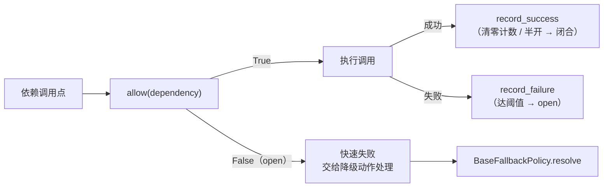

# 降级与熔断基座详细设计

> 项目骨架 · 02 后端基座 · 03 core 横切基座 · 08 降级与熔断基座 · 详细设计

[文档首页](../../../../../../../文档首页.md) › [02-3-8 降级与熔断基座](../02_后端基座_03_core横切基座_08_降级与熔断基座.md) › 01 详细设计　|　[← 父任务](../02_后端基座_03_core横切基座_08_降级与熔断基座.md)

## 1. 概述 <a id="overview"></a>

- **目标**：落地依赖故障应对两组契约与占位实现——`app/fallback/base.py` 的 `BaseFallbackPolicy`（按依赖返回**降级动作**）+ `NullFallbackPolicy`（不降级）；`app/circuit/base.py` 的 `BaseCircuitBreaker`（三态 + 成功 / 失败记录）+ `NullCircuitBreaker`（恒定闭合）；依赖标识清单与两个依赖注入提供者、`create_app` 装配。
- **范围**：`app/fallback/`、`app/circuit/`（新增）、`app/api/deps.py`（提供者导出）、`app/main.py`（装配）、单测。
- **不含**（归相邻任务 / 后续阶段）：真实降级矩阵（按依赖的降级路径执行、降级时段标记与恢复补发）、真实熔断（失败计数 / 阈值 / 半开探测 / 跨实例共享计数）、告警联动 → **性能与安全 / 分布式与监控阶段**（需求 02-32 口径，同一任务文档不重复立项）；限流本身的实现（slowapi Redis 后端 + Redis 故障降级 memory 后端）→ 02-3-10 限流幂等防重放中间层与认证阶段；缓存三防与一致性协议 → 阶段八 通用能力；主从切换与只读模式 → 落库阶段。
- **依据**：需求 [02-32](../../../../../需求/02_需求_后端基座.md#r02-32)、《[架构设计 · 性能与安全](../../../../../../../设计/架构设计/31_架构设计_性能与安全.md)》「限流与降级」节、《[架构设计 · 部署与运维](../../../../../../../设计/架构设计/33_架构设计_部署与运维.md)》「故障应对」节、《[架构设计 · 后端基础类体系](../../../../../../../设计/架构设计/04_架构设计_后端基础类体系.md)》「阶段落地（地基波 + 回补）」节、《[后端开发规范](../../../../../../../规范/后端开发规范.md)》「后端基座体系（强制）」节。

## 2. 现状与差距 <a id="gap"></a>

| 现状 | 差距 |
| --- | --- |
| 全库无 `BaseFallbackPolicy` / `BaseCircuitBreaker`（检索零命中）；无 `app/fallback/`、`app/circuit/` 目录 | 依赖故障（Redis / 主库 / RocketMQ / ES / MinIO / 邮件短信 / 依赖接口）无统一降级与熔断入口；各调用点自判会让降级矩阵散落 |
| 降级矩阵与故障应对已定案（架构 30「限流与降级」节、架构 32「故障应对」节，七类依赖） | 无契约承载「该依赖此刻该走什么动作」与「是否放行」的判定 |
| `app/api/deps.py` 已汇总七个能力域提供者（配置域 / 掩码 / 权限 / 锁 / 验证码 / 密码策略） | 两个新能力域无提供者，「依赖注入可解析」无落点 |
| 需求 02-32 章节标题此前在需求文档中重复出现（同一锚点 `r02-32` 两次） | 已修复（去重），避免锚点歧义 |

## 3. 交付物清单 <a id="tree"></a>

```text
backend/
├── app/fallback/__init__.py              # 新增：能力域包（docstring 口径）
├── app/fallback/base.py                  # 新增：DEPENDENCIES / FallbackAction / BaseFallbackPolicy / NullFallbackPolicy / get_fallback_policy
├── app/circuit/__init__.py               # 新增：能力域包（docstring 口径）
├── app/circuit/base.py                   # 新增：CircuitState / BaseCircuitBreaker / NullCircuitBreaker / get_circuit_breaker
├── app/api/deps.py                       # 修改：导出 get_fallback_policy / get_circuit_breaker
├── app/main.py                           # 修改：装配 app.state.fallback_policy / app.state.circuit_breaker
└── tests/
    ├── fallback/test_fallback.py         # 新增：Kiwi 42（契约 / 依赖清单 / 动作枚举 / 恒定不降级 / 依赖解析）
    └── circuit/test_circuit.py           # 新增：Kiwi 42（契约 / 三态枚举 / 恒定闭合 / 清单复用 / 依赖解析）

bms文档/
├── 设计/架构设计/04_架构设计_后端基础类体系.md   # 修改：§4 基类清单 + §8 跨阶段基座契约表登记
├── 后端基类清单.md                                # 修改：§2 分层总览 + §9 跨阶段基座 + §10 继承链与代码位置
├── 规范/后端开发规范.md                            # 修改：§3.1 强制用法（降级与熔断口径）
├── 项目/01_项目骨架/计划/01_计划_项目骨架.md      # 修改：§3.1 后续阶段待办登记回补窗口
└── 项目/01_项目骨架/需求/02_需求_后端基座.md      # 修改：需求 02-32 补实现期要点注块（回补对齐依据）
```

## 4. 降级能力域设计（`app/fallback/base.py`） <a id="fallback"></a>

| 成员 | 形态 | 说明 |
| --- | --- | --- |
| `DEPENDENCIES` | `tuple[str, ...]` 常量 | 依赖标识清单（对应架构降级矩阵行）：`("redis", "database", "rocketmq", "elasticsearch", "minio", "mail_sms", "external_api")`；**熔断域单向复用本常量** |
| `FallbackAction` | `StrEnum` | 降级动作：`raise`（不降级，向上抛）/ `default`（返回默认值）/ `skip`（跳过该步骤）/ `degrade`（走降级通道） |
| `BaseFallbackPolicy(BaseCapability, ABC)` | 能力域契约中间层 | `key: str = "fallback"` |
| `resolve(dependency, *, exc=None) -> FallbackAction` | 抽象方法（async） | 按依赖返回当前应采取的**降级动作**；`exc` 为触发降级的异常（可选，供实现按异常类型细分） |
| `NullFallbackPolicy(BaseFallbackPolicy, BaseNullObject)` | 占位实现 | **不降级**：`resolve` 恒定返回 `FallbackAction.RAISE`（保持原调用链语义） |
| `get_fallback_policy(request) -> BaseFallbackPolicy` | 模块函数（提供者） | 取应用级单例（`request.app.state.fallback_policy`） |

**架构降级矩阵（参照表，真实实现按此配置化）**：

| 依赖标识 | 降级路径（架构 30 / 32） |
| --- | --- |
| `redis` | 缓存失效直连 DB + 日志告警；限流降级 memory 后端；会话校验降级（凭 access token 有效期）并告警 |
| `database` | 只读模式：从库响应查询，写接口返回明确错误；从库提升预案 |
| `rocketmq` | 审计 / 日志降级同步直写（标记降级时段，恢复后补发）；业务主流程不受影响 |
| `elasticsearch` | 检索降级数据库模糊查询兜底；恢复后重放事件重建索引 |
| `minio` | 上传 / 下载接口报错 + 告警（预签名依赖 MinIO，故障期文件不可用） |
| `mail_sms` | 发送记录标记失败、重试策略生效；告警渠道可降级企业微信 / 钉钉 |
| `external_api` | httpx 短超时 + **熔断**快速失败；Webhook 指数退避重试 |

**口径**：

| 情形 | 处置 |
| --- | --- |
| 返回形态 | **动作枚举**（不返回降级值、不接管调用链）——调用方按动作处理（`default` 取默认值、`skip` 跳过步骤、`degrade` 走降级通道、`raise` 原样上抛） |
| 占位语义 | `NullFallbackPolicy` 恒定 `raise`＝**不降级**，保持现状行为不变（占位期不改变任何调用链语义） |
| `dependency` 取值 | 建议取 `DEPENDENCIES` 之一；占位不校验（真实实现按配置匹配） |
| 降级时段标记 / 恢复补发 | 真实实现职责（RocketMQ 场景），归回补阶段 |

## 5. 熔断能力域设计（`app/circuit/base.py`） <a id="circuit"></a>

| 成员 | 形态 | 说明 |
| --- | --- | --- |
| `CircuitState` | `StrEnum` | 熔断状态：`closed`（闭合，正常放行）/ `open`（断开，快速失败）/ `half_open`（半开，探测放行） |
| `BaseCircuitBreaker(BaseCapability, ABC)` | 能力域契约中间层 | `key: str = "circuit_breaker"` |
| `allow(dependency) -> bool` | 抽象方法（async） | 是否放行（`open` 时 `False`＝快速失败；`closed` / `half_open` 为 `True`） |
| `record_success(dependency) -> None` | 抽象方法（async） | 记录成功（半开探测成功 → 闭合；清零失败计数） |
| `record_failure(dependency) -> None` | 抽象方法（async） | 记录失败（达阈值 → 断开；半开探测失败 → 回到断开） |
| `state(dependency) -> CircuitState` | 抽象方法（async） | 当前状态（供告警 / 可观测性读取） |
| `NullCircuitBreaker(BaseCircuitBreaker, BaseNullObject)` | 占位实现 | **恒定闭合**：`allow` 恒定 `True`、`state` 恒定 `closed`、`record_success` / `record_failure` 空操作 |
| `get_circuit_breaker(request) -> BaseCircuitBreaker` | 模块函数（提供者） | 取应用级单例（`request.app.state.circuit_breaker`） |



**口径**：

| 情形 | 处置 |
| --- | --- |
| 与降级的关系 | 熔断负责「**要不要发这次调用**」（快速失败），降级负责「**失败后怎么办**」（动作选择）；二者常配合：`allow` 为 `False` 或调用失败后 → 问 `resolve` 取降级动作 |
| 计数口径 | 失败计数窗口 / 阈值 / 半开探测间隔由真实实现按配置决定（架构未固化数值），占位不计数 |
| 跨实例 | 真实实现可选进程内计数或 Redis 共享计数（多副本一致），口径随回补阶段定稿；契约已按 async 预留 |
| 占位语义 | `NullCircuitBreaker` 恒定闭合＝**不熔断**，保持现状行为不变 |

## 6. 两域协作与边界 <a id="boundary"></a>

| 维度 | `app/fallback/`（降级） | `app/circuit/`（熔断） |
| --- | --- | --- |
| 回答的问题 | 依赖不可用时**怎么办**（动作） | 该依赖**要不要发这次调用**（放行） |
| 依赖关系 | 定义 `DEPENDENCIES` 常量 | **单向复用** `DEPENDENCIES`（circuit → fallback，不反向） |
| 回补阶段 | 性能与安全 / 分布式与监控 | 性能与安全 / 分布式与监控 |
| 与 02-3-10 限流中间层 | 限流的「Redis 故障降级 memory 后端」是限流实现内部策略，实现时**可**问 `resolve("redis")` 取动作，但限流计数与窗口归 02-3-10 | 不同机制（限流拦流量、熔断拦故障依赖），互不替代 |
| 与 02-3-6 分布式锁 | 无直接关系（锁是互斥，非故障应对） | 同上 |
| 可观测性 | 降级 / 熔断状态建议随告警联动（架构 32 故障应对），归回补阶段与 02-3-11 可观测性基座协同 | 同上 |

## 7. 应用装配与依赖注入 <a id="di"></a>

| 位置 | 变更 |
| --- | --- |
| `app/api/deps.py` | 导出 `get_fallback_policy`（`app/fallback/base.py`）、`get_circuit_breaker`（`app/circuit/base.py`） |
| `app/main.py` `create_app()` | 装配 `app.state.fallback_policy = NullFallbackPolicy()`、`app.state.circuit_breaker = NullCircuitBreaker()` |

两个提供者均为普通同步函数（无上下文变量、无 IO），构造即解析；真实实现替换为配置化策略与计数实现时调用面零改动。

## 8. 继承与分层 <a id="base"></a>

- `BaseFallbackPolicy → BaseCapability → BaseObject`；`NullFallbackPolicy → BaseFallbackPolicy + BaseNullObject → BasePlaceholder → BaseObject`。
- `BaseCircuitBreaker → BaseCapability → BaseObject`；`NullCircuitBreaker → BaseCircuitBreaker + BaseNullObject → BasePlaceholder → BaseObject`。
- `FallbackAction` / `CircuitState` 为能力域枚举（同 `SortDirection` / `LockStrategy` 风格）。

## 9. 登记落点 <a id="register"></a>

| 落点 | 登记内容 |
| --- | --- |
| 《架构设计 · 后端基础类体系》「基类清单与继承链」节 | 新增 `BaseFallbackPolicy` / `NullFallbackPolicy` / `FallbackAction`、`BaseCircuitBreaker` / `NullCircuitBreaker` / `CircuitState` 行 + 继承链补两条 |
| 《架构设计 · 后端基础类体系》「阶段落地（地基波 + 回补）」节 | 跨阶段基座契约表新增「降级」「熔断」两行（代码位置、契约、回补阶段＝性能与安全 / 分布式与监控） |
| 《后端基类清单》 | §2 分层总览补 `app/fallback/`、`app/circuit/`；§9 跨阶段基座补两行；§10 继承链与目录补两条 |
| 《后端开发规范》「后端基座体系」节 | §3.1 补口径：依赖故障应对一律走 `BaseFallbackPolicy`（动作选择）+ `BaseCircuitBreaker`（放行判定），依赖标识取 `DEPENDENCIES`；禁止调用点各自 `try/except` 硬编码降级分支 |
| 计划《01_计划_项目骨架》「后续阶段待办」节 | 登记「降级与熔断真实实现」回补行（性能与安全 / 分布式与监控：降级矩阵配置化、熔断阈值与半开探测、告警联动） |
| 需求 [02-32](../../../../../需求/02_需求_后端基座.md#r02-32) | 参考文档后补 `> 注：实现期要点` 块；实施完成后回写状态 / 完成日期 |

## 10. 测试设计（Kiwi 先行） <a id="tests"></a>

用例**先登记 Kiwi TCMS 再编码**（《[测试规范](../../../../../../../规范/测试规范.md)》「用例管理（Kiwi TCMS）」节）；本任务新分配 **Kiwi 42**：

| Kiwi | 用例 | 断言要点 | 自动化文件 |
| --- | --- | --- | --- |
| 42 | 降级契约继承与能力域标识 | `NullFallbackPolicy → BaseFallbackPolicy → BaseCapability → BaseObject`；`placeholder` 标记；`key == "fallback"` | `tests/fallback/test_fallback.py` |
| 42 | 依赖清单与动作枚举 | `DEPENDENCIES` 七项且无重复；`FallbackAction` 四个成员（`raise` / `default` / `skip` / `degrade`） | 同上 |
| 42 | 占位不降级 | `resolve` 对清单内各依赖与未知依赖均返回 `FallbackAction.RAISE`；带 `exc` 亦然 | 同上 |
| 42 | 降级依赖解析 | `create_app()` 装配 `NullFallbackPolicy`；路由经 `Depends(get_fallback_policy)` 取到同一实例 | 同上 |
| 42 | 熔断契约继承与能力域标识 | `NullCircuitBreaker → BaseCircuitBreaker → BaseCapability → BaseObject`；`key == "circuit_breaker"` | `tests/circuit/test_circuit.py` |
| 42 | 状态枚举与清单单向复用 | `CircuitState` 三态（`closed` / `open` / `half_open`）；`app.circuit.base` 复用的 `DEPENDENCIES` 与 fallback 域**同一对象** | 同上 |
| 42 | 占位恒定闭合 | `allow` 对清单内各依赖恒 `True`；`state` 恒 `closed`；`record_success` / `record_failure` 不抛错且状态不变 | 同上 |
| 42 | 熔断依赖解析 | `create_app()` 装配 `NullCircuitBreaker`；路由经 `Depends(get_circuit_breaker)` 取到同一实例 | 同上 |

## 11. 实施步骤 <a id="steps"></a>

1. 新增 `app/fallback/`（`__init__.py` + `base.py`：`DEPENDENCIES` / `FallbackAction` / `BaseFallbackPolicy` / `NullFallbackPolicy` / `get_fallback_policy`）。
2. 新增 `app/circuit/`（`__init__.py` + `base.py`：`CircuitState` / `BaseCircuitBreaker` / `NullCircuitBreaker` / `get_circuit_breaker`；`DEPENDENCIES` 单向复用 fallback 域）。
3. `app/api/deps.py` 导出两提供者；`app/main.py` 装配两个 `app.state` 单例。
4. 测试：先登记 Kiwi 42 用例，再写 `tests/fallback/test_fallback.py`、`tests/circuit/test_circuit.py`。
5. 登记：架构 04 §4 / §8、《后端基类清单》§2 / §9 / §10、《后端开发规范》§3.1；计划「后续阶段待办」补回补行；需求 02-32 补实现期要点注块（第 9 节）。
6. 验证：`uv run pytest`、`uv run ruff check .`、`uv run ruff format --check .`、`uv run pyright` 全绿；`python3 scripts/tools/base-check/check-base.py` 五项通过。
7. 回写：实施 / 测试记录 + 任务（02-3-8、02_03 core 横切基座）与需求 02-32 状态、计划表。
8. 遗留处理与提交推送：按「处理偏差与遗留」套路闭环后提交推送。

## 12. 验收映射 <a id="accept-map"></a>

| 完成标准（需求 02-32 / 任务 02-3-8） | 验证方式 |
| --- | --- |
| 接口 / 抽象声明就位、可被上层引用 | 两契约落地 + 继承断言 + Kiwi 42 |
| 依赖注入可解析、应用可启动不报错 | `create_app` 装配 + 两提供者解析用例 + 应用冒烟 |
| 占位不降级 / 恒定闭合 | `NullFallbackPolicy.resolve` 恒 `raise`、`NullCircuitBreaker` 恒放行与 `closed` 用例 |
| 降级矩阵行与熔断清单口径统一 | `DEPENDENCIES` 用例（七项）+ 清单单向复用断言 |
| 登记齐备 | 架构 04 §4 / §8、《后端基类清单》§2 / §9 / §10、《后端开发规范》§3.1、计划「后续阶段待办」 |
| 不实现真实能力 | 无降级路径执行、无计数 / 阈值 / 半开探测、无告警联动；仅签名与占位 |
| 无 lint / 类型错误 | `uv run ruff check .`、`uv run ruff format --check .`、`uv run pyright` |

## 13. 边界与开放项 <a id="boundary"></a>

- **真实降级矩阵**（按依赖配置化、动作执行通道、RocketMQ 降级时段标记与恢复补发、MinIO / 邮件短信特定处置）→ 性能与安全 / 分布式与监控阶段；已登记计划「后续阶段待办」表。
- **真实熔断**（失败计数窗口、阈值、半开探测间隔、进程内或 Redis 共享计数、与 httpx 短超时配合）→ 同上；架构未固化阈值数值，实现阶段定稿并登记。
- **告警联动**：降级 / 熔断状态建议接入告警（架构 32 故障应对），随 02-3-11 可观测性基座与运维阶段协同。
- **限流降级**（slowapi Redis 后端 → memory 后端）属限流实现内部策略 → 02-3-10。
- **主从切换与只读模式**（`database` 依赖）→ 落库阶段；缓存三防 → 阶段八 通用能力。
- **依赖标识扩展**：新增依赖类型时在 `DEPENDENCIES` 追加（单一落点），并同步架构 30 / 32 降级矩阵表。
- **测试**：真实降级 / 熔断用例（阈值触发、半开恢复、跨实例一致）随回补阶段补充。

## 14. 对齐记录 <a id="align"></a>

| # | 事项 | 结论 |
| --- | --- | --- |
| 1 | 契约代码落点 | 两个能力域目录：`app/fallback/base.py`（降级）、`app/circuit/base.py`（熔断） |
| 2 | 形态 | `BaseFallbackPolicy(BaseCapability)` + `NullFallbackPolicy`；`BaseCircuitBreaker(BaseCapability)` + `NullCircuitBreaker` |
| 3 | 降级签名 | 全 async：`resolve(dependency, *, exc=None) -> FallbackAction` |
| 4 | 降级动作 | `FallbackAction`（`StrEnum`）：`raise` / `default` / `skip` / `degrade`；调用方按动作处理，基座不接管调用链 |
| 5 | 占位语义 | `NullFallbackPolicy` 恒定 `raise`＝不降级（不变更现状语义）；`NullCircuitBreaker` 恒定闭合（`allow` 恒 True） |
| 6 | 熔断签名 | 全 async：`allow` / `record_success` / `record_failure` / `state`；`CircuitState`（`closed` / `open` / `half_open`） |
| 7 | 依赖清单 | `DEPENDENCIES` 七项定义于 `app/fallback/base.py`；circuit **单向复用**（circuit → fallback，不反向） |
| 8 | 同步 / 异步 | 两个域全部 async（与 masking / lock / captcha / password 统一口径） |
| 9 | 依赖注入 | `get_fallback_policy` / `get_circuit_breaker` + `create_app` 装配两个 `app.state` 单例 |
| 10 | 与相邻基座边界 | 限流（02-3-10）拦流量、熔断拦故障依赖、降级选动作；锁（02-3-6）为互斥机制，不在本域 |
| 11 | 回补阶段 | 性能与安全 / 分布式与监控；计划「后续阶段待办」登记 |
| 12 | 登记落点 | 架构 04 §4 / §8、《后端基类清单》§2 / §9 / §10、《后端开发规范》§3.1 |
| 13 | 测试 | 新分配 Kiwi 42（平台登记 + `@pytest.mark.kiwi_id(42)`） |
| 14 | 需求文档修复 | 需求 02-32 章节标题此前重复（同一锚点两次），本次去重修复 |
| 15 | 交付范围 | 一条龙（设计 / 实施 / 测试 / 登记 / 记录 / 提交推送）+ 随后「处理偏差与遗留」 |
| 16 | 工时 / 窗口 | 1h；02_03 core 横切基座窗口（2026-09-14 ~ 2026-09-20） |

> 本文档依《文档生成规范》编写 · 关键决策逐项确认
