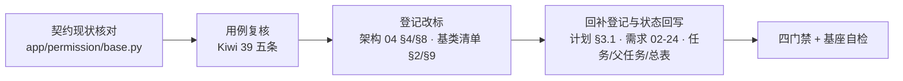

# 权限校验基座实施记录

> 项目骨架 · 02 后端基座 · 03 core 横切基座 · 09 权限校验基座 · 实施记录

[文档首页](../../../../../../../文档首页.md) › [02-3-9 权限校验基座](../02_后端基座_03_core横切基座_09_权限校验基座.md) › 01 实施　|　[← 父任务](../02_后端基座_03_core横切基座_09_权限校验基座.md)

## 1. 实施信息 <a id="meta"></a>

| 项 | 值 |
| --- | --- |
| 任务 | [09 权限校验基座](../02_后端基座_03_core横切基座_09_权限校验基座.md) |
| 对应需求 | [02-24](../../../../../需求/02_需求_后端基座.md#r02-24)（契约由 [02-3-5](../../02_后端基座_03_core横切基座_05_数据脱敏基座/02_后端基座_03_core横切基座_05_数据脱敏基座.md) 于 2026-09-14 提前交付） |
| 详细设计 | [09_详细设计_01_权限校验基座](../设计/09_详细设计_01_权限校验基座.md) |
| 实施日期 | 2026-09-14 |
| 实施人 | minjian |
| 实施环境 | 开发机（Ubuntu，Python 3.14 / uv） |
| 提交 | 待提交 |
| 结论 | 完成（核销式：零代码改动） |

## 2. 实施概览 <a id="overview"></a>



结果小结：需求 02-24 的契约代码（`BasePermissionChecker` / `NullPermissionChecker` / `get_permission_checker` / `require_permission`）与 5 条用例已由 02-3-5 交付，本次逐条核对确认**无代码差距**（本任务 `app/permission/` 零改动）；完成登记改标（02-3-9 复用核销轨迹）、权限分层回补行登记、需求 02-24 实现期要点注块与任务 / 父任务 / 需求 / 计划状态回写；`pytest` / `ruff` / `pyright` / 基座自检全绿。

## 3. 实施过程 <a id="process"></a>

1. **契约现状核对**：逐条比对需求 02-24 第 1 ~ 3 条与 `app/permission/base.py` 成员——`BasePermissionChecker(BaseCapability, ABC)`（`key = "permission"`；抽象 `check(code) -> bool` + 具体 `require(code)` 抛 `PermissionError` 30001 / 403）、`NullPermissionChecker`（恒定允许、`BaseNullObject` 占位标记）、提供者 `get_permission_checker(request)`、依赖工厂 `require_permission(code)`；`app/api/deps.py` 已导出、`create_app()` 已装配 `app.state.permission_checker`。结论：**零代码差距**。
2. **口径澄清**：需求第 1 条写「`check` / `require_permission` 依赖签名」；契约同时提供依赖工厂 `require_permission`（接口侧 `Depends`）与方法级 `require`（基座内 / 非 FastAPI 场景），二者共用 `check` 单一判定源——已在设计第 4 节写明，不引入第二套判定。
3. **用例复核**：`tests/permission/test_permission.py` 5 条 Kiwi 39 用例覆盖继承与 `key`、恒定允许、`require` 抛错（30001 / 403）、依赖工厂放行（含 `get_permission_checker` 解析）、依赖工厂拒绝（统一响应体 403 / `code 30001` / `data is None`）；本任务**不新登记用例**（同代码同源交付，避免两份用例）。
4. **登记改标**：架构 04 §4 基类清单与 §8 跨阶段基座契约表、《后端基类清单》§2 分层总览与 §9 跨阶段基座，权限行说明后补「（02-3-9 于 2026-09-14 复用核销，不重复建设）」；§10 继承链为纯结构描述，不加任务归属（设计第 6 节口径）。
5. **回补登记**：计划「后续阶段待办」**新增**「权限分层真实实现（菜单 / 表单 / 业务 / 按钮 / 动作 / 字段）+ 替换 `NullPermissionChecker`」行（五 RBAC）；既有「`data:plain` 真实权限查询与 RBAC 主体链」行补「02-3-9 复用核销」口径。
6. **需求与状态回写**：需求 02-24 补 `> 注：实现期要点` 块并回写状态 / 完成日期；任务 02-3-9、父任务 02_03 子任务清单、需求总表、计划进度段与 02_03 行同步回写。
7. **顺带核对**：《后端开发规范》§3.1「脱敏与权限」bullet 已含权限口径（权限码校验一律走 `BasePermissionChecker`、接口侧 `require_permission`），**无需改动**（本任务规范侧零改动）。

关键命令：

```bash
uv run pytest --cov=app -q
uv run ruff check .
uv run ruff format --check .
uv run pyright
python3 scripts/tools/base-check/check-base.py    # 需在 bms 根目录执行
```

## 4. 问题与处置 <a id="issues"></a>

| 问题 / 现象 | 原因 | 处置与落点 |
| --- | --- | --- |
| 设计文档两处同级任务链接断链 | 设计目录比任务目录深一级，链接到同级任务需上溯两级，初稿只写了一级 | 改为 `../../02_…_05_…md` / `../../02_…_13_…md`；基座自检复跑断链 0 处 |
| 基座自检脚本报 `基座文档清单.md` 不存在 | `check-base.py` 以 **cwd** 为根拼 `bms文档/` 路径，在 `backend/` 下执行会找错根 | 改为在 `bms` 根目录执行；已记入本节，避免后续误判为文档问题 |
| 用例文件归属（是否需为 09 单独登记 Kiwi） | 契约与用例同源于 02-3-5 一次交付 | 复用既有 **Kiwi 39**，记录中写明复用关系（设计第 8 节 · 对齐记录第 3 项） |

## 5. 验证结果 <a id="verify"></a>

| 完成标准 | 验证方法 | 实测结果 |
| --- | --- | --- |
| 接口 / 抽象声明就位、可被上层引用 | 契约成员逐条核对 + Kiwi 39 继承 / 允许 / 抛错用例 | 通过 |
| 依赖注入可解析、应用可启动不报错 | `create_app` 装配 + `require_permission` / `get_permission_checker` 依赖用例 + 应用冒烟 | 通过 |
| 占位实现恒定允许（不读权限数据） | `NullPermissionChecker.check` 恒 `True` 用例 | 通过 |
| 与 `DataScope` 数据侧分工清晰 | 契约职责表 +《后端开发规范》§7.2 权限两级校验口径 | 通过 |
| 登记齐备（含 02-3-9 归属轨迹） | 架构 04 §4 / §8、《后端基类清单》§2 / §9 改标核对 | 已改标 |
| 不重复建设（复用 02-3-5 契约与用例） | `app/permission/` 零改动（本任务无代码提交）+ 用例复用 Kiwi 39 | 通过 |
| 不实现真实能力 | 无 RBAC 查询、无主体链、无权限分层推导、无权限缓存 | 通过 |
| 无 lint / 类型错误 | `uv run pytest -q` / `ruff check` / `ruff format --check` / `uv run pyright` | 217 passed, 2 skipped / All checks passed / 139 files already formatted / 0 errors |
| 文档链接与清单自洽 | `python3 scripts/tools/base-check/check-base.py`（bms 根） | 断链 0 处、跨层引用 0 处、清单一致 130 / 130 |

## 6. 偏差与遗留 <a id="deviations"></a>

- **偏差**：无功能性偏差（核销式交付，按设计 8 项对齐记录执行）；文档侧修正新设计文档 2 处断链（见第 4 节）。
- **遗留归口（已登记，随对应阶段销项）**：
  - 真实 RBAC 判定（角色 → 权限码集合、多链并集去重）、主体链（`sys_role_assign` 任意中间实体）、权限分层（菜单 / 表单 / 业务为推导关系，按钮 → 动作，字段可见可编辑）→ **五 RBAC**；已登记计划「后续阶段待办」表「权限分层真实实现」与「`data:plain` 真实权限查询与 RBAC 主体链」两行，实现期要点见需求 02-24 `> 注：` 块。
  - 接口侧逐接口接入 `require_permission("业务:动作")`（含平台接口 `platform:manage`）→ **各模块实现 / 认证 · RBAC 阶段**；已登记计划「后续阶段待办」表「平台接口鉴权」行。
  - `require_permission` 拒绝路径响应（30001 / 403）→ 已由 02-3-1 全局处理器承载；「认证 / 权限错误码实现与测试」行在计划「后续阶段待办」表中（认证 / RBAC 阶段）。
  - 字段权限（`visible` / `editable`）与 OAuth2 scope 分工 → **RBAC 阶段** 与 [02-3-13 开放接口 OAuth2 服务端与 scope 基座](../../02_后端基座_03_core横切基座_13_开放接口OAuth2服务端与scope基座/02_后端基座_03_core横切基座_13_开放接口OAuth2服务端与scope基座.md)（任务文档已标注「协同契约（scope 与权限码分工）」条目）。
  - 权限码集合缓存与失效 → 随 RBAC 阶段定稿（缓存三防属阶段六 通用能力）。
  - 真实 RBAC 用例（角色并集、中间实体、分层推导、缓存失效）→ 回补阶段补充。
- **本轮「处理偏差与遗留」复核（2026-09-14，独立收尾工序）**：
  - 计划「后续阶段待办」：权限分层行已新增、「`data:plain` 与 RBAC 主体链」行已补复用核销口径；本轮另补「平台接口鉴权」行（权限码取本契约）与「缓存 Region 分域基座」行（权限码集合缓存随 RBAC 阶段接入本机制）。
  - 消费方标注：[02-3-13 OAuth2 scope 基座](../../02_后端基座_03_core横切基座_13_开放接口OAuth2服务端与scope基座/02_后端基座_03_core横切基座_13_开放接口OAuth2服务端与scope基座.md)（scope 与权限码分工）、[02-3-11 可观测性基座](../../02_后端基座_03_core横切基座_11_可观测性基座（指标与链路）/02_后端基座_03_core横切基座_11_可观测性基座（指标与链路）.md)（权限拒绝指标口径）已标注。
  - 前序任务闭环：[02-3-5 实施记录](../../02_后端基座_03_core横切基座_05_数据脱敏基座/实施/05_实施_01_数据脱敏基座.md) 与 [测试记录](../../02_后端基座_03_core横切基座_05_数据脱敏基座/测试/05_测试_01_数据脱敏基座.md) 中「需求 02-24 状态回写」条已补闭环指向（本任务已回写状态与完成日期）。
  - 需求侧：02-24 `> 注：` 块补方法级 `require(code)` 与依赖工厂共用 `check` 单一判定源的口径。
  - **未标注项与理由**：[02-3-12 健康检查项注册表基座](../../02_后端基座_03_core横切基座_12_健康检查项注册表基座/02_后端基座_03_core横切基座_12_健康检查项注册表基座.md) 不加标注——权限相关健康检查归 `database`（平台库 RBAC 表）与 `redis`（权限缓存）检查项，已由计划 03_03 行登记，无权限专属检查项。
- **结论**：本任务遗留已全部登记去向并闭环（收尾「处理偏差与遗留」步骤复核）。

> 本文档依《文档生成规范》编写
