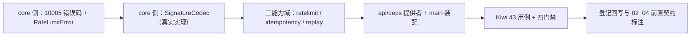

# 限流幂等防重放中间层实施记录

> 项目骨架 · 02 后端基座 · 03 core 横切基座 · 10 限流幂等防重放中间层 · 实施记录

[文档首页](../../../../../../../文档首页.md) › [02-3-10 限流幂等防重放中间层](../02_后端基座_03_core横切基座_10_限流幂等防重放中间层.md) › 01 实施　|　[← 父任务](../02_后端基座_03_core横切基座_10_限流幂等防重放中间层.md)

## 1. 实施信息 <a id="meta"></a>

| 项 | 值 |
| --- | --- |
| 任务 | [10 限流幂等防重放中间层](../02_后端基座_03_core横切基座_10_限流幂等防重放中间层.md) |
| 对应需求 | [02-25](../../../../../需求/02_需求_后端基座.md#r02-25) |
| 详细设计 | [10_详细设计_01_限流幂等防重放中间层](../设计/10_详细设计_01_限流幂等防重放中间层.md) |
| 实施日期 | 2026-09-14 |
| 实施人 | minjian |
| 实施环境 | 开发机（Ubuntu，Python 3.14 / uv） |
| 提交 | 待提交 |
| 结论 | 完成 |

## 2. 实施概览 <a id="overview"></a>



结果小结：写接口防护三组契约与占位实现落地（`BaseRateLimiter` / `NullRateLimiter`、`IdempotencyStore` / `NullIdempotencyStore`、`BaseReplayGuard` / `NullReplayGuard`）；`core/security.py` 新增签名原语 `SignatureCodec`（HMAC-SHA256，**真实实现**）与签名头 / 算法常量；`core` 新增限流错误码 `10005` 与 `RateLimitError`（429）；应用可启动、三个提供者可解析；`pytest` / `ruff` / `pyright` 全绿，新增模块覆盖率 100%。

## 3. 实施过程 <a id="process"></a>

1. **core 错误码与异常**：`app/core/error_codes.py` 登记 `ErrorCode.RATE_LIMIT = 10005`（通用段顺延，架构「错误码分段」节 1xxxx 已覆盖「限流」）；`app/core/exceptions.py` 新增 `RateLimitError(GeneralError)`（10005 / HTTP 429）。
2. **core 安全原语**：`app/core/security.py` 新增常量 `SIGNATURE_HEADER = "X-Signature"` / `SIGNATURE_ALGORITHM = "sha256"` 与签名原语 **`SignatureCodec`**（`build_payload` 串料 `{method}\n{path}\n{timestamp}\n{nonce}\n{body}`、`sign` HMAC-SHA256 hex 小写、`verify` 恒定时间比对 + 签名入参 `strip().lower()` 容错）；**真实实现**（标准库 `hmac` / `hashlib`，纯计算、无密钥托管与外部依赖），供防重放域与出站 Webhook 复用。
3. **限流能力域**：新增 `app/ratelimit/`——`RATE_LIMIT_DIMENSIONS`（`ip` / `user` / `client`）、`DEFAULT_RATE_WINDOW = 60`、`RateLimitRule`（frozen：`limit` / `window`）、`RateLimitDecision`（`allowed` / `limit` / `remaining` / `reset_after`）、`BaseRateLimiter(BaseCapability)`（`key = "rate_limiter"`；抽象 `check` + 具体 `require` 抛 `RateLimitError`）、`NullRateLimiter`（恒定放行、剩余配额等于上限）、`build_rate_limit_key`（`bms:{租户|global}:rate:{维度}:{目标}`）、提供者 `get_rate_limiter`。
4. **幂等能力域**：新增 `app/idempotency/`——`IDEMPOTENCY_HEADER`（`Idempotency-Key`）、`DEFAULT_IDEMPOTENCY_TTL = 86400`、`IdempotencyStore(BaseCapability)`（`key = "idempotency"`；三段式 `begin` / `load` / `save`）、`NullIdempotencyStore`（恒定首次、`load` 恒 None、`save` 空操作）、`build_idempotency_key`（`bms:{租户|global}:idem:{键}`）、提供者 `get_idempotency_store`。
5. **防重放能力域**：新增 `app/replay/`——`TIMESTAMP_HEADER` / `NONCE_HEADER` / `SIGNATURE_HEADER`（后者自 core 再导出，`__all__` 显式声明）、`REPLAY_WINDOW = 300`、`ReplayReason`（`expired` / `bad_signature` / `replayed`）、`ReplayDecision`、`BaseReplayGuard(BaseCapability)`（`key = "replay_guard"`；**模板方法** `verify` 固定编排「时间窗 → 签名 → nonce 去重」并短路，`now` 可注入；抽象 `claim_nonce`；`require` 失败抛 `AuthError`）、`NullReplayGuard`（`claim_nonce` 恒定 True；时间窗与签名占位期真实生效）、提供者 `get_replay_guard`。
6. **依赖注入装配**：`app/api/deps.py` 导出三提供者（并更新模块 docstring）；`app/main.py` 装配 `app.state.rate_limiter = NullRateLimiter()`、`app.state.idempotency_store = NullIdempotencyStore()`、`app.state.replay_guard = NullReplayGuard()`。
7. **测试**：新增 `tests/ratelimit/test_ratelimit.py`（6 条）、`tests/idempotency/test_idempotency.py`（4 条）、`tests/replay/test_replay.py`（7 条），并在 `tests/core/test_security.py` 补签名用例（2 条）并把 `SignatureCodec` 纳入既有继承 / 可构造断言 —— 共 **19 条 Kiwi 43 用例**。
8. **Kiwi 登记**：在 mjbk Kiwi TCMS（分类「平台骨架」、P2、CONFIRMED、标签「自动化」）登记用例 **43「限流幂等防重放中间层（契约 / key 口径 / 占位放行与恒定首次 / 防重放编排与签名 / 依赖解析）」**，与 `@pytest.mark.kiwi_id(43)` 一致。
9. **登记回写**：架构 04 §4 / §6 / §8、《后端基类清单》§2 / §9 / §10、《后端开发规范》§3.1、计划「后续阶段待办」、需求 02-25 注块、02_04 出站集成基座前置契约条；任务 / 父任务 / 需求 / 计划状态回写。

关键命令：

```bash
uv run pytest --cov=app -q
uv run ruff check .
uv run ruff format --check .
uv run pyright
python3 scripts/tools/base-check/check-base.py    # 需在 bms 根目录执行
```

## 4. 问题与处置 <a id="issues"></a>

| 问题 / 现象 | 原因 | 处置与落点 |
| --- | --- | --- |
| ruff `F401`：`app/replay/base.py` 导入 `SIGNATURE_HEADER` 未使用 | 该常量按设计要从防重放域统一出口（与 `TIMESTAMP_HEADER` / `NONCE_HEADER` 并列），但仅定义未引用 | 按 02-3-8（circuit 复用 `DEPENDENCIES`）同款做法补模块 `__all__` 显式再导出 |
| 用例 `test_null_guard_window_and_signature_enforced` 首轮失败（期望放行、实得 `bad_signature`） | 用例把时间戳改到窗口内（`NOW - 299`）却仍用默认签名（按 `NOW` 计算）——签名串料含时间戳 | 用例改为按同一时间戳重算签名（设计上「改任一入参即签名不符」正是预期行为，已被 `test_verify_bad_signature` 覆盖） |
| pyright 18 项 `reportArgumentType`（`tests/replay/test_replay.py`） | 初版用 `dict[str, object]` 收集入参后 `**kwargs` 拆包，strict 模式下无法收敛类型 | 改为全类型化辅助函数（按显式关键字参数传参、签名缺省按入参实时计算），移除 `pyright: ignore` 兜底 |
| pyright 3 项 `reportUnusedFunction`（测试内路由函数） | 忽略注释写在装饰器行，未覆盖函数定义 | 注释移至 `async def` 行（与 `tests/fallback/test_fallback.py` 既有写法一致） |
| `core/exceptions.py` 首次编辑误插入冗余锚点类 | 替换串过宽、包含了相邻定义 | 立即读文件核对并清理，最终仅保留 `RateLimitError`（未进提交） |

## 5. 验证结果 <a id="verify"></a>

| 完成标准 | 验证方法 | 实测结果 |
| --- | --- | --- |
| 接口 / 抽象声明就位、可被上层引用 | 三契约落地 + 继承断言用例 | 通过 |
| 依赖注入可解析、应用可启动不报错 | `create_app` 装配三个单例 + 三提供者解析用例 + 应用冒烟 | 通过 |
| 占位实现恒定通过（不连 Redis） | `NullRateLimiter` 恒放行、`NullIdempotencyStore` 恒首次、`NullReplayGuard` nonce 不拦截 | 通过 |
| 限流拒绝语义明确（`require` 可一行接入） | `RateLimitError`（10005 / 429）用例 | 通过 |
| 幂等「重复键返回首次结果」链路可表达 | `begin` / `load` / `save` 三段式契约 + 占位用例 | 通过 |
| 防重放签名口径定稿且可对接 | 串料 / 算法 / 请求头常量 + 签名往返与容错用例（含标准库独立复算） | 通过 |
| 编排顺序与短路语义 | 超窗 / 签名不符场景断言 `claim_nonce` 未被调用 | 通过 |
| 登记齐备 | 架构 04 §4 / §6 / §8、架构 09 错误码分段、《后端基类清单》§2 / §9 / §10、《后端开发规范》§3.1、计划「后续阶段待办」 | 已登记 |
| 不实现真实能力 | 无 Redis / slowapi 依赖、无跨实例 nonce 去重、无唯一约束落库 | 通过 |
| 无 lint / 类型错误 | `uv run pytest -q` / `ruff check` / `ruff format --check` / `uv run pyright` | 236 passed, 2 skipped / All checks passed / 148 files already formatted / 0 errors |

## 6. 偏差与遗留 <a id="deviations"></a>

- **偏差**：
  - `core/security.py` 的 `SignatureCodec` 采用**真实实现**（标准库 HMAC），未沿用 02-3-3「安全原语占位抛 `NotImplementedError`」写法——理由：签名是纯计算、无密钥托管与外部依赖；已在详细设计 §7 与对齐记录第 8 项明写口径。
  - 防重放占位语义采用**混合口径**（时间窗 + 签名占位期真实生效、nonce 去重不拦截），与「占位不改现状行为」的常规口径略有差异，属用户拍板的决策（对齐记录第 10 项）。
- **遗留归口（已登记，随对应阶段销项）**：
  - 真实限流（slowapi / limits + Redis 后端、IP / 用户 / client 档位、Redis 故障降级 memory 后端、配额告警与 `sys_tenant_quota` 联动）→ **性能与安全 · 租户管理**；已登记计划「后续阶段待办」表「限流 / 幂等 / 防重放真实实现」行，实现期要点见需求 02-25 `> 注：` 块。
  - 真实幂等存储（Redis SETNX 前置拦截、首次结果缓存与 TTL、幂等键字段唯一约束兜底）→ **性能与安全 · 首个落库阶段**；同上登记。
  - 真实 nonce 去重（Redis SETNX、TTL 与窗口对齐）与 `/api/open` ingress 接入（请求头解析、IP 白名单、Client Credentials、按 client 限流）→ **性能与安全 / 开放接口阶段**；与 [02-3-13 开放接口 OAuth2 服务端与 scope 基座](../../02_后端基座_03_core横切基座_13_开放接口OAuth2服务端与scope基座/02_后端基座_03_core横切基座_13_开放接口OAuth2服务端与scope基座.md)（任务文档已标注协同契约）协同。
  - 登录限流联动（失败 5 次锁 15 分钟、连续失败 3 次强制验证码的计数窗口）→ 登录侧接线，已由本任务文档「登录侧联动（口径）」条登记；验证码取 [02-3-7 验证码与密码策略基座](../../02_后端基座_03_core横切基座_07_验证码与密码策略基座/02_后端基座_03_core横切基座_07_验证码与密码策略基座.md) 契约。
  - 出站 Webhook 签名（算法工具复用本任务 `SignatureCodec`，串料 `sha256(secret, body)` 差异）→ **02_04 出站集成基座**；任务文档已补「前置契约（已交付）」条。
  - 签名密钥轮换双密钥过渡窗口 → 开放接口阶段定稿。
  - 真实限流 / 幂等 / nonce 去重用例（滑窗、并发穿透唯一约束、Redis 故障降级）→ 回补阶段补充。
- **结论**：本任务遗留已全部登记去向（收尾「处理偏差与遗留」步骤复核）。

> 本文档依《文档生成规范》编写
